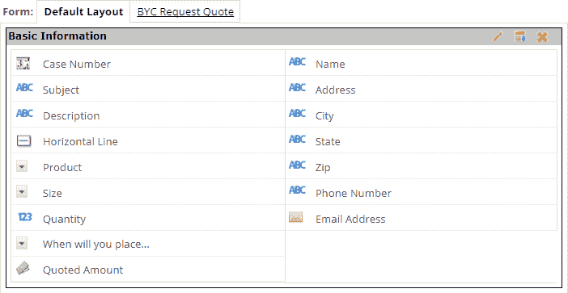
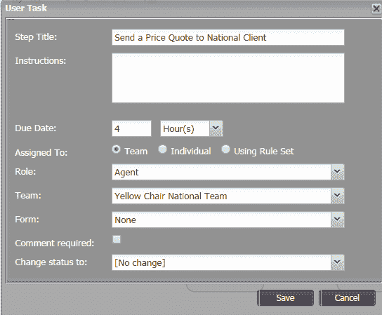
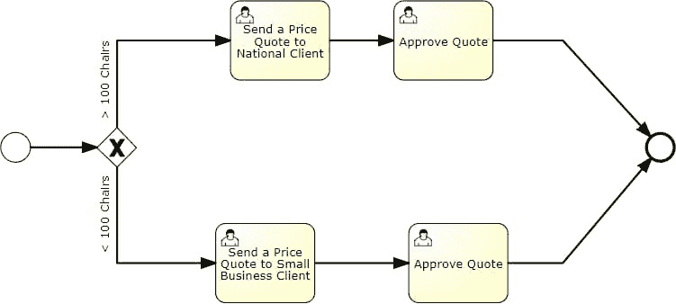
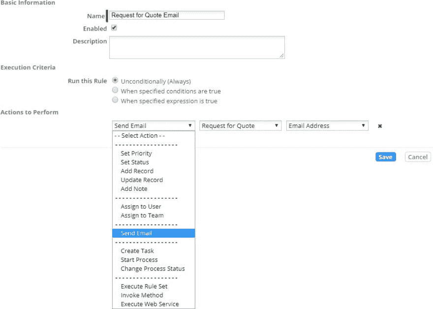
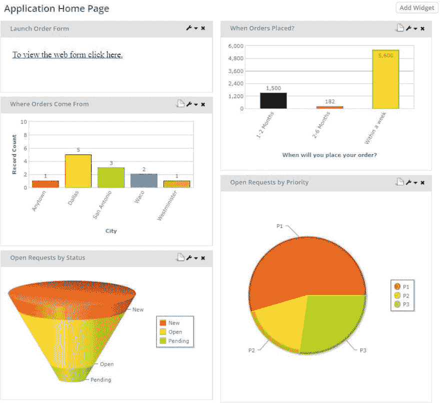

# 动态应用敏捷版

> 原文:[https://dev . to/tech community/dynamic-apps-agile-edition-3bml](https://dev.to/techcommunity/dynamic-apps-agile-edition-3bml)

# 用五个步骤快速构建你的下一个低代码应用

让我们面对现实吧。构建一个应用程序的想法可能会令人望而生畏。你从哪里开始？你需要知道什么？需要多长时间？用 Dynamic Apps Agile Edition 构建一个低代码的应用程序并不复杂，只要遵循正确的结构就可以很快完成。

| 2018 年第一期 | [ 下载 PDFT4】](http://techcommunity.softwareag.com/ecosystem/download/techniques/2018-issue1/SAG_Dynamic_Apps_TECHniques_Jan18_WEB.pdf) |
| --- | --- |

如果你已经用业务流程管理套件(BPMS)构建了应用程序，你可能会认为你的新应用程序的起点是流程流。您将定义流程，对其建模，然后通过直接的人工输入或通过与其他系统的集成来获取将在流程中流动的数据。动态应用企业版提供了所有你熟悉使用的工具，包括一个敏捷版——一种快速创建低代码应用的方法。

如果你希望创建一个低代码的应用程序，你需要从数据优先的角度来考虑你的应用程序。在动态应用敏捷版中，通过遵循以下五步结构，你可以比你想象的更快地组装低代码

应用:

1.  捕获您想要跟踪的信息
2.  定义流程中涉及的人员组
3.  对您想要自动化的流程进行建模
4.  应用业务规则来定义标准和最佳实践
5.  配置图表和报告以帮助您分析数据

## 第一步

让我们从步骤 1 开始，捕获您想要跟踪的信息。在许多跟踪风格的应用程序中，应用程序的全部目的是获取模拟形式的内容，并将其转换为在线形式，以用于在线形式完成、记录存储和检索、协作形式更新以及存储数据的性能指标。

首先，您将完成将纸质表单分解为 AgileApps 字段、字段类型和验证的练习。因此，纸质表单上的名字和姓氏标签在 AgileApps 表单中成为单独的文本字段。

您将对纸质表单上的每个字段进行“原子到比特”的转换，以构建 AgileApps 数字表单。

创建这些字段后，您可以直观地重新排列表单字段，使数据输入更具逻辑性、更人性化，有时还可以使其与纸质表单布局非常相似，以便用户熟悉他们在屏幕上看到的内容。

如果这是一个严格的数据跟踪应用程序，那么工作就到此为止了。然而，大多数时候，这并不是所有用户都想从他们的在线应用程序中得到的。事实上，现在的形式是数字化的，它为他们打开了新的可能性，他们从来没有想过可能。

[T2】](https://res.cloudinary.com/practicaldev/image/fetch/s--B43YqdLy--/c_limit%2Cf_auto%2Cfl_progressive%2Cq_auto%2Cw_880/http://techcommunity.softwareag.com/documents/10157/9398481/fig1-dynamicapps.png/e9cb36c0-75b5-47a0-8ce8-9075f031387f%3Ft%3D1516267776668)

**图 1:** 可视化地重新排列表单元素，以增强易用性。

## 第二步

这就是第二步的用武之地。现在表单已经上线，一些问题将会出现:

*   在最终确定之前，您能进行数据质量审查和签署吗？
*   你能让不同的角色完成表格的不同部分吗？
*   你能通过一个流程发送表格进行审批吗？

在这一步中，您要做的是思考哪些小组将对数据采取行动——您将创建完成每项任务的团队、角色或人员。例如，您可能有一个数据专家小组，这样任何“数据专家”小组成员都可以检查表单的数据质量。您可能有一个经理角色，属于“经理”角色的任何人都可以批准数据专家的工作，并且您可能会指定一个特定的人在表单发送给他们后对其进行最终批准。

使用可视化构造，您可以创建团队和角色，并向这些团队和角色添加人员，以反映组织结构和工作将如何完成。

[T2】](https://res.cloudinary.com/practicaldev/image/fetch/s--NoNBFMhE--/c_limit%2Cf_auto%2Cfl_progressive%2Cq_auto%2Cw_880/http://techcommunity.softwareag.com/documents/10157/9398481/fig2-dynamicapps.png/1f34fcb7-29f4-4897-b1d8-f7589b251249%3Ft%3D1516267781614)

**图 2:** 将任务和批准分配给团队、角色或个人。

## 第三步

现在，第三步:对您想要自动化的过程进行建模。首先考虑一下审批流程是什么样的。有几个步骤？每一步会发生什么动作？谁负责每一步的行动？在所有的任务或条件都满足后，接下来的步骤是什么？

如果您可以在白板上创建工作流程，那么您就具备了在动态应用敏捷版中构建运行流程所需的技能。通过启动流程编辑器，您将看到一个简化的流程工具面板，允许您定义任务、批准、连接、分支条件和子流程。

下面是你要问的问题:

*   我的流程有多少步骤？
*   每一步，是任务还是审批？
*   流程是否需要基于表单内容的分支？
*   谁来完成每一步——一个特定的人，或者团队中的任何人或角色？

这基本上就是你需要开始的全部内容。

首先将任务或批准拖到工作表中。接下来，添加一些关于它的基本信息，比如任务名“验证客户数据”接下来，从提供的单选按钮中分配谁将完成任务。任务进入团队分配队列，进入角色分配队列，任何人都可以选择并完成这些任务，或者将任务分配给特定的人来完成。接下来，画出后续的任务，重复直到完成。然后，您可以将所有任务与流程线的方向连接起来，或者插入允许您动态确定应用程序流程的条件网关。例如，如果订单金额为 $1，000，则对客户进行信用检查，并向信用官角色分配一项任务来完成这项工作。你明白了。

[T2】](https://res.cloudinary.com/practicaldev/image/fetch/s--VhSuq0oA--/c_limit%2Cf_auto%2Cfl_progressive%2Cq_auto%2Cw_880/http://techcommunity.softwareag.com/documents/10157/9398481/fig3-dynamicapps.jpg/b887cfbc-6c30-418e-b3f9-d10023948c14%3Ft%3D1516267786048)

**图 3:** 拖拽流程步骤和任务。

## 第四步

第 4 步是你将完善你已经创建的东西。这里是您应用业务规则来定义标准和最佳实践的地方，这些标准和最佳实践定义了如何完成工作。

业务规则将帮助您评估收集到的数据内容，并应用您组织的专业知识，然后基于该数据采取行动——更新表单值、通知某人、启动流程等。您可以根据需要加入任意多的业务规则。

例如，如果客户订单金额超过 10，000 美元，那么您可能希望自动启动一些快速的客户入职流程？也许您想将该客户分配给某个区域的销售经理角色？也许您想为该记录分配更高的优先级？也许你想给客户发一封定制的电子邮件？也许你想一次完成所有这些项目。这取决于您和您的组织的最佳实践和策略。

应用程序现在已经设计好了。我们有一个带有在线表单的应用程序，我们将人们组织成团队单元和角色，以处理他们的工作分配，我们有一个流程流，它将为人们创建任务，并在任务完成或批准后将流程推进到下一步，我们还有业务规则，它根据表单中的上下文数据来捕获需要如何以及何时采取行动的最佳实践。

然而，仅仅存储这些数据是不够的。你需要利用这些数据做出更好的决定。

[T2】](https://res.cloudinary.com/practicaldev/image/fetch/s--CTZ_OHfl--/c_limit%2Cf_auto%2Cfl_progressive%2Cq_auto%2Cw_880/http://techcommunity.softwareag.com/documents/10157/9398481/fig4-dynamicapps.jpg/e1c92364-229b-4972-81f2-cadf54ffc4d5%3Ft%3D1516267790697)

**图 4** :使用业务角色来获取最佳实践。

## 第五步

第 5 步使用应用程序数据创建有意义的图表和图形，传达重要信息并帮助部门了解应用程序中正在发生的事情。使用 Dynamic Apps Agile Edition 中集成的图表和图形工具，用户可以使用向导直观地配置图表和报告，该向导将引导他们完成创建报告和分析数据的过程。

报告使用在应用程序中收集的实时数据，并提供按定义的行和列对数据进行分组、选择要在列中显示的数据、按数据或日期过滤结果、对结果进行颜色编码、添加总计或执行其他数学运算的方法，然后选择映射到要显示的数据的图表类型。

最终结果是一份带有图表和数据表的报告。这可以随时定制，所有变量都可以更改以创建新的报告。通过单击任何保存的报告，平台将检索收集的所有数据，然后对结果进行排序和过滤，以符合您的报告标准。

除此之外，您还可以在应用程序仪表板中使用这些报告的组件来提供有用的摘要信息，以帮助管理应用程序和工作流。

例如，您可能只需要显示订单金额的报表的图表部分，这样您就可以图形化地查看高于或低于$10K 的订单。您可能希望仪表板上报表的表格部分显示当月前 10 个最大的客户订单，按订单大小从高到低排序。这些只是示例，但是创建定制的仪表板非常容易，甚至可以将仪表板分配给不同的角色，以便财务经理可以看到财务汇总指标，客户服务经理可以看到新的客户支持指标。

[T2】](https://res.cloudinary.com/practicaldev/image/fetch/s--rMwgMM9m--/c_limit%2Cf_auto%2Cfl_progressive%2Cq_auto%2Cw_880/http://techcommunity.softwareag.com/documents/10157/9398481/fig5-dynamicapps.jpg/2dd0fabe-9f12-4769-a9a6-f23c71e6af8a%3Ft%3D1516267795169)

**图 5:** 使用仪表板显示汇总的性能图表或表格。

就是这样。遵循这五个步骤可以为您提供一个简单而有用的结构来快速创建您的低代码应用程序。

## 采取下一步行动

要了解更多关于动态应用的信息，请访问[dynamicapps.softwareag.com](http://dynamicapps.softwareag.com)