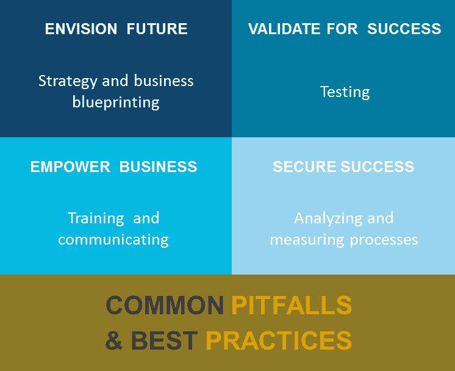
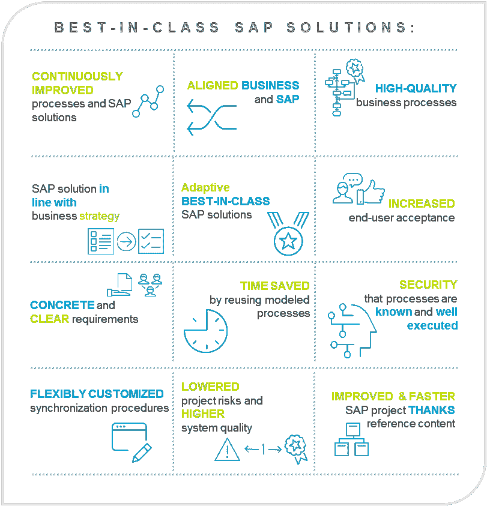

# 充分利用您的 SAP 解决方案

> 原文：<https://dev.to/techcommunity/get-the-most-out-of-your-sap-solutions-328o>

# 最佳实践&常见陷阱

你厌倦了一次又一次地犯同样的错误吗？您是否愿意向他人学习以避免 SAP 项目中的常见陷阱？然后继续读，你来对地方了！

| 2018 年第一期 | [ 下载 PDFT4】](http://techcommunity.softwareag.com/ecosystem/download/techniques/2018-issue1/SAG_SAP_Solutions_Best_Practices_TECHniques_Jan18_WEB.pdf) |
| --- | --- |

事实上，您的 SAP 解决方案的持续成功是有保障的，因为 ARIS 10 与 SAP 及其核心 ALM 组件(新的 SAP 解决方案管理器 7.2)完美配合！然而，并不是每一个 SAP 项目都能成功，项目团队通常会遇到许多陷阱。

为了避免这些陷阱，并为您提供一些关于最佳实践的提示，我决定根据 Software AG 在 SAP 项目中的长期经验，将那些常见的陷阱和最佳实践汇总在一起。这些分为不同的项目阶段，从 SAP 项目生命周期中的战略和业务蓝图开始，到沟通和培训解决方案。

[T2】](https://res.cloudinary.com/practicaldev/image/fetch/s--NfFXwqdX--/c_limit%2Cf_auto%2Cfl_progressive%2Cq_auto%2Cw_880/http://techcommunity.softwareag.com/documents/10157/9398481/fig1-sapoverview.png/6a4352ca-4728-4df3-98f4-5d7aa0f4406c%3Ft%3D1516116932504)

**图 1:** 优化 SAP 解决方案概述

## 展望您的数字未来—建立您的 SAP 数字业务设计

SAP 数字业务设计，也称为蓝图阶段，为 SAP 解决方案的成功奠定基础。无论您的目标是什么，无论您是打算管理向基于 SAP 的数字业务的转型，还是仅仅将您的流程与 SAP 集成，您都需要设计您的业务和流程来与 SAP 解决方案协同工作。

蓝图阶段的数字流程设计可以被视为最终用户需求和 SAP 解决方案之间的一种契约，以确保期望与 SAP 中的实施相匹配。因此，请仔细阅读并重复使用 Performance.Ready 中包含的可用参考内容和“打包的专业知识”。它将加快您利用真实世界知识进行数字化的速度，并让您在一流的 SAP 解决方案方面领先一步。

## 在战略&蓝图阶段，你应该关注什么？

**最佳实践:**

*   记录你的战略并获得高层的支持
*   了解、定义业务需求，并将其与 SAP AG 提供的解决方案相匹配
*   从项目开始就包括业务和 IT

**常见陷阱:**

*   从零开始实施流程
*   认为数字商业设计是一次性的练习
*   忘记将数字业务战略与您的业务流程联系起来
*   忽略正在运行的 SAP 解决方案

一旦初始设置完成，不要忘记在今天的数字世界中，**您的业务需要不断适应**。这包括常规流程变更、IT 系统升级以及新的项目领域。因此，流程和 SAP“世界”之间的同步将不是一次性的活动，而是定期重复的活动。让您的团队和系统为此做好准备！

一旦完成初始蓝图并接受这一变化，利用 **ARIS 中建模的信息将在 SAP 项目的不同阶段为您节省宝贵的时间和资源**，并帮助您逐步实现 SAP 解决方案的全部优势。让我们看看 SAP 项目的其他阶段。

## 成功测试—针对高质量 SAP 流程进行基于流程的测试

测试是一个极其重要的里程碑，对于一个全面运行的同类最佳 SAP 解决方案以及一个顺利和成功的上线。因此，业务测试场景的定义是成功的关键。由于流程不会永远保持不变，它们需要在应用程序的整个生命周期中根据业务策略的变化进行调整。因此，它们需要一次又一次的测试。ARIS 提供测试设计专用工具(测试设计器扩展包),通过重用之前设计的流程、测试场景和测试数据，节省您的时间并确保质量。

## 在测试阶段你应该注意什么？

**最佳实践:**

*   尽早定义战略性的端到端流程
*   在集成测试的定义中包括业务部门
*   选择标准测试工具

**常见陷阱:**

*   只关注功能测试
*   低估测试所需的时间
*   忽略业务部门的反馈

## 让您的业务更强大——培训和交流正确的流程

即使培训和交流被认为是不同的项目阶段，它们也是基于相同的工具一起进行的。

**为您的新 SAP 解决方案传播信息并提供正确的培训**是项目团队的另一项重大任务。同样，过程驱动的方法很有帮助。它确保整个公司了解基于 SAP 的新流程，最终用户知道如何在新环境中工作。尤其是当业务流程经常变化，创新扮演着重要角色时，定期培训和信息需要特别关注。

在培训和推广阶段，您应该注意什么？

**最佳实践:**

*   创建准确的流程文档，作为事实和交流的单点
*   建立治理流程来管理流程设计
*   明确定义一个负责接口管理的核心人员
*   重新使用 ARIS 的可用流程信息进行流程驱动的培训
*   确保 SAP 流程的早期信息和协作
*   确保管理流程管理的过程

**常见陷阱:**

*   项目开始后忘记文档
*   只关注技术集成
*   仅使用 SAP 标准参考流程
*   仅针对 SAP 特性和功能进行培训
*   在上线前对新流程保密
*   忽略用户反馈和评论

好消息是，在设计您的 SAP 解决方案时，您已经为整个项目的所有利益相关者创建了一个培训和信息平台— **一个事实和交流的单点**—并且该平台将在项目完成后长期存在(当然还有更新)!基于角色的**访问流程**信息将是与您的不同目标群体分享正确信息的关键。为了支持持续的过程改进，建立**协作和治理**。

## 保护您的数字化未来——分析&衡量流程，深入了解您正在运行的 SAP 解决方案

一旦您的系统启动并运行，您的项目将通过重用存储库中所有可用的信息，从 ARIS 众多的分析功能中获益。您将有机会分析每一条信息，从组织报告和流程效率分析到假设分析、成本计算数量等等。ARIS 的流程分析和流程挖掘功能，从简单的查询和表格，到复杂的分析和实时仪表板，包括实际流程性能和可视化，将完全适应您的需求和要求，并为您提供**实时洞察，以做出更好的业务和基于事实的决策**。

## 系统启动并运行后，在分析和测量时应该注意什么？

**最佳实践:**

*   使用分析来创造价值，并将你的计划与实际发生的情况进行比较
*   提取和分析 SAP 系统信息，以揭示实际发生了什么，以及它如何导致“原样”流程流
*   考虑并混合不同的 KPI 和维度来规划您的场景
*   确保作为分析基础的数据质量。当您必须组合来自不同来源的数据时，您会遇到特殊的挑战

**常见陷阱:**

*   专注于所有技术特性和分析能力，而忘记了专注于解决当前问题
*   相信分析只是为了管理。实际上，这是整个企业中每个员工都关心的问题
*   假设 KPI 不创造任何价值。分析有助于发现浪费、错误和缺陷，并支持更好的决策
*   相信你现有的分析工具是足够的，ARIS 不仅仅是测量或设计一个过程。是两者的结合！

[T2】](https://res.cloudinary.com/practicaldev/image/fetch/s--iAqIPBwG--/c_limit%2Cf_auto%2Cfl_progressive%2Cq_auto%2Cw_880/http://techcommunity.softwareag.com/documents/10157/9398481/fig2-benefitssap.png/bc890295-8efa-4fc9-9d1b-69763c27be78%3Ft%3D1516116939526)

**图二**:还是不听劝？这是您的福利概述。

## 采取下一步行动

所以现在在你通往成功的道路上没有任何障碍了！

了解更多有关 ARIS 产品组合如何帮助您管理业务[并实现一流的 SAP 解决方案，从而确保您在数字世界中取得成功](https://resources.softwareag.com/bpa/aris-sap-solution-manager-white-paper)的信息。

敬请关注，我们将在下一期公布我们关于成功的 S/4 HANA 项目的提示和技巧！