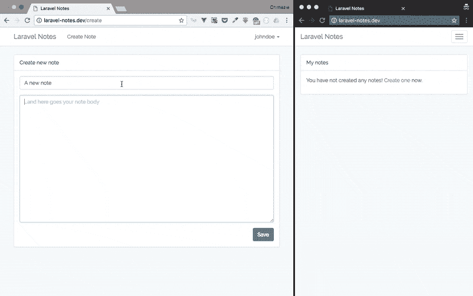

# 如何使用 Laravel 构建协作笔记 app

> 原文:[https://dev . to/mezie/how-to-build-a-collaborative-note-app-using-laravel-mgl](https://dev.to/mezie/how-to-build-a-collaborative-note-app-using-laravel-mgl)

在本教程中，我们将使用 Laravel 和 Pusher 构建一个在线协作笔记应用程序。我们将使用 Vue.js 作为我们的 JavaScript 框架。该应用程序将是基本的，但将展示一个协作应用程序的必要功能，因为这是本教程的重点。

## 我们将会建造什么

在我们开始忙碌之前，让我们先回顾一下我们将要建造的东西。该应用程序将是一个简单的笔记应用程序，只有经过认证的用户才能访问。通过该应用程序，用户可以创建新的笔记，编辑笔记和/或与其他用户共享笔记的链接以供编辑。在编辑笔记的情况下，该应用程序将能够跟踪编辑特定笔记的用户，向其他用户显示正在对笔记进行的实时编辑，并在用户保存笔记时通知其他用户。

[T2】](https://res.cloudinary.com/practicaldev/image/fetch/s--rzZA2OgM--/c_limit%2Cf_auto%2Cfl_progressive%2Cq_66%2Cw_880/http://blog.pusher.com/wp-content/uploads/2017/04/how-to-build-an-online-collaborative-note-app-using-laravel-and-pusher-laravel-notes.gif)

我们开始吧！

## 设置 Laravel

通过打开终端创建一个新的 Laravel 项目，并运行下面的代码:

```
 laravel new laravel-notes 
```

接下来，我们需要设置新的 Laravel 项目。首先，我们需要注册`App\Providers\BroadcastServiceProvider`。打开`config/app.php`并取消 providers 数组中`App\Providers\BroadcastServiceProvider`的注释。

然后我们需要告诉 Laravel 我们正在使用`.env`文件中的 Pusher 驱动程序:

```
 // .env

BROADCAST_DRIVER=pusher 
```

因为我们指定要使用 Pusher 作为我们的广播驱动程序，所以我们需要安装 Pusher PHP SDK:

```
 language-bash
composer require pusher/pusher-php-server Setting Up Pusher 
```

## 设置推动器

如果您还没有，请在此创建一个免费的 Pusher 帐户[，然后登录您的仪表盘并创建一个应用程序。请记下你的应用凭据，因为我们很快就会用到它们。出于本教程的目的，我们将在我们的在线协作笔记应用程序中触发一些客户端事件。](https://pusher.com/signup)

默认情况下，当您创建推送应用程序时，客户端事件是不启用的。我们必须为我们的应用程序启用这一功能。要在 Pusher 应用程序中启用客户端事件，请选择该应用程序，然后单击**应用程序设置**选项卡，然后选中**旁边的复选框启用客户端事件**。

[T2】](https://res.cloudinary.com/practicaldev/image/fetch/s--0b2w0V0U--/c_limit%2Cf_auto%2Cfl_progressive%2Cq_auto%2Cw_880/http://blog.pusher.com/wp-content/uploads/2017/04/how-to-build-an-online-collaborative-note-app-using-laravel-and-pusher-laravel-notes-enable-client-event.png)

现在，让我们填写我们的 Pusher 应用程序凭据。更新`.env`文件以包含我们的 Pusher 应用凭证:

```
 // .env

PUSHER_APP_ID=xxxxxx
PUSHER_APP_KEY=xxxxxxxxxxxxxxxxxxxx
PUSHER_APP_SECRET=xxxxxxxxxxxxxxxxxxxx 
```

记得用你的 Pusher 应用凭证替换 **xs** 。您可以在 Pusher 仪表盘的“概述”选项卡的“密钥”部分找到您的应用凭证。

此外，请记住填写您的 Pusher 应用程序和其他附加选项的集群。

## 安装前端依赖项

在本教程中，我们将使用由 Laravel 为我们设置的 Bootstrap、Vue 和 Axios，尽管我们仍然需要安装每个依赖项。为了编译我们的 CSS 和 JavaScript，我们需要安装 Laravel Mix，它是 Webpack 的包装器。我们可以通过 NPM 安装这些依赖项:

```
 language-bash
npm install 
```

我们还需要安装 Laravel Echo，这是一个 JavaScript 库，可以方便地订阅频道和收听 Laravel 广播的事件，当然还有 Pusher JavaScript 库:

```
 language-bash
npm install --save laravel-echo pusher-js 
```

一旦安装好，我们需要告诉 Laravel Echo 使用推进器。在`resources/assets/js/bootstrap.js`文件的底部，取消对 Laravel Echo 部分的注释，并使用以下内容更新详细信息:

```
 language-javascript
// resources/assets/js/bootstrap.js

import Echo from "laravel-echo"

window.Echo = new Echo({
    broadcaster: 'pusher',
    key: xxxxxxxxxxxxxxxxxxxx,
}); 
```

记得用您的 Pusher app 键替换 **xs** 。

## 认证用户

如前所述，我们的协作笔记应用程序将只对认证用户开放。因此，我们需要一个认证系统:

```
 language-bash
php artisan make:auth 
```

这将为认证系统创建必要的路由、视图和控制器。

在我们继续创建用户之前，我们需要运行全新安装的 Laravel 附带的`users`迁移。但是要做到这一点，我们首先需要建立我们的数据库。打开`.env`文件并输入您的数据库详细信息:

```
 // .env

DB_CONNECTION=mysql
DB_HOST=127.0.0.1
DB_PORT=3306
DB_DATABASE=laravel-notes
DB_USERNAME=root
DB_PASSWORD= 
```

使用您自己的数据库详细信息进行更新。现在，我们可以运行迁移了:

```
 language-bash
php artisan migrate 
```

**注意:**如果你运行的 MySQL 版本早于 5.7.7，或者 MariaDB 版本早于 10.2.2，那么 Laravel 5.4 会有一个 bug。这可以通过将`app/Providers/AppServiceProvider.php`的`boot()`替换为:

```
 language-php
// app/Providers/AppServiceProvider.php

// remember to use
Illuminate\Support\Facades\Schema;

/**
 * Bootstrap any application services.
 *
 * @return void
 */
public function boot()
{
  Schema::defaultStringLength(191);
} 
```

## 注意模型和迁移

通过运行以下命令创建一个`Note`模型和迁移文件:

```
 language-bash
php artisan make:model Note -m 
```

打开`Note`模型，并将下面的代码添加到其中:

```
 language-php
/**
 * Fields that can not be mass assigned
 * 
 * @var array
 */
protected $guarded = ['id'];

/**
 * Get the route key for the model.
 *
 * @return string
 */
public function getRouteKeyName()
{
  return 'slug';
} 
```

我们不用手动指定在`$fillable`数组中可以被批量赋值的每个字段，而是简单地使用`$guarded`并添加`id`列作为不能被批量赋值的字段，这意味着每隔一个字段都可以被批量赋值。默认情况下，Laravel 路由模型绑定将使用模型上的`id`列，但是在本教程中，我们希望使用`slug`列，因此`getRouteKeyName`方法将简单地返回我们希望用于路由模型绑定的列。

在`databases/migrations`目录中，打开我们运行上面的命令时创建的`notes`表迁移，并用以下命令更新`up`方法:

```
 language-php
Schema::create('notes', function (Blueprint $table) {
  $table->increments('id');
  $table->unsignedInteger('user_id');
  $table->string('title');
  $table->string('slug')->unique();
  $table->text('body');
  $table->timestamps();
}); 
```

运行迁移:

```
 language-bash
php artisan migrate 
```

## 定义应用程序路线

打开`routes/web.php`并用以下代码替换路线:

```
 language-php
Auth::routes();

Route::get('/', 'NotesController@index');
Route::get('create', 'NotesController@create');
Route::post('create', 'NotesController@store');
Route::get('edit/{note}', 'NotesController@edit');
Route::patch('edit/{note}', 'NotesController@update'); 
```

这些路由很简单:处理认证的路由、列出用户创建的所有注释的主页路由、创建新注释的路由以及更新指定注释的路由。

**注意:**因为我们已经删除了`/home`路线，所以您可能希望将`app/Http/Controllers/Auth/LoginController.php`和`app/Http/Controllers/Auth/RegisterController.php`的`redirectTo`属性更新为:

```
 language-php
protected $redirectTo = '/'; 
```

## NotesController

让我们创建一个控制器来处理我们聊天应用的逻辑。用下面的命令创建一个`NotesController`:

```
 language-bash
php artisan make:controller NotesController 
```

打开新的 create `app/Http/Controllers/NotesController.php`文件，并向其中添加以下代码:

```
 language-php
// app/Http/Controllers/NotesController.php

use App\Note;

public function __construct()
{
  $this->middleware('auth');
}

/**
 * Display a listing of all notes.
 *
 * @return \Illuminate\Http\Response
 */
public function index()
{
  $notes = Note::where('user_id', auth()->user()->id)
                  ->orderBy('updated_at', 'DESC')
                  ->get();

  return view('notes.index', compact('notes'));
}

/**
 * Show the form for creating a new note.
 *
 * @return \Illuminate\Http\Response
 */
public function create()
{
  return view('notes.create');
}

/**
 * Store a newly created note in database.
 *
 * @param  \Illuminate\Http\Request  $request
 * @return \Illuminate\Http\Response
 */
public function store(Request $request)
{
  $this->validate($request, [
    'title' => 'required',
    'body'  => 'required'
  ]);

  $note = Note::create([
    'user_id' => $request->user()->id,
    'title'   => $request->title,
    'slug'    => str_slug($request->title) . str_random(10),
    'body'    => $request->body
  ]);

  return redirect('/');
}

/**
 * Show the form for editing the specified note.
 *
 * @param  \App\Note  $note
 * @return \Illuminate\Http\Response
 */
public function edit(Note $note)
{
  return view('notes.edit', compact('note'));
}

/**
 * Update the specified note.
 *
 * @param  \Illuminate\Http\Request  $request
 * @param  \App\Note  $note
 * @return \Illuminate\Http\Response
 */
public function update(Request $request, Note $note)
{
  $note->title = $request->title;
  $note->body = $request->body;

  $note->save();

  return 'Saved!';
} 
```

在`NotesController`的`__contruct()`中使用认证中间件表示控制器的所有方法都只能被认证用户访问。`index`方法将获取当前认证用户创建的笔记，并呈现一个包含笔记的视图。`create`方法将显示一个创建新注释的表单。`store`方法将把注释实际保存到数据库中。请注意，我们在 slug 后面添加了一个随机字符串，以使每个音符都是独一无二的。`edit`方法显示了编辑指定注释的表单。最后，`update`方法处理实际的更新并保存到数据库中。

## 创建我们的笔记应用视图

当我们运行`make:auth`时，Laravel 创建了一个名为`app.blade.php`的主布局，我们将利用它进行一些小的添加。所以打开`resources/view/layouts/app.blade.php`,用下面的内容更新导航条的左侧:

```
 language-html
<!-- resources/view/layouts/app.blade.php -->

<!-- Left Side Of Navbar -->
<ul class="nav navbar-nav">
  <li><a href="">Create Note</a></li>
</ul> 
```

我们所做的只是在导航栏上添加了一个创建新注释的链接。

### 创建新的便笺视图

现在，让我们创建用于创建新便笺的视图。在`views`目录中创建一个名为`notes`的新目录。在新创建的`notes`目录中，创建一个名为`create.blade.php`的新文件，并将下面的代码粘贴到其中:

```
 language-html
<!-- resources/views/notes/create.blade.php -->
@extends('layouts.app')

@section('content')
    <div class="container">
        <div class="row">
            <div class="col-md-8 col-md-offset-2">
                <div class="panel panel-default">
                    <div class="panel-heading">Create new note</div>
                    <div class="panel-body">
                        <form action="" method="POST" class="form" role="form">

                            <div class="form-group">
                                <input type="text" class="form-control" name="title" value="" placeholder="Give your note a title" required autofocus>

                                @if ($errors->has('title'))
                                    <span class="help-block">
                                        <strong></strong>
                                    </span>
                                @endif
                            </div>

                            <div class="form-group">
                                <textarea class="form-control" name="body" rows="15" placeholder="...and here goes your note body" required></textarea>

                                @if ($errors->has('body'))
                                    <span class="help-block">
                                        <strong></strong>
                                    </span>
                                @endif
                            </div>

                            <button class="btn btn-primary pull-right">Save</button>
                        </form>
                    </div>
                </div>
            </div>
        </div>
    </div>
@endsection 
```

这将创建一个带有两个输入字段(分别用于注释的标题和正文)和一个保存按钮的表单。

### 列出所有笔记视图

让我们为用户提供一种查看他们创建的所有笔记的方法。在`notes`目录中，创建一个名为`index.blade.php`的新文件，并将下面的代码粘贴到其中:

```
 language-html
<!-- resources/views/notes/index.blade.php -->

@extends('layouts.app')

@section('content')
    <div class="container">
        <div class="row">
            <div class="col-md-8 col-md-offset-2">
                <div class="panel panel-default">
                    <div class="panel-heading">My notes</div>
                    <div class="panel-body">
                        @if($notes->isEmpty())
                            <p>
                                You have not created any notes! <a href="">Create one</a> now.
                            </p>
                        @else
                        <ul class="list-group">
                            @foreach($notes as $note)
                                <li class="list-group-item">
                                    <a href="">

                                    </a>
                                    <span class="pull-right"></span>
                                </li>
                            @endforeach
                        </ul>
                        @endif
                    </div>
                </div>
            </div>
        </div>
    </div>
@endsection 
```

如果用户尚未创建任何注释，则只显示一条消息和一个创建新注释的链接。否则，它将在列表中显示用户创建的所有笔记。

### 编辑笔记视图

让我们创建允许用户编辑注释的编辑视图。在`notes`目录中，创建一个名为`edit.blade.php`的新文件，并将下面的代码粘贴到其中:

```
 language-html
<!-- resources/views/notes/edit.blade.php -->

@extends('layouts.app')

@section('content')
    <div class="container">
        <div class="row">
            <div class="col-md-8 col-md-offset-2">
                <edit-note :note=""></edit-note>
            </div>
        </div>
    </div>
@endsection 
```

您会注意到我们在编辑视图中使用了一个自定义标记,这是我们的视图组件，我们很快就会创建它。

现在让我们创建一个 Vue 组件。在`resources/assets/js/components`目录下创建一个名为`EditNote.vue`的新文件，并将下面的代码粘贴到其中:

```
 language-javascript
// resources/assets/js/components/EditNote.vue

<template>
    <div class="panel panel-default">
        <div class="panel-heading">Edit note</div>
        <div class="panel-body">
            <div class="form-group">
                <input type="text" class="form-control" v-model="title" @keydown="editingNote">
            </div>

            <div class="form-group">
                <textarea class="form-control" rows="15" v-model="body" @keydown="editingNote"></textarea>
            </div>

            <button class="btn btn-primary pull-right" @click="updateNote">Save</button>

            <p>
                Users editing this note:  <span class="badge"></span>
                <span class="label label-success" v-text="status"></span>
            </p>
        </div>
    </div>
</template>

<script>
    export default {
        props: [
            'note',
        ],

        data() {
            return {
                title: "this.note.title,
"
                body: this.note.body,
                usersEditing: [],
                status: ''
            }
        },

        mounted() {
            Echo.join(`note.${this.note.slug}`)
                .here(users => {
                    this.usersEditing = users;
                })
                .joining(user => {
                    this.usersEditing.push(user);
                })
                .leaving(user => {
                    this.usersEditing = this.usersEditing.filter(u => u != user);
                })
                .listenForWhisper('editing', (e) => {
                    this.title = e.title;
                    this.body = e.body;
                })
                .listenForWhisper('saved', (e) => {
                    this.status = e.status;

                    // clear is status after 1s
                    setTimeout(() => {
                        this.status = '';
                    }, 1000);
                });
        },

        methods: {
            editingNote() {
                let channel = Echo.join(`note.${this.note.slug}`);

                // show changes after 1s
                setTimeout(() => {
                    channel.whisper('editing', {
                        title: "this.title,
"
                        body: this.body
                    });
                }, 1000);
            },

            updateNote() {
                let note = {
                    title: "this.title, 
"
                    body:  this.body
                };

                // persist to database
                axios.patch(`/edit/${this.note.slug}`, note)
                    .then(response => {
                        // show saved status
                        this.status = response.data;

                        // clear is status after 1s
                        setTimeout(() => {
                            this.status = '';
                        }, 1000);

                        // show saved status to others
                        Echo.join(`note.${this.note.slug}`)
                            .whisper('saved', {
                                status: response.data
                            });
                    });
            }
        }
    }
</script> 
```

让我们解释每一段代码。就像我们在“创建新注释”表单中一样，模板部分有两个输入字段:标题和正文。每个字段都绑定到数据(分别是标题和正文)。一旦用户开始在任何输入字段中键入(即，一个 keydown 事件)，就会触发`editingNote`方法。同样，当点击 save 按钮时，会触发`updateNote`方法。(我们将很快仔细研究这些方法)最后，在模板部分，我们显示当前正在编辑指定注释的用户数量，并且在单击 save 按钮时显示一条状态消息。

转到组件的脚本部分，首先我们为组件定义一个名为`note`的属性。这个`note`属性将是当前正在编辑的注释。回想一下我们使用`EditNote`组件的编辑视图，您会注意到我们将整个 note 对象作为组件的`note`属性传递。接下来我们定义一些数据，`title`和`body`数据被绑定到各自的输入字段，`usersEditing`将是编辑注释的用户数组，`status`将作为一个指示器，指示注释的编辑何时被保存到数据库中。组件安装后会立即触发`mount`方法，因此这是订阅和收听频道的好地方。在我们的例子中，因为我们希望能够跟踪编辑笔记的用户，所以我们将利用 Pusher 的存在通道。

使用 Laravel Echo，我们可以使用`Echo.join('channel-name')`订阅一个在线频道。如你所见，我们的频道名称是`note.note-slug`。一旦我们订阅了一个存在通道，我们就可以使用`here`方法获得订阅该通道的所有用户，我们只需将订阅的用户分配给`usersEditing`数组。当用户加入通道时，我们只需将该用户添加到`usersEditing`数组中。类似地，当用户离开频道时，我们将该用户从`usersEditing`数组中移除。为了向其他用户实时显示编辑内容，我们监听用户使用`listenForWhisper`输入时触发的客户端事件，并相应地更新表单数据。同样，我们监听编辑何时被保存并显示“保存！”状态，然后一秒钟后我们清除状态消息。

接下来，我们定义我们之前讨论过的方法。`editingNote`方法只是在指定的时间(1 秒)后向当前订阅该频道的所有用户触发一个客户端事件。另一方面，`updateNote`方法发送一个带有编辑内容的`PATCH`请求，将编辑内容保存到数据库中。一旦请求成功，我们向进行保存的用户显示消息保存状态，并在 1 秒钟后清除状态消息。最后，我们触发一个客户端事件，这样其他用户也可以看到消息保存状态。

由于我们创建了一个在线通道，只有通过身份验证的用户才能订阅和收听 note 通道。因此，我们需要一种方法来授权当前通过身份验证的用户可以实际订阅和收听频道。这可以在`routes/channels.php`文件中完成:

```
 language-php
// routes/channels.php

Broadcast::channel('note.{slug}', function ($user, $slug) {
    return [
        'id'   => $user->id,
        'name' => $user->name
    ];
}); 
```

我们将通道名和回调函数传递给`channel()`，如果当前用户已经过身份验证，该函数将返回用户的详细信息。

现在让我们用我们的 Vue 实例注册我们新创建的组件，打开`resources/assets/js/app.js`并在 Vue 实例化之前添加下面一行:

```
 language-javascript
// resources/assets/js/app.js

Vue.component('edit-note', require('./components/EditNote.vue')); 
```

在测试我们的在线协作笔记应用程序之前，我们需要使用 Laravel Mix 编译 JavaScript 文件:

```
 language-bash
npm run dev 
```

现在，我们可以通过运行以下命令来启动我们的笔记应用程序:

```
 language-bash
php artisan serve 
```

完整演示的代码可在 [GitHub](https://github.com/ammezie/laravel-notes) 上获得。

## 结论

我们已经看到了如何使用 Laravel 和 Pusher 构建一个简单的在线协作笔记应用程序。当然，还有其他方法来完成我们在本教程中所做的事情，但我们已经看到了如何用 Pusher 的实时功能来构建一个协作应用程序。此外，你会注意到我们的笔记应用程序没有考虑到像同时编辑笔记这样的情况；为了实现这一目标，您需要研究[运营转型](http://operational-transformation.github.io/)。

这篇文章最初由作者发布在 [Pusher 博客](https://blog.pusher.com/build-collaborative-note-app-using-laravel)上。