# 欢迎使用 AWS Cloud9 和 AWS CodeStar ⚡进行云原生开发

> 原文:[https://dev . to/Alex Casal boni/welcome-to-cloud-native-development-with-AWS-cloud 9-AWS-codestar-3 ell](https://dev.to/alexcasalboni/welcome-to-cloud-native-development-with-aws-cloud9--aws-codestar--3ell)

自从沃纳·威格尔几周前在 AWS re:Invent 2017 上宣布以来，我一直在试验 [AWS Cloud9](https://aws.amazon.com/cloud9/) (这里是[主题视频](https://www.youtube.com/watch?v=fwFoU_Wb-fU))。

本文是我 1 月 10 日在米兰 [AWS 用户组](https://www.meetup.com/AWSusergroupItaly)上发表的关于无服务器应用的演讲 [AWS Cloud9 & CodeStar 的转述版。](https://clda.co/aws-cloud9-codestar)

* * *

我将跳过“无服务器免责声明”部分。

如果你不熟悉无服务器，请看看这里的，或者这里的，或者这里的，或者这里的，或者这里的，或者这里的，或者这里的。

如果您熟悉无服务器，并且不喜欢它，您可能仍然会喜欢这篇文章以及 Cloud9 和 CodeStar 的好处。只要确保你在脑海中用“*集装箱*”替换“ *FaaS* ”，用“*云形成*”:)替换“*山姆*

> 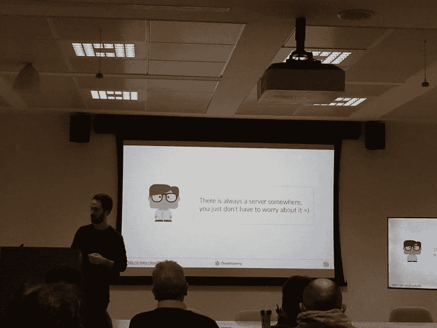【mreferre】今天我们就讲到这里。 [@alex_casalboni](https://twitter.com/alex_casalboni) 提醒大家无服务器中有服务器。检查！2018 年 1 月 10 日 19 点 22 分38

* * *

### 什么是 AWS Cloud9？

AWS Cloud 9 是一个用于编写、运行和调试代码的“*云 IDE* ”。

我要说的是，如果你能使用它们，并投入几个月/几年的时间正确地学习它们，大多数 ide 都是提高你的生产率和代码质量的极好工具。

也就是说，有些 ide 提供了比其他 ide 更高级、更有用的特性(*请不要太在意，除非你用 Word 或记事本编码*)。

[T2】](https://res.cloudinary.com/practicaldev/image/fetch/s--HgxRgsaV--/c_limit%2Cf_auto%2Cfl_progressive%2Cq_auto%2Cw_880/https://cdn-images-1.medium.com/max/300/1%2AKYVscEHbDKXtY3GJz6l0eg.jpeg)

[AWS 在 2016 年 7 月收购了 Cloud9](https://techcrunch.com/2016/07/14/amazons-aws-buys-cloud9-to-add-more-development-tools-to-its-web-services-stack/) ，现在已经更名为 AWS Cloud9。尽管它在 Werner 的浏览器上看起来很棒，但我在主题演讲中的第一印象是类似于“ ***的东西，我为什么要花钱写代码？*** "，后面紧跟着 ***是不是说我离线的时候不能编码？*** ”。像大多数软件工程师一样，在过去的十年中，我使用了许多免费的 ide，并且我习惯了在旅行时编写大量代码。

显然，我不是一个人，许多开发人员在我的演示过程中问了同样的问题。因此，让我简要重述一下我的论点。

关于成本，我相信对于大多数已经大量使用 AWS 的组织来说，这几乎可以忽略不计(对于一个 *t2.micro* 环境，每月 20 天，每天 8 小时，每月不到*2 美元*)。并且不考虑 AWS Free Tier 和自动节约成本设置(30 分钟后休眠)。

“*离线不编码*”的缺点更难防御，但是让我试试。

除非你要对一个成熟的项目进行一次硬核调试，否则你真的能在离线状态下编码超过 30 分钟吗？你能 git 克隆或 git 拉任何有用的东西吗？你能 npm 安装或者 pip 安装你需要的模块吗？您能模仿或忽略您的应用程序使用的所有第三方服务和 API 吗？你能避免搜索你最喜欢的框架文档吗？

当然，你可以为 12 小时的飞行做准备，提前下载/安装你需要的一切。但是这种情况多久发生一次呢？简单地说，我见过最好的开发人员和工程师在网络瘫痪时放弃并休息一会儿。

另一方面，AWS Cloud9 为您提供了一个更好的替代方案，以防您的机器放弃:)我现在可以将我的开发机器扔出窗口，切换到我同事的笔记本，登录到我的 AWS 帐户，并继续在同一个 Cloud9 会话上工作(该会话保存并存储在服务器端)。这意味着你也可以使用更便宜的机器，如 Chromebook 或平板电脑(或手机？).嗯，你可以 100%使用网吧的随机机器，或者你祖母的电脑:)

当然，总会有例外，当 Cloud9 不可用时，我会确保准备好使用我的本地 IDE。与此同时，我希望 AWS 将致力于某种客户端离线支持(也许会把 Cloud9 变成一个进步的 web 应用？).

#### ……为什么这对开发者很重要？

我认为 AWS Cloud9 为目前试图在每个开发人员的机器上建立复杂的工具栈的许多组织解决了一系列问题，特别是如果团队是异构的和/或分布式的。

让我们回顾一下它的一些特性:

*   这是一个成熟的 IDE(基于 T2 的王牌开源编辑器)
*   它配有一个集成的网络终端。这是一个直接在浏览器上进行的真正的 ssh 会话，不需要在本地机器上管理和存储 ssh 密钥或 IAM 凭证。
*   这个 web 终端可以运行在 AWS Cloud9 管理的新 EC2 实例上(EC2 env。)，也可以自带实例(SSH env。)
*   EC2 环境提供了非常方便的**成本节约功能**，这意味着你可以选择配置它们在 30 分钟(或更长)不活动后**休眠**
*   EC2 环境基于[这个亚马逊机器映像](http://docs.aws.amazon.com/cloud9/latest/user-guide/ami-contents.html)，它包括**至少 90%你需要的开发工具**。比如*的 AWS CLI、sam-local、git、gcc、c++、Docker、node.js、npm、nvm、CoffeeScript、Python、virtualenv、pip、pylint、boto3、PHP、MySQL、Apache、Ruby、Rails、Go、Java* 等。如果缺少什么，您可以随时安装:)
*   AWS Cloud9 附带了你期望从现代 IDE 中获得的**实时调试功能**(尽管目前只针对 Node.js)
*   它支持**协作编码和调试会话**。你可以和其他 *IAM 用户*共享一个 Cloud9 环境，用*只读*或*读写*权限邀请他们。
*   它自带对 **AWS Lambda** 的内置支持。这极大地简化了创建新的 Lambda 函数、在本地更新和测试它们的代码、部署新版本等过程。
*   另外， **AWS SAM** 也是团队的一员。[AWS SAM](https://github.com/awslabs/serverless-application-model)——或无服务器应用模型——是一个开放的规范，允许你用简化的云形成语法定义无服务器应用和相关资源。Cloud9 原生集成了 [SAM Local](https://github.com/awslabs/aws-sam-local) 提供的一些功能，SAM Local 是 AWS 用 Go 编写的开源 CLI 工具，用于简化无服务器应用的本地开发和测试。例如，您可以在本地调用函数，也可以模拟 API 网关端点。

我在一个非常简单的 Lambda 函数( ***注*** :我还花了 3 分钟定制主题&布局，根据我的口味和需要)的现场调试期间拍摄了以下截图。

<figure>[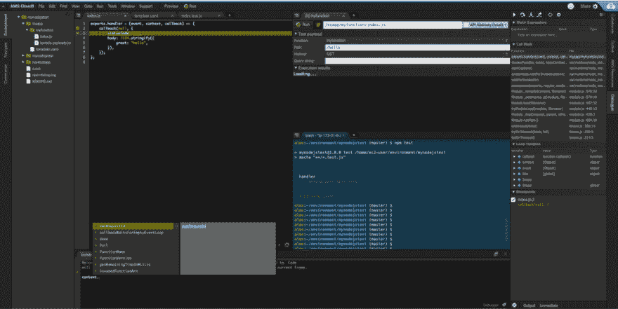](https://aws.amazon.com/cloud9/) 

<figcaption>AWS Cloud9 在与 Node.js</figcaption>

</figure>

的实时调试会话中的作用

#### AWS Cloud9 的局限性和我个人的“愿望”

我确实对 AWS Cloud9 有几个愿望，并且我已经在 Twitter 上分享了其中的几个愿望。

让我讨论其中的几个:

*   在我看来，“*数字限制*”非常合理。每个用户最多可以创建 20 个环境(最多同时打开 10 个)，每个帐户 100 个，每个环境中最多可以邀请 8 个成员。这些都是合理的数字，因为**你不能跨 AWS 账户共享环境**(还不行吗？)
*   **现场调试**很棒，但是**只适用于 Node.js** 。我期待着对 Python 的内置支持(当然还有所有其他的)。
*   这同样适用于目前不支持的一些运行时定制。例如，我找不到一种方法来改变 Python 的**默认林挺和代码完成**行为(只支持 *pylint* 参数)。如果没有自定义林挺，Python3 开发者就无法从 [Python 的类型提示功能](https://twitter.com/alex_casalboni/status/949685627456573440)中获益(需要 [*mypy*](http://mypy-lang.org/) )。
*   如上所述，不支持“离线”开发。在某些场景/团队中，离线工作可能会成为一个关键需求，尽管你总是可以一键将整个环境下载到你的本地机器上(*文件>下载项目*)并继续在本地工作。
*   我认为 Cloud9 可以更好地与 AWS 控制台集成，特别是与 Lambda 和 API Gateway 等服务。例如，没有简单的方法跳转到给定函数的 Lambda 控制台(或 API 网关)。
*   内置的 Lambda 集成非常出色，但它仍然**不如原生 Lambda 控制台**高效。例如，您可以在本地测试一个函数，但是您不能从模板列表中快速选择测试事件。现在，您可以通过在终端中运行 [sam local generate-event](https://github.com/awslabs/aws-sam-local#generate-sample-event-source-payloads) 来解决这个问题。

> 亚历克斯·卡萨尔博尼@亚历克斯 _ 卡萨尔博尼Python 为 AWS Cloud9 调试(拜托！)🐍⚡[# awswishlist](https://twitter.com/hashtag/awswishlist)2018 年 1 月 03 日上午 11:2101

> 亚历克斯·卡萨尔博尼@亚历克斯 _ 卡萨尔博尼我希望将“山姆本地生成事件”集成到 AWS Cloud9 本地运行/调试命令[# awswishlist](https://twitter.com/hashtag/awswishlist)[github.com/awslabs/aws-sa…](https://t.co/OjKkKno2Eg)上午 11:17-03 2018 年 1 月

> 亚历克斯·卡萨尔博尼@亚历克斯 _ 卡萨尔博尼自定义林挺&代码完成为 AWS Cloud9(特别为[# Python](https://twitter.com/hashtag/Python))[# awswishlist](https://twitter.com/hashtag/awswishlist)上午 10:35-08 2018 年 1 月3

> 亚历克斯·卡萨尔博尼@亚历克斯 _ 卡萨尔博尼我为我所有使用 [#Python](https://twitter.com/hashtag/Python) 并希望获得一些静态键入帮助的[#无服务器](https://twitter.com/hashtag/serverless)朋友创建了这个要点:“如何在 AWS Lambda 中使用 Python3 类型提示”
> [gist.github.com/alexcasalboni/…](https://t.co/DOUqXUVHyt)2016:54PM-011

* * *

### 什么是 AWS CodeStar？

AWS CodeStar(又名 **Code-*** )是一种“*包罗万象的服务*”，为开发者提供不断扩展的工具套件。

是一个免费的服务，让你管理和链接诸如*代码提交*、*代码构建*、*代码管道*、*代码部署*、 *Lambda* 、 *EC2* 、*弹性豆茎*、*云形成*、*云 9* 等服务。

我的 2018 年新年决心之一是在我的套牌中使用更多的模因(直到有人出于某种原因决定阻止我)，所以我在这里介绍了 CodeStar 可以解决的一些痛点。

<figure>[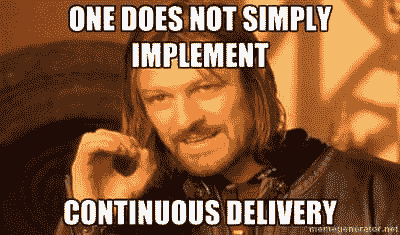](https://en.wikipedia.org/wiki/CI/CD) 

<figcaption>太多的项目往往会**推迟** [**CI/CD**](https://en.wikipedia.org/wiki/CI/CD) **直到为时已晚**而他们的**生产力水平太低**，只是因为这听起来很难。但没必要这么难，对吧？</figcaption>

</figure>

<figure> 

<figcaption>没人喜欢**构建和维护实时仪表盘**。但是它们从第一天起就是至关重要的，对于管理人员来说是评估项目状态，对于开发人员来说是监控系统如何运行。</figcaption>

</figure>

<figure>[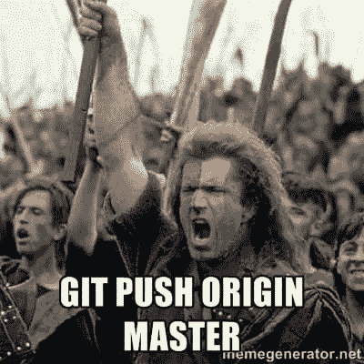](https://git-scm.com/docs/git-push) 

<figcaption>这是大多数开发者整天想做的事情。**随便写点代码推送给高手**。如何在不影响质量和所有权的情况下提供如此简单、顺畅的体验？</figcaption>

</figure>

<figure> 

<figcaption>问题跟踪可能是一个非常**令人沮丧的经历**，尤其是如果没有很好地与源代码控制、访问控制、团队管理、监控等集成的话。</figcaption>

</figure>

***数据驱动括号*** :我可以从统计上确认，JIRA 迷因产生的笑声比其他所有迷因加起来多 42%。

#### …为什么这对组织很重要？

CodeStar 可能不是每个项目/组织的最佳选择，尤其是那些最有经验和最先进的项目/组织，但是它绝对提供了一些非常好的默认设置。值得注意的是，CodeStar 是 100%免费的，你只需为它为你提供的资源付费。

让我们回顾一下它的特点:

*   CodeStar 提供了“ ***项目模板*** 的概念。每个模板代表一个完整的堆栈，包括一个示例应用程序，具有给定的后端、编程语言和框架。
*   它支持三个计算层:***【EC2】******弹性豆茎******λ***。
*   它支持六种编程语言:***c#******Java******node . js******Python******PHP******Ruby***(外加普通 HTML apps)。
*   它支持大量的框架: ***Express*** ， ***Spring*** ， ***Django*** ， ***Flask*** ，***ASP.NET Core***， ***Laravel*** 等。 ***注*** : AWS Lambda 项目仅支持 Express (Node.js)和 Spring (Java)，外加少数示例项目为 ***Alexa 技能*** 。
*   根据您选择的项目模板，CodeStar 将通过将 CodePipeline、CodeBuild 和 CodeDeploy 链接在一起，构建一个 ***CI/CD 管道*** 。
*   每个 CodeStar 项目都是从**源码控制** ( ***git*** )开始的，要么在 ***AWS CodeCommit 上，要么在 GitHub*** 上。CodeStar 将为您创建 git 存储库(对于 GitHub，通过 OAuth ),并负责 CI/CD 的触发器/挂钩。
*   你可以选择**配置你自己的编码工具**来使用 CodeStar。目前，本机只支持 Cloud9、Eclipse 和 VSCode(加上常规的 AWS CLI)。在本文的后面，您会读到更多关于 Cloud9 集成的内容。
*   尽管许多项目都是从周末一个人的努力开始的，但好的项目往往会不断发展，很快就会有更多的人参与进来。CodeStar 允许您邀请 IAM 用户加入到您的项目中，他们可以是:**所有者**(“上帝模式”)，**贡献者**(除了团队管理之外的一切)，或者**查看者**(只读仪表板访问)。更多技术信息[请点击](https://docs.aws.amazon.com/codestar/latest/userguide/access-permissions.html)。
*   如上所述，**问题跟踪**可能是许多项目中最令人沮丧的部分，因为它将上下文切换、可见性和误解问题带入了等式中。CodeStar 允许你**将 JIRA 或 GitHub 问题**集成到你的项目仪表板中，这可能有助于减少上下文切换和集中所有信息。
*   CodeStar 提供了一个**可定制的应用仪表板**(截图如下)，其中包括一个 ***项目 wiki 部分*** ，一个***cloud watch Metrics***部分，你的项目的 git 历史，API 端点，开放问题，Cloud9 环境等。您可以根据自己的意愿将**拖放到**的周围，并使用这个仪表板快速有效地检查项目的整体状态。

<figure>[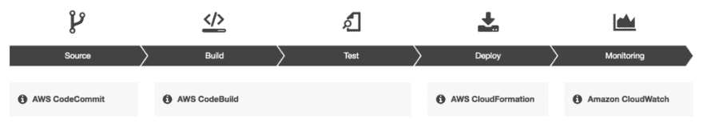](https://aws.amazon.com/codestar/)

<figcaption>CodeStar(AWS Lambda 项目)管理的典型 CI/CD 管道</figcaption>

</figure>

<figure>[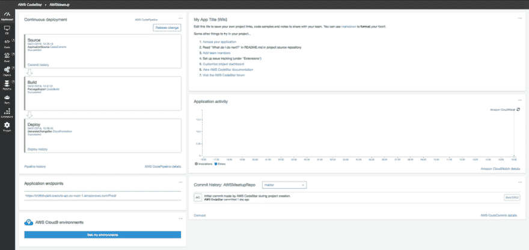](https://docs.aws.amazon.com/codestar/latest/userguide/how-to-customize.html) 

<figcaption>全新的 CodeStar 仪表盘(AWS Lambda 项目)</figcaption>

</figure>

<figure>[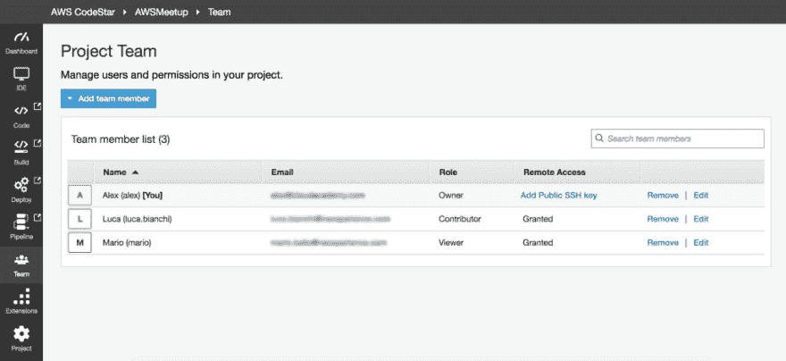](https://docs.aws.amazon.com/codestar/latest/userguide/how-to-manage-team-permissions.html) 

<figcaption>CodeStar 的团队管理和用户角色</figcaption>

</figure>

#### AWS CodeStar 限制和一些“*疑难杂症*

如果你从未玩过 CodePipeline 和 CodeBuild，CodeStar 看起来就像魔术一样，但不幸的是，它还不够完美。我也在推特上分享了一些“愿望”(下面的推文)，这里是我发现的快速回顾。

*   你可以为每个账户 创建多达 ***333 个项目(这个数字看起来像是经过深思熟虑计算出来的，对吗？)，但是每个用户只能有 ***10 个项目*** 和 **100 个项目**。至于 Cloud9，这些似乎是合理的数字，特别是因为 CodeStar **不支持联合用户**或临时访问凭证，这意味着如果一些开发人员开始跨 AWS 帐户合作，您将需要创建大量用户。***
*   尽管默认用户角色似乎涵盖了大多数用例，但是您仍然被所有者/贡献者/查看者权限所困扰，因为**您不能创建自定义角色**。例如，您可能希望拥有一个“*项目经理*”角色，该角色只具有查看权限和团队管理权限。
*   记住 **CodeStar 权限与 Cloud9 权限**无关。如果你想让其他所有者或贡献者加入你的 Cloud9 环境，你必须明确邀请他们。这很有道理，但我认为它可以改进/自动化。
*   我发现的最关键的限制是**没有办法定制项目模板**。正如我已经提到的，CodeStar 为很多事情提供了很好的默认设置，但是你可能需要修改一些细节。例如，您可能希望向代码管道添加测试步骤，向默认 IAM 角色添加自定义权限，编辑默认构建文件，更改默认 API 网关阶段等。一旦你这样做了，**就没有办法将你的编辑保存到一个新的定制项目模板**中，这样你的团队就可以从那里开始了。这意味着您必须将您的定制应用到每个新项目中。您只有两个选择:1) *手动应用变更*，或者 2) *自动将变更集应用到您的 CloudFormation 堆栈*(请注意，每个项目都将创建一个或多个 CloudFormation 堆栈，并且原始模板不会在任何地方进行版本化，所以祝您好运！).另外，请看下一个要点:)
*   一些 CodeStar 功能是基于**神秘的和未记录在案的云形成魔法**，例如 AWS::CodeStar::SyncResources 资源和 AWS::CodeStar 转换。它们听起来都很强大，但是没有简单的方法知道它们的用途(或者我们如何使用它们)。我目前的理解是，AWS::CodeStar::SyncResources 将等待所有其他资源被部署(即*依赖*)，然后确保一切正常(如 IAM 权限、项目 id 等)。).AWS::CodeStar 似乎只是简单地将 SyncResources 注入到已处理的模板中，这样我们就不必这样做了。

> 亚历克斯·卡萨尔博尼@亚历克斯 _ 卡萨尔博尼可定制 AWS CodeStar 项目模板 [#awswishlist](https://twitter.com/hashtag/awswishlist)下午 15:42-04 2018 年 1 月013

* * *

### AWS CodeStar+AWS cloud 9 怎么样？

Cloud9 和 CodeStar 本身就是非常酷的服务，我很高兴看到它们是如何被集成在一起的。或者，更好的是，Cloud9 是如何集成到 CodeStar 中的。

您可以将 AWS Cloud9 环境与您的 CodeStar 项目原生关联起来。如果多个开发人员在同一个项目上工作，您可以为每个开发人员创建并分配一个 Cloud9 环境(最终，如果需要的话，他们将相互合作并邀请)。

一旦你打开 Cloud9，你会发现你的 IAM 凭证已经与 git ( [集成，这需要一些工作](https://docs.aws.amazon.com/codecommit/latest/userguide/setting-up-gc.html))和你的 CodeCommit 库已经为你克隆好了。

不幸的是，如果你选择了 GitHub (目前来说？).

正如几个朋友和同事指出的，这不是一个关键的或技术复杂的集成，从某种意义上说，您可以自己处理它(就像您在本地机器上做的那样)。但是我认为这是一个很好的方法来精简开发经验，减少错误，尤其是当你在多个项目中工作时，尤其是在 T4、T7 和 T9 的时候。

例如，大多数开发人员在本地机器上工作时会大量使用 ***AWS 概要文件*** ，他们中的一些人还会设法记住哪个概要文件可以做什么，在哪个帐户中，等等。有了 CodeStar+Cloud9 **，你将不再关心配置文件或本地凭证**，因为每个 Cloud9 环境都绑定到一个特定的项目和账户。此外，由于 CI/CD 在默认情况下是启用的，大多数时候您只需 ***编写代码，用 sam-local*** 和 git push 进行测试💛

当然，您也可以拥有一个通用的 Cloud9 环境(即与特定的项目无关)，并使用它和多个概要文件来管理独特的资源或原型新东西。

* * *

### 我来开个括号:AWS SAM

我决定用一段关于 AWS SAM 的简短插入语来结束我的演讲，这段插入语被提到了几次，因此值得提供一些背景信息。

*****无服务器警报*****

<figure> 

<figcaption>遇见山姆！</figcaption>

</figure>

*SAM* 代表**无服务器应用模型**，它是一个[开放规范](https://github.com/awslabs/serverless-application-model)，其目标是提供一种定义无服务器应用的标准方式。

从技术上讲，这是一个名为 AWS::Serverless 的 [CloudFormation Transform](https://docs.aws.amazon.com/AWSCloudFormation/latest/UserGuide/transform-section-structure.html) ，它将把 AWS::Serverless::Function 等特殊的无服务器资源转换成标准的 CloudFormation 语法。

您可以将转换看作是一种增强 CloudFormation 模板表达能力的方式，这样您就可以用更简洁的方式定义复杂的资源及其关系。

如果你熟悉其他工具，比如无服务器框架，你会注意到语法非常相似(甚至有一个[插件将你的模板转换成 SAM](https://github.com/SAPessi/serverless-sam) )。

其实你可以用 [**AWS SAM Local**](https://github.com/awslabs/aws-sam-local) 部署 SAM 模板，这是一个用 Go 编写的，由 AWS 正式发布的本地开发的 CLI 工具。

您可以使用 AWS SAM Local 来本地测试您的 Lambda 函数，也可以模拟 API 网关端点。默认情况下，CLI 工具在每个 Cloud9 EC2 环境中都可用，并且 UI 已经支持它的一些功能。

#### 几个山姆的例子

<figure>[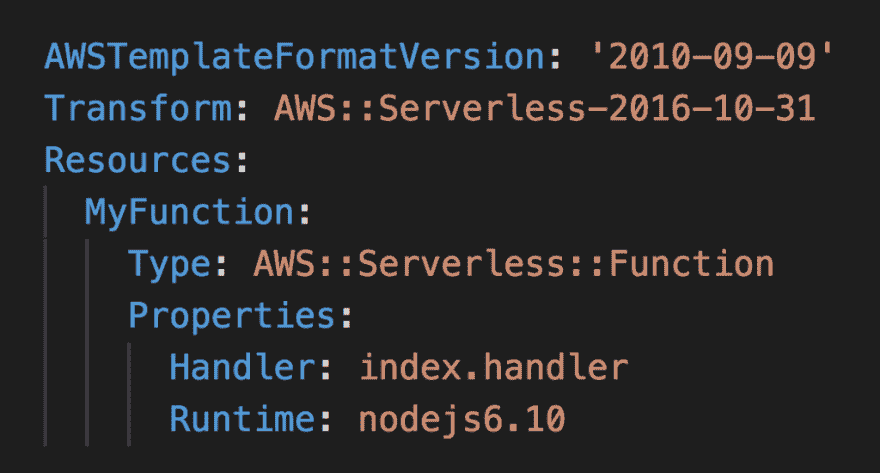](https://github.com/awslabs/serverless-application-model/blob/master/versions/2016-10-31.md#awsserverlessfunction) 

<figcaption>一个简单的无服务器功能(附加属性可用于 IAM 策略、VCP 配置、DLQ、跟踪等。)</figcaption>

</figure>

<figure>[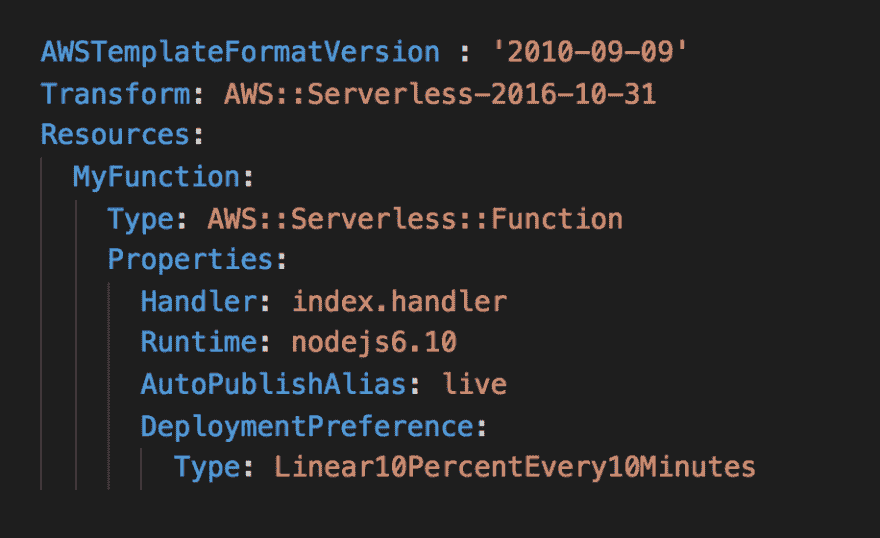](https://github.com/awslabs/serverless-application-model/blob/master/docs/safe_lambda_deployments.rst#safe-lambda-deployments) 

<figcaption>与上面定义的功能相同，加上 CodeDeploy 流量转移(每 10 分钟 10%)</figcaption>

</figure>

<figure>[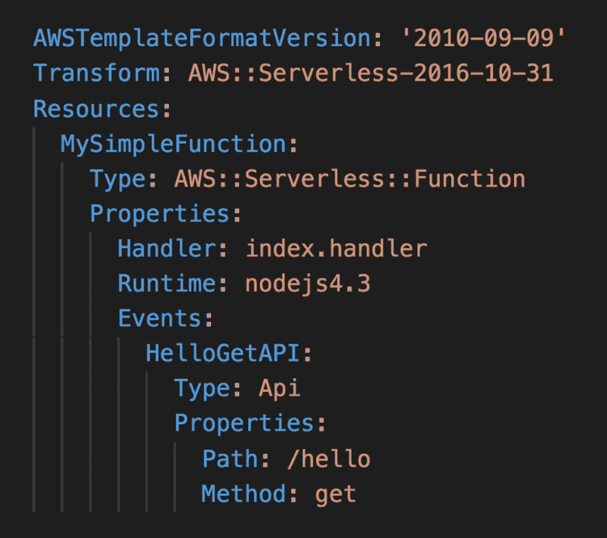](https://github.com/awslabs/serverless-application-model/blob/master/versions/2016-10-31.md#event-source-object) 

<figcaption>与上面定义的功能相同，加上一个 API 网关端点(没别的需要定义)</figcaption>

</figure>

<figure>[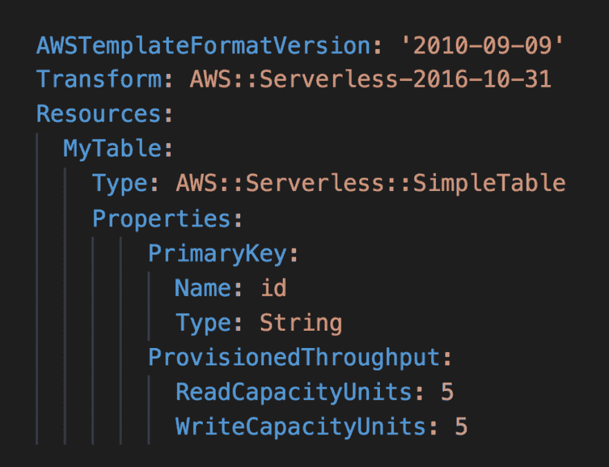](https://github.com/awslabs/serverless-application-model/blob/master/versions/2016-10-31.md#awsserverlesssimpletable) 

<figcaption>一个简化的 DynamoDB 定义(只有主键和吞吐量)</figcaption>

</figure>

<figure>[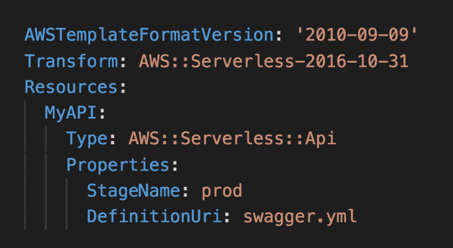](https://github.com/awslabs/serverless-application-model/blob/master/versions/2016-10-31.md#awsserverlessapi) 

<figcaption>一个以 swagger 格式定义的 API 网关(sam-local 在部署前会打包到 S3！)</figcaption>

</figure>

#### 我个人对 AWS SAM 的“祝愿”

我对 AWS SAM 只有一个愿望:我希望看到更多与 AWS::Serverless 转换相关的透明度和文档。

在 GitHub 上有一个开放的规范和本地 CLI 工具是很好的，但在我看来，只要 CloudFormation 转换像一个不可忽视的黑盒一样，社区就不会有太大贡献。

既然我喜欢做梦，为什么不允许**自定义云形态也变形**？我几乎可以打赌它们是用某种 Lambda hook 实现的，我甚至无法想象社区能够以这种方式开发和共享多少伟大的东西。

* * *

> 亚历克斯·卡萨尔博尼@亚历克斯 _ 卡萨尔博尼这是我在 AWS Cloud9、CodeStar 和 SAM(包括一段 [@PaulDJohnston](https://twitter.com/PaulDJohnston) 引文、几个迷因和几个“CloudStar”错别字)上的资料！⚡🐿️[#无服务器](https://twitter.com/hashtag/serverless)[# AWS meetup](https://twitter.com/hashtag/awsmeetup)[clda.co/aws-cloud9-cod…](https://t.co/9tEWMDebrO)22:29pm-2018 年 1 月 10 日1026

我希望你学到了一些关于 AWS Cloud9 和 CodeStar 的新知识(请不要混淆它们，像我几次做的那样，创建一些奇怪的混合体，如“ **CloudStar** ”。我建议尽快在 CodeStar 上构建一个简单的原型或示例项目。这里可以开始[！](https://console.aws.amazon.com/codestar)

* * *

如果你读到这里，你可能喜欢这篇文章，或者想分享你的想法。无论哪种方式，不要忘记推荐和分享，请不要犹豫给出反馈和分享您的想法=)

* * *