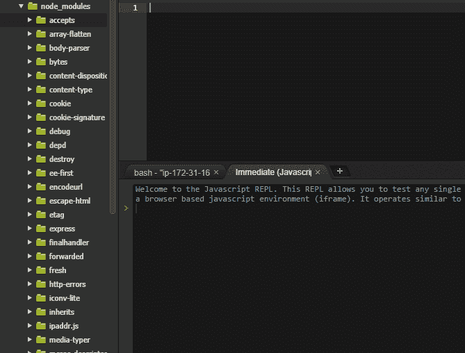

# 为什么 NPM 安装额外的模块？

> 原文:[https://dev . to/salahhamza/why-does-NPM-install-extra-modules-4kb 2](https://dev.to/salahhamza/why-does-npm-install-extra-modules-4kb2)

我是 web 开发的新手，目前正在学习的 [Node.js](https://nodejs.org/en/) 和 [Express](http://expressjs.com/) 是我正在钻研的第一个 web 框架，因为这是我正在学习的在线课程所使用的堆栈(我对此非常满意)。
在尝试将 express 安装到我正在工作的目录中时，我注意到不仅安装了 Express 模块，还安装了许多其他模块:

[T2】](https://res.cloudinary.com/practicaldev/image/fetch/s--Dl6G5nJj--/c_limit%2Cf_auto%2Cfl_progressive%2Cq_auto%2Cw_880/https://thepracticaldev.s3.amazonaws.com/i/57iwamsz2x2nygync3ob.PNG)

所以，我的问题是:**那些额外的模块有什么必要？它们是 express 正常运行所必需的吗？**

提前谢谢你