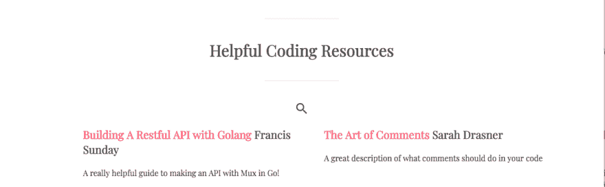
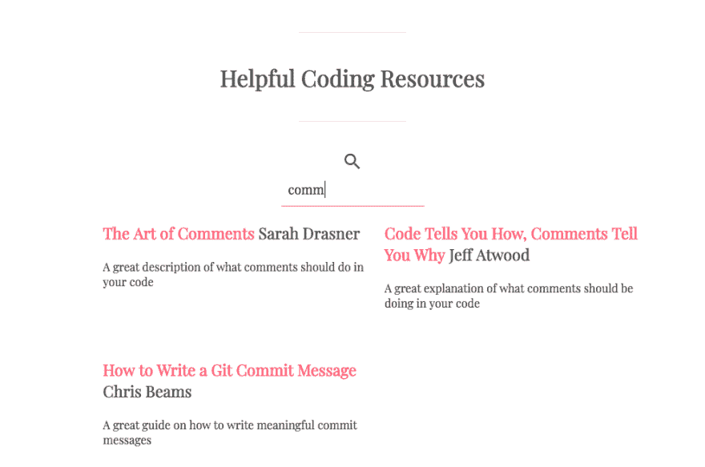

# 作为 React 和 Vue 开发人员学习 Angular 5

> 原文:[https://dev . to/aspittel/learning-angular-5-as-a-react-and-vue-developer-5dp 3](https://dev.to/aspittel/learning-angular-5-as-a-react-and-vue-developer-5dp3)

我尽量不参与一些编程文章使用的“框架之战”的叙述。不过，我得承认，我对 AngularJS(又名 Angular 1)相当挑剔。语法和结构对我来说似乎很笨拙，错误消息处理起来也不好玩！随着 React 的兴起，我也更倾向于更加流行的基于组件的架构。向 Angular 2 的 rocky 非向后兼容迁移让我迷失了，我不再关注 Angular。

最近，我听到了更多关于 Angular 5 的讨论，我想尝试一下，并将我的体验与我使用 Vue 和 React 的体验进行比较，因为我经常使用它们。

# 入门

我从 Angular 网站上的教程开始，它看起来非常简单，在概念上与其他框架相似。TypeScript 可能是与 Angular 最大的区别，我真的很喜欢它！在我看完他们的样本后，我觉得构建一个项目很舒服，特别是因为它太大了！我花了几个小时才看完！

超级英雄主题非常可爱，我喜欢它包括路由、API 请求、CLI 和服务的方式。它对框架的介绍非常透彻！

# 最终项目

[上周](https://dev.to/aspittel/how-i-built-an-api-with-mux-go-postgresql-and-gorm-5ah8)我在 Go 中构建了一个显示编码资源的 API，所以这周我想为那个应用构建一个前端！在这一点上，我几乎完全在“微服务”风格的应用程序中工作:我更愿意分别构建前端和后端。这款应用也不例外——本周的项目是完全静态的，它托管在 GitHub 页面上。

我从编码资源的组件、资源的 TypeScript 模式开始，然后是连接到 API 的服务。我一直保留着这个建筑。由于这是一个超级简单的应用程序，我觉得没有必要在这一点上有子组件或任何类似的东西。

服务看起来是这样的:

```
@Injectable()
export class ResourcesService {
  private resourcesUrl = 'https://helpful-coding-resources.herokuapp.com/resources';

  constructor (
    private http: HttpClient,
  ) {}

  getResources (): Observable<Resource[]>{
    return this.http.get<Resource[]>(this.resourcesUrl)
               .pipe(
                  tap(resources => console.log('done! 😀'));
               )
  } 
```

<svg width="20px" height="20px" viewBox="0 0 24 24" class="highlight-action crayons-icon highlight-action--fullscreen-on"><title>Enter fullscreen mode</title></svg> <svg width="20px" height="20px" viewBox="0 0 24 24" class="highlight-action crayons-icon highlight-action--fullscreen-off"><title>Exit fullscreen mode</title></svg>

我确实觉得有趣的是 Angular 有自己的 AJAX 服务，而不是你用你最喜欢的。我通常使用 Axios，使用它也没问题，但是把它包含在库中也不错。

旁注:我不习惯在 JavaScript 中使用分号，但我在这个项目中使用了它们，主要是因为 VSCode 会在 TypeScript 文件中自动插入它们，我懒得更改设置！

然后，我对组件本身进行了处理，结果是这样的:

```
export class ResourcesComponent implements OnInit {
  resources: Resource[];
  initialResources: Resource[];
  showSearch: boolean;

  constructor(private resourceService: ResourcesService) { }

  ngOnInit() {
    this.getResources();
  }

  getResources(): void {
    this.resourceService.getResources()
        .subscribe(resources => {
          this.resources = resources;
          this.initialResources = resources;
        });
  }

  toggleSearch(): void {
    this.showSearch = !this.showSearch;
  }

  search(val): void {
    this.resources = this.initialResources.filter(resource => {
      return resource.Tags.some(tag => {
        return tag.toLowerCase().startsWith(val.toLowerCase());
      });
    });
  }
} 
```

<svg width="20px" height="20px" viewBox="0 0 24 24" class="highlight-action crayons-icon highlight-action--fullscreen-on"><title>Enter fullscreen mode</title></svg> <svg width="20px" height="20px" viewBox="0 0 24 24" class="highlight-action crayons-icon highlight-action--fullscreen-off"><title>Exit fullscreen mode</title></svg>

我也喜欢模板语言，感觉很像 Vue。我还觉得有趣的是，Angular 中的 HTML 和 JS 代码仍然是分离的，特别是与 React 架构相比。

```
<div *ngIf="resources">
  <div class="search-div">
    <i
      class="material-icons"
      (click)="toggleSearch()"
    >
      search
    </i>
    <input
      #searchInput
      [ngClass]="{'shown': showSearch}"
      class="search-box"
      (keyup)="search(searchInput.value)"
      type="text"
      placeholder="Filter Resources"
    />
  </div>
  <div class="list">
    <div class="resource" *ngFor="let resource of resources">
        <a href="{{ resource.Link }}"><h3>{{ resource.Name }} <span class="author">{{ resource.Author }}</span></h3></a>
        <p>{{ resource.Description }}</p>
    </div>
  </div>
</div>
<div *ngIf="!resources">
  <div class="loader"></div>
</div> 
```

<svg width="20px" height="20px" viewBox="0 0 24 24" class="highlight-action crayons-icon highlight-action--fullscreen-on"><title>Enter fullscreen mode</title></svg> <svg width="20px" height="20px" viewBox="0 0 24 24" class="highlight-action crayons-icon highlight-action--fullscreen-off"><title>Exit fullscreen mode</title></svg>

我有两个数组，一个包含当前显示的资源，另一个包含从 API 获取的资源。这使我能够轻松地实现基于标签的过滤。我还有一个开关，当搜索栏不用时，它会隐藏起来。最后，我有一个搜索方法，可以过滤附加到资源上的标签。

### 显示所有文章

[T2】](https://res.cloudinary.com/practicaldev/image/fetch/s--vUaXtfTI--/c_limit%2Cf_auto%2Cfl_progressive%2Cq_auto%2Cw_880/https://thepracticaldev.s3.amazonaws.com/i/wbys08e8eh1ft3u085bs.png)

### 搜索到的文章

[T2】](https://res.cloudinary.com/practicaldev/image/fetch/s--9iH_wO26--/c_limit%2Cf_auto%2Cfl_progressive%2Cq_auto%2Cw_880/https://thepracticaldev.s3.amazonaws.com/i/4zy9grpahskujvo29bfb.png)

我也很容易地添加了动画。有关于在 Angular 中直接实现它们的文档，但是我选择在 CSS 中实现它们。我更习惯于这样，它也被优化了。

# 部署

我找到了一个`npm`包，它将 Angular 5 应用程序部署到 GitHub 页面，我用它来进行所有的静态托管。这相对简单，我很容易就部署好了页面。

# 下一步

我很高兴看到自 AngularJS 以来 Angular 生态系统已经取得了多大的进步！我喜欢组件架构，语法似乎也有所改进。我认为一切都集成得很好，CLI 也很棒。

话虽如此，我看不出 Angular 5 的个人需求或用途。这个包很大，对我来说，在问题上比 React 或 Vue 更难找到支持(可能是因为快速的版本控制)。如果我想要静态类型，我可能会在 React 中使用 flow 或者在 Vue 中集成 TypeScript。我认为 Angular 正试图成为重视稳定性的企业应用的首选框架。在它后面有谷歌的名字是非常重要的，它所覆盖的大域名可能也会有所帮助。我仍然更喜欢 React 和 Vue 代码的结构——我更喜欢它们提供的更大的灵活性。

简而言之，我喜欢使用 Angular 5，如果有人要求，我会毫不犹豫地使用它创建另一个应用程序，但与其他框架相比，我不会选择自己使用它。Vue 是如此容易学习，它的生态系统是如此一致，React 的架构已经成为行业的转型。我没有不喜欢 Angular 5 的任何东西，我只是不像喜欢其他工具那样喜欢它。

[全代码](https://github.com/aspittel/helpful-coding-resources/)
[App](https://www.alispit.tel/helpful-coding-resources/)

**我的一部分[关于学习新事物](https://medium.com/on-learning-new-things/learning-new-things-f4db7f16724)系列**