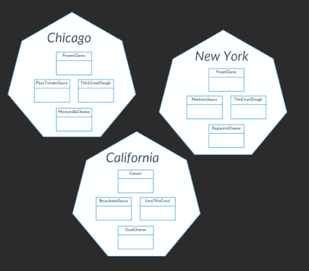
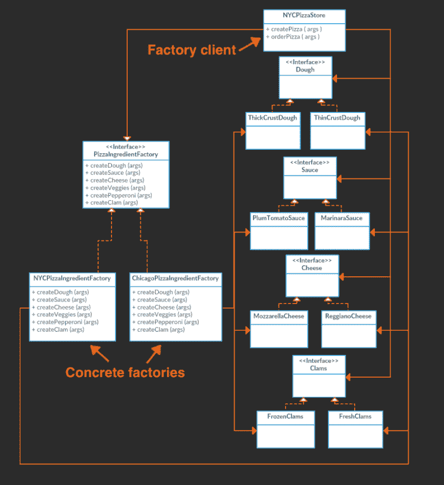
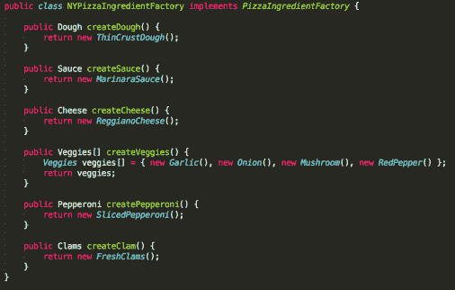
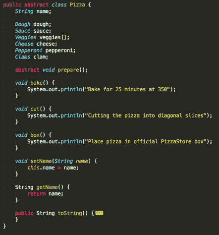
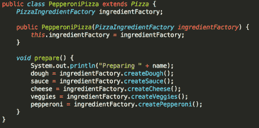
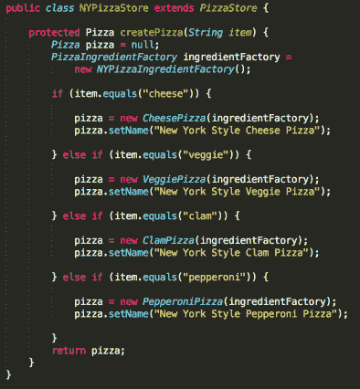

# 设计模式:工厂模式，第 2 部分

> 原文:[https://dev . to/Henri guy/design-patterns-factory-pattern-part-2-17la](https://dev.to/henriguy/design-patterns-factory-pattern-part-2-17la)

最初发布于: [henricodesjava.blog](https://henricodesjava.blog)

大家新年快乐！希望你对编码、学习和成长的新一年感到兴奋 

我们上次停止了第四章[头先设计模式:涵盖工厂模式的大脑友好指南](https://www.amazon.com/Head-First-Design-Patterns-Brain-Friendly/dp/0596007124/ref=sr_1_1?ie=UTF8&qid=1505068308&sr=8-1&keywords=head+first+design+patterns)。在这篇文章中，我们将讨论本章中的第二种模式，称为“抽象工厂模式”。

两种工厂模式都负责封装对象创建，换句话说，封装具体的实现。工厂方法模式通过使用继承来实现这一点，抽象工厂模式通过使用组合来实现这一点。

让我们继续使用第 1 部分中的比萨饼店例子。教科书给了我们一个假设的例子，我们想控制未来所有比萨饼店使用的配料类型。值得注意的是，所有的商店都会使用某种类型的面团、酱、奶酪和蛤蜊。这意味着每种配料都有几种不同的类型。这就是我们可以将它们归入“配料家族”的原因。

[T2】](https://res.cloudinary.com/practicaldev/image/fetch/s--oFM4vyQx--/c_limit%2Cf_auto%2Cfl_progressive%2Cq_auto%2Cw_880/https://henricodesjava.files.wordpress.com/2018/01/family-of-ingredients-1.jpg%3Fw%3D449%26h%3D394)

我们要做的是为每个区域创建一个工厂类。芝加哥、纽约和加利福尼亚的配料工厂。每个工厂都将实现一个通用的“PizzaIngredientFactory”Java 接口。让我们看一下这个解决方案的类图。为了简洁起见，没有显示加州配料厂。

[T2】](https://res.cloudinary.com/practicaldev/image/fetch/s--FGQhSYQb--/c_limit%2Cf_auto%2Cfl_progressive%2Cq_auto%2Cw_880/https://henricodesjava.files.wordpress.com/2018/01/factory-pattern1.jpg%3Fw%3D900%26h%3D985)

有点乱，但是仔细看看这个类图中的关系。我们看到的是，每个配料类别(面团、酱、奶酪、蛤蜊)都有一个接口，然后有适合某个地区的实现。而这些实现都来自各自的 PizzaIngredientFactory。这是给我们的模式一个正式定义的起点。

**抽象工厂模式:**提供一个接口，用于创建一系列相关或依赖的对象，而无需指定它们的具体类。

下面是 PizzaIngredientFactory 接口。

[T2】](https://res.cloudinary.com/practicaldev/image/fetch/s--rcAr7xoP--/c_limit%2Cf_auto%2Cfl_progressive%2Cq_auto%2Cw_880/https://henricodesjava.files.wordpress.com/2018/01/screen-shot-2018-01-14-at-10-04-50-am.png%3Fw%3D310%26h%3D160)

下面是这个接口在纽约和芝加哥的实现。

[T2】](https://res.cloudinary.com/practicaldev/image/fetch/s--nLnjJoBN--/c_limit%2Cf_auto%2Cfl_progressive%2Cq_auto%2Cw_880/https://henricodesjava.files.wordpress.com/2018/01/screen-shot-2018-01-14-at-10-05-55-am.png%3Fw%3D506%26h%3D322)

[T2】](https://res.cloudinary.com/practicaldev/image/fetch/s--mLUo2lc3--/c_limit%2Cf_auto%2Cfl_progressive%2Cq_auto%2Cw_880/https://henricodesjava.files.wordpress.com/2018/01/screen-shot-2018-01-14-at-10-07-01-am.png%3Fw%3D302%26h%3D402)

我们还没完。我们需要对披萨做些改变，这样所有的披萨都只使用工厂生产的原料，而不接受任何细绳。下面是抽象的披萨。花点时间回顾一下我的第 1 部分帖子，注意一下所做的修改。为了简洁起见，上面的类图中没有显示这个抽象的 pizza 和所有接口以及配料的实现。

[T2】](https://res.cloudinary.com/practicaldev/image/fetch/s--FwLiUS_9--/c_limit%2Cf_auto%2Cfl_progressive%2Cq_auto%2Cw_880/https://henricodesjava.files.wordpress.com/2018/01/screen-shot-2018-01-14-at-10-08-10-am.png%3Fw%3D442%26h%3D473)

下面是意大利香肠披萨的样子。请注意，选择特定类型的面团、酱和奶酪的所有责任都留给了配料工厂。在这个类中是泛型接口，可以在构造函数中传递一个具体的实现。奶酪、蛤蜊和蔬菜披萨看起来像这样。

[T2】](https://res.cloudinary.com/practicaldev/image/fetch/s--ie_AIHxf--/c_limit%2Cf_auto%2Cfl_progressive%2Cq_auto%2Cw_880/https://henricodesjava.files.wordpress.com/2018/01/screen-shot-2018-01-14-at-10-09-53-am.png%3Fw%3D438%26h%3D216)

最后，让我们从更高的层面来看看顾客对这些披萨的使用。下面是纽约披萨店。

[T2】](https://res.cloudinary.com/practicaldev/image/fetch/s--2ffU4bP2--/c_limit%2Cf_auto%2Cfl_progressive%2Cq_auto%2Cw_880/https://henricodesjava.files.wordpress.com/2018/01/screen-shot-2018-01-14-at-10-12-20-am.png%3Fw%3D394%26h%3D426)

这里我们看到“NYPizzaIngredientFactory”的构造函数被设置为一般的“PizzaIngredientFactory”数据成员。然后将它传递给每个 pizza 类型的构造函数。嘣，所有的魔法都在后台发生！

这需要做大量的工作，类图可能看起来有点混乱，但这是实现抽象工厂模式所需要的。如果你想看看这个例子的完整代码库，请点击这里查看。感谢阅读 