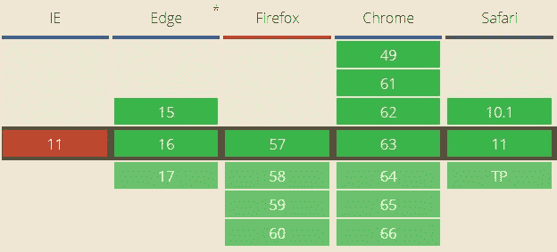
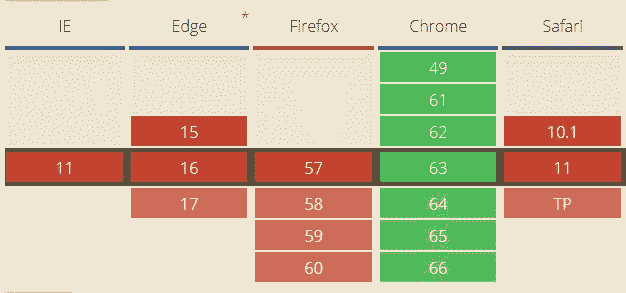

# Safari 是新的互联网浏览器

> 原文:[https://dev . to/nektro/safari-is-the-new-internet-explorer-1df 0](https://dev.to/nektro/safari-is-the-new-internet-explorer-1df0)

*图片来源:[blog.html5test.com](http://blog.html5test.com/2015/07/safari-and-ie/)T3】*

不久前，有人在 The Verge 上发布了一篇题为“ [Chrome 正在变成新的 Internet Explorer 6](https://www.theverge.com/2018/1/4/16805216/) ”的文章。而今天我要对此进行强烈反驳。我如此不喜欢这篇文章的原因是因为它不仅提出了有效的观点，而且在这样做的过程中，证明了它的标题是错误的，并且完全颠覆了它试图揭示的问题。

Chrome 开始遭遇的问题是，它变得太好了。Google 在 web 开发栈的整个过程(标准规范编写、浏览器工程、网站开发等)中投入了如此多的人员，以至于其他浏览器在发布新功能时很难赶上。

然而，这不是 Internet Explorer 面临的问题。从文章来看，

> 忽视 web 标准意味着开发人员开始专门围绕 Internet Explorer 编写他们的站点，并建议他们的客户只能通过 Internet Explorer 访问他们的站点。

Internet Explorer(因此微软大约在 2006 年左右)不仅没有参与标准的制定，而且偏离了标准，从而迫使 web 开发者也这样做，以迎合拥有+90%市场份额的浏览器。

我们看到的图表是这样的:

来这样的图表:

Chrome 宠坏了我们，如果你足够幸运，最近玩过闪亮的新 API，我希望你有 Chrome，因为 ES6 模块仍然没有在 Firefox 中实现，Firefox 和 Edge 都不支持自定义元素(Firefox 只是在 FF 59 的夜间启用了它)

但是游猎。Safari 既有**。

哦。你可能已经注意到“两者”旁边有一个大星号。是的，因为正如我在标题中所说，Safari 是新的互联网浏览器。Safari 支持很多很多的 API，但是有足够多的差异，你必须意识到它们。

*   对于 ES6 模块:Safari 要求你在`include`语句中包含`.js`扩展，并且(根据我的经验)如果你`export`它，有时只会看到模块内部的函数(从模块内部)。
*   还有自定义元素:Safari 不支持`:host` CSS 选择器，所以你试图添加的很多嵌入式 CSS 可能都不会工作。

就在今天，我正在制作一个 compass PWA，我在 iOS 上的`deviceorientation`事件中发现了一个差异，即事件的`alpha`值将在每次页面加载时重置为陀螺仪的初始值。因此，他们没有利用规范中的`absolute`属性，而是为指南针值添加了自己的`webkitCompassHeading`属性。

哦，苹果..

😩