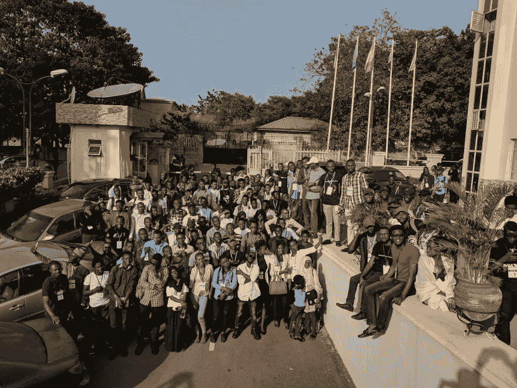

# 2017 年是一年:$ git 推原产地尼日利亚

> 原文：<https://dev.to/inidaname/2017-was-a-year--git-push-origin-nigeria-2lk0>

如果你是 PES 2016 的粉丝，相信你还记得激情坑的那首[**(1985)。**](https://youtu.be/doMQ0qrvJTM?t=81) 歌曲中我最喜欢的部分，*🎵1985 年是个好年景。*

> 嘶:你尖叫了吗？让我们再试一次*🎵* **1985 年是个好年景！！！**

<figure>

<figcaption>Konami PES 2016</figcaption>

</figure>

几周前，我被我在 Medium 上看到的 2017 年评论数量吓到了。 [***这个神一定是疯了***](https://medium.com/@unicodeveloper/2017-in-review-the-gods-must-be-crazy-1e8d3af72e5b) ***？*** 正确。

让我们做一个快速的。

> 记住，这不是什么历史课。

2017 年之前，尼日利亚科技行业的历史主要存在于谷歌和推特上，其中一部分存在于脸书，是的，我知道你可以在尼日利亚科技故事的一些页面上找到 GitHub。

让我们开始吧，2017 年谷歌开发者峰会，为下一个 10 亿用户打造一个美好的非洲，谷歌开发者大会*请注意*

 *<figure> 

<figcaption>GDG 发展节北中部 2017</figcaption>

</figure>

我相信现在你明白我的意思了。开发人员的身份从 Linkedin 上的一些头衔转移到了基于社区的东西。

我们现在有 ***名人开发者。*T3】**

<figure> 

<figcaption>庆幸我是张真勋:</figcaption>

</figure>

 **社区增长过去由网吧承担，这要感谢那些家伙。说真的，现在我们有脸书、谷歌和微软，是的，你没听错，微软，2017 年的魔术师。

通过 Andela 学习社区 1.0 和 2.0、Hotels.ng 实习、[基本编码挑战](http://medium.com/basiccodingchallenge)和其他许多活动，尼日利亚青年正在真正建设尼日利亚的明天。

你读过那个从哈科特港 [**到硅谷**](https://startupsventurecapital.com/port-harcourt-to-silicon-valley-861aef4593c7) 的家伙或者那个在诺基亚手机 **上建了一个应用的家伙 [**吗？**](https://medium.freecodecamp.org/how-i-went-from-programming-with-a-feature-phone-to-working-for-an-mit-startup-40ca3be4fa0f)**

这只是一个开始，2018 年只过去了 13 天，我甚至无法记录在短短一个周末发生了多少次会面

我知道没错，我记得他们用我们向雅虎男孩解释

[https://www.youtube.com/embed/doMQ0qrvJTM](https://www.youtube.com/embed/doMQ0qrvJTM)

现在作为一个尼日利亚人和一个尼日利亚的开发者(相信我这是两码事),请帮我呐喊一下*🎵2017 年是个好年景🎵。*还不会是好节奏*🎵2017 年是个好年景🎵。*

谢谢你。

我知道 2018 年将是又一个美好的一年，我希望你能为尼日利亚做出贡献，为社区增加积极的价值。只要在 2018 年结束前承诺，你需要的只是$ git push，即使你不得不使用- force 相信我，你不会后悔，因为一旦你的 pull 请求被合并，我们的旅程就开始了。***