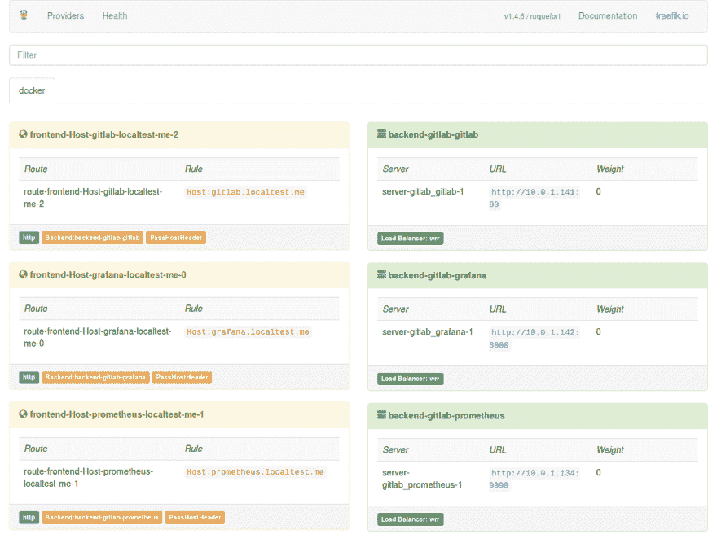
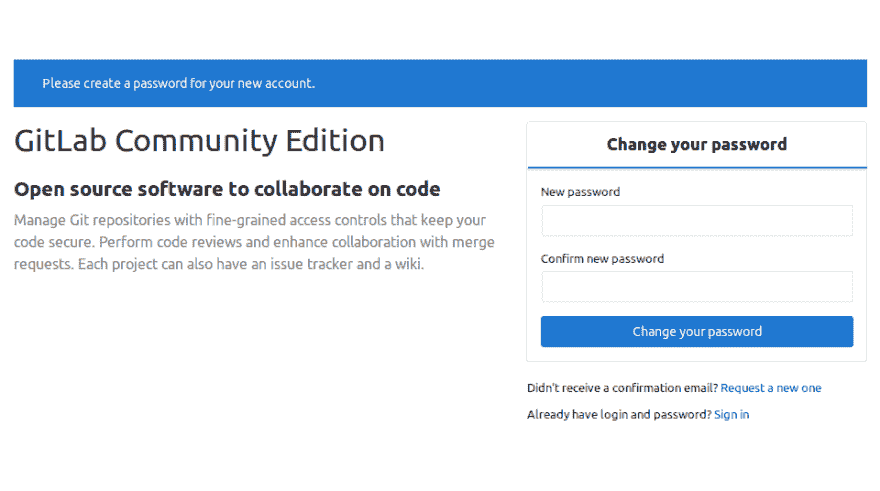
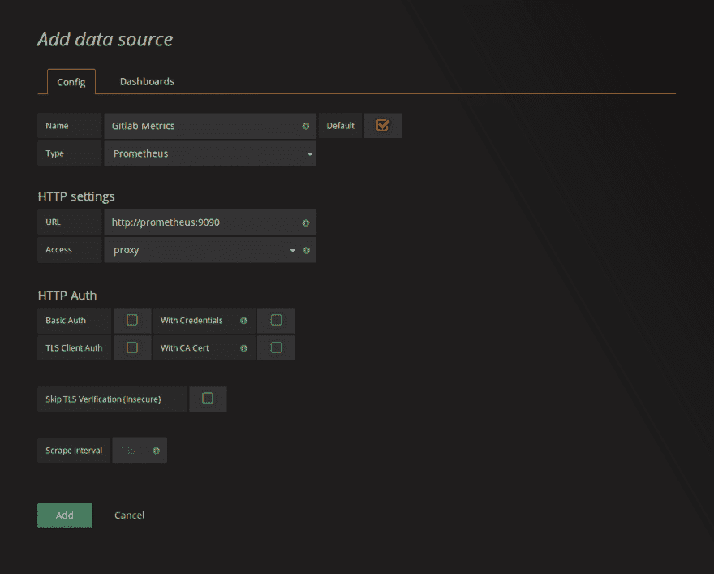

# 在 Docker Swarm 上部署 gitlab

> 原文:[https://dev . to/livioribeiro/deploying-git lab-on-docker-swarm-1fb 1](https://dev.to/livioribeiro/deploying-gitlab-on-docker-swarm-1fb1)

**更新**:你可能想看看 gitlab 文档上的说明[。](https://docs.gitlab.com/omnibus/settings/nginx.html)

Docker Swarm 是一个容器编排系统，非常容易设置和开始使用，它内置在 Docker 引擎中，可以在几分钟内设置好。但是部署像 Gitlab 这样的服务可能有点棘手。

在本教程中，我将展示如何在 Docker Swarm 上部署 Gitlab，同时尝试模拟生产环境。

## 但是 Kubernetes 打赢了容器编排战！

自从 Docker 宣布支持 Kubernetes 以来，我就听说 Swarm 将停止使用，但我相信这两种解决方案将共存(至少我希望如此)。Kubernetes 是一个很好的解决方案，但它并不容易上手，而且建立一个新的集群可能非常具有挑战性，特别是如果您只有几台服务器可用的话(记住，您还需要一个 etcd 集群)。

Kubernetes 仍然是一个很好的选择，我猜测 Swarm 可能会成为 Kubernetes 的一个门面。

## 我们开始之前...

在我们到达 Gitlab 之前，我们需要一些东西:

*   代理将请求转发给正确的服务
*   邮局和邮局
*   普罗米修斯公司将从 Gitlab 和 Grafana 收集指标，并对这些指标进行可视化
*   一个 NFS4 共享来存储我们需要的任何持久数据

### 代理人

对于代理，我们可以使用 [Traefik](https://traefik.io/) 。我们只需要在我们的 Swarm 集群上创建一个新的网络，启动 Traefik 服务:

```
$ docker network create --driver overlay proxy
$ docker service create \
    --name traefik \
    --constraint=node.role==manager \
    --publish 80:80 --publish 8080:8080 \
    --mount type=bind,source=/var/run/docker.sock,target=/var/run/docker.sock \
    --network proxy \
    traefik \
    --docker \
    --docker.swarmmode \
    --docker.domain=localtest.me \
    --docker.watch \
    --web 
```

<svg width="20px" height="20px" viewBox="0 0 24 24" class="highlight-action crayons-icon highlight-action--fullscreen-on"><title>Enter fullscreen mode</title></svg> <svg width="20px" height="20px" viewBox="0 0 24 24" class="highlight-action crayons-icon highlight-action--fullscreen-off"><title>Exit fullscreen mode</title></svg>

我们首先创建了`proxy`网络，因此 Traefik 可以访问任何连接到该网络的服务。通过将 Docker 套接字安装到 Traefik 服务中，我们允许它在部署新服务时进行观察并重新配置自己。参数`--docker.domain=[localtest.me](http://readme.localtest.me/)`将指示 Traefik 将`{service_name}.localtest.me`代理给相应的服务([，您可以覆盖默认设置](https://docs.traefik.io/configuration/backends/docker/#labels-overriding-default-behaviour))。

需要注意的是，域名“ [localtest.me](http://readme.localtest.me/) ”是一个重定向到`127.0.0.1`的服务。非常方便，因为不必与`/etc/hosts`混淆。

### 建立 NFS

首先我们需要安装 NFS 服务器:

```
# On Debian/Ubuntu
apt-get install -y nfs-kernel-server

# On RedHat/CentOS
yum install -y nfs-utils

# Start the NFS server and enable it on startup
systemctl enable --now nfs-server 
```

<svg width="20px" height="20px" viewBox="0 0 24 24" class="highlight-action crayons-icon highlight-action--fullscreen-on"><title>Enter fullscreen mode</title></svg> <svg width="20px" height="20px" viewBox="0 0 24 24" class="highlight-action crayons-icon highlight-action--fullscreen-off"><title>Exit fullscreen mode</title></svg>

对于 NFS 共享，将需要如下所示的目录结构:

```
/srv/gitlab-swarm/
├── gitlab
│   ├── config
│   ├── data
│   └── logs
├── grafana
├── postgres
└── prometheus 
```

<svg width="20px" height="20px" viewBox="0 0 24 24" class="highlight-action crayons-icon highlight-action--fullscreen-on"><title>Enter fullscreen mode</title></svg> <svg width="20px" height="20px" viewBox="0 0 24 24" class="highlight-action crayons-icon highlight-action--fullscreen-off"><title>Exit fullscreen mode</title></svg>

我们可以使用下面的 shell 来创建它:

```
mkdir -p /srv/gitlab-swarm && \
mkdir -p /srv/gitlab-swarm/gitlab/{data,logs,config} && \
mkdir -p /srv/gitlab-swarm/postgres && \
mkdir -p /srv/gitlab-swarm/grafana && \
mkdir -p /srv/gitlab-swarm/prometheus && \
chmod -R 777 /srv/gitlab-swarm 
```

<svg width="20px" height="20px" viewBox="0 0 24 24" class="highlight-action crayons-icon highlight-action--fullscreen-on"><title>Enter fullscreen mode</title></svg> <svg width="20px" height="20px" viewBox="0 0 24 24" class="highlight-action crayons-icon highlight-action--fullscreen-off"><title>Exit fullscreen mode</title></svg>

然后我们需要创建目录`/exports/gitlab-swarm`并在上面挂载`srv/gitlab-swarm`(这是 NFS 版本 4 所需要的):

```
mkdir -p /exports/gitlab-swarm
mount --bind /srv/gitlab-swarm /exports/gitlab-swarm 
```

<svg width="20px" height="20px" viewBox="0 0 24 24" class="highlight-action crayons-icon highlight-action--fullscreen-on"><title>Enter fullscreen mode</title></svg> <svg width="20px" height="20px" viewBox="0 0 24 24" class="highlight-action crayons-icon highlight-action--fullscreen-off"><title>Exit fullscreen mode</title></svg>

通过编辑`/etc/exports` :
设置 NFS 共享

```
# /etc/exports

/exports/               *(rw,sync,fsid=0,crossmnt,no_subtree_check)
/exports/gitlab-swarm   *(rw,sync,no_root_squash,no_subtree_check) 
```

<svg width="20px" height="20px" viewBox="0 0 24 24" class="highlight-action crayons-icon highlight-action--fullscreen-on"><title>Enter fullscreen mode</title></svg> <svg width="20px" height="20px" viewBox="0 0 24 24" class="highlight-action crayons-icon highlight-action--fullscreen-off"><title>Exit fullscreen mode</title></svg>

现在我们重新加载 NFS 配置:

```
exportfs -ra 
```

<svg width="20px" height="20px" viewBox="0 0 24 24" class="highlight-action crayons-icon highlight-action--fullscreen-on"><title>Enter fullscreen mode</title></svg> <svg width="20px" height="20px" viewBox="0 0 24 24" class="highlight-action crayons-icon highlight-action--fullscreen-off"><title>Exit fullscreen mode</title></svg>

**更新 2018-08-18**

```
/srv/gitlab-swarm/      /exports/gitlab-swarm/  none    bind 
```

<svg width="20px" height="20px" viewBox="0 0 24 24" class="highlight-action crayons-icon highlight-action--fullscreen-on"><title>Enter fullscreen mode</title></svg> <svg width="20px" height="20px" viewBox="0 0 24 24" class="highlight-action crayons-icon highlight-action--fullscreen-off"><title>Exit fullscreen mode</title></svg>

记住，我们需要在集群的每个节点上安装 NFS 客户端:

```
# On Debian/Ubuntu
apt-get install -y nfs-common

# On RedHat/CentOS
yum install -y nfs-utils 
```

<svg width="20px" height="20px" viewBox="0 0 24 24" class="highlight-action crayons-icon highlight-action--fullscreen-on"><title>Enter fullscreen mode</title></svg> <svg width="20px" height="20px" viewBox="0 0 24 24" class="highlight-action crayons-icon highlight-action--fullscreen-off"><title>Exit fullscreen mode</title></svg>

为了测试 NFS 配置是否正确，我们可以尝试装载共享:

```
mkdir /var/tmp/test-nfs && \
mount -t nfs4 127.0.0.1:/gitlab-swarm /var/tmp/test-nfs && \
grep nfs4 /proc/mounts | cut -d ' ' -f 1,2,3 && \
umount /var/tmp/test-nfs 
```

<svg width="20px" height="20px" viewBox="0 0 24 24" class="highlight-action crayons-icon highlight-action--fullscreen-on"><title>Enter fullscreen mode</title></svg> <svg width="20px" height="20px" viewBox="0 0 24 24" class="highlight-action crayons-icon highlight-action--fullscreen-off"><title>Exit fullscreen mode</title></svg>

运行上面的命令应该会输出这个:

```
127.0.0.1:/gitlab-swarm /var/tmp/test-nfs nfs4 
```

<svg width="20px" height="20px" viewBox="0 0 24 24" class="highlight-action crayons-icon highlight-action--fullscreen-on"><title>Enter fullscreen mode</title></svg> <svg width="20px" height="20px" viewBox="0 0 24 24" class="highlight-action crayons-icon highlight-action--fullscreen-off"><title>Exit fullscreen mode</title></svg>

## 建筑堆栈

### 配置文件

为了部署我们的 Gitlab 堆栈，首先我们需要为我们正在部署的服务创建配置文件。

第一个是针对 Gitlab 本身的(gitlab.rb)。我们正在使用的 Docker 镜像版本(10.3.3)基于 omnibus 安装，包含 gitlab 所需的所有服务，包括 postgres、redis 和 prometheus。我们将禁用这些服务，并设置 gitlab 在其他容器中查找它们:

```
# gitlab.rb

external_url 'http://gitlab.local'
registry_external_url 'http://registry.gitlab.local'

# Disable services
postgresql['enable'] = false
redis['enable'] = false
prometheus['enable'] = false
postgres_exporter['enable'] = false
redis_exporter['enable'] = false

# Postgres settings
gitlab_rails['db_adapter'] = "postgresql"
gitlab_rails['db_encoding'] = "unicode"

# database service will be named "postgres" in the stack
gitlab_rails['db_host'] = "postgres" 
gitlab_rails['db_database'] = "gitlab"
gitlab_rails['db_username'] = "gitlab"
gitlab_rails['db_password'] = "gitlab"

# Redis settings
# redis service will be named "redis" in the stack
gitlab_rails['redis_host'] = "redis"

# Prometheus exporters
node_exporter['listen_address'] = '0.0.0.0:9100'
gitlab_monitor['listen_address'] = '0.0.0.0'
gitaly['prometheus_listen_addr'] = "0.0.0.0:9236"
gitlab_workhorse['prometheus_listen_addr'] = "0.0.0.0:9229" 
```

<svg width="20px" height="20px" viewBox="0 0 24 24" class="highlight-action crayons-icon highlight-action--fullscreen-on"><title>Enter fullscreen mode</title></svg> <svg width="20px" height="20px" viewBox="0 0 24 24" class="highlight-action crayons-icon highlight-action--fullscreen-off"><title>Exit fullscreen mode</title></svg>

从 gitlab 设置度量收集的 Prometheus 配置文件:

```
# prometheus.yaml

global:
  scrape_interval: 15s

scrape_configs:
  - job_name: 'prometheus'
    static_configs:
      - targets: ['localhost:9090']

  # gitlab monitor
  - job_name: 'gitlab_monitor'
    static_configs:
      - targets: ['gitlab:9168']

  # gitlab sidekiq
  - job_name: 'gitlab_sidekiq'
    metrics_path: /sidekiq
    static_configs:
      - targets: ['gitlab:9168']

  # gitlab process
  - job_name: 'gitlab_process'
    metrics_path: /process
    static_configs:
      - targets: ['gitlab:9168']

  # gitlab pages
  - job_name: 'gitlab_pages'
    static_configs:
      - targets: ['gitlab:9235']

  # gitaly
  - job_name: gitaly
    static_configs:
      - targets: ['gitlab:9236']

  # gitlab workhorse
  - job_name: workhorse
    static_configs:
      - targets: ['gitlab:9229'] 
```

<svg width="20px" height="20px" viewBox="0 0 24 24" class="highlight-action crayons-icon highlight-action--fullscreen-on"><title>Enter fullscreen mode</title></svg> <svg width="20px" height="20px" viewBox="0 0 24 24" class="highlight-action crayons-icon highlight-action--fullscreen-off"><title>Exit fullscreen mode</title></svg>

Grafana 配置文件:

```
[database]
path = "/data/grafana.db"

[session]
provider = "redis"
provider_config = "addr=redis:6379,prefix=grafana:" 
```

<svg width="20px" height="20px" viewBox="0 0 24 24" class="highlight-action crayons-icon highlight-action--fullscreen-on"><title>Enter fullscreen mode</title></svg> <svg width="20px" height="20px" viewBox="0 0 24 24" class="highlight-action crayons-icon highlight-action--fullscreen-off"><title>Exit fullscreen mode</title></svg>

### 服务

现在我们可以开始定义堆栈的服务了。先从 Gitlab 本身说起:

```
# stack.yaml

version: "3.4"

services:
  gitlab:
    image: "gitlab/gitlab-ce:10.3.3-ce.0"
    volumes:
      - "gitlab_data:/var/opt/gitlab"
      - "gitlab_logs:/var/log/gitlab"
      - "gitlab_config:/etc/gitlab"
    ports:
      - "2222:22"
    configs:
      - source: "gitlab.rb"
        target: "/etc/gitlab/gitlab.rb"
    networks:
      - default
      - proxy
    deploy:
      labels:
        traefik.port: "80"
        traefik.frontend.rule: "Host:gitlab.localtest.me"
        traefik.docker.network: "proxy"

volumes:
  gitlab_data:
    driver: local
    driver_opts:
      type: nfs4
      o: "addr=127.0.0.1"
      device: ":/gitlab-swarm/gitlab/data"
  gitlab_logs:
    driver: local
    driver_opts:
      type: nfs4
      o: "addr=127.0.0.1"
      device: ":/gitlab-swarm/gitlab/logs"
  gitlab_config:
    driver: local
    driver_opts:
      type: nfs4
      o: "addr=127.0.0.1"
      device: ":/gitlab-swarm/gitlab/config"

configs:
  gitlab.rb:
    file: "./gitlab.rb"

networks:
  proxy:
    external: true 
```

<svg width="20px" height="20px" viewBox="0 0 24 24" class="highlight-action crayons-icon highlight-action--fullscreen-on"><title>Enter fullscreen mode</title></svg> <svg width="20px" height="20px" viewBox="0 0 24 24" class="highlight-action crayons-icon highlight-action--fullscreen-off"><title>Exit fullscreen mode</title></svg>

这里最值得注意的是体积。 [Docker 支持使用“本地”驱动程序](https://docs.docker.com/engine/reference/commandline/volume_create/#driver-specific-options)挂载 NFS 卷。卷被装载到`127.0.0.1`，因为 NFS 服务器与 my 1 node 集群运行在同一台机器上。

除此之外，我们在 gitlab 服务上添加了一些标签，告诉 traefik 在代理到该服务时使用主机名“gitlab.localtest.me”和端口 80，我们还需要告诉 Traefik 使用哪个网络来访问 gitlab 服务。我们需要设置两个网络,“代理”与 traefik 连接,“默认”与该堆栈上的其他服务通信。我们还使用了一个[群配置](https://docs.docker.com/engine/swarm/configs/)，它就像一个[群秘密](https://docs.docker.com/engine/swarm/secrets/)，只是没有加密(如果你愿意，你可以使用一个秘密)。

由于我们在`gitlab.rb`中禁用了 postgres、redis 和 prometheus，我们也需要设置这些服务:

```
# stack.yaml

services:
  gitlab:
    # ...
  redis:
    image: "redis:4.0.6-alpine"
  postgres:
    image: "postgres:10.1-alpine"
    volumes:
      - "postgres_data:/data"
    environment:
      POSTGRES_USER: gitlab
      POSTGRES_PASSWORD: gitlab
      PGDATA: /data
      POSTGRES_DB: gitlab
  prometheus:
    image: "prom/prometheus:v2.0.0"
    command: "--config.file=/prometheus.yaml  --storage.tsdb.path  /data"
    volumes:
      - "prometheus_data:/data"
    configs:
      - prometheus.yaml
    networks:
      - default
      - proxy
    deploy:
      labels:
        traefik.port: 9090
        traefik.frontend.rule: "Host:prometheus.localtest.me"
        traefik.docker.network: "proxy"

volumes:
  # ...
  postgres_data:
    driver: local
    driver_opts:
      type: nfs4
      o: "addr=127.0.0.1"
      device: :/gitlab-swarm/postgres
  prometheus_data:
    driver: local
    driver_opts:
      type: nfs4
      o: "addr=127.0.0.1"
      device: ":/gitlab-swarm/prometheus"

configs:
  gitlab.rb: # ...
  prometheus.yaml:
    file: "./prometheus.yaml" 
```

<svg width="20px" height="20px" viewBox="0 0 24 24" class="highlight-action crayons-icon highlight-action--fullscreen-on"><title>Enter fullscreen mode</title></svg> <svg width="20px" height="20px" viewBox="0 0 24 24" class="highlight-action crayons-icon highlight-action--fullscreen-off"><title>Exit fullscreen mode</title></svg>

与 gitlab 服务类似，我们为 Postgres 和 Prometheus 服务创建了 NFS 卷，并为 Prometheus 服务添加了 Traefik 标签和配置文件。

现在转到 Grafana 服务:

```
# stack.yaml

services:
  # ...
  grafana:
    image: "grafana/grafana:4.6.3"
    environment:
      GF_PATHS_CONFIG: "/grafana.ini"
    configs:
      - grafana.ini
    volumes:
      - "grafana_data:/data"
    networks:
      - default
      - proxy
    deploy:
      labels:
        traefik.port: 3000
        traefik.frontend.rule: "Host:grafana.localtest.me"
        traefik.docker.network: "proxy"

volumes:
  # ...
  grafana_data:
    driver: local
    driver_opts:
      type: nfs4
      o: "addr=127.0.0.1"
      device: ":/gitlab-swarm/grafana"

configs:
  # ...
  grafana.ini:
    file: "./grafana.ini" 
```

<svg width="20px" height="20px" viewBox="0 0 24 24" class="highlight-action crayons-icon highlight-action--fullscreen-on"><title>Enter fullscreen mode</title></svg> <svg width="20px" height="20px" viewBox="0 0 24 24" class="highlight-action crayons-icon highlight-action--fullscreen-off"><title>Exit fullscreen mode</title></svg>

将所有这些放在一起，我们将得到这样的堆栈:

```
# stack.yaml

version: "3.4"

services:
  gitlab:
    image: "gitlab/gitlab-ce:10.3.3-ce.0"
    volumes:
      - "gitlab_data:/var/opt/gitlab"
      - "gitlab_logs:/var/log/gitlab"
      - "gitlab_config:/etc/gitlab"
    ports:
      - "2222:22"
    configs:
      - source: "gitlab.rb"
        target: "/etc/gitlab/gitlab.rb"
    networks:
      - default
      - proxy
    deploy:
      labels:
        traefik.port: 80
        traefik.frontend.rule: "Host:gitlab.localtest.me"
        traefik.docker.network: "proxy"
  redis:
    image: "redis:4.0.6-alpine"
  postgres:
    image: "postgres:10.1-alpine"
    volumes:
      - "postgres_data:/data"
    environment:
      POSTGRES_USER: "gitlab"
      POSTGRES_PASSWORD: "gitlab"
      PGDATA: "/data"
      POSTGRES_DB: "gitlab"
  prometheus:
    image: "prom/prometheus:v2.0.0"
    command: "--config.file=/prometheus.yaml  --storage.tsdb.path  /data"
    volumes:
      - "prometheus_data:/data"
    configs:
      - prometheus.yaml
    networks:
      - default
      - proxy
    deploy:
      labels:
        traefik.port: 9090
        traefik.frontend.rule: "Host:prometheus.localtest.me"
        traefik.docker.network: "proxy"
  grafana:
    image: grafana/grafana:4.6.3
    environment:
      GF_PATHS_CONFIG: "/grafana.ini"
    configs:
      - grafana.ini
    volumes:
      - "grafana_data:/data"
    networks:
      - default
      - proxy
    deploy:
      labels:
        traefik.port: 3000
        traefik.frontend.rule: "Host:grafana.localtest.me"
        traefik.docker.network: "proxy"

volumes:
  gitlab_data:
    driver: local
    driver_opts:
      type: nfs4
      o: "addr=127.0.0.1"
      device: ":/gitlab-swarm/gitlab/data"
  gitlab_logs:
    driver: local
    driver_opts:
      type: nfs4
      o: "addr=127.0.0.1"
      device: ":/gitlab-swarm/gitlab/logs"
  gitlab_config:
    driver: local
    driver_opts:
      type: nfs4
      o: "addr=127.0.0.1"
      device: ":/gitlab-swarm/gitlab/config"
  postgres_data:
    driver: local
    driver_opts:
      type: nfs4
      o: "addr=127.0.0.1"
      device: ":/gitlab-swarm/postgres"
  prometheus_data:
    driver: local
    driver_opts:
      type: nfs4
      o: "addr=127.0.0.1"
      device: ":/gitlab-swarm/prometheus"
  grafana_data:
    driver: local
    driver_opts:
      type: nfs4
      o: "addr=127.0.0.1"
      device: ":/gitlab-swarm/grafana"

configs:
  gitlab.rb:
    file: "./gitlab.rb"
  prometheus.yaml:
    file: "./prometheus.yaml"
  grafana.ini:
    file: "./grafana.ini"

networks:
  proxy:
    external: true 
```

<svg width="20px" height="20px" viewBox="0 0 24 24" class="highlight-action crayons-icon highlight-action--fullscreen-on"><title>Enter fullscreen mode</title></svg> <svg width="20px" height="20px" viewBox="0 0 24 24" class="highlight-action crayons-icon highlight-action--fullscreen-off"><title>Exit fullscreen mode</title></svg>

## 部署堆栈

为了部署我们的堆栈，我们使用 docker 命令行

```
docker stack deploy -c stack.yaml gitlab 
```

<svg width="20px" height="20px" viewBox="0 0 24 24" class="highlight-action crayons-icon highlight-action--fullscreen-on"><title>Enter fullscreen mode</title></svg> <svg width="20px" height="20px" viewBox="0 0 24 24" class="highlight-action crayons-icon highlight-action--fullscreen-off"><title>Exit fullscreen mode</title></svg>

这可能需要一些时间，但是当所有的服务都准备好了，您就可以访问`localhost:8080`来查看 Traefik 仪表板:

[T2】](https://res.cloudinary.com/practicaldev/image/fetch/s--7AIl2PD2--/c_limit%2Cf_auto%2Cfl_progressive%2Cq_auto%2Cw_880/https://thepracticaldev.s3.amazonaws.com/i/6jcnoe0l72ip3nvtb7h9.png)

如果你访问`gitlab.localtest.me`,你会看到我们在 Docker Swarm 上运行的 Gitlab 实例！

[T2】](https://res.cloudinary.com/practicaldev/image/fetch/s--p8ueA2RP--/c_limit%2Cf_auto%2Cfl_progressive%2Cq_auto%2Cw_880/https://thepracticaldev.s3.amazonaws.com/i/oz6y875skyw5f5t5dfsm.png)

转到`grafana.localtest.me`，您可以使用用户名和密码“admin”登录，单击“Add datasource”并创建一个新的“Prometheus”类型的 datasource，其 url 为“[http://Prometheus:9090”:](http://prometheus:9090%22:)

[T2】](https://res.cloudinary.com/practicaldev/image/fetch/s--GhqkrrlS--/c_limit%2Cf_auto%2Cfl_progressive%2Cq_auto%2Cw_880/https://thepracticaldev.s3.amazonaws.com/i/ygvaehik72t4hfj79ueb.png)

然后进入“菜单(grafana icon)>仪表板>导入”，使用我们刚刚创建的数据源导入 [Gitlab-Monitor 仪表板](https://grafana.com/dashboards/1575)，我们将看到 Gitlab 活动的一些图形:

[T2】](https://res.cloudinary.com/practicaldev/image/fetch/s--hrZV4pVW--/c_limit%2Cf_auto%2Cfl_progressive%2Cq_auto%2Cw_880/https://thepracticaldev.s3.amazonaws.com/i/efmu0rbcmm8cavn32o3e.png)