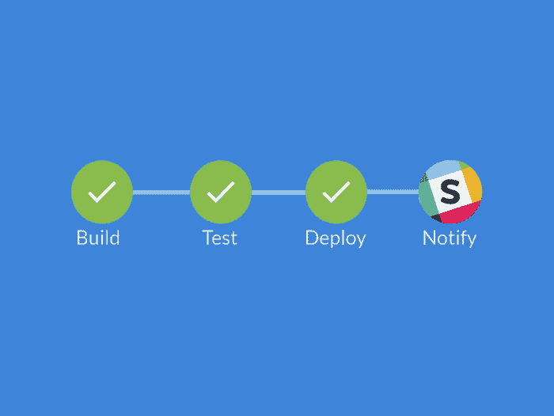

# Jenkins 时差通知

> 原文:[https://dev.to/committedsw/jenkins-slack-notifications-3mh4](https://dev.to/committedsw/jenkins-slack-notifications-3mh4)

[T2】](///static/slackNotifications-a661d0493d23b1574f3bf93fbf29bdc8-63613.png)

为了从我们基于 Jenkins Blue Ocean 的持续集成中添加一个松弛通知，我们使用了[松弛通知](https://plugins.jenkins.io/slack)插件。向 Jenkinsfile 添加一组函数，然后在管道的`post`部分调用这些函数。我们使用 git 命令提取提交者的名字和提交的散列，这样我们就可以链接到 bitbucket 中的提交，如果构建失败或不稳定，就添加作者的名字，这样就会引起他们的注意。

```
pipeline {
  agent { 
    ...
  }

  stages {
    stage('env') {
      steps {
        notifyStarted()
      }
    }
        ...
  }
  post {
    success {
      notifySuccess()
    }
    unstable {
      notifyUnstable()
    }
    failure {
      notifyFailed()
    }
  }
}

def notifyBuild(String buildStatus = 'STARTED', String colorCode = '#5492f7', String notify = '') {

  def project = 'projectName'
  def channel = "${project}"
  def base = "https://bitbucket.org/committed/${project}/commits/" 

  def commit = sh(returnStdout: true, script: 'git log -n 1 --format="%H"').trim()
  def link = "${base}${commit}" 
  def shortCommit = commit.take(6)
  def title = sh(returnStdout: true, script: 'git log -n 1 --format="%s"').trim()
  def subject = "<${link}|${shortCommit}> ${title}" 

  def summary = "${buildStatus}: Job <${env.RUN_DISPLAY_URL}|${env.JOB_NAME} [${env.BUILD_NUMBER}]>\n${subject} ${notify}"

  slackSend (channel: "#${channel}", color: colorCode, message: summary)

}

def author() {
  return sh(returnStdout: true, script: 'git log -n 1 --format="%an" | awk \'{print tolower($1);}\'').trim()
}

def notifyStarted() {
  notifyBuild()
}

def notifySuccess() {
  notifyBuild('SUCCESS', 'good')
}

def notifyUnstable() {
  notifyBuild('UNSTABLE', 'warning', "\nAuthor: @${author()} <${RUN_CHANGES_DISPLAY_URL}|Changelog>")
}

def notifyFailed() {
  notifyBuild('FAILED', 'danger', "\nAuthor: @${author()} <${RUN_CHANGES_DISPLAY_URL}|Changelog>")
} 
```