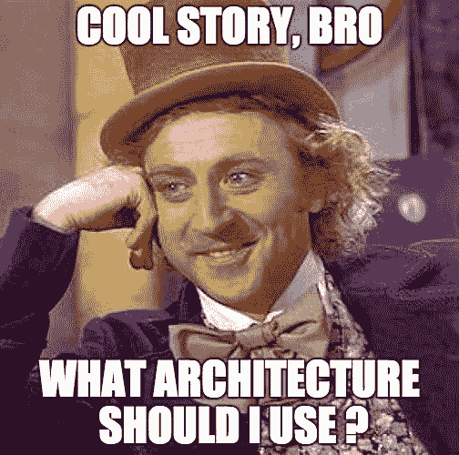
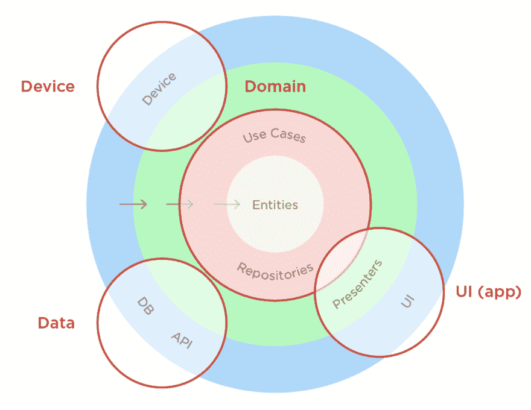

# 清洁建筑和 MVP 思想概述

> 原文：<https://dev.to/wahibhaq/a-brief-summary-of-thoughts-on-clean-architecture-and-mvp-48h9>

最初发表于 [WahibHaq 博客](http://wahibhaq.com/blog/clean-architecture-mvp-summary/)。

大约 3 个月前，我经历了一个 Android 开发职位的求职过程，经历了各种面试步骤。一个潜在雇主给了我一个任务，让我针对以下情况提交一份一页纸的架构建议:

```
You are an experienced developer. Can you design 1-page architecture of an app
for a financial product with 50k users base (3k daily), that can work in a
modern setup of development, e.g. Spotify squads? Once you come onboard you may have to design for 10-100x userbase. The architecture can be a generic view. 
```

[](https://res.cloudinary.com/practicaldev/image/fetch/s--KsjE1PM5--/c_limit%2Cf_auto%2Cfl_progressive%2Cq_auto%2Cw_880/http://wahibhaq.github.io/img/blog/posts/summary-thoughts-clean-architecture-mvp/architecture-meme.jpg) 

我研究了一下，把我个人的想法整理成一个文档。今天，我决定把它们发表在博客上。

> 免责声明:在这篇文章中没有提供关于 *Clean Architecture* 或 *MVP* 的详细解释，因为它只是强调了所提出的解决方案，并概述了我的理由。

另外，2017 年是我对 **[干净的架构](https://www.amazon.com/Clean-Architecture-Craftsmans-Software-Structure/dp/0134494164/ref=sr_1_1?ie=UTF8&qid=1515276671&sr=8-1&keywords=clean+architecture)** 感兴趣的一年，也是我在 [Freeletics](https://play.google.com/store/apps/details?id=com.freeletics.lite&hl=en) 获得了一些在 Android 应用中应用 **[模型-视图-展示者(MVP)](https://en.wikipedia.org/wiki/Model%E2%80%93view%E2%80%93presenter)** 架构模式的实践经验的一年。总的来说，软件架构一直是我感兴趣的领域，不幸的是，我从来没有机会在我过去的任何 Android 项目中实现它。Android 开发人员理解在没有任何可靠架构的情况下构建健壮的、产品质量的、可维护的应用程序的困难。

有趣的是，2017 年将永远被铭记为谷歌[官方](https://android-developers.googleblog.com/2017/05/android-and-architecture.html)首次使用 **[架构组件](https://developer.android.com/topic/libraries/architecture/index.html)** 为安卓应用推荐一款[应用架构](https://developer.android.com/topic/libraries/architectuimg/final-architecture.png)的一年。它基本上是一个库的集合，提供简单、灵活和实用的方法，将开发人员从一些常见问题中解放出来，以便他们可以专注于用更少的样板代码编写模块化应用程序，并构建良好的体验。

* * *

### 我们应该对一个现代的 app 架构有什么期待？

在我看来，它需要健壮、稳定、可轻松扩展、适应敏捷需求的变化、快速集成新的平台特性、支持可测试性，同时能够被不同层次的开发人员理解，以确保可维护性。

我相信*干净的架构*就是答案。

### 干净的建筑

[T2】](https://res.cloudinary.com/practicaldev/image/fetch/s--c0f9PFvt--/c_limit%2Cf_auto%2Cfl_progressive%2Cq_auto%2Cw_880/http://wahibhaq.github.io/img/blog/posts/summary-thoughts-clean-architecture-mvp/clean-architecture-ring-diagram.png)

资料来源:8thlight.com

在 [Clean Architecture](https://8thlight.com/blog/uncle-bob/2012/08/13/the-clean-architecture.html) 中，代码按照一个依赖规则被分成洋葱状的层:内层不应该知道外层的任何事情。内层包含业务逻辑，而外层包含实现，中间层包含接口适配器。每个环代表一个抽象层

```
Some key technical benefits achieved in this way are:

> Abstraction over Implementation
> Single Responsibility Principle 
> Separation of Concern
> Decoupled Code 
```

### 不同的层、组件以及它们如何相互通信

[](https://res.cloudinary.com/practicaldev/image/fetch/s--ahOh6vkO--/c_limit%2Cf_auto%2Cfl_progressive%2Cq_auto%2Cw_880/http://wahibhaq.github.io/img/blog/posts/summary-thoughts-clean-architecture-mvp/srp-clean-architecture-diagram.png) 
来源:五.社

#### 展示/UI 层

*   MVP 非常适合 UI/表示层。
*   视图是哑的，并且实现了[被动视图](https://martinfowler.com/eaaDev/PassiveScreen.html)模式。它是一组可以由任何 Android 视图实现的接口，例如活动、片段、适配器或自定义视图。
*   Presenter 充当视图(Android 特定组件的抽象)和业务逻辑(交互者/用例)之间的中间人。它们处理用户交互，调用适当的业务逻辑，并将数据发送到 UI 进行呈现。
*   演示者不依赖于 Android 类，因此提高了可测试性。

#### 域层

*   *用例*的一个简单例子是“将钱从一个账户转移到另一个账户”。每个*用例*都是执行特定业务逻辑的可重用组件。它从存储库中获取数据，执行业务逻辑，并将结果返回给演示者。

#### 数据层(数据库& API)

*   [存储库模式](https://martinfowler.com/eaaCatalog/repository.html)负责创建数据源的抽象，用例从数据源中获取数据以进行操作。所有底层的持久性都应该在这里:DAOs、ORM、翻新(或任何其他网络相关的东西)服务、JSON 解析等等。
*   即使在参差不齐的网络上，应用程序也应该无缝工作。缓存和重用以前获取的资源的能力是优化性能的一个重要方面。
*   业务逻辑不应该知道数据来自哪里。局部行动，全球同步。

#### 设备层

*   设备包含了 Android 的具体实现，比如传感器、警报、通知、播放器、各种管理器等等。

### 对拟议架构的分析

*   坚持干净的架构。
*   它被模块级、包级和类级整齐地分开。因此*单一责任原则*和*关注点分离*应该得到满足。
*   业务逻辑不再直接接触 Android，这应该会产生一个解耦的代码库。
*   通过向分离的类注入各自依赖关系的模拟实现，可以使测试更加容易。
*   没有强迫使用演示者来处理演示逻辑，我们可以说干净的架构是“前端”不可知的——这意味着我们可以使用 MVP，MVVM 或其他任何东西。
*   呈现者依赖于视图界面，而不是直接依赖于活动:这样，我们成功地将呈现者从视图实现中分离出来，遵守了[坚实的](https://en.wikipedia.org/wiki/SOLID_(object-oriented_design))原则。我们可以在不改变演示者的一行代码的情况下替换具体视图。此外，我们可以通过创建一个模拟视图来轻松地对 presenter 进行单元测试。
*   每一层都有自己的工作模型，所以具体的细节，比如视图，不依赖于较低层实现的具体细节。
*   我们可以使用 [RxJava](https://github.com/ReactiveX/RxJava) 的强大功能向上游提供数据，并让它为我们处理线程调度，而不是使用回调来进行层间通信。每个内层都可以用外层可以理解的方式来转换数据。
*   允许更改任何外层的实现，而不必对我们的代码库进行大量更改，并满足*可扩展性*要求。
*   遵循这种方法既困难又费时，但是可以把它看作是对未来将要工作和维护代码的开发人员的一种帮助。
*   值得一提的是，这支持使用像 [Dagger](https://google.github.io/dagger/) 这样的依赖注入框架。

### 跨职能团队和架构

上面分享的问题陈述还提到了**[Spotify squants](https://labs.spotify.com/2014/03/27/spotify-engineering-culture-part-1/)**这是一个非常有趣的概念，出自 Spotify 工程文化。产品团队似乎是建立强大的、知识丰富的开发团队的好方法。通俗地说，Squad 就是一个小型的跨职能自组织的 scrum 团队。他们承担着端到端的责任，并为他们的长期使命而共同努力。在团队中，关键的驱动力是自主性。

对于一个雇主来说，敏捷是一个关键的需求，因此也是对支持敏捷的架构的期望。更重要的敏捷原则之一是:

> “最好的架构、需求和设计来自自组织团队。”

*   Benji Weber 认为团队中不需要一个建筑师。这是团队的责任。在理想的团队中，每个成员都会考虑重叠和互补的问题。
*   软件架构不应该成为一个 5 到 9 人团队从一个特性到发布的障碍。
*   干净的架构提供了关注点的分离，为开发团队提供了管理环境中的复杂性和快速变化所需的节奏和灵活性。通过设计，它在您的组件之间创建了一个切口，同时为未来的通信建立了契约。这使得 android 开发人员能够与其他部落的成员和谐地工作。
*   在开始开发一个功能之前定义 MVP 合同的做法间接帮助了同一个*团队中的 android 开发人员有效地定义他们之间的职责范围。*

### 进一步阅读

*   这些关于干净架构的胡言乱语是什么？
*   [安卓架构系列](http://five.agency/android-architecture-part-1-every-new-beginning-is-hard/)
*   [转换应用程序以使用干净的架构](https://academy.realm.io/posts/converting-an-app-to-use-clean-architecture/)
*   [构建 Android...干净的路？](https://fernandocejas.com/2014/09/03/architecting-android-the-clean-way/)
*   [清洁建筑的完全白痴指南](https://android.jlelse.eu/a-complete-idiots-guide-to-clean-architecture-2422f428946f)
*   [采用 Android 架构组件的反应式清洁架构](https://mag.n26.com/reactive-clean-architecture-with-android-architecture-components-685a6682e0ca)