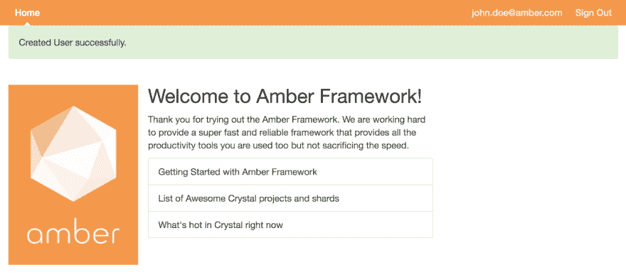

# 配方—构建琥珀认证系统

> 原文:[https://dev . to/Elias jpr/recipebuilding-an-amber-authentic ation-system-517](https://dev.to/eliasjpr/recipebuilding-an-amber-authentication-system-517)

# 配方——构建琥珀认证系统

[https://amberframework.org](https://amberframework.org)

[T2】](https://res.cloudinary.com/practicaldev/image/fetch/s--tB4bd7Dm--/c_limit%2Cf_auto%2Cfl_progressive%2Cq_auto%2Cw_880/https://cdn-images-1.medium.com/max/1600/1%2AiCbPqtqO3aW7vpobL9pMog.png)

先决条件:

*   熟悉 MVC 以及迁移、数据库等术语
*   琥珀色框架 CLI 已安装(安装说明)
*   支持的数据库之一 PostgreSQL、MySQL、SQLite
*   终端控制台

# 概述

几乎所有的 web 应用程序都需要某种形式的用户认证和注册。因此，大多数 web 框架都有过多的选项来实现身份验证，但 Amber Framework 与众不同，它提供了一个内置的基本身份验证生成器，可以轻松地进行定制和扩展，并提供了一些工具，使您可以快速入门，而不会带来不必要的复杂性。

## 使用琥珀色认证生成器

开始之前，请确保您具备所有先决条件。让我们首先生成一个应用程序，对于我们的例子，我们将调用我们的应用程序 Blogsy。

#### 1。生成 Blogsy 应用程序

首先，我们通过在终端控制台中键入以下命令来生成我们的应用程序。

`amber new blogsy --deps`

> 注意:deps 将自动安装项目依赖项。

#### 2。转到您的项目目录

琥珀色命令在我们项目的根目录下执行。

`cd blogsy`

#### 3。脚手架用户认证

接下来，搭建认证系统。这将生成一个所需文件的列表，以便为我们的博客启用认证。在 Blogsy 项目的根目录中键入以下命令。

`amber g auth User`

上面的命令将给出以下输出:

```
08:26:45 Generate   | Rendering Auth user
08:26:45 Generate   | new       config/initializers/granite.cr
08:26:45 Generate   | new       spec/models/user_spec.cr
08:26:45 Generate   | new       spec/models/spec_helper.cr
08:26:45 Generate   | new       spec/controllers/spec_helper.cr
08:26:45 Generate   | new       db/migrations/20180110202645523_create_user.sql
08:26:45 Generate   | new       db/seeds.cr
08:26:45 Generate   | new       src/models/user.cr
08:26:45 Generate   | new       src/controllers/registration_controller.cr
08:26:45 Generate   | new       src/controllers/user_controller.cr
08:26:45 Generate   | new       src/controllers/session_controller.cr
08:26:45 Generate   | new       src/views/registration/new.slang
08:26:45 Generate   | rewritten src/views/layouts/_nav.slang
08:26:45 Generate   | new       src/views/user/show.slang
08:26:45 Generate   | new       src/views/user/edit.slang
08:26:45 Generate   | new       src/views/session/new.slang
08:26:45 Generate   | new       src/handlers/authenticate.cr 
```

<svg width="20px" height="20px" viewBox="0 0 24 24" class="highlight-action crayons-icon highlight-action--fullscreen-on"><title>Enter fullscreen mode</title></svg> <svg width="20px" height="20px" viewBox="0 0 24 24" class="highlight-action crayons-icon highlight-action--fullscreen-off"><title>Exit fullscreen mode</title></svg>

要完成身份验证系统的安装，请使用以下命令迁移数据库:

`amber db create migrat`

这将输出:

```
08:52:25 (INFO) Database    | Created database blogsy_development
08:52:25 (INFO) Database    | Migrating db, current version: 0, target: 20180110205213147
08:52:25 (INFO) Database    | OK   20180110205213147_create_user.sql 
```

<svg width="20px" height="20px" viewBox="0 0 24 24" class="highlight-action crayons-icon highlight-action--fullscreen-on"><title>Enter fullscreen mode</title></svg> <svg width="20px" height="20px" viewBox="0 0 24 24" class="highlight-action crayons-icon highlight-action--fullscreen-off"><title>Exit fullscreen mode</title></svg>

现在，我们可以运行我们的本地开发服务器，并看到我们的工作认证系统。

运行以下命令`amber w`

```
08:53:52 Watcher    | Terminating app Blogsy...
08:53:52 Watcher    | Compiling Blogsy...
08:53:52 Watcher    | Building project Blogsy...
08:54:05 (INFO) Server  | [Amber 0.6.1] serving application "Blogsy" at http://0.0.0.0:3000
08:54:05 (INFO) Server  | Server started in development.
08:54:05 (INFO) Server  | Startup Time 00:00:00.000596000 
```

<svg width="20px" height="20px" viewBox="0 0 24 24" class="highlight-action crayons-icon highlight-action--fullscreen-on"><title>Enter fullscreen mode</title></svg> <svg width="20px" height="20px" viewBox="0 0 24 24" class="highlight-action crayons-icon highlight-action--fullscreen-off"><title>Exit fullscreen mode</title></svg>

#### 4。注册并登录页面

要查看注册页面，请访问[http://0 . 0 . 0 . 0:3000/sign up](http://0.0.0.0:3000/signup)

## 重述

Amber framework 提供了一个内置的身份验证生成器，消除了复杂性，使开发人员能够专注于任务，而不是实现细节。内置的身份验证系统很简单，很容易根据开发人员的需求进行修改。

然后

```
- [From Zero to Deploy](https://amberframework.org/guides/getting-started/quick-start.md#zero-to-deploy)
- [Amber Framework Guides](https://amberframework.org/guides/getting-started/README.md#getting-started)
- [Crystal Play](https://play.crystal-lang.org/#/cr) — an online playground to run Crystal code
- Get real time help [Amber Community Channel](https://gitter.im/amberframework/amber)
- GitHub (help the community)[https://github.com/amberframework/amber] and star the project 
```

<svg width="20px" height="20px" viewBox="0 0 24 24" class="highlight-action crayons-icon highlight-action--fullscreen-on"><title>Enter fullscreen mode</title></svg> <svg width="20px" height="20px" viewBox="0 0 24 24" class="highlight-action crayons-icon highlight-action--fullscreen-off"><title>Exit fullscreen mode</title></svg>