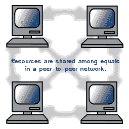
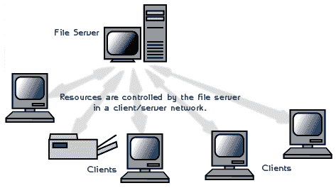

# 网络架构网络架构的类型

> 原文:[https://dev . to/cadellsinghh _ 25/types-of-network-architecture-56i 7](https://dev.to/cadellsinghh_25/types-of-network-architecture-56i7)

## 什么是网络架构

首先，什么是网络架构？它基本上是物理和逻辑设计，涉及软件、硬件、协议和数据传输介质。简单来说就是指计算机如何组织，任务如何在这些计算机之间分配。两种广泛使用的网络架构是**点对点**又名 **P2P** 和**客户端/服务器**又名**分层**。

### 对等架构

在对等网络中，任务被分配给网络上的每个设备。此外，在这个网络中没有真正的等级制度，所有的计算机都被认为是平等的，并且都有相同的能力使用这个网络上的可用资源。不是有一个中央服务器作为共享驱动器，而是每台连接到这个网络的计算机作为存储在其上的文件的服务器。

[T2】](https://res.cloudinary.com/practicaldev/image/fetch/s--PHsvG4NG--/c_limit%2Cf_auto%2Cfl_progressive%2Cq_66%2Cw_880/http://fcit.usf.edu/network/chap6/pics/peer.gif)

#### 点对点网络的优势

*   不需要专用服务器，这意味着成本更低。
*   如果一台计算机停止工作，连接到网络的其他计算机将继续工作。
*   由于现代操作系统中的内置支持，安装和设置相当容易。

#### 点对点网络的缺点

*   每台计算机都要进行安全和数据备份。
*   随着 P2P 网络上计算机数量的增加...性能、安全性和访问成为一大难题。

### 客户/服务器架构

在客户机/服务器网络中，一台集中的、真正强大的计算机(服务器)充当集线器，其他计算机或工作站(客户机)可以连接到该集线器。该服务器是系统的核心，它管理资源并向任何请求资源的客户机提供资源。

[T2】](https://res.cloudinary.com/practicaldev/image/fetch/s--EOM9hNzM--/c_limit%2Cf_auto%2Cfl_progressive%2Cq_66%2Cw_880/http://fcit.usf.edu/network/chap6/pics/clntserv.gif)

#### 客户机/服务器网络的优势

*   资源和数据安全通过服务器控制。
*   不限于少数电脑。
*   可以在任何地方跨多个平台访问服务器。

#### 客户机/服务器网络的缺点

*   由于需要服务器以及网络设备(如集线器、路由器和交换机),成本可能会非常高。
*   如果服务器出现故障，整个网络都会受到影响。
*   技术人员需要有效地维护和确保网络功能。