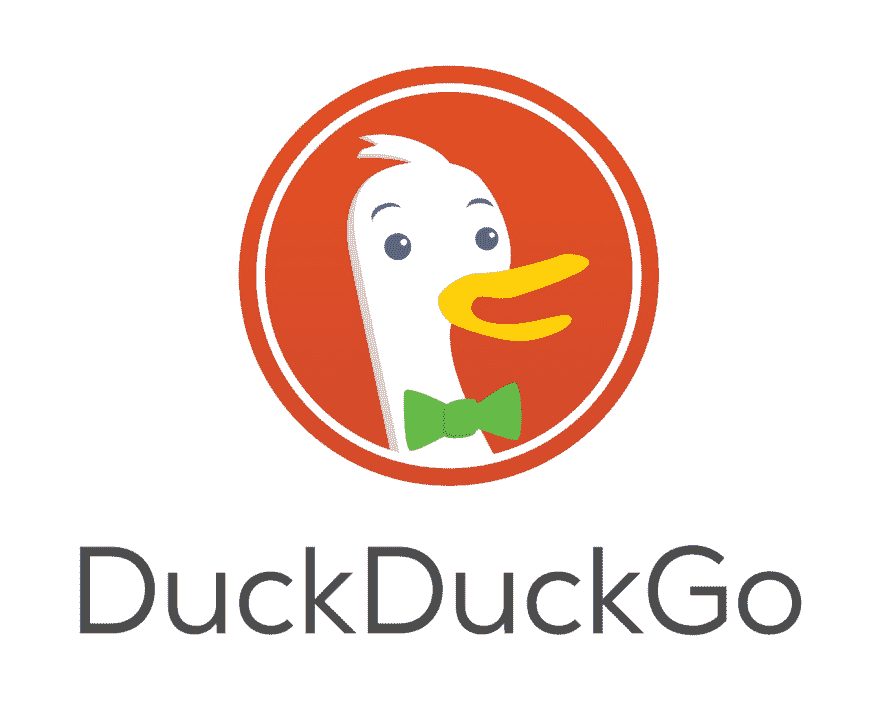
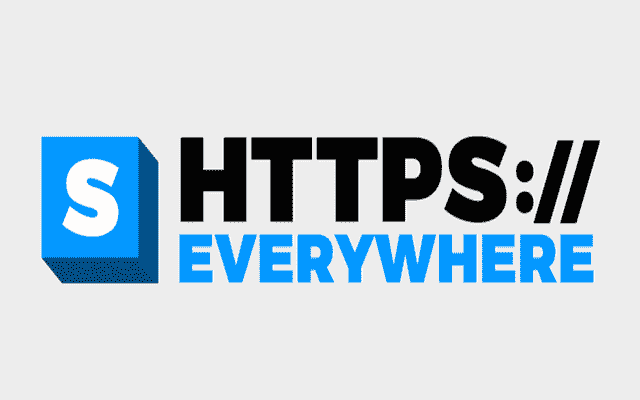
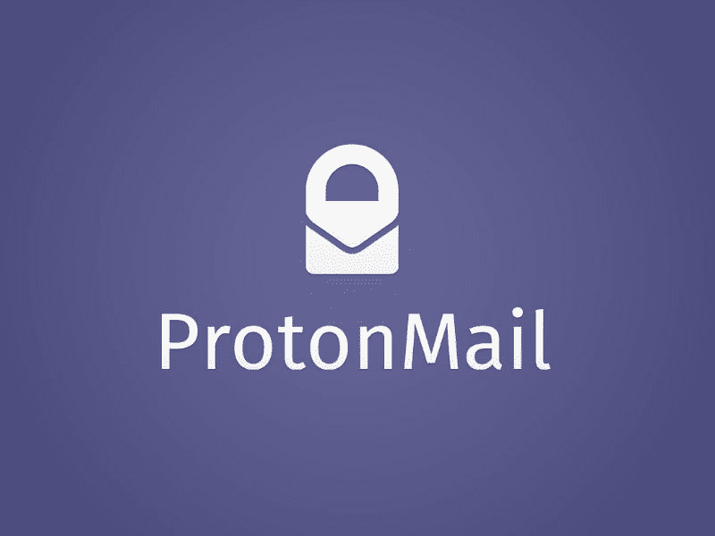

# 网络安全

> 原文：<https://dev.to/terceranexus6/-3067>

违反了公司或国家使用者的权利。 。 。 使用者注意到那个了吗？ 为此，开发者制作了打开软件的工具！

## 达克达克戈

是安全的浏览器。 尊敬隐私保护。 [请在尝试之前单击此处](//duckduckgo.com)

[T2】](https://res.cloudinary.com/practicaldev/image/fetch/s--kadyOPE_--/c_limit%2Cf_auto%2Cfl_progressive%2Cq_auto%2Cw_880/https://images.duckduckgo.com/iu/%3Fu%3Dhttp%253A%252F%252Fwww.technobuffalo.com%252Fwp-content%252Fuploads%252F2014%252F09%252FDuckDuckGo-Logo.jpg%26f%3D1)

## HTTPS 随处可见

你会担心 HTTP 协议吗
[请在尝试之前点击这里](https://www.eff.org/https-everywhere)

[T2】](https://res.cloudinary.com/practicaldev/image/fetch/s--2LRqa3Jn--/c_limit%2Cf_auto%2Cfl_progressive%2Cq_auto%2Cw_880/https://images.duckduckgo.com/iu/%3Fu%3Dhttps%253A%252F%252F2.bp.blogspot.com%252F-5ahOO1RokZo%252FWP0HNlqTCKI%252FAAAAAAAAAwY%252FGJjxDQtnTikWVMT1NehGJCfVq8WhGYjpQCEw%252Fs1600%252Fhttps-everywhere-logo_0.png%26f%3D1)

## 隐私獾

用 COOKIES 擦掉。 [请在尝试之前单击此处](https://www.eff.org/privacybadger)

[T2】](https://res.cloudinary.com/practicaldev/image/fetch/s--Iyn8bV4i--/c_limit%2Cf_auto%2Cfl_progressive%2Cq_auto%2Cw_880/https://www.eff.org/sites/all/themes/badger/badger-stroke.png)

## 质子邮件

安全的[电子邮件](https://protonmail.com/)。

[T2】](https://res.cloudinary.com/practicaldev/image/fetch/s--N3D78Rgv--/c_limit%2Cf_auto%2Cfl_progressive%2Cq_auto%2Cw_880/https://images.duckduckgo.com/iu/%3Fu%3Dhttp%253A%252F%252Fwww.zdnet.de%252Fwp-content%252Fuploads%252F2015%252F11%252Fprotonmail.jpg%26f%3D1)

以上。 安全地享受