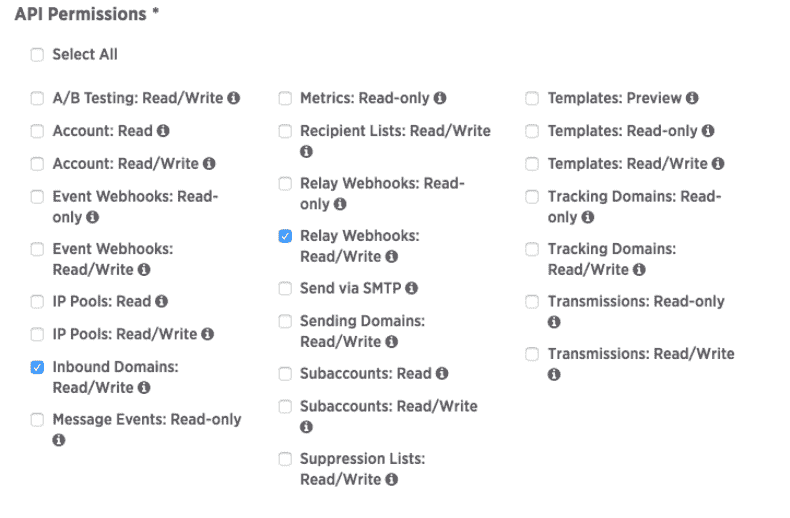
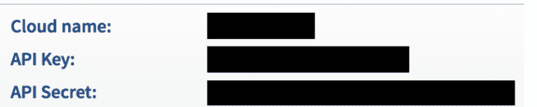
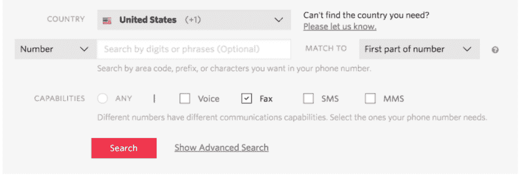
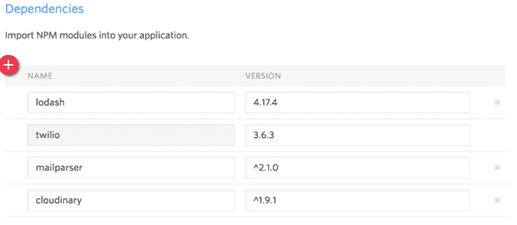
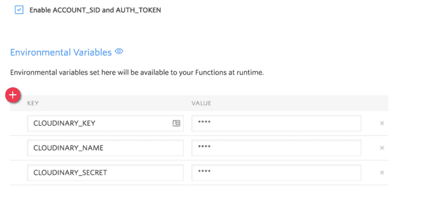
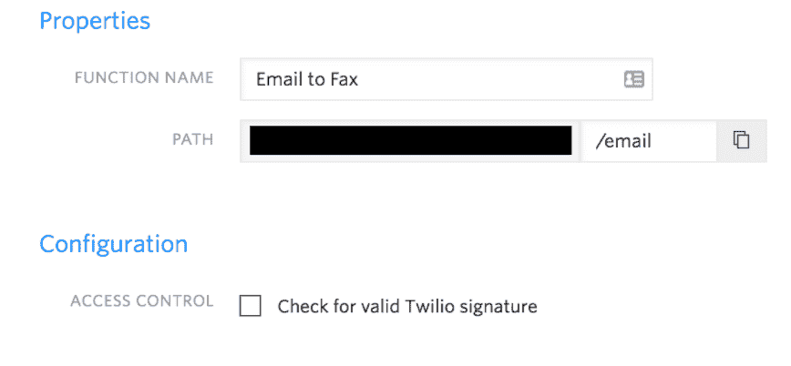

# 如何使用 SparkPost、Twilio 和 Cloudinary 通过电子邮件发送传真

> 原文:[https://dev . to/spark post/how-to-send-faxes-via-email-using-spark post-twilio-cloud inary-5e5i](https://dev.to/sparkpost/how-to-send-faxes-via-email-using-sparkpost-twilio--cloudinary-5e5i)

### 没有传真机？没问题！SparkPost、Twilio 和 Cloudinary 来拯救世界了！

我不知道你怎么样，但是我没有传真机。我必须发送或接收传真，这是千载难逢的，所以当 Twilio 分享了一个使用 SparkPost 将传真直接发送到您的电子邮件的绝妙方法时，我非常兴奋。但这只是成功的一半。我决定建立从电子邮件发送传真的能力，这样我就再也不需要传真机了！

我们将构建一个功能，这样我们就可以发送一个 PDF 附件到 FAX_NUMBER@YOUR_DOMAIN，它会自动将 PDF 传真到 at 符号前的电话号码(也称为本地部分，供所有您的电子邮件爱好者使用)。为此，我们将使用 SparkPost 的入站功能、Twilio 的传真 API 和 Cloudinary 将它们粘合在一起。我们将收到一封发给 Twilio 函数的电子邮件，提取附件 PDF，保存到 Cloudinary，然后以传真形式发送。

### 注册并配置您的 SparkPost 帐户

首先，你需要一个 [SparkPost 账户](https://app.sparkpost.com/join)和一个你想用来接收邮件的域名(又名[入站域名](https://developers.sparkpost.com/api/inbound-domains.html))。您还需要创建一个 API 密匙，允许读写`inbound domains`和`relay webhooks`

[T2】](https://res.cloudinary.com/practicaldev/image/fetch/s--fqm4eG-2--/c_limit%2Cf_auto%2Cfl_progressive%2Cq_auto%2Cw_880/https://media.sparkpost.com/uploads/2018/01/Screen-Shot-2018-01-10-at-3.27.28-PM.png)

接下来，为您的入站域添加 [SparkPost MX](https://www.sparkpost.com/docs/tech-resources/inbound-email-relay-webhook/#add-mx-records) 记录。一旦你[验证](https://mxtoolbox.com/)它们设置正确，运行下面的 cURL 来添加你的入站域。

```
curl -XPOST \
  https://api.sparkpost.com/api/v1/inbound-domains \
  -H "Authorization: YOUR_API_KEY" \
  -H "Content-Type: application/json" \
  -d '{ "domain": "YOUR_DOMAIN" }' 
```

<svg width="20px" height="20px" viewBox="0 0 24 24" class="highlight-action crayons-icon highlight-action--fullscreen-on"><title>Enter fullscreen mode</title></svg> <svg width="20px" height="20px" viewBox="0 0 24 24" class="highlight-action crayons-icon highlight-action--fullscreen-off"><title>Exit fullscreen mode</title></svg>

### 报名参加 Cloudinary

接下来，我们需要一个 [Cloudinary 帐户](https://cloudinary.com/users/register/free)来存储我们要传真的 PDF。如果你不知道，Cloudinary 是一个强大的存储、操作和交付所有媒体的解决方案。获取您的云名称、API 密钥和 API 秘密，并将其放在安全的地方以备后用。

[T2】](https://res.cloudinary.com/practicaldev/image/fetch/s--8P1bOofJ--/c_limit%2Cf_auto%2Cfl_progressive%2Cq_auto%2Cw_880/https://media.sparkpost.com/uploads/2018/01/Screen-Shot-2018-01-10-at-3.41.58-PM.png)

### 创建&配置 Twilio

我们将使用 Twilio 来接收电子邮件和发送传真。首先，[给](https://www.twilio.com/try-twilio)注册一个账户，[购买一个可以收发传真的电话号码](https://www.twilio.com/login?g=%2Fconsole%2Fphone-numbers%2Fsearch%2Fbuy%2Fresults&t=3a4d26ea80f7766974e80da9f2835d8e4df28f63a511efd5ae0093c5cb47e0d9)。

[T2】](https://res.cloudinary.com/practicaldev/image/fetch/s--D9WaDJdc--/c_limit%2Cf_auto%2Cfl_progressive%2Cq_auto%2Cw_880/https://media.sparkpost.com/uploads/2018/01/Screen-Shot-2018-01-10-at-3.43.40-PM.png)

Twilio 的无服务器功能非常适合这个项目。这不是一个有状态的应用程序，它不需要一直运行。使用它，我们可以快速设置并运行我们的应用程序。

我们需要以下 NPM 模块来实现我们的功能:

[T2】](https://res.cloudinary.com/practicaldev/image/fetch/s--yKnMFspt--/c_limit%2Cf_auto%2Cfl_progressive%2Cq_auto%2Cw_880/https://media.sparkpost.com/uploads/2018/01/Screen-Shot-2018-01-10-at-3.45.46-PM.png)

让我们也为 Cloudinary 添加我们的环境变量，并使 Twilio 的选项能够通过我们的`ACCOUNT_SID`和`AUTH_TOKEN`，这样我们就可以使用他们的客户端库，而不用担心我们的凭证:

[T2】](https://res.cloudinary.com/practicaldev/image/fetch/s--qRtmAqkd--/c_limit%2Cf_auto%2Cfl_progressive%2Cq_auto%2Cw_880/https://media.sparkpost.com/uploads/2018/01/Screen-Shot-2018-01-10-at-3.48.59-PM.png)

### 代码

首先，让我们编写基本的 Twilio 函数，并加入我们的依赖项:

```
const cloudinary = require('cloudinary')
const { MailParser } = require('mailparser')
const { toArray } = require('lodash')
exports.handler = function(context, messages, callback) {
  const twilio = context.getTwilioClient()
  cloudinary.config({
    cloud_name: context.CLOUDINARY_NAME,
    api_key: context.CLOUDINARY_KEY,
    api_secret: context.CLOUDINARY_SECRET
  })
} 
```

<svg width="20px" height="20px" viewBox="0 0 24 24" class="highlight-action crayons-icon highlight-action--fullscreen-on"><title>Enter fullscreen mode</title></svg> <svg width="20px" height="20px" viewBox="0 0 24 24" class="highlight-action crayons-icon highlight-action--fullscreen-off"><title>Exit fullscreen mode</title></svg>

`messages`变量是一个充满了 SparkPost 交给我们的消息的对象。我们需要循环处理邮件，提取附件，保存到 Cloudinary，然后发送传真。

```
// after the cloudinary config
const promises = toArray(messages).map((message) => {
    const toNumber = pickPhoneNumber(message)
    return pickPdfAttachment(message)
      .then((attachment) => {
        if (!attachment) { return false }
        return uploadAttachment(attachment)
      })
      .then((mediaUrl) => {
        return sendFax(twilio, toNumber, mediaUrl)
      })
  })
  Promise.all(promises)
    .then(() => callback(null, 'success'))
    .catch((error) => callback(error)) 
```

<svg width="20px" height="20px" viewBox="0 0 24 24" class="highlight-action crayons-icon highlight-action--fullscreen-on"><title>Enter fullscreen mode</title></svg> <svg width="20px" height="20px" viewBox="0 0 24 24" class="highlight-action crayons-icon highlight-action--fullscreen-off"><title>Exit fullscreen mode</title></svg>

### 解析邮件

你可以在 API 文档中看到一个[有效载荷 SparkPost 发送](https://developers.sparkpost.com/api/relay-webhooks.html#header-example-payloads)的例子。对我们来说，重要的部分是包含原始邮件的`rcpt_to`和
`content`。这些住在`message.msys.relay_message`里面。

我们可以通过从`rcpt_to`值中分离出本地部分——所有在`@`之前的部分——来提取电话号码。

```
function pickPhoneNumber(message) {
  return message.msys.relay_message.rcpt_to.split('@')[0]
} 
```

<svg width="20px" height="20px" viewBox="0 0 24 24" class="highlight-action crayons-icon highlight-action--fullscreen-on"><title>Enter fullscreen mode</title></svg> <svg width="20px" height="20px" viewBox="0 0 24 24" class="highlight-action crayons-icon highlight-action--fullscreen-off"><title>Exit fullscreen mode</title></svg>

我们还需要从邮件中提取 PDF。为此，我们将使用`mailparser`库解析 RFC 822 值，并返回第一个附加 PDF 的内容。

```
function pickPdfAttachment(message) {
  return new Promise((resolve, reject) => {
    const content = message.msys.relay_message.content
    const isBase64 = content.email_rfc822_is_base64
    const body = isBase64 ? Buffer.from(content.email_rfc822, 'base64') : content.email_rfc822
    const parser = new MailParser({ streamAttachments: true })
    let attachment
    parser.on('data', (data) => {
      if(!attachment &&
          data.type === 'attachment' &&
          data.contentType === 'application/pdf') {
        attachment = data.content
      }
    })
    parser.on('error', reject)
    parser.write(body)
    parser.end(() => resolve(attachment))
  })
} 
```

<svg width="20px" height="20px" viewBox="0 0 24 24" class="highlight-action crayons-icon highlight-action--fullscreen-on"><title>Enter fullscreen mode</title></svg> <svg width="20px" height="20px" viewBox="0 0 24 24" class="highlight-action crayons-icon highlight-action--fullscreen-off"><title>Exit fullscreen mode</title></svg>

### 保存附件

假设我们得到了一个附件，我们需要把它放在一个 Twilio 可以获取的地方。进入 Cloudinary。使用他们的节点库，我们可以很容易地通过管道传输 PDF 并获得公共访问的 URL。

```
function uploadAttachment(attachment) {
  return new Promise((resolve, reject) => {
    const stream = cloudinary.v2.uploader.upload_stream((error, result) => {
      if (error) {
        reject(error)
      }
      else {
        resolve(result.url)
      }
    })
    attachment.pipe(stream)
  })
} 
```

<svg width="20px" height="20px" viewBox="0 0 24 24" class="highlight-action crayons-icon highlight-action--fullscreen-on"><title>Enter fullscreen mode</title></svg> <svg width="20px" height="20px" viewBox="0 0 24 24" class="highlight-action crayons-icon highlight-action--fullscreen-off"><title>Exit fullscreen mode</title></svg>

### 发送传真

我们代码的最后一步是发送传真！Twilio 让这一切变得非常简单。我们需要三个值:我们发送到的号码、我们发送的号码和媒体 url。我们将使用之前购买的号码发送“发件人”号码。并且我们应该有来自电子邮件本地部分的电话号码和来自 Cloudinary 的媒体 url！

```
function sendFax(twilio, toNumber, mediaUrl) {
  return twilio.fax.v1.faxes.create({
      to: toNumber,
      from: YOUR_PHONE_NUMBER,
      mediaUrl: mediaUrl,
    })
    .then((res) => {
      console.log('sent', mediaUrl, 'to', toNumber)
    })
} 
```

<svg width="20px" height="20px" viewBox="0 0 24 24" class="highlight-action crayons-icon highlight-action--fullscreen-on"><title>Enter fullscreen mode</title></svg> <svg width="20px" height="20px" viewBox="0 0 24 24" class="highlight-action crayons-icon highlight-action--fullscreen-off"><title>Exit fullscreen mode</title></svg>

### 创建中继 Webhook

最后一个难题是将 SparkPost 的入站域绑定到 Twilio 函数。让我们创建一个中继 webhook，将发送到入站域的所有邮件传递到 Twilio 函数。复制您的函数路径，并将其传递到这个 cURL 请求中，以创建中继 webhook。确保“检查有效的 Twilio 签名”未被选中，以便 SparkPost 可以访问它！

[](https://res.cloudinary.com/practicaldev/image/fetch/s--XM6p-KU2--/c_limit%2Cf_auto%2Cfl_progressive%2Cq_auto%2Cw_880/https://media.sparkpost.com/uploads/2018/01/Screen-Shot-2018-01-10-at-4.13.11-PM.png)T3】

```
curl -XPOST \
  https://api.sparkpost.com/api/v1/relay-webhooks \
  -H "Authorization: YOUR_API_KEY" \
  -H "Content-Type: application/json" \
  -d '{ "target": "YOUR_TWILIO_PATH", "match": { "domain": "YOUR_INBOUND_DOMAIN", "protocol": "SMTP" }, "name": "Email-to-Fax" }' 
```

<svg width="20px" height="20px" viewBox="0 0 24 24" class="highlight-action crayons-icon highlight-action--fullscreen-on"><title>Enter fullscreen mode</title></svg> <svg width="20px" height="20px" viewBox="0 0 24 24" class="highlight-action crayons-icon highlight-action--fullscreen-off"><title>Exit fullscreen mode</title></svg>

### 发送传真！！🎉

发送电子邮件到 FAX_NUMBER@YOUR_DOMAIN，并附上 PDF 格式的传真，应该可以通过！

你可以通过我们在 T4 的朋友[帕特里克](https://twitter.com/kolencherry)的一些[指导](https://www.twilio.com/blog/2017/12/fax-to-email-twilio-functions-sparkpost.html)来设置一台完全正常工作的电子邮件传真机接收传真！如果您有任何问题，请随时[联系](https://twitter.com/theavigoldman)，祝您传真愉快！

-阿维

另外，在你向全世界发布这一功能之前，你可能需要验证你要发送的电话号码，并增加发送者的安全性。我建议在电子邮件中添加一个令牌，您可以在 Twilio 函数中验证它。

*帖子[如何使用 SparkPost 通过电子邮件发送传真，Twilio & Cloudinary](https://www.sparkpost.com/blog/send-faxes-via-email/) 最早出现在 [SparkPost](https://www.sparkpost.com) 上。*