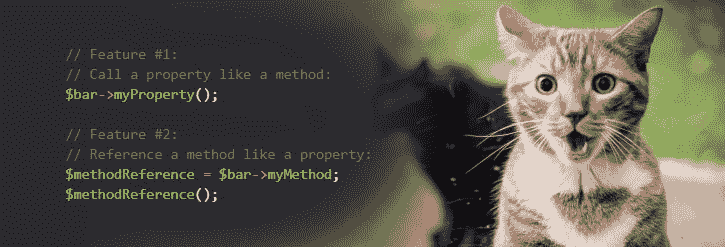
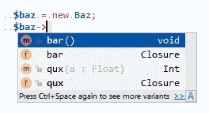

# PHP 中属性和方法的统一符号表

> 原文：<https://dev.to/wesnetmo/unified-interface-for-properties-and-methods-in-php-3nip>

[T2】](https://res.cloudinary.com/practicaldev/image/fetch/s--WBBVfbSA--/c_limit%2Cf_auto%2Cfl_progressive%2Cq_auto%2Cw_880/https://thepracticaldev.s3.amazonaws.com/i/fve1zcq0afc2j1tvrl3h.png)

## 简介

如果你曾经和`callable`类型的人一起工作过，你可能已经知道了它的怪癖([...还有更怪癖的](https://wiki.php.net/rfc/consistent_callables)。我打赌你和我一样恨他们。简而言之，**一个 callable 一旦传递了一个`callable`类型声明，不一定会传递所有的`callable`类型声明** ( [例子](https://3v4l.org/a27NX))。我认为`callable`类型完全是个坏主意，我认为现代 PHP 代码可以比这好得多。

类型声明没有上下文相关的行为。一个`Closure`引用实际上在任何地方都是可调用的。

相反，我们都应该做的是:

```
<?php
//  1- Retrieve the Closure from a callable just once
//  2- Only pass around Closures and always type-hint for Closure
//     ...
// 42- Profit!
public function bar(Closure $in): Closure{
    $in();
    return Closure::fromCallable([$this, "method"]);
} 
```

Enter fullscreen mode Exit fullscreen mode

## 用*符号*让它更漂亮

我写了一个小工具，改进了我们访问对象成员的方式。你可以立即安装它，然后用 composer ( `composer require netmosfera/symbola`)试用，或者在 [github](https://github.com/Netmosfera/Symbola) 上看看。

下面是它的作用:

```
<?php

use Netmosfera\Symbola\Symbola;

class Bar
{
    use Symbola;

    public $myProperty;

    function __construct(Closure $p){
        $this->myProperty = $p;
    }

    public function myMethod(){
        echo "myMethod() called!\n";
    }    
}

$p = function(){
    echo "myProperty() called!\n";
};

$bar = new Bar($p);

// Feature #1:
// Call a property like a method:
$bar->myProperty(); // myProperty() called!

// Feature #2:
// Reference a method like a property:
$methodReference = $bar->myMethod;
$methodReference(); // method() called! 
```

Enter fullscreen mode Exit fullscreen mode

## 可视性支持

只能从兼容的范围调用属性，只能从兼容的范围检索方法句柄:

```
<?php

use Netmosfera\Symbola\Symbola;

class Bar
{
    use Symbola;

    private $myProperty;

    function __construct(){
        $this->myProperty = function(){
            echo "myProperty() called!\n";
        };
    }

    private function myMethod(){
        echo "myMethod() called!\n";
    }

    public function callProperty(){
        $this->myProperty();
    }

    public function getMethod(): Closure{
        return $this->myMethod;
    }
}

$bar = new Bar();

//------------------------------------------------------------------------------------------

try{
    // The property is private, it cannot be called publicly:
    $bar->myProperty();
} catch(Error $e){
    echo $e->getMessage() . "\n";
    // Error: Referenced the either undefined or
    // non-public object member `Bar::myProperty`
}

//------------------------------------------------------------------------------------------

try{
    // The method is private, it cannot be referenced publicly:
    $methodReference = $bar->myMethod;
} catch(Error $e){
    echo $e->getMessage() . "\n";
    // Error: Referenced the either undefined or
    // non-public object member `Bar::myMethod`
}

//------------------------------------------------------------------------------------------

// The property can be called privately, however:
$bar->callProperty(); // myProperty() called!

// Similarly, the method can be referenced privately,
// and the obtained reference is free to be passed to
// other scopes:
$methodReference = $bar->getMethod();
$methodReference(); // myMethod() called! 
```

Enter fullscreen mode Exit fullscreen mode

显然，`protected`也是支持的；受保护的方法只能在类的层次结构中引用，受保护的属性只能在类的层次结构中调用。

## 等同于`Closure`年代

`Closure::fromCallable()`的一个问题是，返回的对象不能被比较是否相等(测试的最新 PHP 版本是 7.2):

```
<?php

class A{ function bar(){} }
$a = new A;
$c1 = Closure::fromCallable([$a, "bar"]);
$c2 = Closure::fromCallable([$a, "bar"]);
assert($c1 === $c2); // Fail! 
```

Enter fullscreen mode Exit fullscreen mode

但是 *Symbola* 通过为每个创建的`Closure`保留一个句柄来解决这个问题，然后在需要的时候重用这个句柄:

```
<?php

use Netmosfera\Symbola\Symbola;

class A{ use Symbola; function bar(){} }
$a = new A;
$c1 = $a->bar;
$c2 = $a->bar;
assert($c1 === $c2); // Works! 
```

Enter fullscreen mode Exit fullscreen mode

`Closure`的句柄保存在对象本身中，当对象被销毁时，它们被垃圾收集，因此自然限制了程序中创建的对象的数量。

## 什么叫`$this`设定为？

`$this` in property-Closures 不反弹到宿主类'`$this`；如果需要，必须使用`Closure::bind()`手动执行。

```
<?php

use Netmosfera\Symbola\Symbola;

class Baz
{
    use Symbola;

    public $qux;

    function __construct($qux){
        $this->qux = $qux;
    }
}

class Foo
{
    function getClosure(): Closure{
        return function(){
            assert($this instanceof Foo);
        };
    }
}

$foo = new Foo();
$baz = new Baz($foo->getClosure());
$baz->qux(); // $this in qux() is $foo, not $baz 
```

Enter fullscreen mode Exit fullscreen mode

## IDE 支持

`callable`最糟糕的问题之一是缺乏静态分析。ide 很难区分字符串/数组和`callables`。

```
<?php

// I look like a simple string, but trust me,
// I'm actually a callable ¯\_(ツ)_/¯ 
$foo = "baz";

// ...

// ಠ_ಠ
$foo(); 
```

Enter fullscreen mode Exit fullscreen mode

有了*符号*，神奇的功能可以用 phpdoc 的`@property`和`@method` :
来注释

```
<?php

use Netmosfera\Symbola\Symbola;

/**
 * @property Closure $bar
 * @method int qux(float $a)
 */
class Baz
{
    use Symbola;

    public $qux;

    function __construct(){
        $this->qux = function(float $a): int{};
    }

    function bar(){}
} 
```

Enter fullscreen mode Exit fullscreen mode

这一点都不好，但是...这是件大事。重构管用，静态分析管用(大部分)，搜索管用。

[T2】](https://res.cloudinary.com/practicaldev/image/fetch/s--e73Zr6bj--/c_limit%2Cf_auto%2Cfl_progressive%2Cq_auto%2Cw_880/https://i.imgur.com/MSp1pER.png)

## 少了什么

*   函数作用域`static`变量不起作用，但是没人用它们，对吧？不管怎样，他们都是一团糟。

*   静态方法和属性也不受支持。鉴于缺乏一个`__getStatic`魔法方法，我认为只增加对`__callStatic`的支持并不重要。

*   从`parent::`方法中创建`Closure`是不可能的。我可能会在某个时候补充这一点；例如`Symbola::parent("method")`作为`Closure::fromCallable("parent::method")`的替代。

*   可能是别的什么，让我知道是什么:-P

## 安装

```
composer require netmosfera/symbola 
```

Enter fullscreen mode Exit fullscreen mode

[GitHub 上的符号](https://github.com/Netmosfera/Symbola)

我希望我说服你尝试一下，我打赌你会喜欢它！感谢您的阅读，请在评论中告诉我您的想法。