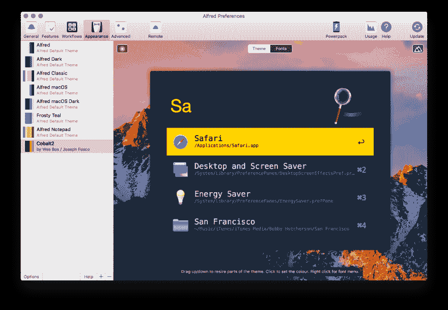
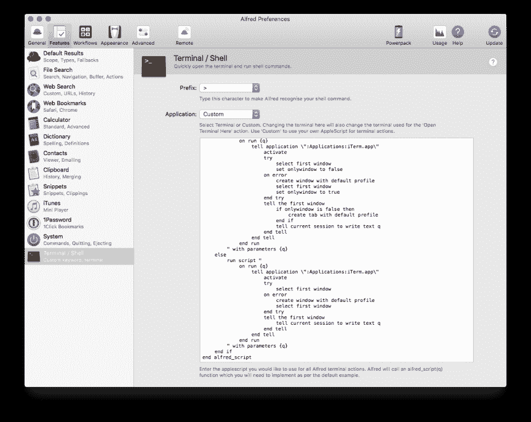

# 我的 Mac 设置

> 原文:[https://dev.to/nickytonline/my-mac-setup-2m05](https://dev.to/nickytonline/my-mac-setup-2m05)

也许我应该开始一个名为“不仅仅是要点”的系列，因为我正在慢慢地将我的要点转化为博客帖子。我转换的最后一个是关于我的 Visual Studio 代码设置的。

我参加了本周关于工具的[# dev discuse，我贴了一些链接到我在 Mac 上设置的 gists。](https://twitter.com/ThePracticalDev/status/950910573369229313)

液体错误:内部

## 你在 Mac 上绝对需要的工具

*   自制二人组。这些是简化在你的 Mac 上安装大多数东西的必备工具。一旦这些安装完毕，您就可以继续了。
    *   [自制软件](https://brew.sh)——从命令行运行`/usr/bin/ruby -e "$(curl -fsSL https://raw.githubusercontent.com/Homebrew/install/master/install)"`来安装。
    *   [家酿木桶](https://caskroom.github.io)——从命令行运行`brew tap caskroom/cask`来安装它。
*   [奇观](https://www.spectacleapp.com)，我发现的在 macOS 上管理 windows 的最好的应用。这对于习惯了这种开箱即用功能的 Windows 用户来说尤其有用。从命令行运行`brew cask install spectacle`来安装它。
*   [阿尔弗雷德](https://www.alfredapp.com) ( [购买阿尔弗雷德动力包](https://www.alfredapp.com/powerpack/buy/)以充分利用阿尔弗雷德)。从命令行运行`brew cask install alfred`来安装它。

### 阿尔弗雷德设置

阿尔弗雷德是如此令人敬畏，它值得在这篇文章中有自己的一节。基本上就是类固醇和一袋薯片。它不仅仅是一个应用程序启动器。它允许你为你每天做的重复任务创建工作流，并且也有大量现有的[工作流](https://www.alfredapp.com/workflows/)可供使用。我甚至决定做一些我自己的，[Nicky tonline/Alfred-workflows:希望对 Alfred](https://github.com/nickytonline/alfred-workflows) 有用的工作流。
液体错误:内部
[](https://res.cloudinary.com/practicaldev/image/fetch/s--1KgLpIjq--/c_limit%2Cf_auto%2Cfl_progressive%2Cq_auto%2Cw_880/https://thepracticaldev.s3.amazonaws.com/i/3a5uy98t5v0dskpk36nu.png)

直到今年夏天，我才开始使用阿尔弗雷德。为什么我没有早点用它？！

[【t1°】](https://dev.to/nickytonline/quick-hulk-code-pen-18i1)

Syntax FM 播客有一个很棒的工具集，包括 Alfred，[我们最喜欢的生产力技巧🔥—语法播客 011](https://syntax.fm/show/011/our-favourite-productivity-hacks) 。你应该去看看。

除了工作流，您还可以安装主题。我喜欢韦斯·博斯为其他东西设计的钴 2 主题，我猜既然韦斯是阿尔弗雷德的超级粉丝，他也决定为阿尔弗雷德设计主题。从 github.com/wesbos/Cobalt2-Alfred-Theme[库](https://github.com/wesbos/Cobalt2-Alfred-Theme)下载[原钴 2 主题文件](https://raw.githubusercontent.com/wesbos/Cobalt2-Alfred-Theme/master/Cobalt2-alfred3.x.alfredappearance)。一旦下载，打开文件，它会问你，如果你想导入到阿尔弗雷德的主题。

[T2】](https://res.cloudinary.com/practicaldev/image/fetch/s--X-HVs3ng--/c_limit%2Cf_auto%2Cfl_progressive%2Cq_auto%2Cw_880/https://thepracticaldev.s3.amazonaws.com/i/56k68zpta3vkfbx8ybif.png)

点击导入按钮，阿尔弗雷德已经钴。

[T2】](https://res.cloudinary.com/practicaldev/image/fetch/s--DULYqHym--/c_limit%2Cf_auto%2Cfl_progressive%2Cq_auto%2Cw_880/https://thepracticaldev.s3.amazonaws.com/i/2djw6ar9a2iqmvsdipyz.png)

在撰写本文时，这里列出了我目前已经安装的所有工作流:

*   [yannickglt/alfred-dev docs:dev docs . io 的 Alfred 工作流](https://github.com/yannickglt/alfred-devdocs)。[从帕卡尔那里抢过来](https://github.com/packal/repository/raw/master/com.yannickglt.alfred2.devdocs/devdocs.alfredworkflow)。直接从 Alfred 搜索栏搜索 [DevDocs](https://devdocs.io/) 。
*   carlosgaldino/Alfred-e moji-workflow:搜索表情代码的 Alfred 2 工作流。。抓住这里的。我用这个来获得表情符号超级⚡快速⚡.我刚刚用它把那两个闪电放在这个帖子里！
*   will Farrell/Alfred-encode-decode-workflow:将一个 sting 编码解码成多个变奏。。抓住这里的。一种超快速的文本编码/解码方法。
*   [ruedap/Alfred-font-awesome-workflow](https://github.com/ruedap/alfred-font-awesome-workflow)。抓住这里的。
*   [ghar LAN/Alfred-github-Workflow:Alfred 3 的 GitHub 工作流](https://github.com/gharlan/alfred-github-workflow)。抓住这里的。
*   恩格林斯坦/阿尔弗雷德-过程杀手。抓住这里的。
*   [运行命令](http://www.packal.org/workflow/runcommand)。我只是用它来从命令行启动 Visual Studio 代码。
*   [StackOverflow 搜索](http://www.packal.org/workflow/stackoverflow-search)。从阿尔弗雷德开始搜索 stackoverflow.com。我对这个工作流做的唯一调整是更改关键字来启动它。我把`.so`换成了`sos`。否则，它将启动 RunCommand 工作流，并因初始的`.`运行无效命令而出错。我也觉得好笑，我把它叫做`sos`。派人来帮忙！🆘
*   [时区](http://geekzone.philosophicalzombie.net/post/45823505821/alfred-workflow-timezones-a-customizable-world)。抓住这里的。在一个国家或城市获得时间的超级快捷的方法。
*   【T0 版本】T1 版。
*   [包装更新器](http://www.packal.org/workflow/packal-updater)。它会更新您通过 [Packal](http://www.packal.org) 获得的任何工作流，这是一个为 Alfred 提供的流行工作流和主题目录。
*   这些是我开源的一些工作流，我觉得很方便，[Nicky tonline/alfred-workflows:希望对 Alfred 有用的工作流](https://github.com/nickytonline/alfred-workflows)。
*   我也做了一些其他的，但它们只是打开我的谷歌音乐之类的东西的简单工作流程。它使用 Alfred 工作流模板来打开一个 URL。试试自己做一个吧！我保证这不难。
*   **更新 2018/01/27:找到 [MDN 搜索](http://www.packal.org/workflow/mdn-search)工作流程。超级得心应手！**

如果你使用 Alfred 并且有一些工作流程没有在这里列出，请在评论中提及。我一直在寻找新的来改善我的整个开发工作流程。

您也可以从 Alfred 启动终端，方法是在 Alfred 搜索栏中键入`>`,后跟您希望运行的命令。因为我使用 iTerm，所以我希望它打开，而不是默认的终端应用程序。从阿尔弗雷德 2.7.2 开始，你可以运行一个自定义的 Applescript 来启动另一个终端应用程序。打开 Alfred 首选项窗口，单击首选项窗口顶部的功能按钮，然后单击底部的终端/外壳按钮。在应用程序下拉菜单中，选择自定义，并从阿尔弗雷德库的[自定义 iTerm Applescripts 中粘贴](https://github.com/stuartcryan/custom-iterm-applescripts-for-alfred)[该脚本](https://raw.githubusercontent.com/stuartcryan/custom-iterm-applescripts-for-alfred/master/custom_iterm_script_iterm_2.9.applescript)。

[T2】](https://res.cloudinary.com/practicaldev/image/fetch/s---uLl5ifu--/c_limit%2Cf_auto%2Cfl_progressive%2Cq_auto%2Cw_880/https://thepracticaldev.s3.amazonaws.com/i/30almlm8iljcxrzcqlk4.png)

你们都准备好了。要测试它，启动 Alfred，在搜索栏中键入`> ls`并按回车键。iTerm 应该会打开当前目录的列表。

## Web 开发工具

*   [VS 代码](https://code.visualstudio.com)，这里是[我的设置](http://vscode.iamdeveloper.com)。从命令行运行`brew cask install visual-studio-code`来安装它。
*   [n](https://github.com/tj/n) ，用于安装不同版本的节点。我肯定有人会建议使用 [nvm](https://github.com/creationix/nvm) 。但问题是，当我从 [zsh](http://www.zsh.org/) (另一个很好的 shell 选择)切换时，我无法让 nvm 与 fish 一起工作，所以我只是切换到 n，它工作得非常好。从命令行运行`brew install n`来安装它。
*   [now.sh](https://now.sh) ，非常适合托管，但也非常适合淘汰一些概念验证和部署。从命令行运行`brew cask install now`来安装它。
*   [码头工人](https://www.docker.com/get-docker)，把所有东西集装箱化！从命令行运行`brew cask install docker`来安装它。
*   [Fira 代码字体](https://github.com/tonsky/FiraCode)用于我的 shell 和我最喜欢的编辑器。安装任何字体时，只运行一次下面的命令，`brew tap caskroom/fonts`。一旦安装完毕，您就可以通过运行`brew cask install font-fira-code`来安装 Fira 代码。
*   我已经发现了[整个骚动是关于`npx`](https://medium.com/@maybekatz/introducing-npx-an-npm-package-runner-55f7d4bd282b) 的，所以我也把它加到了我的工具箱里。谢谢[彼得·屈内](https://dev.to/peter_kuehne/comment/213k)！

## 外壳/终端设置

*   [iTerm2](https://www.iterm2.com/) ，比开箱即用的 macOS 终端 app 更好的终端。从命令行运行`brew cask install iterm2`来安装它。
*   [鱼壳](http://fishshell.com)，更好的贝壳体验。从命令行运行`brew cask install fish`来安装它。
*   [渔夫](https://github.com/fisherman/fisherman)，为鱼壳做主题和其他实用工具。从命令行运行`curl -Lo ~/.config/fish/functions/fisher.fish --create-dirs https://git.io/fisher`来安装它。
*   edc/bass(支持 bash 实用程序)——假设安装了 Fisherman。从命令行运行`fisher edc/bass`来安装它。
*   我使用带有 git 别名的 git CLI。这是我的 [git 别名](https://gitaliases.iamdeveloper.com)列表。
*   我用鱼壳别名是因为我打字很慢，或者就是记不住真正的命令。请随意运行下面的脚本片段，将它们添加到您的🐡 🐚。**

```
alias cg="eval \"git clone git@github.com:$argv.git\"" # Clones a gist, just pass in the gist ID
funcsave cg

alias flushdns="sudo killall -HUP mDNSResponder" # Because I never remember this command
funcsave flushdns

alias g="git"
funcsave g

alias glog="git log --oneline --decorate --all --graph"
funcsave glog

# Check out a PR
alias copr="git fetch origin pull/$argv/head:pr$argv;"
funcsave copr

alias y="yarn"  # Some say I live dangerously aliasing this to 'y'. I say yolo.
funcsave y

alias nib="node --inspect-brk" # nib path-to-my-file/my-file.js
funcsave nib

# When you want to just hash out an idea for something web
# Automatic page reloading and assets. Requires npx so
# ensure your npm is upgraded to the latest and greatest.
alias hot="npx browser-sync start --server src/ --files \"src/*.html\"  \"src/css/*.css\"  \"src/js/*.js\""
funcsave hot 
```

<svg width="20px" height="20px" viewBox="0 0 24 24" class="highlight-action crayons-icon highlight-action--fullscreen-on"><title>Enter fullscreen mode</title></svg> <svg width="20px" height="20px" viewBox="0 0 24 24" class="highlight-action crayons-icon highlight-action--fullscreen-off"><title>Exit fullscreen mode</title></svg>

## 有用的工具

*   [解压器](https://theunarchiver.com)——从命令行运行`brew cask install the-unarchiver`来安装它。
*   安非他明，有时你只是想让你的笔记本电脑保持清醒…💊
*   [VLC](https://www.videolan.org/vlc/download-macosx.html)——从命令行运行`brew cask install vlc`来安装。
*   [f.lux](https://justgetflux.com) ，这样你就可以对你的👀晚上。从命令行运行`brew cask install flux`来安装它。
*   [Dropbox](https://www.dropbox.com/downloading) ，我用它来同步我的阿尔弗雷德设置，鱼，渔夫等。通过符号链接。从命令行运行`brew cask install dropbox`来安装它。
*   [黑暗模式](https://github.com/sindresorhus/dark-mode)——从命令行运行`brew install dark-mode`安装。
*   [香草](http://matthewpalmer.net/vanilla)为 OS X 菜单栏。把杂物藏起来。从命令行运行`brew cask install vanilla`来安装它。
*   [松弛](https://slack.com/downloads/osx)
*   自从我发现了熊，我越来越少用这个了。有了[熊](http://www.bear-writer.com/)，我更容易陷入待办事项模式。
*   [熊](http://www.bear-writer.com/)，这绝对是我最喜欢的新 app。这是我一直使用的第一款笔记应用。我认为这都是由于降价支持和简单性。
*   [LiceCap](https://www.cockos.com/licecap) ，用于动画 GIF 截屏。我发现这个工具非常容易使用，动画截图也相当不错。从命令行运行`brew cask install licecap`来安装它。
*   玛瑙。这对于电脑的日常维护非常有用。要安装它，请运行`brew cask install onyx`。

## 调整 macOS

*   [防止任务控制重新安排空间](https://spigotdesign.com/prevent-mission-control-rearranging-desktop-spaces)。这快把我逼疯了，所以我取消了设置。我整理我的空间，因为我希望它们保持原样。
*   如果你用的是带 Touchbar 的 Mac，映射功能键，以便在浏览器、编辑器或其他任何开发工具中使用。

这差不多就是我现在电脑上的所有信息了。我可能应该着手编写一个脚本来安装所有这些，但目前，其他的优先事项。

我一直在寻找新的工具来提高我的效率，所以欢迎在下面的评论中加入进来。

这是我的 mac 设置脚本的链接，它是我在这篇博文之后不久制作的。它并不完美，但它帮助我非常容易地设置了一些机器。