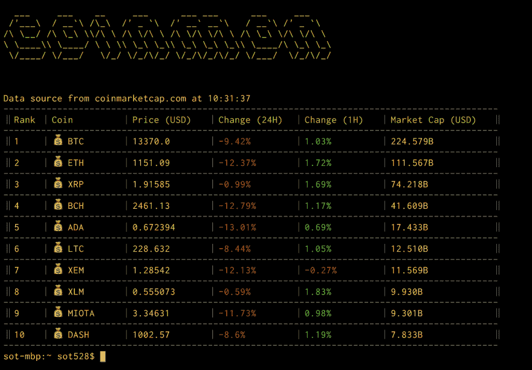
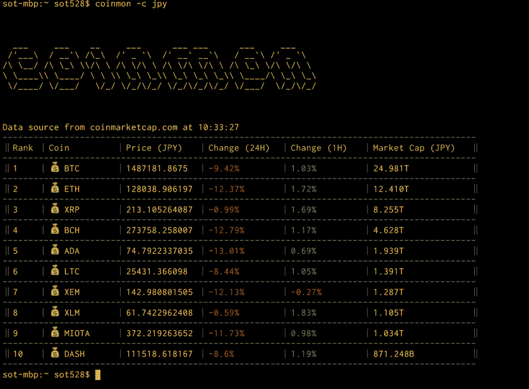
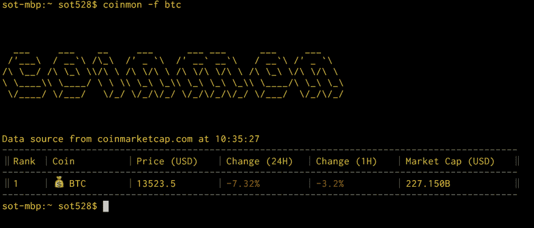

# 用终端显示加密货币的行情

> 原文：<https://dev.to/sot528/-7ao>

为了密码货币瘾君子的工程师。
密码货币的行情用[Coinmon](https://github.com/bichenkk/coinmon) 在终端确认吧。

```
 npm install -g coinmon
    coinmon 
```

Enter fullscreen mode Exit fullscreen mode

[T2】](https://res.cloudinary.com/practicaldev/image/fetch/s--A81WvcDW--/c_limit%2Cf_auto%2Cfl_progressive%2Cq_auto%2Cw_880/https://thepracticaldev.s3.amazonaws.com/i/u3n4qwheisdfyvhfv1b0.png)

# 用日元表示

```
 coinmon -c jpy 
```

Enter fullscreen mode Exit fullscreen mode

[T2】](https://res.cloudinary.com/practicaldev/image/fetch/s--FJWIJ6LG--/c_limit%2Cf_auto%2Cfl_progressive%2Cq_auto%2Cw_880/https://thepracticaldev.s3.amazonaws.com/i/8ks4ylzjjqsrp70t9xkt.png)

# 指定货币进行显示

```
 coinmon -f btc 
```

Enter fullscreen mode Exit fullscreen mode

[T2】](https://res.cloudinary.com/practicaldev/image/fetch/s--14U0SX5d--/c_limit%2Cf_auto%2Cfl_progressive%2Cq_auto%2Cw_880/https://thepracticaldev.s3.amazonaws.com/i/591zfs37exm1ufma3rkc.png)

以上。
这样在职场也放心了呢。