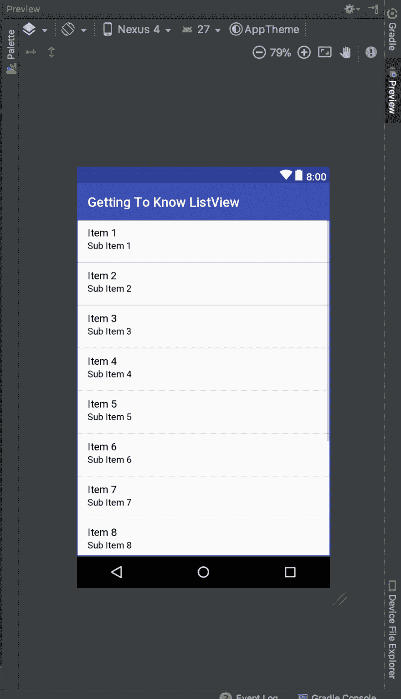
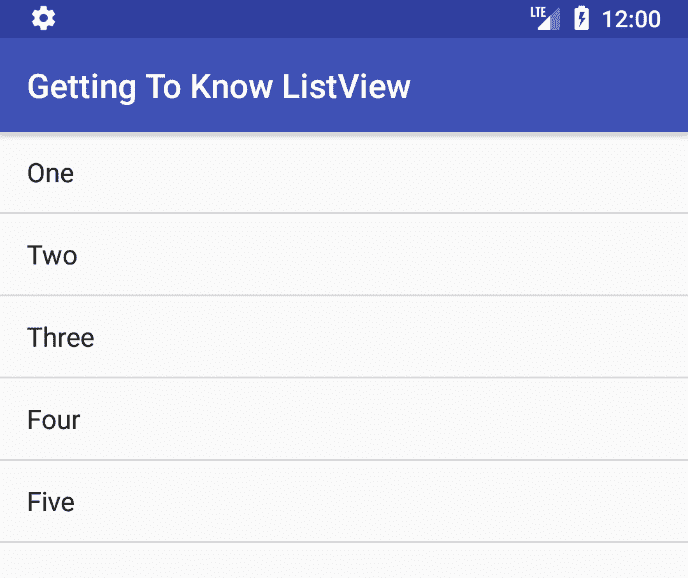
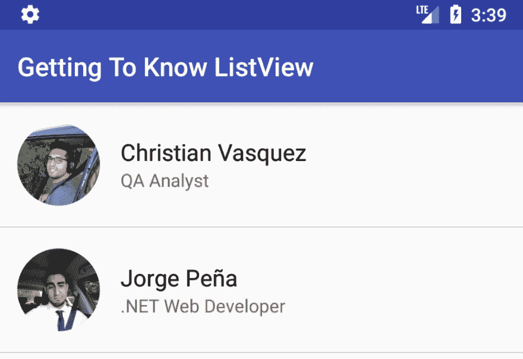

# 了解 Android 中的 ListView

> 原文:[https://dev . to/chrisvasqm/getting-immediate-with-listview-in-Android-2336](https://dev.to/chrisvasqm/getting-intimate-with-listview-in-android-2336)

### 警告

这将是一篇很长的文章，所以请花时间通读。

*下面的代码样本是用 [Kotlin](https://kotlinlang.org/) 编写的，我认为你对 Android Studio 和一个基本的 Android 应用程序的项目结构有点熟悉。*

如果你目前正在学习 Android 开发，很有可能你会碰到`ListView`。这是一种特殊的用于展示`list of items`的`View`(我已经可以听到你在想:“废话！”)这在安卓系统中很常见。

尽管如此，由于`ListView`面临的性能和动画限制，它正被`RecycleView`所取代。

但是至少熟悉它是如何工作的对你来说是有好处的，因为这也可能帮助你理解为什么以及如何在以后工作。

# 要求

*   [Java SDK](http://www.oracle.com/technetwork/java/javase/downloads/index.html) 。
*   [安卓工作室](https://developer.android.com/studio/index.html)(我会用 3.0.1 版本)。
*   Kotlin (Android Studio 3.0 或更高版本自带)。
*   [科特林安卓扩展](https://kotlinlang.org/docs/tutorials/android-plugin.html)(这样我们就不用再用`findViewById()`了)

# 设置布局

转到您的`activity_main.xml`，它最初应该是这样的:

```
<?xml version="1.0" encoding="utf-8"?>
<android.support.constraint.ConstraintLayout xmlns:android="http://schemas.android.com/apk/res/android"
    xmlns:app="http://schemas.android.com/apk/res-auto"
    xmlns:tools="http://schemas.android.com/tools"
    android:layout_width="match_parent"
    android:layout_height="match_parent"
    tools:context="com.chrisvasqm.gettingtoknowlistview.MainActivity">

    <TextView
        android:layout_width="wrap_content"
        android:layout_height="wrap_content"
        android:text="Hello World!"
        app:layout_constraintBottom_toBottomOf="parent"
        app:layout_constraintLeft_toLeftOf="parent"
        app:layout_constraintRight_toRightOf="parent"
        app:layout_constraintTop_toTopOf="parent" />

</android.support.constraint.ConstraintLayout> 
```

<svg width="20px" height="20px" viewBox="0 0 24 24" class="highlight-action crayons-icon highlight-action--fullscreen-on"><title>Enter fullscreen mode</title></svg> <svg width="20px" height="20px" viewBox="0 0 24 24" class="highlight-action crayons-icon highlight-action--fullscreen-off"><title>Exit fullscreen mode</title></svg>

默认布局由屏幕中心的`TextView`通过约束组成。酷，但我们不需要它，所以继续🗑️吧。

我们将用
替换所有内容

```
<?xml version="1.0" encoding="utf-8"?>
<ListView xmlns:android="http://schemas.android.com/apk/res/android"
    android:layout_width="match_parent"
    android:layout_height="match_parent" /> 
```

<svg width="20px" height="20px" viewBox="0 0 24 24" class="highlight-action crayons-icon highlight-action--fullscreen-on"><title>Enter fullscreen mode</title></svg> <svg width="20px" height="20px" viewBox="0 0 24 24" class="highlight-action crayons-icon highlight-action--fullscreen-off"><title>Exit fullscreen mode</title></svg>

现在，如果你检查你的 Android Studio 的预览面板，它应该是这样的:

[T2】](https://res.cloudinary.com/practicaldev/image/fetch/s--yUxlDvpg--/c_limit%2Cf_auto%2Cfl_progressive%2Cq_auto%2Cw_880/https://thepracticaldev.s3.amazonaws.com/i/ffqni9k2afgtyk9ixotd.png)

太好了！我们可以看到列表已经显示了一些内容。

所以，让我们来试试吧。在您的设备/仿真器上运行应用程序。

屏幕一片空白？厉害！这是意料之中的事👍。

### 为什么？

因为`ListView`显示了那些示例项目，所以你可以看到当你用数据填充它时它会是什么样子，但是我们还没有这样做...还没有。

# 向`ListView`添加数据

实现这一点有多种方法，我将向您展示其中的三种方法(除非有更多的方法，而我不知道它们)。

## 1)使用字符串数组资源文件

填充`ListView`最简单的方法是使用`string-array`资源文件。

转到你的`app/res/values/`文件夹，创建一个新的 XML 文件，姑且称之为`arrays.xml`，然后添加下面的代码:

```
<?xml version="1.0" encoding="utf-8"?>
<resources>
    <string-array name="list_items">
        <item>One</item>
        <item>Two</item>
        <item>Three</item>
        <item>Four</item>
        <item>Five</item>
    </string-array>
</resources> 
```

<svg width="20px" height="20px" viewBox="0 0 24 24" class="highlight-action crayons-icon highlight-action--fullscreen-on"><title>Enter fullscreen mode</title></svg> <svg width="20px" height="20px" viewBox="0 0 24 24" class="highlight-action crayons-icon highlight-action--fullscreen-off"><title>Exit fullscreen mode</title></svg>

为了将它添加到我们的`ListView`，我们可以在`activity_main.xml`布局中添加`entries`属性到它:

```
<?xml version="1.0" encoding="utf-8"?>
<ListView xmlns:android="http://schemas.android.com/apk/res/android"
    android:layout_width="match_parent"
    android:layout_height="match_parent"
    android:entries="@array/list_items"/> 
```

<svg width="20px" height="20px" viewBox="0 0 24 24" class="highlight-action crayons-icon highlight-action--fullscreen-on"><title>Enter fullscreen mode</title></svg> <svg width="20px" height="20px" viewBox="0 0 24 24" class="highlight-action crayons-icon highlight-action--fullscreen-off"><title>Exit fullscreen mode</title></svg>

现在再次运行该应用程序，您应该能够看到以下内容:

[T2】](https://res.cloudinary.com/practicaldev/image/fetch/s--ozJXvEJO--/c_limit%2Cf_auto%2Cfl_progressive%2Cq_auto%2Cw_880/https://thepracticaldev.s3.amazonaws.com/i/qytdut5zqk0air8ku3wi.png)

## 2)使用数组列表&数组适配器

为了做到这一点，我们需要给我们的`ListView`添加一个`id`属性，我将其命名为“listView”:

```
<?xml version="1.0" encoding="utf-8"?>
<ListView xmlns:android="http://schemas.android.com/apk/res/android"
    android:id="@+id/listView"
    android:layout_width="match_parent"
    android:layout_height="match_parent" /> 
```

<svg width="20px" height="20px" viewBox="0 0 24 24" class="highlight-action crayons-icon highlight-action--fullscreen-on"><title>Enter fullscreen mode</title></svg> <svg width="20px" height="20px" viewBox="0 0 24 24" class="highlight-action crayons-icon highlight-action--fullscreen-off"><title>Exit fullscreen mode</title></svg>

然后，到你的`MainActivity.java`那里，做一个`String` s:
的`List<>`

```
val items = listOf(
    "First",
    "Second",
    "Third",
    "Fourth",
    "Fifth"
) 
```

<svg width="20px" height="20px" viewBox="0 0 24 24" class="highlight-action crayons-icon highlight-action--fullscreen-on"><title>Enter fullscreen mode</title></svg> <svg width="20px" height="20px" viewBox="0 0 24 24" class="highlight-action crayons-icon highlight-action--fullscreen-off"><title>Exit fullscreen mode</title></svg>

`listOf()`函数接受任意数量的参数，并返回相同类型的`List<TYPE>`对象。

另外，**是不可改变的**。我的意思是它没有任何`add()`或`remove()`方法，就像常规的`List`会有的那样。为了得到它们，你必须使用`mutableListOf()`方法。

现在我们需要将我们的`items`列表传递给一个 ArrayAdapter 对象:

```
val arrayAdapter = ArrayAdapter<String>(
    this,
    android.R.layout.simple_list_item_1,
    items
) 
```

<svg width="20px" height="20px" viewBox="0 0 24 24" class="highlight-action crayons-icon highlight-action--fullscreen-on"><title>Enter fullscreen mode</title></svg> <svg width="20px" height="20px" viewBox="0 0 24 24" class="highlight-action crayons-icon highlight-action--fullscreen-off"><title>Exit fullscreen mode</title></svg>

`android.R.layout.simple_list_item_1`是一个仅由`TextView`组成的布局，而`TextView`是`android`包的一部分，该包有一个 R.layout 文件夹，其中保存了常用的资源，因此我们不必自己制作(但我们将在下一节中制作)。

现在我们已经准备好了我们的`arrayAdapter`，我们可以设置我们的`ListViews`的适配器到它:

```
listView.adapter = arrayAdapter 
```

<svg width="20px" height="20px" viewBox="0 0 24 24" class="highlight-action crayons-icon highlight-action--fullscreen-on"><title>Enter fullscreen mode</title></svg> <svg width="20px" height="20px" viewBox="0 0 24 24" class="highlight-action crayons-icon highlight-action--fullscreen-off"><title>Exit fullscreen mode</title></svg>

我们的 MainActivity 的`OnCreate`方法现在应该是这样的:

```
override fun onCreate(savedInstanceState: Bundle?) {
    super.onCreate(savedInstanceState)
    setContentView(R.layout.activity_main)

    val items = listOf(
        "First",
        "Second",
        "Third",
        "Fourth",
        "Fifth"
    )

    val arrayAdapter = ArrayAdapter<String>(
        this,
        android.R.layout.simple_list_item_1,
        items
    )

    listView.adapter = arrayAdapter
} 
```

<svg width="20px" height="20px" viewBox="0 0 24 24" class="highlight-action crayons-icon highlight-action--fullscreen-on"><title>Enter fullscreen mode</title></svg> <svg width="20px" height="20px" viewBox="0 0 24 24" class="highlight-action crayons-icon highlight-action--fullscreen-off"><title>Exit fullscreen mode</title></svg>

你还在等什么？自己去运行 app 看看吧！

您现在应该能够看到这一点:

[T2】](https://res.cloudinary.com/practicaldev/image/fetch/s--Ga74vF9m--/c_limit%2Cf_auto%2Cfl_progressive%2Cq_auto%2Cw_880/https://thepracticaldev.s3.amazonaws.com/i/lqa9q0o6iq3n330fhnpj.png)

干得好，但是...让我们更上一层楼😎！

## 3)使用自定义数组适配器

在本节结束时，我们将这样做:

[T2】](https://res.cloudinary.com/practicaldev/image/fetch/s--msqKgmex--/c_limit%2Cf_auto%2Cfl_progressive%2Cq_auto%2Cw_880/https://thepracticaldev.s3.amazonaws.com/i/s71jl8313180sg53wzvr.png)

首先，我们需要创建一个`class`来保存我们的联系相关数据:

```
class Contact(
    val imageResource: Int,
    val name: String,
    val description: String
) 
```

<svg width="20px" height="20px" viewBox="0 0 24 24" class="highlight-action crayons-icon highlight-action--fullscreen-on"><title>Enter fullscreen mode</title></svg> <svg width="20px" height="20px" viewBox="0 0 24 24" class="highlight-action crayons-icon highlight-action--fullscreen-off"><title>Exit fullscreen mode</title></svg>

现在我们可以通过创建一个继承自 ArrayAdapter `class`的`class`来创建我们的自定义 ArrayAdapter，因为我们将显示`Contact` s，我将把它命名为`ContactArrayAdapter` :

```
class ContactArrayAdapter(context: Context, contacts: List<Contact>)
    : ArrayAdapter<Contact>(context, 0, contacts) {

    override fun getView(position: Int, convertView: View?, parent: ViewGroup?): View {
        val rootView = convertView ?: LayoutInflater.from(context).inflate(R.layout.list_item, parent, false)
        val currentContact = getItem(position)

        rootView.contactImage.setImageResource(currentContact.imageResource)
        rootView.contactName.text = currentContact.name
        rootView.contactDescription.text = currentContact.description

        return rootView
    }
} 
```

<svg width="20px" height="20px" viewBox="0 0 24 24" class="highlight-action crayons-icon highlight-action--fullscreen-on"><title>Enter fullscreen mode</title></svg> <svg width="20px" height="20px" viewBox="0 0 24 24" class="highlight-action crayons-icon highlight-action--fullscreen-off"><title>Exit fullscreen mode</title></svg>

您可能会注意到，`R.layout.list_item`将以红色突出显示，这是因为我们还没有创建显示`contactImage`、`contactName`和`contactDescription`的自定义布局。

前往您的`app/res/layout/`文件夹，`layout`文件夹上的`Right Click`并选择`New > Layout resource file`。将其命名为“list_item ”,然后点击 OK。

现在将这个 XML 添加到它:

```
<?xml version="1.0" encoding="utf-8"?>
<LinearLayout xmlns:android="http://schemas.android.com/apk/res/android"
    xmlns:app="http://schemas.android.com/apk/res-auto"
    android:layout_width="match_parent"
    android:layout_height="match_parent"
    android:orientation="horizontal"
    android:padding="16dp">

    <ImageView
        android:id="@+id/contactImage"
        android:layout_width="64dp"
        android:layout_height="64dp"
        app:srcCompat="@mipmap/ic_launcher_round" />

    <LinearLayout
        android:layout_width="wrap_content"
        android:layout_height="match_parent"
        android:gravity="center_vertical"
        android:orientation="vertical"
        android:paddingLeft="16dp">

        <TextView
            android:id="@+id/contactName"
            android:layout_width="wrap_content"
            android:layout_height="wrap_content"
            android:text="Contact Name"
            android:textColor="@android:color/black"
            android:textSize="18sp" />

        <TextView
            android:id="@+id/contactDescription"
            android:layout_width="wrap_content"
            android:layout_height="wrap_content"
            android:text="Contact Description" />
    </LinearLayout>

</LinearLayout> 
```

<svg width="20px" height="20px" viewBox="0 0 24 24" class="highlight-action crayons-icon highlight-action--fullscreen-on"><title>Enter fullscreen mode</title></svg> <svg width="20px" height="20px" viewBox="0 0 24 24" class="highlight-action crayons-icon highlight-action--fullscreen-off"><title>Exit fullscreen mode</title></svg>

从[我的个人资料](https://dev.to/chrisvasqm)和[乔治的](https://dev.to/dpbacross)中复制我们的个人资料图片，然后粘贴到您的`app/res/drawable/`文件夹中。

现在我们终于一切就绪，可以开始行动了。

回到你的`MainActivity`并重构它，这样我们现在有了一个`List<Contact>`，我们将使用新的`ContactArrayAdapter`，而不是使用`ArrayAdapter<String>`。

应该是这样的:

```
class MainActivity : AppCompatActivity() {

    override fun onCreate(savedInstanceState: Bundle?) {
        super.onCreate(savedInstanceState)
        setContentView(R.layout.activity_main)

        val contacts = listOf(
                Contact(R.drawable.contact_chris, "Christian Vasquez", "QA Analyst"),
                Contact(R.drawable.contact_david, "Jorge Peña", ".NET Web Developer")
        )

        val arrayAdapter = ContactArrayAdapter(this, contacts)

        listView.adapter = arrayAdapter
    }
} 
```

<svg width="20px" height="20px" viewBox="0 0 24 24" class="highlight-action crayons-icon highlight-action--fullscreen-on"><title>Enter fullscreen mode</title></svg> <svg width="20px" height="20px" viewBox="0 0 24 24" class="highlight-action crayons-icon highlight-action--fullscreen-off"><title>Exit fullscreen mode</title></svg>

运行应用程序，您应该能够看到我们的最终结果:

[T2】](https://res.cloudinary.com/practicaldev/image/fetch/s--msqKgmex--/c_limit%2Cf_auto%2Cfl_progressive%2Cq_auto%2Cw_880/https://thepracticaldev.s3.amazonaws.com/i/s71jl8313180sg53wzvr.png)

什么？你的图像不是圆形的？

哦...我会把它作为家庭作业留给你:)

咳咳[提示](https://github.com/hdodenhof/CircleImageView)咳咳。

# 最后的话

你成功了👏👏👏

确保你自己击掌，因为这是一个很大的工作量！

我希望你在这个过程中学到了一些新东西🤓。