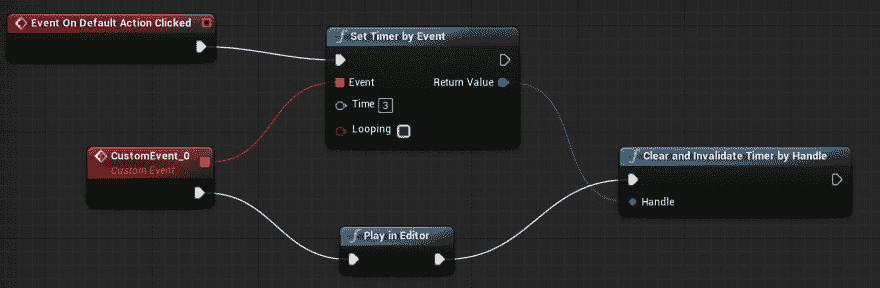
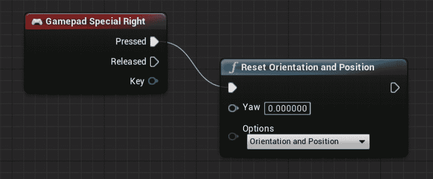

# UE4 的 VR Preview 开始时，想设法解决高度不一致的问题

> 原文:[https://dev.to/shiena/ue4-vr-preview-3cjc](https://dev.to/shiena/ue4-vr-preview-3cjc)

# 前言

在 UE4 上看 VR Preview 的时候，按下了 Play 按钮，然后戴上了 Oculus，如果不在传感器的范围内，照相机就会变成地板的高度，重做很麻烦，所以是费尽了九牛二虎之力的记录。

# 尝试延迟 VR Preview

运行 VR Preview 时 Oculus 进入传感器范围即可，因此尝试在 VR Preview 之前加入延迟。
所以必要的有以下 3 点。

*   成为执行契机的东西(按钮之类的)
*   计时器
*   如何通过 Bluepirnt 或 C++执行 VR Preview 功能

第一个是要进行编辑器扩展太夸张了，所以在 alwei 先生的[UE4 Blutility 的轻松的编辑器扩展](http://unrealengine.hatenablog.com/entry/2016/10/05/215937)中解说的方法中，双击继承了`GlobalEditorUtilityBase`的 Blutility 资产进行调用

第二个使用 Blueprint 的`Set Timer by Event`节点。

第三，经过反复试验，无法直接执行 VR Preview 的功能本身，所以可以通过将 Play 按钮的键盘快捷方式`Alt+P`发送到工具栏来实现。
这是添加 C++类作为函数库并编写以下代码。

```
#pragma once

#include "CoreMinimal.h"
#include "Kismet/BlueprintFunctionLibrary.h"
#include "MyBlueprintFunctionLibrary.generated.h"

UCLASS()
class MYPROJECT_API UMyBlueprintFunctionLibrary : public UBlueprintFunctionLibrary
{
    GENERATED_BODY()

    UFUNCTION(BlueprintCallable, Category="MyBPLibrary")
    static void PlayInEditor();
}; 
```

```
#include "MyBlueprintFunctionLibrary.h"
#include "Kismet2/DebuggerCommands.h"

void UMyBlueprintFunctionLibrary::PlayInEditor()
{
    FPlayWorldCommands::GlobalPlayWorldActions->ProcessCommandBindings(EKeys::P, FModifierKeysState(false, false, false, false, true, true, false, false, false), false);
} 
```

因为有依存模块，所以在`PublicDependencyModuleNames`中追加`"Slate", "SlateCore", "UnrealEd"`。

```
using UnrealBuildTool;

public class MyProject : ModuleRules
{
    public MyProject(ReadOnlyTargetRules Target) : base(Target)
    {
        PCHUsage = PCHUsageMode.UseExplicitOrSharedPCHs;

        PublicDependencyModuleNames.AddRange(new string[] { "Core", "CoreUObject", "Engine", "InputCore" });

        PrivateDependencyModuleNames.AddRange(new string[] { });

        if (Target.bBuildEditor == true)
        {
            PublicDependencyModuleNames.AddRange(new string[] { "Slate", "SlateCore", "UnrealEd" });
        }

        // Uncomment if you are using Slate UI
        // PrivateDependencyModuleNames.AddRange(new string[] { "Slate", "SlateCore" });

        // Uncomment if you are using online features
        // PrivateDependencyModuleNames.Add("OnlineSubsystem");

        // To include OnlineSubsystemSteam, add it to the plugins section in your uproject file with the Enabled attribute set to true
    }
} 
```

在适当的文件夹中制作 Blutility，组成以下节点。
然后调用该资产，3 秒后 VR Preview 开始(严格来说是最后执行的播放模式)
做了呢！

[T2】](https://res.cloudinary.com/practicaldev/image/fetch/s--U6hq0XBc--/c_limit%2Cf_auto%2Cfl_progressive%2Cq_auto%2Cw_880/https://dev-to-uploads.s3.amazonaws.com/i/sxuclaexwvucqqtzfg38.png)

# 更简单的方法

如果在 level blue print 上组成以下节点，按下 Oculus Touch 左控制器的菜单按钮时就可以重置位置跟踪。 婴儿

[T2】](https://res.cloudinary.com/practicaldev/image/fetch/s--mH1P5t0T--/c_limit%2Cf_auto%2Cfl_progressive%2Cq_auto%2Cw_880/https://dev-to-uploads.s3.amazonaws.com/i/0vkj5quvo67nxrrajxsg.png)