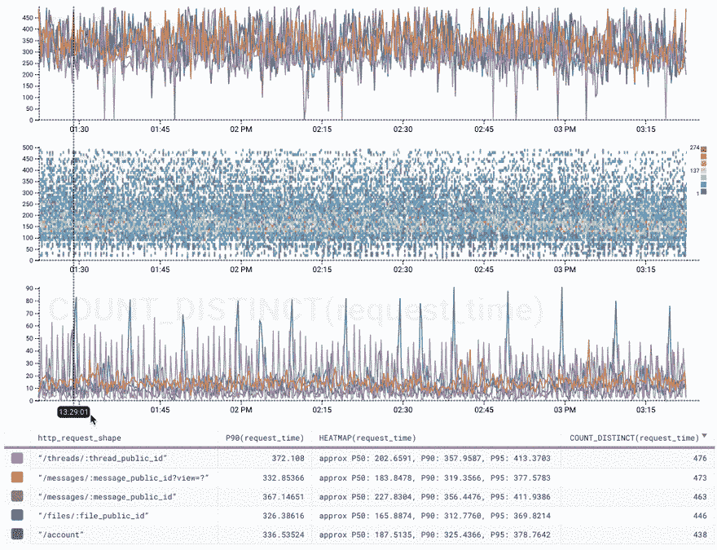
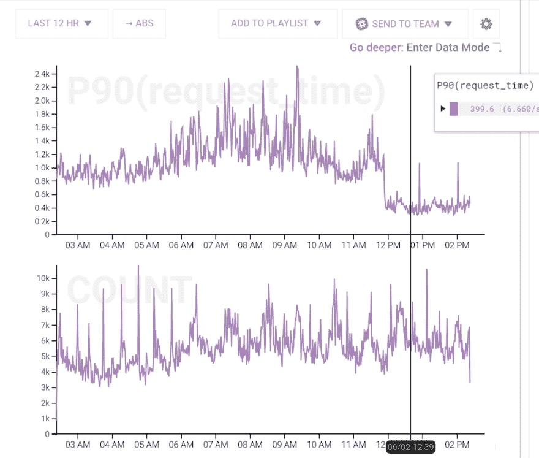

# 制作更快的 API

> 原文：<https://dev.to/nylas/making-a-faster-api-cad>

**TL；博士:**

*   视觉化很重要。工具很重要。
*   [设定一个清晰可衡量的目标](#goal)。
*   [使用蜂巢](#honeycomb)之类的工具来诊断出了什么问题。
*   使用 cProfile 和 SnakeViz 这样的分析器来处理简单的情况。
*   使用像 [nylas-perftools](https://github.com/nylas/nylas-perftools) 这样的剖析器来处理复杂的统计案例。
*   [通过蜂窝或石墨/Sensu 设置监控&报警](#monitoring)。

在 Nylas，我们的 API 是我们产品的核心，是我们业务的核心，也是我们与客户的主要接口。因此，保持 API 快速运行对我们来说非常重要。有效地加速 API 是一项诊断、分析和监控的工作，需要好的工具、好的可视化和专注。这篇博文将介绍我们用来实现绩效目标的技术，并给出具体的例子来说明这些技术是如何应用的。

## 设定明确的、可衡量的目标

*我们当前的 API 目标是总请求时间**P90<500 毫秒**T3】*

所有的目标都有细微差别。明确定义这些细微差别很重要，因为它们会影响您分析数据的方式。

这个目标被设计得很紧凑。它很容易在办公室的一张纸上显示出来，让所有人都可以看到，同时还提供了一个清晰准确的目标。这种简洁隐藏了相当多的复杂性，尽管如此，当我们决定是否达到目标时，还是需要考虑这些复杂性。

首先，**【总请求时间】**需要再详细阐述一下。Nylas API 有许多不同的端点。这些端点中的每一个都有不同的性能考虑，并且可以有非常不同的使用模式。有几十个小目标，每个端点一个，是没有意义的，所以我们必须平衡在哪里划线，并在这个度量中排除几个 API 端点。例如，我们有一个长轮询端点，每次总是打开 30 秒。电子邮件`/send`端点的性能是上游终端用户服务器的功能，在关注我们控制的性能旋钮时没有帮助。此外，`/health`端点是微不足道的，会扭曲平均值。

**“P90”**是一种量化我们最慢的 API 请求的方法。它是“百分之九十”的简写。在我们的例子中，这意味着 10 个请求中有 9 个花费的时间不到 1 秒。此外，我们每 15 分钟运行一次计算，以消除间歇性颤振。

最后，500 毫秒是我们在全代理网络级别尽可能宽松地测量的。如果我们只看应用程序代码，我们可能会忽略网络问题和其他瓶颈。但是，由于我们仅从 AWS 美国东部提供服务，因此我们仅包括距离数据中心一定物理距离内的响应，以标准化光速时间。

## 用蜂巢测量

知道到底哪里出了问题才是最难的。人类是不可思议的模式检测者，但是我们必须用模式来做这件事。在 Nylas API 这样的系统上，快速从大量数据中获取有意义的模式对于有效的性能调优至关重要。

对这个问题影响最大的工具是蜂巢。他们的界面速度是关键。它允许您只需几次击键，就可以用不同的排序、过滤和分组标准来可视化数据。这个速度至关重要，因为找到正确的数据模式需要快速连续地进行几十次直觉。从头开始创建可视化所花费的精神能量是从实际诊断手边的问题中转移出来的能量。

正确的可视化也很重要。我们积极使用热图来快速了解特定端点的运行情况。在一个可视化视图中，我不仅可以看到哪些端点最慢，还可以看到响应时间有多不稳定。持续缓慢和不稳定缓慢意味着需要不同调试技术的不同问题。

[T2】](https://res.cloudinary.com/practicaldev/image/fetch/s--61MFAz3G--/c_limit%2Cf_auto%2Cfl_progressive%2Cq_66%2Cw_880/https://www.nylas.com/hs-fs/hubfs/blog%2520images/Making%2520a%2520Faster%2520API/honeycomb-gif.gif)

这是蜂巢热图。我们正在查看按端点细分的 5 个最慢的 API 端点。只需将鼠标悬停在一个端点上，我们就可以看到每个端点的行为。顶部图表是每个端点的 P90。中间是热图，显示了按频率着色的各个样本。底部是请求数。

[T2】](https://res.cloudinary.com/practicaldev/image/fetch/s--pqKP66mz--/c_limit%2Cf_auto%2Cfl_progressive%2Cq_auto%2Cw_880/https://www.nylas.com/hs-fs/hubfs/blog%2520images/Making%2520a%2520Faster%2520API/honeycomb-graph.png)

这是一个蜂窝图，展示了一个显著提高性能的部署。顶部的图表是 P90 请求时间图。

同样重要的是要记住，当测量像高流量 API 这样的东西时，几乎没有绝对。一切都是概率性的，应该如此对待。

第一个测量阶段是关于集中精力。没有一个绩效项目拥有无限的资源，银弹也很少存在；然而，通常会有一个离群值出现在噪声中。这些是我们接下来要深入探讨的阶段。

## 用 Nylas Perftools 进行仿形

一旦我们找到了缓慢的原因，是时候更深入地探究可能发生的事情了。

概要分析的目标是将问题缩小到最好是一个可重现的场景，或者至少是一个功能级的地方，以便集中精力进行审计和修复。

有几种方法可以进行侧写。第一种是通过标准的代码剖析和逐步调试。这种方法非常精确，但是倾向于依赖确定性的隔离代码。第二种是通过实际生产机器上的统计分析。这种方法更难设置，交互性更差，但在诊断实际发生的情况方面要好得多。

当人们第一次想到 Python 中的概要分析时，Google 的第一个结果是 cProfile。我们会用一点点，但只有当问题可以在本地孤立地重现时才有效。cProfile 副作用很大，对生产环境不利。此外，这个分析器的默认输出是一大串文本。虽然这对于数据的可移植性和获得精确的数字很好，但对于快速掌握正在发生的事情的要点并不好。我们喜欢使用 [SnakeViz](https://jiffyclub.github.io/snakeviz/) ，它为分析数据提供了火焰图和圆图。同样，视觉化很重要。你的模式识别能力可以立即告诉你轨迹的特征，比它处理数字表要快得多。额外的时间意味着你可以尝试更多的直觉，更快地接近真正的问题。

[T2】](https://res.cloudinary.com/practicaldev/image/fetch/s--6fmRt8cA--/c_limit%2Cf_auto%2Cfl_progressive%2Cq_auto%2Cw_880/https://www.nylas.com/hs-fs/hubfs/blog%2520images/Making%2520a%2520Faster%2520API/snake-viz.png)

这是 SnakeViz 的一个输出。尽管有本地测试的警告，但是查看 cProfile 的结果要比默认的文本转储容易得多。

对于一个大型的 API，标准的代码剖析通常不是答案的来源。许多问题是由于负载、网络或其他随机和罕见的事件造成的，这些事件不容易在分析器能够处理的单一受控环境下本地重现。

相反，我们求助于我们自己设计的名为 [nylas-perftools](https://github.com/nylas/nylas-perftools) 的统计分析器，我们已经[写了大量关于这个令人敬畏的工具](https://www.nylas.com/blog/performance)的文章。看看吧！简而言之，这将定期对堆栈进行采样，并给出一个火焰图，它不仅代表一条线性代码路径，还代表机器在一段时间内所做事情的统计采样。这可以快速直观地告诉我们，在真实的生产负载下是否出现了缓慢的区域。

[T2】](https://res.cloudinary.com/practicaldev/image/fetch/s--P4js92Ze--/c_limit%2Cf_auto%2Cfl_progressive%2Cq_auto%2Cw_880/https://www.nylas.com/hs-fs/hubfs/blog%2520images/Making%2520a%2520Faster%2520API/flame-graph.png)

这是 nylas-perftools 的输出。在这个例子中，很明显有一个函数占用了大部分时间。值得注意的是，与 cProfile SnakeViz 图不同，这是一个正在运行的生产系统的统计表示。

## 修复&验证

如果测量和分析工具完成了它们的工作，那么实际的代码修复往往是最容易的部分。在最好的情况下，通过几行代码，一个可再现的问题将会立即出现，并且明显更快。更常见的情况是，修复往往有点投机性，由来自分析和测量步骤的非常强的基于证据的预感驱动。

推测性的修复很好，但是它们需要一个验证步骤，这个步骤只能在以前的测量和分析工具中找到。这就是为什么确保概要文件和图表是可复制的并且容易返回也是很重要的。在提交中保存一个概要分析的代码，拥有一个现成的调试构建工件，或者保存到图形的链接，这些都有助于快速重现之前的度量。

## 监控&警戒

部署的补丁并不是性能之战的结束。绩效是一项持续的努力，必须如此对待。

我们使用 Honeycomb 的警报功能来让我们知道我们的主 P90 < 500ms goal exceeds its threshold. This automatically goes to [PagerDuty](https://www.pagerduty.com/) 的时间，并通知待命工程师。我们还使用[石墨](https://graphiteapp.org/)和[感官](https://sensuapp.org/)来提醒我们通过 PagerDuty 的其他警报。

API 性能与服务器健康检查略有不同。偶尔，警报可能会响起，我们会看到一个巨大的峰值，表明部署不当或 API 暂时出现了其他问题。更有可能的是，随着时间的推移，代码和 cruft 会不断构建，性能开始慢慢下降。当这种情况发生时，我们的性能警报开始忽明忽暗，这是一个非常强烈的信号，表明是时候再次重复整个过程了。

我在这里概述的是相当简单的过程，类似于许多调试过程。关键是为一个众所周知的困难过程带来有效的工具、良好的可视化和清晰的焦点。

* * *

这篇文章最初发表在 Nylas 工程博客上。