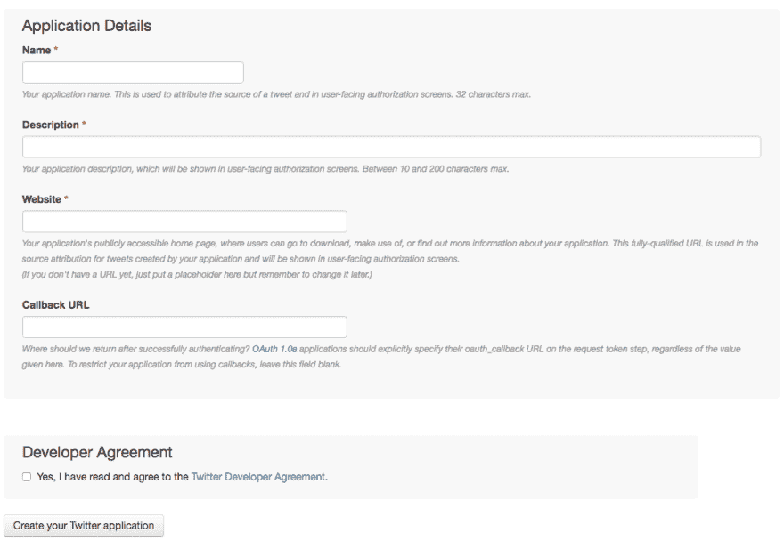

# 如何用 17 行代码构建一个简单的 Twitter 机器人

> 原文:[https://dev . to/oohsinan/how-to-build-a-simple-Twitter-bot-in-17-lines-of code-2 aan](https://dev.to/oohsinan/how-to-build-a-simple-twitter-bot-in-17-lines-ofcode-2aan)

几个月前，我创建了这个 twitter 机器人，它可以转发指定用户列表中的任何内容。你猜怎么着？只有 17 行代码。我分享这个的原因是因为我认为在线服务收取至少 15 美元来创建一个简单的机器人工具是疯狂的，当你可以自己创建的时候。你准备好了吗？

下面是我们要用来建造机器人的东西:

*   Node.js —安装在[https://nodejs.org/en/](https://nodejs.org/en/)
*   twit —节点的 Twitter API 客户端(相信我，就是 twit)。[https://github.com/ttezel/twit](https://github.com/ttezel/twit)

基本上就是这样。

## 创建应用程序

在我们开始编写代码之前，我们必须设置我们的 Twitter 应用程序。你可以在 https://apps.twitter.com/做这件事。点击“创建新应用”按钮，您将看到以下内容:

[T2】](https://res.cloudinary.com/practicaldev/image/fetch/s--xqoO8EPi--/c_limit%2Cf_auto%2Cfl_progressive%2Cq_auto%2Cw_880/https://cdn-images-1.medium.com/max/1600/1%2AttqN-UZdw2jdvSd-KVftcg.png)

填写信息。如果你没有网站可以放在“网站”栏，你可以只写[https://www.example.com](https://www.example.com)。
一旦创建了应用程序，在“密钥和访问令牌”选项卡上有 4 件重要的事情需要记下来:

*   消费者密钥
*   消费者秘密
*   访问令牌密钥
*   访问令牌秘密

如果您没有看到您的“访问令牌密钥”和“访问令牌密码”，只需点击“创建我的访问令牌”按钮，您就可以设置了。

## 初始化项目

打开 CMD 或终端和 cd 到 twitter bot 的新目录，执行命令:

```
npm init 
```

<svg width="20px" height="20px" viewBox="0 0 24 24" class="highlight-action crayons-icon highlight-action--fullscreen-on"><title>Enter fullscreen mode</title></svg> <svg width="20px" height="20px" viewBox="0 0 24 24" class="highlight-action crayons-icon highlight-action--fullscreen-off"><title>Exit fullscreen mode</title></svg>

并填写信息。接下来，我们需要安装适当的依赖项，在本例中只有一个:

```
npm install twit --save 
```

<svg width="20px" height="20px" viewBox="0 0 24 24" class="highlight-action crayons-icon highlight-action--fullscreen-on"><title>Enter fullscreen mode</title></svg> <svg width="20px" height="20px" viewBox="0 0 24 24" class="highlight-action crayons-icon highlight-action--fullscreen-off"><title>Exit fullscreen mode</title></svg>

现在在该目录中创建一个名为 index.js 的文件。

**注意**:如果你在运行`npm init`时改变了入口点，那么确保文件名与你在`package.json`中输入的相匹配。如果你没有改变什么，那么不要担心，就叫它`index.js`。

## 好玩的部分

打开一个您选择的空白文本编辑器，并创建一个 Twit 实例，用于向 Twitter 的 API 发出请求。配置应该是以下形式的对象:

```
var Twit = require('twit')
var T = new Twit({
    consumer_key:         ' ... ',
    consumer_secret:      ' ... ',
    access_token:         ' ... ',
    access_token_secret:  ' ... ',
}) 
```

<svg width="20px" height="20px" viewBox="0 0 24 24" class="highlight-action crayons-icon highlight-action--fullscreen-on"><title>Enter fullscreen mode</title></svg> <svg width="20px" height="20px" viewBox="0 0 24 24" class="highlight-action crayons-icon highlight-action--fullscreen-off"><title>Exit fullscreen mode</title></svg>

用您的消费和访问密钥替换`' ... '`。
现在创建一个数组，保存您想要转发的用户的字符串 id(您可以在下面的代码片段中更改我放入的 id):

```
var users = ["10228272", "155659213", "783214"]; 
```

<svg width="20px" height="20px" viewBox="0 0 24 24" class="highlight-action crayons-icon highlight-action--fullscreen-on"><title>Enter fullscreen mode</title></svg> <svg width="20px" height="20px" viewBox="0 0 24 24" class="highlight-action crayons-icon highlight-action--fullscreen-off"><title>Exit fullscreen mode</title></svg>

现在我们将创建一个格式为`T.stream(path, [params])` :
的流

```
var stream = T.stream('statuses/filter', {follow: users}); 
```

<svg width="20px" height="20px" viewBox="0 0 24 24" class="highlight-action crayons-icon highlight-action--fullscreen-on"><title>Enter fullscreen mode</title></svg> <svg width="20px" height="20px" viewBox="0 0 24 24" class="highlight-action crayons-icon highlight-action--fullscreen-off"><title>Exit fullscreen mode</title></svg>

注意，在第二个参数中，对于键`follow`，我们将值设置为变量`users`。
现在，当事件 tweet 被触发时，我们将收听该流:

```
stream.on('tweet', function (tweet) {
    if (users.indexOf(tweet.user.id_str) > -1) {
        console.log(tweet.user.name + ": " + tweet.text);
        T.post('statuses/retweet/:id', { id: tweet.id_str }, function (err, data, response) {
            console.log(data)
        })
    }
}) 
```

<svg width="20px" height="20px" viewBox="0 0 24 24" class="highlight-action crayons-icon highlight-action--fullscreen-on"><title>Enter fullscreen mode</title></svg> <svg width="20px" height="20px" viewBox="0 0 24 24" class="highlight-action crayons-icon highlight-action--fullscreen-off"><title>Exit fullscreen mode</title></svg>

每当一个状态(tweet)进入流时，就会发出这个函数。第 2 行是必要的，以确保刚刚发 tweeted 的用户的 ID 出现在数组`users`中。
第 4 行基本上是使用 twit 转发带有`tweet.id_str`的`id`的推文。如果你想了解 tweet 对象的其他属性，你可以前往:[https://developer . Twitter . com/en/docs/tweets/data-dictionary/overview/tweet-object](https://developer.twitter.com/en/docs/tweets/data-dictionary/overview/tweet-object)

## 让我们运行机器人吧！

基本上就是这样，您只用 17 行代码就创建了您的第一个 twitter 机器人！要运行它，只需在 CMD 或终端中执行这个命令:

```
node index.js 
```

<svg width="20px" height="20px" viewBox="0 0 24 24" class="highlight-action crayons-icon highlight-action--fullscreen-on"><title>Enter fullscreen mode</title></svg> <svg width="20px" height="20px" viewBox="0 0 24 24" class="highlight-action crayons-icon highlight-action--fullscreen-off"><title>Exit fullscreen mode</title></svg>

## 未来更新

稍后我会写另一篇文章，解释如何将你的机器人部署到 Heroku，这样你就不必在本地系统上全天候运行它。

## 最终代码

```
var Twit = require('twit')
var T = new Twit({
    consumer_key:         ' ... ',
    consumer_secret:      ' ... ',
    access_token:         ' ... ',
    access_token_secret:  ' ... ',
})
var users = ["10228272", "155659213", "783214"];
var stream = T.stream('statuses/filter', {follow: users});
stream.on('tweet', function (tweet) {
    if (users.indexOf(tweet.user.id_str) > -1) {
        console.log(tweet.user.name + ": " + tweet.text);
        T.post('statuses/retweet/:id', { id: tweet.id_str }, function (err, data, response) {
            console.log(data)
        })
    }
}) 
```

<svg width="20px" height="20px" viewBox="0 0 24 24" class="highlight-action crayons-icon highlight-action--fullscreen-on"><title>Enter fullscreen mode</title></svg> <svg width="20px" height="20px" viewBox="0 0 24 24" class="highlight-action crayons-icon highlight-action--fullscreen-off"><title>Exit fullscreen mode</title></svg>