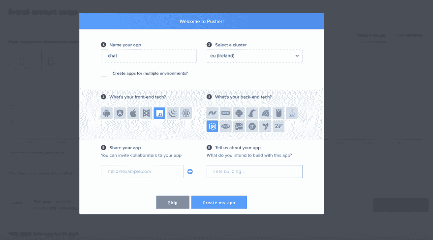

# 如何用 JavaScript 构建消息传递状态

> 原文:[https://dev . to/pmbanugo/how-to-build-a-message-delivery-status-in-JavaScript-34ob](https://dev.to/pmbanugo/how-to-build-a-message-delivery-status-in-javascript-34ob)

当构建实时应用程序时，我们经常想知道一个过程或事件发生的实际时间。例如，在一个即时消息应用程序中，我们想知道我们的消息是否以及何时被发送到目标客户。我们在 WhatsApp 上看到了这一点，消息是实时发送的，你可以看到每条消息在发送和阅读时的状态，发送时有两个灰色勾号，阅读时有两个蓝色勾号。我们可以使用 Pusher 和 JavaScript 很容易地构建一个消息传递状态。

## 如何？

Pusher 有一个通道和事件的概念，这是它的基础。我们可以通过通道向客户端发送消息，并让客户端通过触发一个事件来通知我们已读回执，发送方将侦听该事件并做出相应的反应。

通道提供了一种过滤数据和控制对不同信息流的访问的方式，而事件则是在构成所有通信基础的推送系统中打包消息的主要方法。

要用 Pusher 实现消息传递状态，我们必须订阅一个通道并监听通道上的事件。我们将用 JavaScript 构建一个简单的聊天应用程序，它将向客户端发送消息，客户端收到消息后将触发一个事件。

## 应用程序设置

要使用 Pusher API，我们必须从仪表板注册并创建一个 Pusher 应用程序。我们可以创建尽可能多的应用程序，每个应用程序都将获得一个应用程序 id 和密钥，我们将使用它们在客户端或服务器端代码上初始化 Pusher 实例。

### 创建新的推单账户

1.  [注册](https://pusher.com/signup)成为 Pusher，如果您已经有帐户，请登录。
2.  注册后，我们进入仪表板，显示一个屏幕来设置一个新的 pusher 应用程序。

    1.  输入应用程序的名称。在这种情况下，我称之为“聊天”。
    2.  选择一个集群
    3.  如果您希望拥有不同的开发、试运行和生产实例，请选择“为多个环境创建应用程序”选项
    4.  选择前端技术。我将选择 VanillaJS，因为我不会使用任何框架
    5.  选择 NodeJS 作为我的后端
3.  点击**创建 App** 创建 Pusher app。

[T2】](https://res.cloudinary.com/practicaldev/image/fetch/s--kpt8OvXf--/c_limit%2Cf_auto%2Cfl_progressive%2Cq_auto%2Cw_880/http://blog.pusher.com/wp-content/uploads/2017/03/how-to-build-a-message-delivery-status-in-javascript-create-pusher-app.png)

## 代码

我们将使用通道作为通过通道发送消息和触发事件的手段。推动器中有 3 种通道:

*   知道频道名称的任何人都可以订阅的公共频道。
*   **私人频道**，让您的服务器控制对您正在广播的数据的访问。
*   **存在频道**是私有频道的扩展，但是强制频道订阅者在订阅时注册用户信息。它还能让用户知道谁在线。

客户端需要通过身份验证才能使用私有通道和在线通道。对于示例应用程序，我们将使用 vanilla JS 构建客户机，使用 NodeJS 构建服务器(用于身份验证)。因为我不希望消息通过服务器，而是从客户端到客户端，并且我不需要知道用户是在线还是离开，所以我将使用一个私有通道进行演示，但是同样的技术也适用于任何类型的通道。客户端事件只能在私有或存在通道中触发，要使用这些通道类型，用户/客户端必须经过身份验证，因此需要 NodeJS 后端进行身份验证。

此外，要使用客户端事件，必须为应用程序启用它们。转到 Pusher 仪表盘，在**应用设置**选项卡上，选择“启用客户端事件”并更新。

#### 后端

因为我们正在使用 Express 在 node 中构建后端，所以让我们初始化一个新的 Node 应用程序并安装所需的依赖项。运行以下命令:

*   `npm init`并选择默认选项
*   `npm i --save body-parser express pusher`安装 express 和 Pusher 节点包

添加一个名为`server.js`的新文件，该文件将包含认证 Pusher 客户端的逻辑，并呈现我们稍后将添加的静态文件。该文件将包含以下内容

```
var express = require('express');
var bodyParser = require('body-parser');

var Pusher = require('pusher');

var app = express();
app.use(bodyParser.json());
app.use(bodyParser.urlencoded({ extended: false }));

var pusher = new Pusher({ appId: APP_ID, key: APP_KEY, secret:  APP_SECRET, cluster: APP_Cluster });

app.get('/',function(req,res){      
     res.sendFile('index.html', {root: __dirname });
});

app.use(express.static(__dirname + '/'));

app.post('/pusher/auth', function(req, res) {
  var socketId = req.body.socket_id;
  var channel = req.body.channel_name;
  var auth = pusher.authenticate(socketId, channel);
  res.send(auth);
});

var port = process.env.PORT || 5000;
app.listen(port, function () {
  console.log(`Example app listening on port ${port}!`)
}); 
```

<svg width="20px" height="20px" viewBox="0 0 24 24" class="highlight-action crayons-icon highlight-action--fullscreen-on"><title>Enter fullscreen mode</title></svg> <svg width="20px" height="20px" viewBox="0 0 24 24" class="highlight-action crayons-icon highlight-action--fullscreen-off"><title>Exit fullscreen mode</title></svg>

我们通过传入一个对象来实例化 Pusher，该对象包含我们的应用 ID 和密钥的详细信息，可以在 Pusher 仪表板的**应用密钥**选项卡上找到。行`var auth = pusher.authenticate(socketId, channel);`通过 Pusher 对客户端进行认证，并向调用客户端返回一个认证码。为了允许这个文件在我们启动 npm 时运行，我们用下面的值更新 package . JSON:

```
"scripts": {
    "start": "node server.js",
    "test": "echo \"Error: no test specified\" && exit 1"
  }, 
```

<svg width="20px" height="20px" viewBox="0 0 24 24" class="highlight-action crayons-icon highlight-action--fullscreen-on"><title>Enter fullscreen mode</title></svg> <svg width="20px" height="20px" viewBox="0 0 24 24" class="highlight-action crayons-icon highlight-action--fullscreen-off"><title>Exit fullscreen mode</title></svg>

#### 前端

后端就绪后，我们现在继续制作前端。我们将使用来自这个[站点](http://bootsnipp.com/snippets/6eWd)的模板，稍加修改。

添加一个名为`index.html`和`style.css`的新文件，每个文件包含以下内容:

**Index.html**T2】

```
<!DOCTYPE html>
<html>
<head>

    <link rel="stylesheet" href="https://maxcdn.bootstrapcdn.com/bootstrap/3.3.7/css/bootstrap.min.css" integrity="sha384-BVYiiSIFeK1dGmJRAkycuHAHRg32OmUcww7on3RYdg4Va+PmSTsz/K68vbdEjh4u" crossorigin="anonymous">

    <link rel="stylesheet" href="https://maxcdn.bootstrapcdn.com/bootstrap/3.3.7/css/bootstrap-theme.min.css" integrity="sha384-rHyoN1iRsVXV4nD0JutlnGaslCJuC7uwjduW9SVrLvRYooPp2bWYgmgJQIXwl/Sp" crossorigin="anonymous">

    <scriptsrc="https://code.jquery.com/jquery-2.2.4.min.js"
        integrity="sha256-BbhdlvQf/xTY9gja0Dq3HiwQF8LaCRTXxZKRutelT44="
        crossorigin="anonymous"></script>

    <script src="https://maxcdn.bootstrapcdn.com/bootstrap/3.3.7/js/bootstrap.min.js" integrity="sha384-Tc5IQib027qvyjSMfHjOMaLkfuWVxZxUPnCJA7l2mCWNIpG9mGCD8wGNIcPD7Txa" crossorigin="anonymous"></script>

    <link rel="stylesheet" href="style.css">
    <script src="https://js.pusher.com/4.0/pusher.min.js"></script>
    <script src="index.js"></script>
</head>
<body>
    <div class="container">
    <div class="row form-group">
        <div class="col-xs-12 col-md-offset-2 col-md-8 col-lg-8 col-lg-offset-2">
            <div class="panel panel-primary">
                <div class="panel-heading">
                    <span class="glyphicon glyphicon-comment"></span> Comments
                    <div class="btn-group pull-right">
                        <button type="button" class="btn btn-default btn-xs dropdown-toggle" data-toggle="dropdown">
                            <span class="glyphicon glyphicon-chevron-down"></span>
                        </button>
                        <ul class="dropdown-menu slidedown">
                            <li><a href="http://www.jquery2dotnet.com"><span class="glyphicon glyphicon-refresh">
                            </span>Refresh</a></li>
                            <li><a href="http://www.jquery2dotnet.com"><span class="glyphicon glyphicon-ok-sign">
                            </span>Available</a></li>
                            <li><a href="http://www.jquery2dotnet.com"><span class="glyphicon glyphicon-remove">
                            </span>Busy</a></li>
                            <li><a href="http://www.jquery2dotnet.com"><span class="glyphicon glyphicon-time"></span>
                                Away</a></li>
                            <li class="divider"></li>
                            <li><a href="http://www.jquery2dotnet.com"><span class="glyphicon glyphicon-off"></span>
                                Sign Out</a></li>
                        </ul>
                    </div>
                </div>
                <div class="panel-body body-panel">
                    <ul class="chat">

                    </ul>
                </div>
                <div class="panel-footer clearfix">
                    <textarea id="message" class="form-control" rows="3"></textarea>
                    <span class="col-lg-6 col-lg-offset-3 col-md-6 col-md-offset-3 col-xs-12" style="margin-top: 10px">
                        <button class="btn btn-warning btn-lg btn-block" id="btn-chat">Send</button>
                    </span>
                </div>
            </div>
        </div>
    </div>
</div>

<script id="new-message-other" type="text/template">
    <li class="left clearfix">
        <span class="chat-img pull-left">
            
        </span>
        <div class="chat-body clearfix">
            <p>
                {{body}}
            </p>
        </div>
    </li>
</script>

<script id="new-message-me" type="text/template">
    <li id="{{id}}" class="right clearfix">
        <span class="chat-img pull-right">
            
        </span>
        <div class="chat-body clearfix">
            <div class="header">
                <small class="text-muted">{{status}}</small>

            </div>
            <p>
                {{body}}
            </p>
        </div>
    </li>
</script>

</body>
</html> 
```

<svg width="20px" height="20px" viewBox="0 0 24 24" class="highlight-action crayons-icon highlight-action--fullscreen-on"><title>Enter fullscreen mode</title></svg> <svg width="20px" height="20px" viewBox="0 0 24 24" class="highlight-action crayons-icon highlight-action--fullscreen-off"><title>Exit fullscreen mode</title></svg>

**style.css**

```
@import url("http://netdna.bootstrapcdn.com/font-awesome/4.0.3/css/font-awesome.css");
.chat
{
    list-style: none;
    margin: 0;
    padding: 0;
}

.chat li
{
    margin-bottom: 10px;
    padding-bottom: 5px;
    border-bottom: 1px dotted #B3A9A9;
}

.chat li.left .chat-body
{
    margin-left: 60px;
}

.chat li.right .chat-body
{
    margin-right: 60px;
}

.chat li .chat-body p
{
    margin: 0;
    color: #777777;
}

.panel .slidedown .glyphicon, .chat .glyphicon
{
    margin-right: 5px;
}

.body-panel
{
    overflow-y: scroll;
    height: 250px;
}

::-webkit-scrollbar-track
{
    -webkit-box-shadow: inset 0 0 6px rgba(0,0,0,0.3);
    background-color: #F5F5F5;
}

::-webkit-scrollbar
{
    width: 12px;
    background-color: #F5F5F5;
}

::-webkit-scrollbar-thumb
{
    -webkit-box-shadow: inset 0 0 6px rgba(0,0,0,.3);
    background-color: #555;
} 
```

<svg width="20px" height="20px" viewBox="0 0 24 24" class="highlight-action crayons-icon highlight-action--fullscreen-on"><title>Enter fullscreen mode</title></svg> <svg width="20px" height="20px" viewBox="0 0 24 24" class="highlight-action crayons-icon highlight-action--fullscreen-off"><title>Exit fullscreen mode</title></svg>

我们添加的页面包含一个一对一的聊天模板。在第 **18** 行，我们添加了加载 Pusher JavaScript 库的脚本，在第 **19** 行，我们正在加载一个自定义的 JavaScript 文件，我们将使用它来处理来自页面的交互。添加包含以下内容的文件:

**index.js**

```
$(document).ready(function(){
    // Enable pusher logging - don't include this in production
    Pusher.logToConsole = true;

    var pusher = new Pusher('APP_KEY', {
        cluster: 'eu',
        encrypted: false
    });

    var channel = pusher.subscribe('private-channel');
    //channel name prefixed with 'private' because it'll be a private channel
}); 
```

<svg width="20px" height="20px" viewBox="0 0 24 24" class="highlight-action crayons-icon highlight-action--fullscreen-on"><title>Enter fullscreen mode</title></svg> <svg width="20px" height="20px" viewBox="0 0 24 24" class="highlight-action crayons-icon highlight-action--fullscreen-off"><title>Exit fullscreen mode</title></svg>

从上面的代码中，我们首先通过用 **App_Key** 和集群创建一个 Pusher 对象来连接到 Pusher。这些值是从推杆仪表板上获得的。`encrypted`设置为 false，允许它在未加密的连接上发送信息。

然后，我们订阅一个用于发送消息的频道。频道名称可以是任何名称，但最长不得超过 164 个字符。私有通道的另一个限制是它必须以`private-`为前缀。

接下来，我们绑定到事件。这样，我们可以通过订阅的通道从客户端接收消息。将下面一行添加到`index.js`

```
channel.bind('client-message-added', onMessageAdded);
channel.bind('client-message-delivered', onMessageDelivered);

$('#btn-chat').click(function(){
    const id = generateId();
    const message = $("#message").val();
    $("#message").val("");

    let template = $("#new-message-me").html();
    template = template.replace("{{id}}", id);
    template = template.replace("{{body}}", message);
    template = template.replace("{{status}}", "");

    $(".chat").append(template);

    //send message
    channel.trigger("client-message-added", { id, message });
});
function generateId() {
    return Math.round(new Date().getTime() + (Math.random() * 100));
}

function onMessageAdded(data) {
    let template = $("#new-message-other").html();
    template = template.replace("{{body}}", data.message);

    $(".chat").append(template);

    //notify sender
    channel.trigger("client-message-delivered", { id: data.id });
}

function onMessageDelivered(data) {
    $("#" + data.id).find("small").html("Delivered");
} 
```

<svg width="20px" height="20px" viewBox="0 0 24 24" class="highlight-action crayons-icon highlight-action--fullscreen-on"><title>Enter fullscreen mode</title></svg> <svg width="20px" height="20px" viewBox="0 0 24 24" class="highlight-action crayons-icon highlight-action--fullscreen-off"><title>Exit fullscreen mode</title></svg>

我将从客户端触发事件，不希望它通过后端或被验证。这只是为了这个演示。[客户端事件](https://pusher.com/docs/client_api_guide/client_events#trigger-events)必须以`client-`为前缀，这就是为什么我用上面的代码这样做的原因。带有任何其他前缀的事件将被推送服务器拒绝，发送到客户端未订阅的频道的事件也是如此。

> 触发客户端事件时要格外小心，这一点很重要。因为这些内容来自其他用户，可能会被您站点的恶意用户篡改。

当用户输入新消息时会触发`client-message-added`。一旦其他用户收到消息，它就会显示在页面上，并触发`client-message-delivered`事件来通知发送者收到消息。通过这种方式，我们可以实现在应用程序中获得消息传递状态通知的目标。

运行应用程序，看看它是如何工作的。

[T2】](https://res.cloudinary.com/practicaldev/image/fetch/s--IL-V9KDR--/c_limit%2Cf_auto%2Cfl_progressive%2Cq_66%2Cw_880/http://blog.pusher.com/wp-content/uploads/2017/03/how-build-a-message-delivery-status-in-javascript-final-app.gif)

## 总结起来

到目前为止，您已经看到了，并且知道通道和事件是 Pusher 的基础，我希望我已经向您展示了如何使用 Pusher 和 JavaScript 实现消息交付状态。你可以在 GitHub 上找到代码

*此文最初发表在[推手](https://blog.pusher.com/how-to-build-a-message-delivery-status-in-javascript/)T3 上*