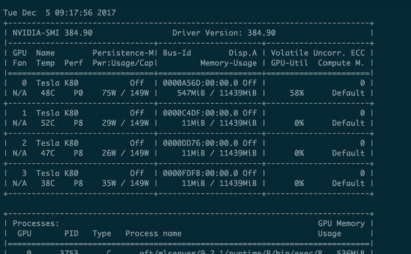
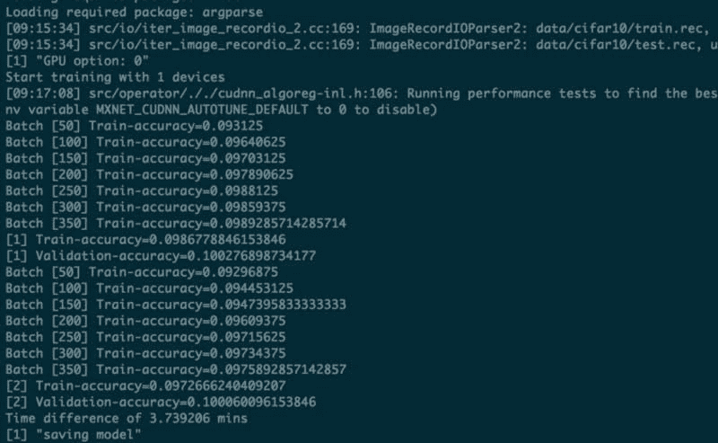

# 深度神经网络:如何使用 MXNet + GPU 支持和 R 绑定设置 Azure NC24 VM

> 原文:[https://dev . to/pa1nd/deep-neural-networks-how-to-setup-a-azure-nc24-VM-with-mxnet-GPU-support-and-r-bindings-8ag](https://dev.to/pa1nd/deep-neural-networks-how-to-setup-a-azure-nc24-vm-with-mxnet-gpu-support-and-r-bindings-8ag)

> _ **免责声明:这是一个技术性很强的帖子；专为疯狂的开发者打造。** _

[T2】](https://res.cloudinary.com/practicaldev/image/fetch/s--9CwfDyGN--/c_limit%2Cf_auto%2Cfl_progressive%2Cq_auto%2Cw_880/https://blog.penguin.academy/conteimg/downloaded_images/Deep-Neural-Networks--How-to-setup-a-Azure-NC24-VM-with-MXNet---GPU-support-and-R-bindings/1-_A9cCqKvHGd3SGWeJy-ZoQ.jpeg)

这是关于如何设置包含 4 个 Tesla K80 GPUs 的 Azure NC24 VM 的描述。这个想法是在 Ubuntu 16.04 LTS 下设置一个 NC24 虚拟机并安装带有 GPU 支持的 MXNet，以给一个简单的 9 层卷积神经网络增加一些功能。官方文档非常有用，可以在这里找到。

关键的学习是:用 Python 重写你的代码。几天后，这对我们来说是最快的方法。

还是出于文档的目的，我发表了这篇文章。可能会有其他疯狂的人，对他们来说，这可能是有用的。

我大体上遵循了这里描述的流程:[用 Azure GPU VMs、MXNet 和微软 R Server](https://blogs.technet.microsoft.com/machinelearning/2016/09/15/building-deep-neural-networks-in-the-cloud-with-azure-gpu-vms-mxnet-and-microsoft-r-server/) 在云中构建深度神经网络。

* * *

## I .天蓝色调教

如果您还没有 Azure 帐户，请注册一个。如果你是 Azure 的新手，这很简单，除了一个潜在的问题。

1.  使用 Ubuntu 16.04 添加虚拟机。
2.  这个比较棘手:如果你刚刚注册了一个账户，你的免费账户是不会允许你购买 NC24 的，因为你可以获得的虚拟核心的默认配额太小了。解决方案:将您的免费计划转变为付费计划(启动信用将保持不变),并**写信支持在您希望启动虚拟机的数据中心位置增加 vcore 配额**。

* * *

## 二世。系统设置

如上所述，我是在关注[这篇文章](https://blogs.technet.microsoft.com/machinelearning/2016/09/15/building-deep-neural-networks-in-the-cloud-with-azure-gpu-vms-mxnet-and-microsoft-r-server/)。

它假设所有的软件包(CUDA、cuDNN、MKL 和 MXNet)都在用户的主目录中。在上面的文章中有关于如何获得它们的描述。你需要英伟达和英特尔的账户。但结果是，文章中链接的版本太旧了，不再受支持/不容易获得。所以完整的过程来了:

1.  **准备系统:**更新 apt-get: $ sudo apt-get 更新安装所需的一切:$ sudo apt-get Install-y lib atlas-base-dev libopencv-dev libprotoc-dev python-numpy python-scipy make unzip git gcc g++ libcurl 4-OpenSSL-dev libssl-dev 更新到 cc 的替代项:$ sudo Update-alternatives-Install/usr/bin/cc/usr/bin/gcc 50
2.  安装 CUDA:尝试从下载的包中安装 CUDA 对我来说失败了。下面是我尝试的:$ chmod 755 cuda _ 8 . 0 . 27 _ Linux . run $ sudo。/cuda _ 8 . 0 . 27 _ Linux . run–覆盖

安装过程中，出现提示时选择以下选项:

*   安装 Linux-x86_64 361.77 的 NVIDIA 加速图形驱动？—是的
*   您想安装 OpenGL 库吗？—是的
*   要运行 nvidia-xconfig 吗？—本例中不需要。
*   安装 CUDA 8.0 工具包？—是的
*   输入工具包位置[默认为/usr/local/cuda-8.0] —选择默认
*   你想在/usr/local/cuda 安装一个符号链接吗？—是的
*   安装 CUDA 8.0 示例？—没有

如果 CUDA 安装失败:

$ sudo apt-get upgrade-y

$ sudo apt-get dist-upgrade-y

$ sudo apt-get install Linux-image-extra-virtual

$ sudo apt-get install Linux-source

$ sudo apt-get source Linux-image-$(uname-r)

$ sudo apt-get install Linux-headers-$(uname-r)

…还是失败了。我最终决定通过包管理器安装 CUDA 9。

**最后是这样的:**

$ sudo apt-get 安装 cuda

Btw:由于你从包管理器安装 CUDA，你会得到最新的补丁，你不必另外安装。这也意味着，在下文中，版本将与文章中使用的不同。

试试 nvidia-smi 是否工作(设置持续模式)

$ sudo NVIDIA-SMI-pm 1

$ NVIDIA-SMI

现在应该会显示这样的内容……(见本节末尾的截图)

1.  **下载并安装 cuDNN** 并创建 cudnn.h 头文件的符号链接:$ tar-xvzf cud nn-9.0-Linux-x64-V7 . tgz $ sudo mv cuda/usr/local/cud nn $ sudo ln-s/usr/local/cud nn/include/cud nn . h/usr/local/cuda/include/cud nn . h
2.  **下载安装 MKL:**$ tar-xvzf l _ mkl _ 2017 . 3 . 196 . tgz $ sudo。/l_mkl_2017.3.196/install.sh 按照提示，输入您在英特尔电子邮件中收到的 mkl 序列号。默认安装位置是/opt/Intel —下一步您将需要它。
3.  **安装 MXNet:** 我决定在更新到 1.0 之前安装最新版本。安装那两个包为我解决了一些问题:$ sudo apt-get install-y libopenblas-dev liblapack-dev $ git clone-recursive【https://github.com/apache/incubator-mxnet.git】T2mxnet-branch 0 . 12 . 1

编辑。bashrc 并添加到 CUDA 和 cuDNN 库的链接。

$ nano ~/。bashrc

$ export LD _ LIBRARY _ PATH =/usr/local/cuda/lib 64/:/usr/local/cud nn/lib 64/:$ LD _ LIBRARY _ PATH

$ export LIBRARY _ PATH =/usr/local/cud nn/lib 64/

重新加载环境:$ bash

接下来，将 config.mk 复制到$MXNET_HOME 目录。

$ CD mxnet/$

$ CP make/config . MK。

**修改$MXNET_HOME/config.mk make 文件**以使用 CUDA、cuDNN 和 MKL。

$ nano config.mk

USE _ CUDA = 1

USE _ CUDA _ PATH =/usr/local/CUDA
T3】USE _ cud nn = 1

要使用 MKL，所以设置 USE_BLAS 和 USE_INTEL_PATH 如下:

USE _ BLAS = mkl

USE _ INTEL _ PATH =/opt/INTEL/

要启用分布式计算，请设置:

USE_DIST_KVSTORE = 1

现在是建造的时候了。为了并行构建，我使用了–j 选项。

$ make -j ${nproc}

1.  **安装微软 R(ml Server):**MRS(微软 R Server)不再可用，但微软有新产品可以使用:【Linux 机器学习服务器。安装非常简单，这里描述的是。

要将 MXNet 库添加到 R 中，首先在/etc/ld.so.conf 中添加以下两行:$ nano/etc/LD . so . conf

/usr/local/cuda/lib 64/

/usr/local/cud nn/lib 64/

，然后重新配置动态链接器运行时绑定:

$ sudo ldconfig

1.  **创建 MXNet R 包:**祝贺您成功到达这里。现在有趣的部分来了。在 MXNET _ HOME 文件夹中，运行以下命令:＄sudo Rscript-e " install . packages(' dev tools '，repo = '[https://cran . r studio . com ')"](https://cran.rstudio.com%E2%80%99)%E2%80%9D)

我们现在需要安装一些 R 依赖项。

$ CD R-package/

$ sudo Rscript-e " install . packages(c(' Rcpp '，' DiagrammeR '，' data.table '，' jsonlite '，' magrittr '，' stringr '，' roxygen2 ')，repos = '[https://cran . rstudio . com '](https://cran.rstudio.com%27))"

如果这对你来说很好。太神奇了！

继续第 8 步。否则，在步骤 9 检查故障排除。

1.  **安装 MXNet R 包:** $ cd..$ make rpkg $ sudo R CMD INSTALL mxnet _ 0.12 . tar . gz

**排除 rpkg 构建的故障**:如果出现问题，很可能是 Makeconf 中的编译器标志有问题。这个评论很好的描述了如何解决:[https://github . com/Microsoft/Microsoft-R-open/issues/26 # issue comment-313739668](https://github.com/Microsoft/microsoft-r-open/issues/26#issuecomment-313739668)

make conf 的位置不是/opt/Microsoft/ml server/9 . 2 . 1/runtime/R/etc/Makeconf 就是/etc/make conf

1.  **R 依赖项的故障排除:**对我来说，大多数 R 依赖项安装失败。以下是我做的事情，让他们安装。

为了修复 DiagrammeR 包，这有助于:

$ sudo apt-get install libxml 2-dev

要修复其他包，这是必不可少的:

$ sudo Rscript-e " install . packages(' OpenSSL ')"

$ sudo Rscript-e " install . packages(' httr ')"
"
$ sudo Rscript-e " remove . packages(' curl ')"

$ sudo Rscript-e " install . packages(' curl ')"

最后 roxygen2 可以这样安装:

$ sudo Rscript-e " dev tools::install _ version(' roxy gen 2 '，version='5.0.1 '，repo = '[https://cran . r studio . com '](https://cran.rstudio.com%27))"

1.  现在你应该已经完成了，你可以在 R 中要求 MXNet 并使用 GPU。希望下一个 MXNet 版本会变得更容易。🚀 🐧 🎉

<figure> 

<figcaption>输出这样的东西</figcaption>

</figure>

## 三世。试运转

让我们试一试，建立一些深度神经网络！我用了 [CIFAR-10 问题和数据集](https://www.cs.toronto.edu/~kriz/cifar.html)作为例子。这是一个 10 类的分类问题，数据集有 60000 幅彩色图像(每类 6000 幅)。微软公布了一个简单的 [CIFAR-10 训练算法](https://mxnetstorage.blob.core.windows.net/blog1/MXNet_AzureVM_install_test.tar.gz)，可以从 r 开始执行，你首先要安装 argparse 依赖:

$ sudo Rscript-e " install . packages(' arg parse '，repo = '[https://cran . r studio . com ')"](https://cran.rstudio.com%E2%80%99)%E2%80%9D)

现在可以从解压后的文件夹中运行以下命令:

$ Rscript train _ resnet _ dynamic _ reload。稀有

您应该会看到类似于下面截图的输出:

[T2】](https://res.cloudinary.com/practicaldev/image/fetch/s--SFG1HRvH--/c_limit%2Cf_auto%2Cfl_progressive%2Cq_auto%2Cw_880/https://blog.penguin.academy/conteimg/downloaded_images/Deep-Neural-Networks--How-to-setup-a-Azure-NC24-VM-with-MXNet---GPU-support-and-R-bindings/1-nw0CJC8BtXLf3Nb9CguewQ.jpeg)

对我来说，在 GPU 上运行需要 3.7 分钟。😎

相对于 CPU 相当惊人:微软在 CPU 上磨合用了 119.5 分钟。