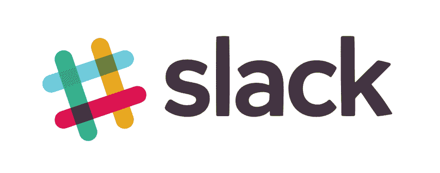

# 面向 Slack 的流行 PHP 包的轮回

> 原文:[https://dev.to/phpprofi/-PHP-slack-4k2m](https://dev.to/phpprofi/--php---slack-4k2m)

大家好！

今天，我想谈一谈一个很小但很受欢迎的 open source 包，并请求您的帮助和支持。

## 懈怠

您肯定都在自己的团队中使用过 t0s lack t1，以简化您的项目。在这个计划中，Slack 是很方便的东西。

[T2】](https://res.cloudinary.com/practicaldev/image/fetch/s--OvDI5FMw--/c_limit%2Cf_auto%2Cfl_progressive%2Cq_auto%2Cw_880/http://phpprofi.ru/resources/img/blogs/b8050f01-7610-42fe-beb3-8c31348d0018.jpeg)

* * *

http://phpprofi.ru/blogs/post/93 的читать

* * *

en:[https://dev . to/phpprofi/recreation-of-popular-PHP-package-for-slack-2p3i](https://dev.to/phpprofi/reincarnation-of-popular-php-package-for-slack-2p3i)