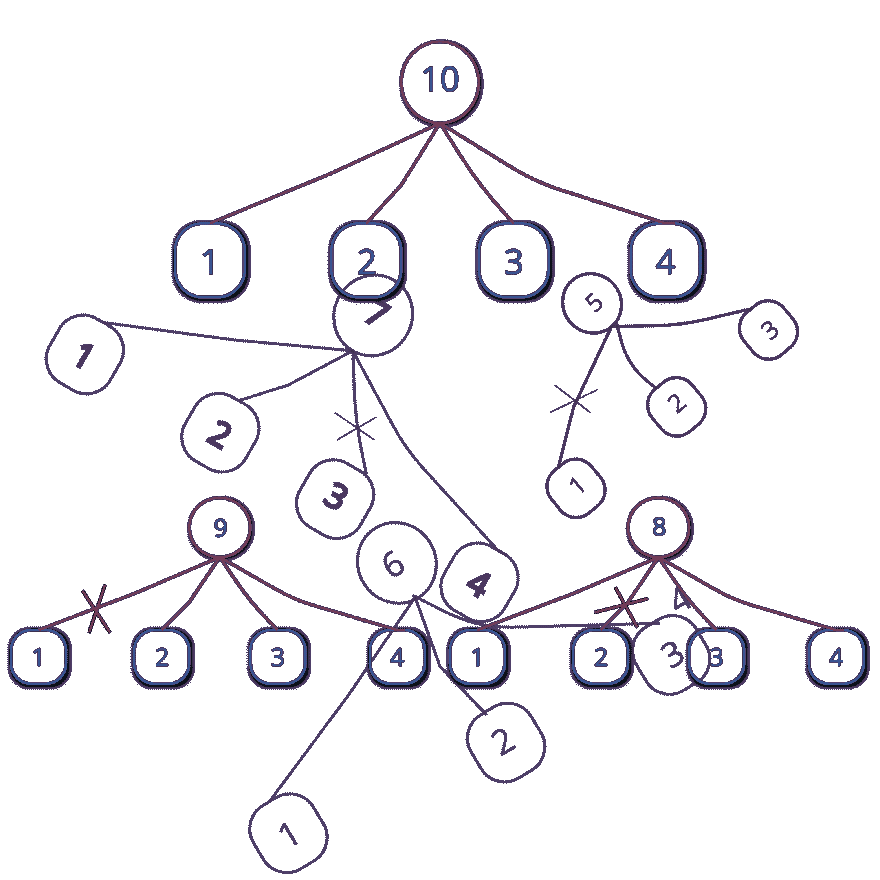
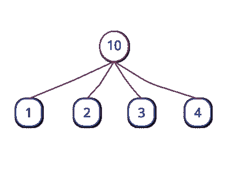
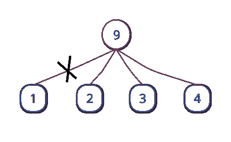
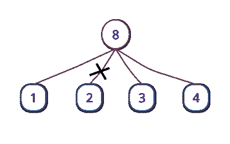
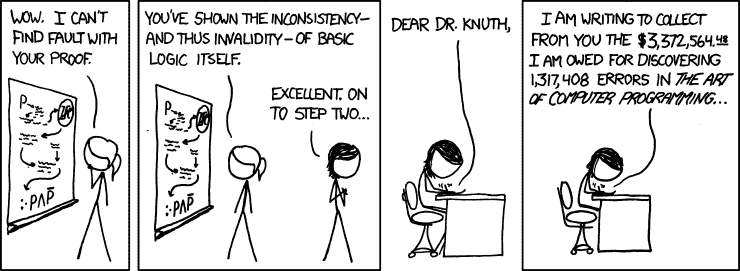

# 寻找最大分区的另一种方法

> 原文:[https://dev . to/sched utron/another-way-to-find-max-partitions-2pgj](https://dev.to/schedutron/another-way-to-find-max-partitions-2pgj)

[T2】](https://res.cloudinary.com/practicaldev/image/fetch/s--hZRALaUH--/c_limit%2Cf_auto%2Cfl_progressive%2Cq_auto%2Cw_880/https://cdn-images-1.medium.com/max/2000/1%2AAPvhFmzJb82rixlRy5ckaw.png)

* * *

您正在组织一次黑客马拉松，并决定向获胜者提供免费云存储作为奖励。对于奖金基金，您有 1024 GB 的云空间。你可以给这些千兆字节，条件是在黑客马拉松中位置越高，空间越大。因为你想让尽可能多的参与者开心，你想找到最大数量的位置来颁发奖品。这意味着，如果您只有 8 GB 可用，您将总共有 3 个位置—冠军获得 5 GB，亚军获得 2 GB，第三名获得 1 GB(另一种变化是可能的— 4、3 和 1gb，但 8 GB 的位置数仍然是 3)。

那么如何解决这个问题呢？请注意(如上例所示)，对于给定数量的位置(让我们称这个数量为 p)，可能有多种分布。事实上，这可以归结为用不同的较小数字的和来表示一个数字，这样就有尽可能多的这些数字。对于 8g，我们可以选择 8 = 7 + 1 或 8 = 5 + 3 的形式，但这不是最佳形式，因为 8 可以表示为多个数字的和，例如 8 = 5 + 2 + 1。一个可以方便解决这个问题的数学概念是划分——引用维基百科，正整数 *n* 的划分，也称为整数划分，是将 n 写成正整数之和的一种方式。所以在我们的例子中，我们只想计算 512 的划分，它有尽可能多的数。为了方便讨论，我们称之为最大分区。

在计算机科学中，这个问题属于某一类问题，其解决方案使用贪婪算法——在解决方案的每个阶段做出局部最优选择的过程，希望找到全局最优。解决我们例子的“贪婪”方法如下:从 1 开始作为第一个被加数不是很自然吗？剩下的就是将 7 表示为最大分区，并在其上加 1。但是现在将 7 表示为最大分区有一个约束——我们不能使用 1。所以我们使用 2，然后将 8 - (1+2) = 5 表示为最大分区。同样，我们不能用 1 和 2。我们也不能使用 3 或 4，因为那样我们会再次分别使用 2 和 1。因此，我们将 5 表示为它本身，这样就完成了——我们现在的最大分区是 8 = 1 + 2 + 5。很容易看出，当我们最初想要弹出的数字(这里是 3)至少是剩余数字(这里是 5)的一半时，就会出现最后一个条件。我把那部分留给你去想。

因此，更正式地说，考虑我们最初有两个数字 n= 8 和 l = 1。如果 n ≤ 2l，我们就简单地把 n 表示成它本身，否则就弹出 l，然后求解把 n - l 表示成一个最大划分使得划分中的每个数至少是 l+1 的子问题。这个子问题的 l 值比原问题的 l 值大 1。所以对于我们将 8 表示为最大划分的例子(n，l)，我们首先弹出 1，然后求解子问题(n-l，l+1)，即(7，2)。对于这个子问题，我们跳出 2，然后求解子问题(7-2，2+1)，也就是(5，3)。现在，既然 5 ≤ 2x3，我们只要弹出 5 就完事了。我们现在只是将弹出的数字相加，得到 8 = 1 + 2 + 5。既然我们现在已经更正式地阐明了战略，那么就很容易想出一个可行的方案来解决我们的问题。Python 3 中有一个简单的实现:

```
def max_partition(n, l=1):
    partition = []
    while n > 2*l:
        partition.append(l)
        n = n - l
        l += 1
    partition.append(n)
    return partition
print(max_partition(int(input()))) 
```

<svg width="20px" height="20px" viewBox="0 0 24 24" class="highlight-action crayons-icon highlight-action--fullscreen-on"><title>Enter fullscreen mode</title></svg> <svg width="20px" height="20px" viewBox="0 0 24 24" class="highlight-action crayons-icon highlight-action--fullscreen-off"><title>Exit fullscreen mode</title></svg>

* * *

但是等等——我有另一种方法。也许更好。我注意到可以表示为前 n 个自然数之和的数是特殊的。他们炫耀身份的时候不是已经是 max-partition 形态了吗？！比如 6 写成 6 = 1 + 2 + 3 的时候不是已经是 max-partition 形式了吗？10 写成 10 = 1 + 2 + 3 + 4 的时候不是已经是 max-partition 形式了吗？为了这个对话，我们称这样的号码为“高级号码”。这种见解构成了我的算法的基础。

我们是这样进行的:如果我们必须找到其最大划分的数 n 已经是一个高级数，我们简单地用它的 n = 1 + 2 + 3 + … + k 形式来表示它。如果它不是一个高级数，我们仍然可以找到一个 k，它足够大，足以使 s = 1 + 2 + 3 + … + k 大于 n(足够大的意思是 k 可以使 1 + 2 + 3 + … + k 大于 n，但不能使 1 + 2 + 3 + … + k-1 大于 n)。因为 k 刚好大到 s 大于 n，所以 s-n 会小于 k，所以 s-n 会是 1，2，3，…，k-1 中的一个数。如果我们从前 k 个自然数的和中“抽出”s-n 会怎么样？这样我们就得到了 s-(s-n)，也就是 n！

顺便说一下，上一段的最后一个字符不是阶乘🙂。让我们想象一下到目前为止我们学到的观点。通常，Ferrers 图用于可视化分区，但对于我们的目的，我发现我的自定义可视化更方便:在下面的树中，顶部节点是我们希望评估其最大分区的编号。树叶是最大划分表示中的数字，当然，这些数字相加得出顶部节点上的数字。对于一个高级号码来说，一切都很好:

[T2】](https://res.cloudinary.com/practicaldev/image/fetch/s--CNssUAXw--/c_limit%2Cf_auto%2Cfl_progressive%2Cq_auto%2Cw_880/https://cdn-images-1.medium.com/max/1600/1%2A916SSjR3bqu5mmdthoeUbA.png)

对于不是高级的号码，我们剪切适当的分支，以便不添加通过该分支连接到顶部节点的叶子上的号码。考虑 9:

[T2】](https://res.cloudinary.com/practicaldev/image/fetch/s--a1sGhnwI--/c_limit%2Cf_auto%2Cfl_progressive%2Cq_auto%2Cw_880/https://cdn-images-1.medium.com/max/1600/1%2AD9loLo4gMUlKWfwJ6jZFiA.png)

下面是 8 的树。请注意，我们只是在寻找数字 k。对于 8 和 9，它是 4。由于前 4 个自然数的和是 10，我们首先画出 10 的树，然后用我们想要的数字替换顶部节点中的 10——这里是 8。然后我们切断连接顶部节点和数字 10–8 = 2 的分支。对于 9，这个数字是 10 - 9 = 1。

[T2】](https://res.cloudinary.com/practicaldev/image/fetch/s--Xz5G22UT--/c_limit%2Cf_auto%2Cfl_progressive%2Cq_auto%2Cw_880/https://cdn-images-1.medium.com/max/1600/1%2AgNEqvbhVVGfqemJjBwp0Nw.png)

那么最大划分就是剩余叶子的总和。我希望你现在明白我的算法了。

一个有待发现的微妙之处是找出“刚好足够大的 k”的方法。但这是一个非常简单的计算。前 k 个自然数之和为 n = k * (k+1) / 2。对一个正 k 解这个方程后，我们得到 k =(√( 1+8 * n)-1)/2。因为如果 n 不是一个高级数，k 将是一个分数，我们取它的上限。这使得 k 足够大。

我想现在我已经清楚地表达了这个算法。因此，我们可以对解决方案进行编程。这里是 Python 3 中另一个简单的实现:

```
import math
def optimal_summands(n):
    k = ((1 + 8*n)**0.5 - 1) / 2
    k = math.ceil(k)
    summands = list(range(1, k+1))
    the_sum = int(k * (k+1) / 2)
    if the_sum - n > 0:  # If n is not senior.
        del summands[the_sum-n-1]
    return summands
print(optimum_summands(int(input()))) 
```

<svg width="20px" height="20px" viewBox="0 0 24 24" class="highlight-action crayons-icon highlight-action--fullscreen-on"><title>Enter fullscreen mode</title></svg> <svg width="20px" height="20px" viewBox="0 0 24 24" class="highlight-action crayons-icon highlight-action--fullscreen-off"><title>Exit fullscreen mode</title></svg>

如果我们对这两种算法做一些分析，我们发现它们都是线性时间运行的，即 O(n)。然而，O(n)中隐藏的不可见常数对于 *optimal_summands()* 可能比 max_partition()要少得多。

我用 Python 做了一些简单的检查，看看哪种方法更快，结果是后一种方法的执行速度是前一种方法的三倍多。我使用 Python 的 timeit 模块对这两种算法进行计时，下面是我在 Python 解释器上进行的一次检查的实例:

```
>>> from timeit import timeit
>>>
>>> timeit(setup='from different_summands import optimal_summands', stmt='optimal_summands(10000)', number=100000)
0.8999944160023006
>>>
>>> timeit(setup='from greedy_different_summands import max_partition', stmt='max_partition(10000)', number=100000)
3.161972836998757
>>> 
```

<svg width="20px" height="20px" viewBox="0 0 24 24" class="highlight-action crayons-icon highlight-action--fullscreen-on"><title>Enter fullscreen mode</title></svg> <svg width="20px" height="20px" viewBox="0 0 24 24" class="highlight-action crayons-icon highlight-action--fullscreen-off"><title>Exit fullscreen mode</title></svg>

我经常观察到，知道一些数学事实可以让一个人开发一个更好的算法，或者至少更快更直观地开发一个算法。数学洞察力通常可以极大地提高程序的运行时间。数学和计算机科学——尤其是算法研究，是很好的朋友！

[T2】](https://res.cloudinary.com/practicaldev/image/fetch/s--xXgEuc4w--/c_limit%2Cf_auto%2Cfl_progressive%2Cq_auto%2Cw_880/https://cdn-images-1.medium.com/max/1600/1%2AYtieqHKCtP37N0P5vT1sxw.png)

如果你知道其他一些让后一个程序运行更快的因素，请在评论中告诉我。最后，也许贪婪并不总是好的，但数学是好的。😀

* * *

顺便说一下， 你可以把那 1024 千兆字节拆分成:
1024 = 1+2+3+4+5+6+7+8+9+10+12+13+14+15+16+17+18+19+20+21+22+23+24+25+26+27+28+29+30+31+32+33+34+35+36+37 + 38 + 39 + 40 + 41 + 42 + 43 + 44 + 45
(注意到漏数了吗？ 提示:它是前 45 个自然数的和- 1024。)
当然，你的黑客马拉松必须有超过 45 名参与者！🙂
P.S:我该为此写一篇 ArXiv 论文吗？