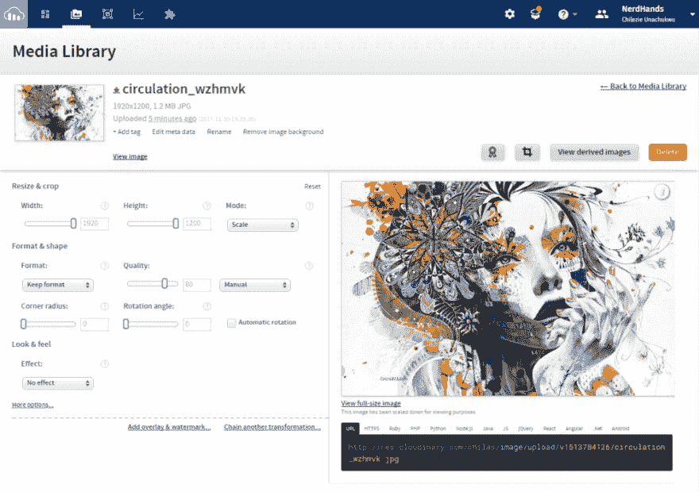

# 使用 Cloudinary 为电子邮件活动嵌入和优化图像

> 原文：<https://dev.to/iamchilas/embedding-and-optimizing-images-for-email-campaigns-with-cloudinary-2o0j>

虽然电子邮件活动不是最新或最闪亮的营销策略，但它们仍然被认为是一种值得信赖的电子营销方法，用于与产品的现有和潜在客户(或用户)进行沟通。因此，正确地计划和管理你的活动是很重要的。

虽然营销团队意识到了这一点，但有一点经常被忽视，那就是形象。电子邮件活动中使用的图像通常非常大，这导致电子邮件加载非常慢，或者在网络覆盖较差的地区，根本无法加载。

在本帖中，我们将向您展示如何使用 [Cloudinary 的图像优化](http://cloudinary.com/documentation/image_optimization)功能为您的电子邮件活动调整图像。Cloudinary 提供的每一种图像处理、优化和转换也可以应用于作为电子邮件的一部分发送出去的图像。所以，无论你想缩放你的图片，缩小尺寸，添加一些文字等等。Cloudinary 会保护你的。很棒吧？

优化图像基本上是通过调整大小、转换格式或改变质量来缩小图像的大小。有了这些知识，现在让我们看看如何实现这一点。

### 调整图像质量

首先，让我们看看改变我们的图像质量是多么容易。您可能有一个创意团队，为您提供用于宣传活动的图片。大多数时候，这些图像的质量非常高。虽然拥有这样高质量的图像可能是一件好事，但你可能真的需要重新考虑。这种图像通常非常大，会导致电子邮件增加几磅重量😜。

所以让我们脱掉这些。

继续操作并[创建一个 Cloudinary 帐户](https://cloudinary.com/users/register/free)，这只需要几分钟的时间。完成后，将测试图像上传到媒体库。您可以通过点击媒体库上的图像轻松获得您的图像 URL。点击图像还会显示一些操作图像的基本控件。见下面截图。

[T2】](https://res.cloudinary.com/practicaldev/image/fetch/s--ieFssZL5--/c_limit%2Cf_auto%2Cfl_progressive%2Cq_auto%2Cw_880/https://res.cloudinary.com/chilas/image/upload/q_10/w_1000/v1513784491/cloudinary_media_library_snapshot.png)

现在我们在平台上有了高质量的图像，我们如何请求一个低质量的图像呢？只需在 URL 中添加 q_[quality]即可。因此，以下面的图片为例，它的 URL 为`https://res.cloudinary.com/chilas/image/upload/v1513784126/circulation_wzhmvk.jpg`，大小为 1.2MB，如果我们想将质量设置为 40，它将变成`https://res.cloudinary.com/chilas/image/upload/q_40/v1513784126/circulation_wzhmvk.jpg`。这也将文件大小减少到 389KB。

[T2】](https://res.cloudinary.com/practicaldev/image/fetch/s--n-XmETOx--/c_limit%2Cf_auto%2Cfl_progressive%2Cq_auto%2Cw_880/https://res.cloudinary.com/chilas/image/upload/q_40/v1513784126/circulation_wzhmvk.jpg)

质量范围从 10 到 100，但是当然，您总是可以通过指定 q_auto 让 Cloudinary 自动处理它。我建议，虽然电子邮件活动，最好找到自己的甜蜜点，并使用。

### 调整图像大小

现在让我指出，我的图像尺寸是 1920 x 1200。这是全高清分辨率。但是当大多数用户可能使用移动设备时，我们不需要我们的图像那么大。

调整图像的大小并不需要我们回到创造性的设计，而是给生成的 URL 添加一个简单的宽度参数。

比方说，我们希望我们的图像调整到 500 像素的宽度，我们只需将 *w_500* 添加到 URL。因此它应该是这样的:
`https://res.cloudinary.com/chilas/image/upload/q_40/w_500/v1513784126/circulation_wzhmvk.jpg`

[T2】](https://res.cloudinary.com/practicaldev/image/fetch/s--41g6RUDA--/c_limit%2Cf_auto%2Cfl_progressive%2Cq_auto%2Cw_880/https://res.cloudinary.com/chilas/image/upload/q_40/w_500/v1513784126/circulation_wzhmvk.jpg)

就是这样。现在你有了一个最适合大多数移动设备的图像。

### 使用正确的图像格式

Cloudinary 支持基于浏览器的图像格式，老实说，这非常重要。浏览器通常具有为在其上观看而优化的图像格式，Cloudinary 的智能系统利用了这一点。

要利用这一点，您只需在 URL 中添加 f_auto 参数，它就会以一种针对浏览器优化的格式提供图像。例如，它向 Google Chrome 用户提供图像的 WebP 版本，向 Internet Explorer 9+用户提供图像的 JPEG-XR 版本。如果浏览器不支持这些现代图像格式，则使用默认的优化 JPEG。

```
https://res.cloudinary.com/chilas/image/upload/q_40/w_500/f_auto/v1513784126/circulation_wzhmvk.jpg 
```

[T2】](https://res.cloudinary.com/practicaldev/image/fetch/s--cDVRc_QH--/c_limit%2Cf_auto%2Cfl_progressive%2Cq_auto%2Cw_880/https://res.cloudinary.com/chilas/image/upload/q_40/w_500/f_auto/v1513784126/circulation_wzhmvk.jpg)

### 结论

这篇文章向您展示了如何使用 Cloudinary 的图像优化功能来调整您的图像，以获得更成功的图像。你有什么为你的活动优化图片的技巧？请在评论中告诉我们你的想法！