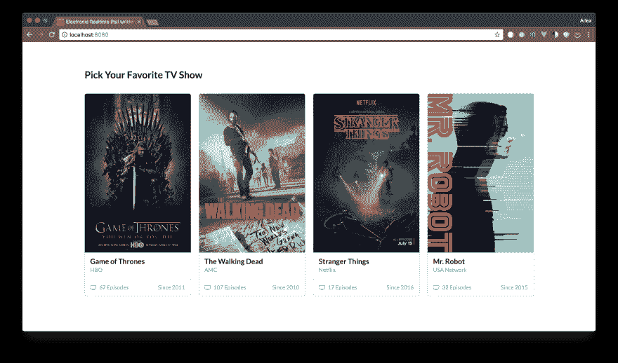
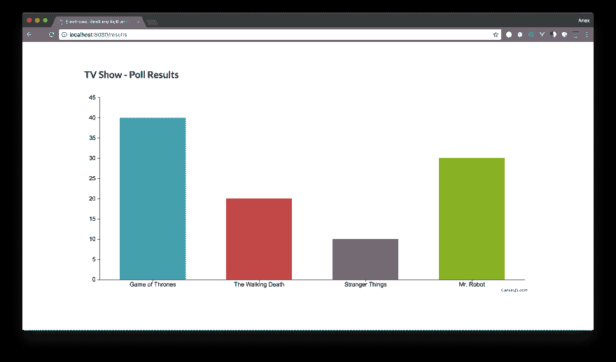
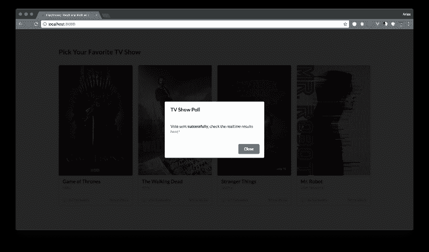

# 用 Go 编写一个简单的电子实时投票

> 原文：<https://dev.to/lexmartinez/writing-a-simple-electronic-realtime-poll-with-go-4ejg>

*原发表于我的[博客](https://redknot.io/articles/writing-realtime-poll-w-go)*

Golang 在街上被称为 Go，自 2009 年发布以来越来越受欢迎，九年后的 Go 已经证明是一种简单但功能强大的编程语言，是蛋糕上的樱桃，非常容易学习。在本帖中，我们将使用 Go 中的服务器端 writen 创建一个实时投票，这是为了学习这种令人敬畏的语言而创建的学术练习的一部分。

最初的项目想法来自于 **Christian Nwamba** 在 *codementor.io* 写的这篇很棒的[文章](https://www.codementor.io/christiannwamba/how-to-build-an-electronic-realtime-poll-in-5-steps-es41iluc9)，基本上在他的帖子中他用 NodeJS 建立了实时投票，老实说，帖子非常喜欢我，鉴于我想尝试一些 Go 的味道，我决定用 Golang 创建我自己的投票版本。

## 第一步

老实说，我以前从来没有用 Go 写过任何东西，所以我的第一步是把它安装到我的电脑上，这很容易，只需要导航到[golang.org](https://golang.org/)网站，下载适合我的操作系统的安装程序，然后使用安装向导来完成这个过程，几分钟后我就把 Go 核心安装到我的电脑上，并准备好编码了。为了测试它，我使用了发表在 **Golang** 网站上的`Hello, Wold!`例子:

```
package main

import "fmt"

func main() {
    fmt.Println("Hello, World")
} 
```

Enter fullscreen mode Exit fullscreen mode

在使用命令`go run hello.go`检查所有工作正常之后，我的下一步是准备我的代码编辑器( *Visual Studio 代码*)来与 Go 一起工作，基本上我在市场上找到了这个伟大的[扩展](https://marketplace.visualstudio.com/items?itemName=lukehoban.Go)，在安装它之后，我准备好了`Go`。

## 我的计划

正如 *Christian Nwamba* 的帖子所说，该项目分为几层，更具体地说是三层，首先是提供视图和接收投票的服务器，其次是为项目提供实时功能的`Pusher`集成，最后是包括投票屏幕和结果屏幕在内的视图，对于这些视图，我们使用几行`JavaScript`、`HTML`和`SemanticUI`来设置样式，在这篇帖子中，我们将讨论前两层。

[T2】](https://res.cloudinary.com/practicaldev/image/fetch/s--pBxlHDlQ--/c_limit%2Cf_auto%2Cfl_progressive%2Cq_auto%2Cw_880/https://raw.githubusercontent.com/lexmartinez/go-realtime-poll/master/screenshots/screenshot-1.png)

## 服务器

如前所述，我们的服务器端负责交付视图和接收投票，因此后端设计有以下端点:

| 方法 | 小路 | 描述 |
| --- | --- | --- |
| `GET` | `/` | 投票屏幕 |
| `POST` | `/` | 投票接待处 |
| `GET` | `/results` | 结果图表屏幕 |

为了实现这些端点并创建我们需要的简单路由，使用了`net/http`，然后我们的主函数看起来像这样

```
func main() {
    http.HandleFunc("/", base)
    http.HandleFunc("/results", results)

    if err := http.ListenAndServe(":8080", nil); err != nil {
        panic(err)
    } else {
        fmt.Println("Polling server running at localhost:8080")
    }
} 
```

Enter fullscreen mode Exit fullscreen mode

在这个代码片段中，我们基本上告诉`Go`我们要分派哪些路由，哪个函数应该处理这些请求，同时在`8080`端口启动服务器。让我们分别看看处理函数:

### 结果处理程序

结果处理器函数非常基本，负责交付结果屏幕，其中有结果图表，图表呈现和`Pusher`侦听器是我们`frontend`功能的一部分，因此在我们的服务器端，我们只需要用`HTML`输出流进行响应，为此，我想使用一个模板引擎实现，如`Pug`，幸运的是，我找到了这个漂亮的包 [`github.com/Joker/jade`](https://github.com/Joker/jade) ，语法几乎与 pug 相同，所以基本上是我们所需要的。

```
func results(w http.ResponseWriter, r *http.Request) {
    dat, err := ioutil.ReadFile("./templates/results.pug")
    if err != nil {
        fmt.Printf("ReadFile error: %v", err)
        return
    }

    tmpl, err := jade.Parse("results", string(dat))
    if err != nil {
        fmt.Printf("Parse error: %v", err)
        return
    }

    keys := Keys{
        Key:   os.Getenv("APP_KEY"),
        Cluster: os.Getenv("APP_CLUSTER"),
    }

    goTpl, err := template.New("html").Parse(tmpl)
    if err != nil {
        fmt.Printf("\nTemplate parse error: %v", err)
        return
    }
    err = goTpl.Execute(w, keys)
    if err != nil {
        fmt.Printf("\nExecute error: %v", err)
        return
    }
} 
```

Enter fullscreen mode Exit fullscreen mode

一些脚注，我们用`io/ioutil`包读取我们的外部模板文件，同样作为参数我们正在注入一些环境变量到`Pusher`客户端连接，这些环境变量是用 [`github.com/alexsasharegan/dotenv`](https://github.com/alexsasharegan/dotenv) 包从外部`.env`加载的。
[](https://res.cloudinary.com/practicaldev/image/fetch/s--dvLtfxtm--/c_limit%2Cf_auto%2Cfl_progressive%2Cq_auto%2Cw_880/https://raw.githubusercontent.com/lexmartinez/go-realtime-poll/master/screenshots/screenshot-3.png)

### 基础处理程序

基础函数将处理根请求，即传递投票屏幕并接收投票(然后将它们发送给`Pusher`)，让我们看看`base`处理程序的实现

```
func base(w http.ResponseWriter, r *http.Request) {
    if r.Method == http.MethodPost {
        vote(w,r)
    } else if r.Method == http.MethodGet {
        home(w,r)
    } else {
        w.WriteHeader(http.StatusBadRequest)
        w.Write([]byte("400 - Unsupported Request Method!"))
    }
} 
```

Enter fullscreen mode Exit fullscreen mode

本质上，在这个函数中，我们基于请求方法将请求路由到两个不同的子处理程序，第一个，`home`基本上与`results`处理程序相同，这里是`vote`处理程序实现

```
func vote (w http.ResponseWriter, r *http.Request) {
    r.ParseForm()
    option := r.Form.Get("option")

    client := pusher.Client{
        AppId: os.Getenv("APP_ID"),
        Key: os.Getenv("APP_KEY"),
        Secret: os.Getenv("APP_SECRET"),
        Cluster: os.Getenv("APP_CLUSTER"),
        Secure: true,
    }

    data := map[string]string{"vote": option}
    client.Trigger("tv-shows", "vote-event", data)

    w.WriteHeader(http.StatusOK)
    w.Header().Set("Content-Type", "application/json")
    w.Write([]byte("Success vote for: " + option))
} 
```

Enter fullscreen mode Exit fullscreen mode

在这个代码片段中，我们接收请求数据并获得`option`字段，也就是我们的投票，然后使用 pusher API 包 [`github.com/pusher/pusher-http-go`](https://github.com/pusher/pusher-http-go) 通过`Pusher`发送它。

> Pusher 是一个很棒的实时通知 API，它使用 websockets，如果你想使用它并进行配置，你必须注册(有一个免费模式)并配置你的应用程序，有关应用程序设置的更多信息，请参见 [Pusher 文档](https://pusher.com/docs)

[T2】](https://res.cloudinary.com/practicaldev/image/fetch/s--TJqHaui1--/c_limit%2Cf_auto%2Cfl_progressive%2Cq_auto%2Cw_880/https://raw.githubusercontent.com/lexmartinez/go-realtime-poll/master/screenshots/screenshot-2.png)

就是这样！我们的投票服务器是活的！

> *   The complete source code of this exercise can be found in this [**GitHub Repo**](https://github.com/lexmartinez/go-realtime-poll)
> *   Find it on. Thanks for reading! Welcome comments, suggestions and [DMS](https://twitter.com/lex0316) !