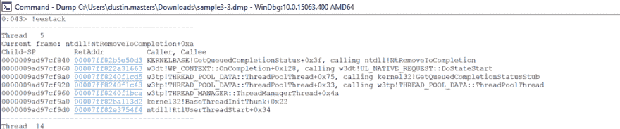
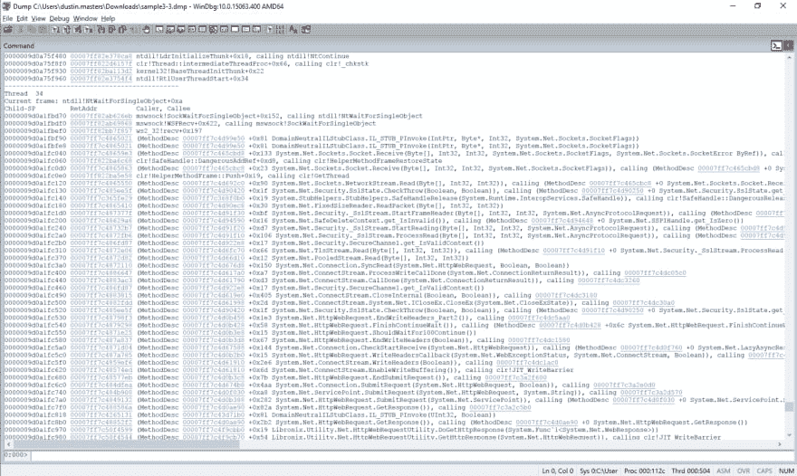
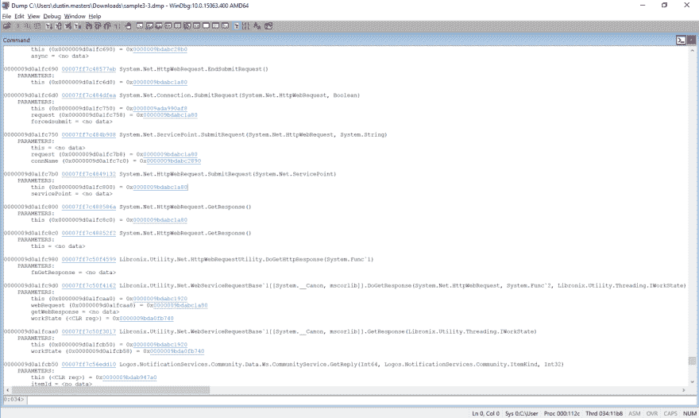
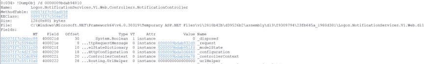
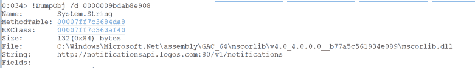
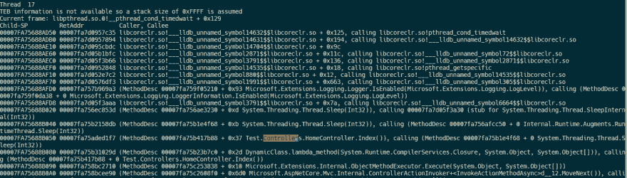
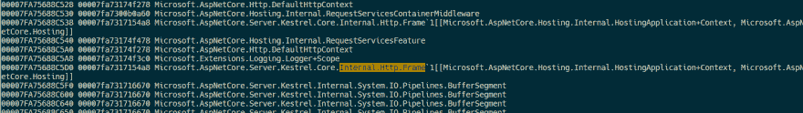
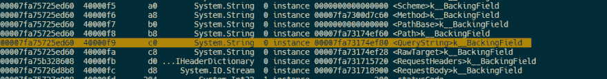
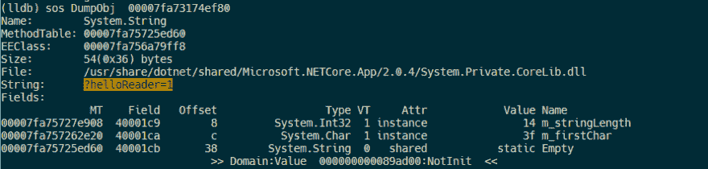

# 使用 SOS 调试工具检查应用程序状态

> 原文：<https://dev.to/dustinsoftware/inspecting-application-state-with-the-sos-debugging-tools-i3a>

这篇文章最初发表在 [Faithlife 上。代码](https://faithlife.codes/blog/2018/01/using-sos/)。

在这篇文章中，我们将介绍如何使用 SOS 调试工具来检查. NET Framework /进程转储中的变量。NET 核心应用程序。

必需的:

*   [过程转储](https://docs.microsoft.com/en-us/sysinternals/downloads/procdump)
*   【Windows 调试工具

### 获取内存转储

在第一个例子中，我们将使用一个运行在 IIS 上的 ASP.NET MVC 5 应用程序，但是这里的步骤可以用在普通的。NET framework Windows 应用程序。让我们从一个正在运行的应用程序的完整内存转储开始。

下载 [ProcDump](https://docs.microsoft.com/en-us/sysinternals/downloads/procdump) ，并将其复制到运行您想要调试的应用程序的服务器上。使用任务管理器从您想要分析的应用程序中获取进程 ID，然后将其作为参数传递给`procdump`。

```
procdump -ma <pid> 
```

Enter fullscreen mode Exit fullscreen mode

您现在应该在工作目录中有一个名为类似于`w3wp_171229_151050.dmp`的转储。

> 注意:
> 
> 如果您在 IIS 中的单个应用程序池下运行多个应用程序，通过将应用程序更改为在它自己的应用程序池下运行可能会更容易调试，这允许 ASP.NET 应用程序在专用进程下运行。

### 检查 ASP.NET 应用状态(。NET 框架)

现在我们有了内存转储，是时候查看应用程序的挂起状态了。将转储文件复制到您的工作站，然后通过 WinDBG 中的`File > Open Crash Dump`打开它。您的屏幕应该是这样的:

[T2】](https://res.cloudinary.com/practicaldev/image/fetch/s--LWKe7llj--/c_limit%2Cf_auto%2Cfl_progressive%2Cq_auto%2Cw_880/https://files.logoscdn.com/v1/files/9282765/content.png%3Fsignature%3DOutnTBW6SL3XDlxpFWtUZ2RUzfc)

加载 SOS 调试扩展，这将允许我们检查托管线程:

```
!loadby sos clr 
```

Enter fullscreen mode Exit fullscreen mode

然后，列出每个线程的堆栈跟踪:

```
!eestack 
```

Enter fullscreen mode Exit fullscreen mode

> 注意:
> 
> 如果运行此命令时出现异常，并且您使用的是 IIS Express，请重试该命令。似乎有一个 bug 只在 WinDbg 的第一个命令运行时抛出异常，这应该不会影响您的调试会话的其余部分。

[T2】](https://res.cloudinary.com/practicaldev/image/fetch/s--pqihxRtd--/c_limit%2Cf_auto%2Cfl_progressive%2Cq_auto%2Cw_880/https://files.logoscdn.com/v1/files/9282876/content.png%3Fsignature%3DP1C00NAOb2CSQf4qm0Qg37XH3ls)

您应该会在输出中看到很多线程。要缩小结果范围，请在输出文本中搜索项目的名称空间。

[T2】](https://res.cloudinary.com/practicaldev/image/fetch/s--VRfpCxAk--/c_limit%2Cf_auto%2Cfl_progressive%2Cq_auto%2Cw_880/https://files.logoscdn.com/v1/files/9282925/content.png%3Fsignature%3DsEIcoMZ_m8UjW8JMkJKq5bAkuD0)

我们可以看到在线程 34 中有一个外部 web 请求。让我们看看请求的是什么外部 URL。切换到线程，然后运行`clrstack -p`以获得关于每个方法调用的更多详细信息。

```
~34 s
!clrstack -p 
```

Enter fullscreen mode Exit fullscreen mode

[T2】](https://res.cloudinary.com/practicaldev/image/fetch/s--wFJYt5xT--/c_limit%2Cf_auto%2Cfl_progressive%2Cq_auto%2Cw_880/https://files.logoscdn.com/v1/files/9282962/content.png%3Fsignature%3Da-iJjR35uoEII6z6HF9A8CrY-As)

> 注意:
> 
> 您可能会看到许多包含值`<no data>`的参数。这可能是由编译器优化导致的；检查这些参数的状态超出了本文的范围。

控制器出现在这个调用堆栈中，所以让我们通过点击`this`实例地址来检查对象实例，这是`!DumpObj`命令的快捷方式。

[T2】](https://res.cloudinary.com/practicaldev/image/fetch/s--DLqoWK0j--/c_limit%2Cf_auto%2Cfl_progressive%2Cq_auto%2Cw_880/https://files.logoscdn.com/v1/files/9283010/content.png%3Fsignature%3DncBPHOf0p0B2gOBoHMkOF1WVCdU)

该实例包含一个名为`_request`的字段，该字段包含一个名为`requestUri`的字段，该字段具有该请求的原始 URI:

[T2】](https://res.cloudinary.com/practicaldev/image/fetch/s--7bQ9KjGb--/c_limit%2Cf_auto%2Cfl_progressive%2Cq_auto%2Cw_880/https://files.logoscdn.com/v1/files/9283018/content.png%3Fsignature%3DGqnF5Ecb6yNF9VOBWnH08UjeT8g)

就是这样！对于转储不同的字段类型，命令略有不同。

* * *

### [T1。Linux 上的 NET 核心应用程序](#net-core-application-on-linux)

必需的:

*   LLDB 3.9
*   CoreCLR repo 中 SOS 插件的本地构建副本- [指令](https://github.com/dotnet/coreclr/blob/e432923a0cc31e1c34f94c5a2e9b75570ecf9d9a/Documentation/building/linux-instructions.md)

在下一个场景中，我们将从运行在 Ubuntu x64 实例上的. NET 核心应用程序中检查核心转储。该实例将在处理请求时进行核心转储，我们将对此进行检查。

使用`createdump`实用程序对进程进行核心转储。这些命令假设您已经将 coreclr repo 签出到`~/git/coreclr`，并且您正在运行一个用。网芯 2.0。

```
sudo ~/git/coreclr/bin/Product/Linux.x64.Debug/createdump -u (pid) 
```

Enter fullscreen mode Exit fullscreen mode

在 LLDB 中加载转储。该命令还会加载 SOS 调试扩展。

```
lldb-3.9 dotnet -c /tmp/coredump.18842 -o "plugin load ~/git/coreclr/bin/Product/Linux.x64.Debug/libsosplugin.so" 
```

Enter fullscreen mode Exit fullscreen mode

几分钟后，CLI 将变为可用。运行`eestack`转储所有 CLR 线程的状态。如果您得到一个空的输出或者一个分段错误，请验证您正在运行正确版本的`lldb`，并且正在从 bin 目录加载`libsosplugin`，并且您已经使用`createdump`创建了核心转储。

```
eestack 
```

Enter fullscreen mode Exit fullscreen mode

[T2】](https://res.cloudinary.com/practicaldev/image/fetch/s--DVliqqn9--/c_limit%2Cf_auto%2Cfl_progressive%2Cq_auto%2Cw_880/https://files.logoscdn.com/v1/files/9344627/content.png%3Fsignature%3D8MbFKjB-x-o5H7aI6yf8JKSj7U4)

在线程 17 的堆栈中有一个`HomeController`的实例。切换到它以显示关于当前请求的更多信息。这一次，我们将检查一个内部。NET 核心请求框架，因为关于当前请求的信息不像在 ASP.NET MVC 5 中那样容易访问。

```
thread select 17
sos DumpStackObjects 
```

Enter fullscreen mode Exit fullscreen mode

在输出中寻找`Microsoft.AspNetCore.Server.Kestrel.Core.Internal.Http.Frame'1[[Microsoft.AspNetCore.Hosting.Internal.HostingApplication+Context, Microsoft.AspNetCore.Hosting]]`的地址，然后转储对象。根据您运行的框架版本，该类的名称可能略有不同。

[T2】](https://res.cloudinary.com/practicaldev/image/fetch/s--ILgf-ila--/c_limit%2Cf_auto%2Cfl_progressive%2Cq_auto%2Cw_880/https://files.logoscdn.com/v1/files/9344645/content.png%3Fsignature%3DFvWisjSHfow2R8CetEVQF-BSTss)

识别`QueryString`字段地址:

[T2】](https://res.cloudinary.com/practicaldev/image/fetch/s--Sza0tIAJ--/c_limit%2Cf_auto%2Cfl_progressive%2Cq_auto%2Cw_880/https://files.logoscdn.com/v1/files/9344656/content.png%3Fsignature%3DtSUH7-hjtnIhxElgR2JYdsKx6Ng)

转储该字段会显示浏览器请求的 URL 的查询部分！

[T2】](https://res.cloudinary.com/practicaldev/image/fetch/s--hhBWPgqj--/c_limit%2Cf_auto%2Cfl_progressive%2Cq_auto%2Cw_880/https://files.logoscdn.com/v1/files/9344665/content.png%3Fsignature%3D6oo1knWMliccP1fnUFtQblQQwjk)

* * *

感谢 Kyle Sletten、Justin Brooks 和 Bradley Grainger 审阅了本文的初稿。

延伸阅读:

*   [SOS.dll(SOS 调试扩展)](https://docs.microsoft.com/en-us/dotnet/framework/tools/sos-dll-sos-debugging-extension)
*   [。NET Core 调试指令](https://github.com/dotnet/coreclr/blob/e432923a0cc31e1c34f94c5a2e9b75570ecf9d9a/Documentation/building/debugging-instructions.md)
*   [在 OS X 建造 core clr](https://github.com/dotnet/coreclr/blob/e432923a0cc31e1c34f94c5a2e9b75570ecf9d9a/Documentation/building/osx-instructions.md)
*   [构建 LLDB](https://github.com/dotnet/coreclr/blob/e432923a0cc31e1c34f94c5a2e9b75570ecf9d9a/Documentation/building/buildinglldb.md)——调试需要。OS X 的网络核心
*   [。NET Core 小型转储格式](https://github.com/dotnet/coreclr/blob/38ec680aa59010221bfc15afa23af73764fd0406/Documentation/botr/xplat-minidump-generation.md)