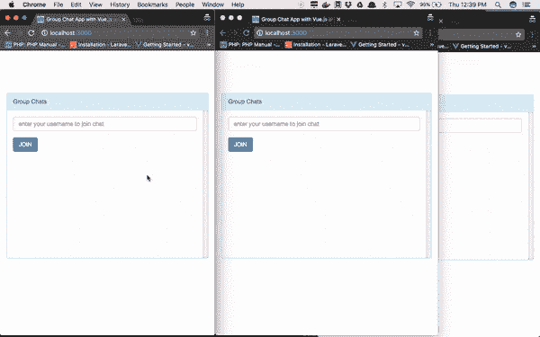
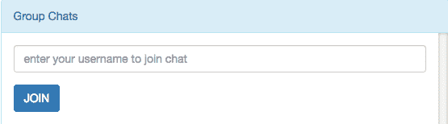
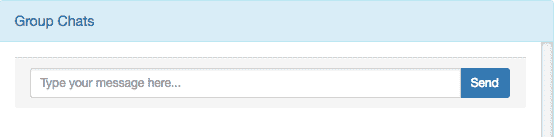

# 用 JavaScript 和 Pusher 构建一个群聊应用

> 原文：<https://dev.to/mezie/build-a-group-chat-app-in-javascript-and-pusher-441a>

通过 WhatsApp、Facebook Messenger 等群聊应用程序与朋友和同事进行群聊的能力改善了朋友和同事之间的互动，他们可以在任何地方聊天，并且仍然有身临其境的感觉。

在本教程中，我们将使用 JavaScript 和 Pusher 构建一个群聊应用程序。尽管这款应用很简单，但它将具备典型群聊应用的一些功能，比如群里的用户数量、新用户加入群里时的通知，以及实时向群里的所有用户显示聊天信息。我们将使用 Node.js (Express)作为应用服务器，Vue.js 在前端，Pusher 用于我们的服务器和前端之间的实时通信。

本教程假设您的计算机上已经安装了 Node.js 和 NPM。

让我们快速浏览一下我们将要构建的内容:

[T2】](https://res.cloudinary.com/practicaldev/image/fetch/s--rnu2zm_8--/c_limit%2Cf_auto%2Cfl_progressive%2Cq_66%2Cw_880/https://blog.pusher.com/wp-content/uploads/2017/04/how-to-build-a-group-chat-app-in-javascript-and-pusher_demo.gif)

完整的源代码可以在 [Github](https://github.com/ammezie/pusher-group-chat) 上找到以供参考。

我们开始吧！

## 创建推送应用程序

如果您还没有，请在此创建一个免费的 Pusher 帐户[，然后登录您的仪表盘并创建一个应用程序。请记下你的应用凭据，因为我们很快就会用到它们。您可以在“概述”选项卡的“密钥”部分找到您的应用凭据。](https://pusher.com/signup)

## 创建 Node.js 服务器

创建了 Pusher 应用程序并获得了应用程序凭证后，我们可以继续创建 Node.js 服务器了。如上所述，我们将使用 Express 作为 Node.js 框架。使用以下命令初始化新的 Node.js 项目:

```
mkdir pusher-group-chat
cd pusher-group-chat
npm init -y 
```

接下来，我们将安装 Express、Pusher 的 Node.js 包和我们的应用程序将需要的一些其他依赖项:

```
npm install express body-parser express-session dotenv pusher --save 
```

你会注意到我们安装了`dotenv`包，它允许我们从`.env`文件的环境变量中提取细节。

本教程的其余部分假设您已经`cd`到了`pusher-group-chat`目录，因为后续命令将从该目录中运行。

现在让我们开始充实服务器，运行命令创建一个新的文件名`server.js`:

```
touch server.js 
```

打开新创建的文件，将下面的代码粘贴到其中:

```
// server.js
require('dotenv').config();
const express    = require('express');
const path       = require('path');
const bodyParser = require('body-parser');
const session    = require('express-session');
const Pusher     = require('pusher');

const app = express();

// Session middleware
app.use(session({
    secret: 'somesuperdupersecret',
    resave: true,
    saveUninitialized: true
}))

// Body parser middleware
app.use(bodyParser.json());
app.use(bodyParser.urlencoded({ extended: false }));

// Serving static files
app.use(express.static(path.join(__dirname, 'public')));

// Create an instance of Pusher
const pusher = new Pusher({
    appId:     process.env.PUSHER_APP_ID,
    key:       process.env.PUSHER_APP_KEY,
    secret:    process.env.PUSHER_APP_SECRET,
    cluster:   process.env.PUSHER_APP_CLUSTER,
    encrypted: true
});

app.listen(3000, () => {
    console.log('Server is up on 3000')
}); 
```

首先，我们创建一个基本的 Express 服务器，并启用服务器将使用的一些中间件。中间件将允许我们在会话中保存用户的详细信息以备后用。中间件将允许我们获取表单数据。然后我们提供来自`public`目录的静态文件。

接下来，我们创建 Pusher 的一个实例。如您所见，我们正在从一个`.env`(我们还没有创建)文件的环境变量中加载我们的 Pusher 应用凭证。最后，我们在端口`3000`上启动服务器。

在我们移动到服务器的另一部分之前，让我们创建上面谈到的`.env`文件:

```
touch .env 
```

并将下面几行粘贴进去:

```
// .env
PUSHER_APP_ID=xxxxxx
PUSHER_APP_KEY=xxxxxxxxxxxxxxxxxxxx
PUSHER_APP_SECRET=xxxxxxxxxxxxxxxxxxxx
PUSHER_APP_CLUSTER=xxxx 
```

记得用你的 Pusher 应用凭证替换 xs。

## 添加路线

现在让我们添加我们的服务器将需要的必要路线。打开`server.js`，在我们创建 Pusher 实例的地方添加以下代码:

```
// server.js

...

app.get('/', (req, res) => {
    res.sendFile('index.html');
});

app.post('/join-chat', (req, res) => {
    // store username in session
    req.session.username = req.body.username;
    res.json('Joined');
});

app.post('/pusher/auth', (req, res) => {
    const socketId = req.body.socket_id;
    const channel = req.body.channel_name;
    // Retrieve username from session and use as presence channel user_id
    const presenceData = {
        user_id: req.session.username
    };
    const auth = pusher.authenticate(socketId, channel, presenceData);
    res.send(auth);
});

app.post('/send-message', (req, res) => {
    pusher.trigger('presence-groupChat', 'message_sent', {
        username: req.body.username,
        message:  req.body.message
    });
    res.send('Message sent');
});

... 
```

在上面的代码片段中，第一条路线将呈现`index.html`，当我们到达`/`端点时，这是我们应用程序的主要入口点。接下来，我们定义了`/join-chat`端点，当用户填写输入字段以加入聊天时，将调用该端点。我们获取用户输入的用户名，并将其保存在会话中。因为我们将为我们的群聊应用程序使用一个在线通道，所以我们需要实现一个 auth API 来验证服务器端的用户请求。因此，当用户订阅我们的聊天时，会自动调用`/pusher/auth`端点。我们将从会话中检索到的用户名传递给 Pusher 的`authenticate`方法，这样当用户订阅了通道时，它就可以在客户端使用了。最后，我们创建了一个`/send-message`路由，它使用 Pusher 向通道`presence-groupChat`广播一个`message_sent`事件。通常，在`/send-message`路径中，您将把消息持久化到数据库中，但是出于本教程的目的并且为了简单起见，我们不会把消息持久化到数据库中。

这些都在服务器端。

## 设置聊天应用前端

让我们继续构建我们的应用程序前端。我们谈到了`index.html`，它将是我们应用程序的主要入口点，还记得我们设置了服务器来呈现来自`public`目录中的静态文件。现在我们将创建目录和文件。

```
mkdir public
cd public
touch index.html 
```

并将以下代码粘贴到其中:

```
<!-- public/index.html -->

<!DOCTYPE html>
<html lang="en">
  <head>
    <meta charset="utf-8">
    Group Chat App with Vue.js and Pusher
    <link rel="stylesheet" href="//netdna.bootstrapcdn.com/bootstrap/3.3.4/css/bootstrap.min.css">
    <style>
      body {
        padding-top: 100px;
      }
      .chat {
            list-style: none;
            margin: 0;
            padding: 0;
        }
        .chat li {
            margin-bottom: 10px;
            padding-bottom: 5px;
            border-bottom: 1px dotted #B3A9A9;
        }
        .chat li .chat-body p {
            margin: 0;
            color: #777777;
        }
        .panel-body {
            overflow-y: scroll;
            height: 350px;
        }
        ::-webkit-scrollbar-track {
            -webkit-box-shadow: inset 0 0 6px rgba(0,0,0,0.3);
            background-color: #F5F5F5;
        }
        ::-webkit-scrollbar {
            width: 12px;
            background-color: #F5F5F5;
        }
        ::-webkit-scrollbar-thumb {
            -webkit-box-shadow: inset 0 0 6px rgba(0,0,0,.3);
            background-color: #555;
        }
    </style>
  </head>
  <body>
    <div class="container" id="app">
      <div class="row">
        <div class="col-md-6 col-md-offset-3">
          <div class="panel panel-info">
          </div>
        </div>
      </div>
    </div>
    <script src="https://unpkg.com/axios/dist/axios.min.js"></script>
    <script src="https://unpkg.com/vue"></script>
    <script src="//js.pusher.com/4.0/pusher.min.js"></script>
    <script src="./app.js"></script>
  </body>
</html> 
```

基本的自举网页与一些样式。正如在本教程的介绍部分开始的那样，我们将使用 Vue.js。所以我们引入了 Vue、Axios(将用于向我们的服务器发出 AJAX 请求),当然还有 Pusher JavaScript 库。我们还引用我们自己的 JavaScript 文件，该文件将包含我们所有的 Vue.js 特定代码。

现在让我们添加聊天应用程序的主要部分。打开`index.html`，在带有类`panel panel-info`的 div 后立即添加以下代码:

```
<!-- public/index.html -->

<div class="panel-heading">
  Group Chats <span class="badge"></span>
</div>
<div class="panel-body">
  <div v-if="joined">
    <em><span v-text="status"></span></em>
    <ul class="chat">
      <li class="left clearfix" v-for="message in messages">
        <div class="chat-body clearfix">
          <div class="header">
            <strong class="primary-font">

            </strong>
          </div>
          <p>

          </p>
        </div>
      </li>
    </ul>
    <div class="panel-footer">
      <div class="input-group">
        <input id="btn-input" type="text" name="message" class="form-control input-sm" placeholder="Type your message here..." v-model="newMessage" @keyup.enter="sendMessage">
        <span class="input-group-btn">
          <button class="btn btn-primary btn-sm" id="btn-chat" @click="sendMessage">Send</button>
        </span>
      </div>
    </div>
  </div>
  <div v-else>
    <div class="form-group">
      <input type="text" class="form-control" placeholder="enter your username to join chat" v-model="username" @keyup.enter="joinChat">
    </div>
    <button class="btn btn-primary" @click="joinChat">JOIN</button>
  </div>
</div> 
```

我们已经在网页上添加了 Vue.js，所以我们可以开始使用它了。我们在群聊标题旁边显示加入群聊的用户数量。使用 Vue.js 条件渲染，我们将只在用户加入(即输入他/她的用户名)群聊时显示聊天表单，否则将向用户显示一个表单，以输入用户名来加入聊天。当用户在用户名输入字段内点击 JOIN 按钮或按 ENTER 时，将触发`joinChat`方法。我们还将用户名输入字段与`username`数据绑定在一起，这样我们就可以轻松地将用户输入的任何内容传递给 Vue.js。

一旦用户加入了聊天，我们循环(使用`v-for`)消息(如果有的话)并显示它们，然后向用户显示一个输入字段来键入他们的聊天消息。当用户在消息输入域中点击发送按钮或按回车键时，将触发`sendMessage`方法。我们还将消息输入字段与`newMessage`数据绑定在一起，这样我们就可以轻松地将用户输入的内容传递给 Vue.js

当用户没有加入聊天时:

[T2】](https://res.cloudinary.com/practicaldev/image/fetch/s--2V0HnXY8--/c_limit%2Cf_auto%2Cfl_progressive%2Cq_auto%2Cw_880/https://blog.pusher.com/wp-content/uploads/2017/04/how-to-build-a-group-chat-app-in-javascript-and-pusher_join-1.png)

当用户加入聊天时:

[T2】](https://res.cloudinary.com/practicaldev/image/fetch/s--Xa_twNLJ--/c_limit%2Cf_auto%2Cfl_progressive%2Cq_auto%2Cw_880/https://blog.pusher.com/wp-content/uploads/2017/04/how-to-build-a-group-chat-app-in-javascript-and-pusher_chat-1.png)

## 创建 App.js

现在让我们创建包含所有 Vue.js 特定代码的文件。使用下面的命令来实现这一点:

```
cd public
touch app.js 
```

并将以下代码粘贴到其中:

```
// public/app.js

const pusher = new Pusher('xxxxxxxxxxxxxxxxxxxx', {
    cluster: 'APP_CLUSTER',
    encrypted: true,
    authEndpoint: 'pusher/auth'
});
const app = new Vue({
    el: '#app',
    data: {
        joined: false,
        username: '',
        members: '',
        newMessage: '',
        messages: [],
        status: ''
    },
    methods: {
        joinChat() {
            axios.post('join-chat', {username: this.username})
                .then(response => {
                    // User has joined the chat
                    this.joined = true;
                    const channel = pusher.subscribe('presence-groupChat');
                    channel.bind('pusher:subscription_succeeded', (members) => {
                        this.members = channel.members;
                    });
                    // User joins chat
                    channel.bind('pusher:member_added', (member) => {
                        this.status = `${member.id} joined the chat`;
                    });
                    // Listen for chat messages
                    this.listen();
                });
        },
        sendMessage() {
            let message = {
                username: this.username,
                message: this.newMessage
            }
            // Clear input field
            this.newMessage = '';
            axios.post('/send-message', message);
        },
        listen() {
            const channel = pusher.subscribe('presence-groupChat');
            channel.bind('message_sent', (data) => {
                this.messages.push({
                    username: data.username,
                    message: data.message
                });
            });
        }
    }
}); 
```

记得用你的 Pusher 应用密钥替换 xs，并指定你的应用集群。

首先，我们创建一个 Pusher 实例，向它传递我们的应用程序密钥和其他选项。我们传入在 Express 服务器中设置的认证端点`/pusher/auth`。接下来，我们创建 Vue.js 的一个实例，然后我们指定想要挂载 Vue.js 的元素(`#app`)。我们定义了一些将被我们的应用程序使用的数据。默认为`false`的`joined`数据表示用户是否已经加入聊天。`username`将是用户从加入聊天表单中输入的用户名。`members`将保存群聊中的用户数量。`newMessage`将是用户从聊天表单输入的消息。`messages`将保存一组聊天消息。`status`将简单地显示新加入用户的通知。

当用户输入用户名加入聊天时，调用`joinChat`方法，该方法依次向服务器上的`/join-chat`端点发出 HTTP POST 请求，并传递用户名。一旦请求成功，我们将`joined`设置为`true`，并为用户订阅`presence-groupChat`频道。因为我们使用的是一个存在通道，Pusher 为我们提供了额外的功能，比如让成员进入通道。这样，我们可以监听订阅成功的时间，让所有用户订阅该频道，并将其分配给我们的`members`数据。我们还监听新用户何时使用`pusher:member_added`事件加入聊天，并通知其他用户有新用户加入聊天。最后，我们调用一个`listen`方法(我们将很快创建它),它监听新的聊天消息并广播给用户。

`sendMessage`方法非常简单，它向服务器上的`/send-message`端点发出 HTTP POST 请求，传递聊天消息。我们还清除了前一条消息的输入字段，这样用户就可以开始输入新消息，而不必先手动清除输入字段。

最后，我们从`joinChat`方法中调用的`listen`方法将监听从我们的服务器触发的`message_sent`事件，并将新消息添加到消息数组中，最后将其广播给用户。

注意:默认情况下，Pusher 会尝试使用`/pusher/auth`作为`authEndpoint`。如果您的设置与此不同，那么您必须在实例化 Pusher JavaScript 库时指定。

注意:推动器出现通道将带有前缀`presence-`。

测试应用程序

我们已经完成了群聊应用的构建。是时候检验我们的成果了。为了测试该应用程序，我们需要通过执行以下命令来启动我们的 Express 服务器:

```
node server.js 
```

该应用程序现在应该正在运行，可以通过 [http://localhost:3000](http://localhost:3000) 访问。继续并试用该应用程序。您应该会得到与下面的演示类似的东西:

[T2】](https://res.cloudinary.com/practicaldev/image/fetch/s--rnu2zm_8--/c_limit%2Cf_auto%2Cfl_progressive%2Cq_66%2Cw_880/https://blog.pusher.com/wp-content/uploads/2017/04/how-to-build-a-group-chat-app-in-javascript-and-pusher_demo.gif)

## 结论

这就是本教程的内容。在本教程中，我们看到了如何用 JavaScript 和 Pusher 构建一个群聊应用程序。使用 Pusher 的在线频道，我们看到让所有成员订阅一个频道是多么容易。你可以通过 [Pusher's presence](https://pusher.com/docs/client_api_guide/client_presence_channels) 频道做更多令人兴奋的事情，比如建立聊天室、文档协作者、查看同一网页的人、游戏中的竞争者等。
我有没有提到你可以注册一个永久免费的推送账户，包括 100 个连接，无限的频道，20 万条每日消息，SSL 保护，还有比发布/订阅消息更多的功能？是的，你可以。[在这里报名](https://pusher.com/signup)。

这篇文章最初由作者发布在 [Pusher 博客](https://blog.pusher.com/build-group-chat-app-javascript-pusher)上。