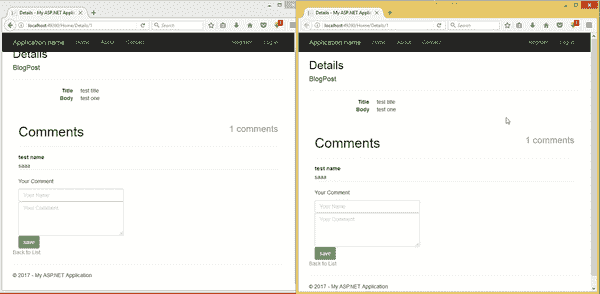

# 使用构建实时评论功能。网和推动器

> 原文:[https://dev . to/samuelayo/build-a-real time-commenting-feature-using-net-and-pusher-2pha](https://dev.to/samuelayo/build-a-realtime-commenting-feature-using-net-and-pusher-2pha)

重新加载页面来查看新的评论既无聊又费力，因为你甚至不知道对你评论的回复来了没有。你一直在重新加载，一直在浪费你的数据。长话短说，用户可能会放弃那些必须重新加载页面才能看到新评论的网站。

今天，我们将使用构建一个具有实时评论功能的微型博客引擎。网和推动器。

为了完成本教程，我们将使用 MSSQL 作为我们的数据库引擎。请确保它已启动并正在运行。

[T2】](https://res.cloudinary.com/practicaldev/image/fetch/s--XA_R6M_x--/c_limit%2Cf_auto%2Cfl_progressive%2Cq_66%2Cw_880/https://blog.pusher.com/wp-content/uploads/2017/11/build-a-realtime-commenting-feature-using-net-and-pusher.gif)

要学习本教程，请确保您熟悉以下基础知识:

## 设置推手账号和 app

[Pusher](https://pusher.com/) 是一种托管服务，可以非常容易地将实时数据和功能添加到 web 和移动应用程序中。

Pusher 充当服务器和客户端之间的实时层。Pusher 保持与客户端的持久连接——如果可能的话，通过 Web-socket，并退回到基于 HTTP 的连接——这样，一旦您的服务器有了新数据，它们就可以通过 Pusher 将数据推送到客户端。

如果你还没有，去 Pusher 创建一个免费账户。

我们将在仪表板上注册一个新的应用程序。唯一必须的选项是应用程序名称和集群。一个集群代表 Pusher 服务器的物理位置，它将处理您的应用程序的请求。此外，从应用程序密钥部分复制出你的应用程序 ID、密钥和密码，因为我们稍后会用到它们。

这篇文章最初由作者发表在 Pusher 的博客[这里](https://blog.pusher.com/build-a-realtime-commenting-feature-using-net-and-pusher/)

## 在 Visual Studio 中设置 Asp.Net 项目

我们需要做的下一件事是创建一个新的`Asp.Net MVC application`。

为此，让我们:

*   打开`Visual Studio`并从工具条中选择`New Project`
*   在模板下，选择`Visual C#`
*   接下来，选择`Web`
*   在中间部分，选择`ASP.NET Web Application`。
*   对于本教程，我将项目命名为:`Real-Time-Commenting`。
*   现在我们差不多准备好了。下一步将是使用`NuGet Package`为`ASP.NET`安装官方的`Pusher`库。

为此，我们转到顶栏上的工具，单击`NuGet Package Manager`，在下拉菜单中选择`Package Manager Console`。

我们将在 Visual Studio 的底部看到`Package Manager Console`。接下来，让我们通过运行以下命令来安装该软件包:

```
Install-Package PusherServer 
```

## 精心制作我们的应用程序

现在我们的环境已经设置好了，让我们开始编写代码。

默认情况下，Visual Studio 为我们创建了三个控制器。然而，我们将为应用程序逻辑使用 HomeController。

我们要做的第一件事是定义一个模型来存储数据库中的文章列表。我们姑且称这个模型为`BlogPost`。因此，让我们在 models 文件夹中创建一个名为`BlogPost.cs`的文件，并添加:

```
 using System;
    using System.Collections.Generic;
    using System.ComponentModel.DataAnnotations.Schema;
    using System.Linq;
    using System.Web;

    namespace Real_Time_Commenting.Models
    {
        public class BlogPost
        {
            public int BlogPostID { get; set; }

            public string Title { get; set; }

            [Column(TypeName = "ntext")]
            public string Body { get; set; }
        }
    } 
```

在这个代码块中，我们定义了保存博客文章的模型。我们在此定义的属性包括:

*   文章的 id，称为`BlogPostID`(通常是主键)
*   我们帖子的标题，叫做`Title`(定义为一个字符串)
*   我们将创建的文章的正文。定义为字符串

接下来，让我们创建一个名为`Comment`的模型，我们之前已经提到过。让我们在 models 文件夹中创建一个名为`Comment.cs`的文件，并添加:

```
 using System;
    using System.Collections.Generic;
    using System.ComponentModel.DataAnnotations.Schema;
    using System.Linq;
    using System.Web;

    namespace Real_Time_Commenting.Models
    {
        public class Comment
        {
            public int CommentID { get; set; }

            public string Name { get; set; }

            [Column(TypeName = "ntext")]
            public string Body { get; set; }

            public int BlogPostID { get; set; }
        }
    } 
```

查看上面的代码，我们注意到我们已经声明了以下属性:

*   我们的注释的 ID 叫做`CommentID`(通常是主键)
*   评论者的姓名。
*   注释的正文。
*   我们正在评论的帖子的 ID。

现在我们已经定义了我们的模型，让我们在默认的数据库上下文中引用它。为此，让我们打开`models\IdentityModels.cs`文件，然后找到名为`ApplicationDbContext`的类，并在创建函数后添加以下内容:

```
 public DbSet<BlogPost> BlogPost { get; set; }
    public DbSet<Comment> Comment { get; set; } 
```

在上面的代码块中，`DbSet`类表示用于读取、更新和删除操作的实体集。
T5 这里，我们定义了两个实体，我们的`BlogPost`和`Comment`模型。我们现在可以从`ApplicationDbContext`的实例中访问它们。

## 连接到我们的数据库

尽管我们的模型已经建立，我们仍然需要将一个数据库附加到我们的应用程序。为此，选择 Visual Studio 左侧的服务器资源管理器，右键单击数据连接并添加一个数据库。

有各种轻量级的数据库，可以适合我们正在构建的应用程序，例如:

*   Microsoft access 数据库
*   Sqlite 数据库
*   ms sql server

对于本教程，我使用 MSSQL 服务器。

## 创建我们的控制器

现在我们的模型和数据库都设置好了，让我们继续创建我们的索引路径。打开`HomeController`并替换为:

```
 using PusherServer;
    using Real_Time_Commenting.Models;
    using System;
    using System.Collections.Generic;
    using System.Linq;
    using System.Threading.Tasks;
    using System.Web;
    using System.Web.Mvc;

    namespace Real_Time_Commenting.Controllers
    {
        public class HomeController : Controller
        {
            ApplicationDbContext db = new ApplicationDbContext();
            public ActionResult Index()
            {
                return View(db.BlogPost.AsQueryable());
            }

            public ActionResult Create()
            {
                return View();
            }

            [HttpPost]
            public ActionResult Create(BlogPost post)
            {
                db.BlogPost.Add(post);
                db.SaveChanges();
                return RedirectToAction("Index");
            }

            public ActionResult Details(int? id)
            {
                return View(db.BlogPost.Find(id));
            }

            public ActionResult Comments(int? id)
            {
                var comments = db.Comment.Where(x => x.BlogPostID == id).ToArray();
                return Json(comments, JsonRequestBehavior.AllowGet);
            }

            [HttpPost]
            public async Task<ActionResult> Comment(Comment data)
            {
                db.Comment.Add(data);
                db.SaveChanges();
                var options = new PusherOptions();
                options.Cluster = "XXX_APP_CLUSTER";
                var pusher = new Pusher("XXX_APP_ID", "XXX_APP_KEY", "XXX_APP_SECRET", options);
                ITriggerResult result = await pusher.TriggerAsync("asp_channel", "asp_event", data);
                return Content("ok");
            }
        }
    } 
```

在上面的代码块中，我们定义了六个不同的函数:

*   `Index`函数，它显示了我们所有博客文章的快速列表。
*   `Create`函数，为`GET`和`POST`请求处理新 BlogPosts 的添加。
*   `Details`函数，返回我们文章的完整视图。
*   `Comments`函数，返回一篇特定文章的所有评论的 JSON 数据。
*   `Comment`函数，处理新注释的添加，并将数据发送给 Pusher。

在查看我们的控制器函数之前，我们注意到有一行代码将我们的 DB 上下文导入到我们的类中:

```
ApplicationDbContext db = new ApplicationDbContext(); 
```

这使得访问我们在`ApplicationDbContext`类中定义的数据库模型成为可能。

在`Index`函数中，我们返回我们的视图，传入我们数据库中所有帖子的列表，这将被循环。

接下来，在处理我们的`GET`请求的`Create`函数中，我们简单地返回创建新帖子的视图。

我们转到处理我们的`POST`请求的`Create`函数，该函数接收一个名为`post`的`BlogPost`类型的参数。在这个函数中，我们将一个新的`post`添加到数据库中，之后我们返回一个对`Index`函数的重定向。

在我们的`Details`函数中，我们将一个特定的`post`的实例返回给我们的视图，该视图将被显示。该视图还将显示允许我们添加评论的表单。

在我们的`Comments`函数中，我们返回属于特定`post`的所有`comments`，其 ID 作为 JSON 提供。这个方法将通过 AJAX POST 调用。

最后，我们的`Comment`函数处理将评论添加到数据库，并将数据发送到 Pusher。我们注意到这个函数是一个`async`方法。这是因为 Pusher 库异步发送数据，我们必须等待它的响应。

此外，我们需要将`XXX_APP_CLUSTER`、`XXX_APP_ID`、`XXX_APP_KEY`和`XXX_APP_SECRET`替换为我们之前从 Pusher 获得的应用集群、ID、密钥和秘密。

## 创建我们的视图文件

为了完成我们的应用程序，我们需要 3 个不同的视图文件，我们将在下面讨论。

**索引视图**

让我们将位于`Views\Home\Index.cshtml`的`Index.cshtml`文件中的默认内容替换为:

```
 @model IEnumerable<Real_Time_Commenting.Models.BlogPost>

    @{
        ViewBag.Title = "Index";
    }

    <h2>Index</h2>

    <p>
        @Html.ActionLink("Create New", "Create")
    </p>
    <table class="table">
        <tr>
            <th>
                @Html.DisplayNameFor(model => model.Title)
            </th>
            <th>
                @Html.DisplayNameFor(model => model.Body)
            </th>
            <th></th>
        </tr>

    @foreach (var item in Model) {
        <tr>
            <td>
                @Html.DisplayFor(modelItem => item.Title)
            </td>
            <td>
                @Html.DisplayFor(modelItem => item.Body)
            </td>
            <td>
                @Html.ActionLink("Details", "Details", new { id=item.BlogPostID }) |
            </td>
        </tr>
    }

    </table> 
```

查看上面的 HTML 结构，我们注意到我们已经定义了一个表，该表列出了我们所有的帖子并将它们链接到详细信息页面。

**创建视图**

这里，我们需要在`View\Home`文件夹中创建一个名为`Create.cshtml`的新文件，并将以下内容粘贴到其中:

```
@model Real_Time_Commenting.Models.BlogPost

    @{
        ViewBag.Title = "Create";
    }

    <h2>Create</h2>

    @using (Html.BeginForm()) 
    {
        @Html.AntiForgeryToken()

        <div class="form-horizontal">
            <h4>BlogPost</h4>
            <hr />
            @Html.ValidationSummary(true, "", new { @class = "text-danger" })
            <div class="form-group">
                @Html.LabelFor(model => model.Title, htmlAttributes: new { @class = "control-label col-md-2" })
                <div class="col-md-10">
                    @Html.EditorFor(model => model.Title, new { htmlAttributes = new { @class = "form-control" } })
                    @Html.ValidationMessageFor(model => model.Title, "", new { @class = "text-danger" })
                </div>
            </div>

            <div class="form-group">
                @Html.LabelFor(model => model.Body, htmlAttributes: new { @class = "control-label col-md-2" })
                <div class="col-md-10">
                    @Html.EditorFor(model => model.Body, new { htmlAttributes = new { @class = "form-control" } })
                    @Html.ValidationMessageFor(model => model.Body, "", new { @class = "text-danger" })
                </div>
            </div>

            <div class="form-group">
                <div class="col-md-offset-2 col-md-10">
                    <input type="submit" value="Create" class="btn btn-default" />
                </div>
            </div>
        </div>
    }

    <div>
        @Html.ActionLink("Back to List", "Index")
    </div>

    @section Scripts {
        @Scripts.Render("~/bundles/jqueryval")
    } 
```

在上面的 HTML 结构中，我们有三个主要输入:

*   一个文本输入元素，保存文章的标题。
*   一个文本输入元素，保存文章的内容。
*   一个按钮元素，用于提交新条目。

**详细视图和 Vue 绑定**

这是我们需要的最终视图文件。这个文件还处理 Pusher 事件的绑定，并使用 Pusher 和 Vue 实时更新评论。

让我们在`Views\Home`文件夹中创建一个名为`Details.cshtml`的新文件，并在其中添加以下内容:

```
@model Real_Time_Commenting.Models.BlogPost

    @{
        ViewBag.Title = "Details";
    }

    <script src="https://cdnjs.cloudflare.com/ajax/libs/vue/2.3.4/vue.min.js"></script>
    <script src="https://cdnjs.cloudflare.com/ajax/libs/axios/0.16.2/axios.min.js"></script>
    <script src="//js.pusher.com/4.0/pusher.min.js"></script>
    <style>
        .user_name{
        font-size:14px;
        font-weight: bold;
    }
    .comments-list .media{
        border-bottom: 1px dotted #ccc;
    }
    </style>
    <h2>Details</h2>
    <div id="app">
        <div>
            <h4>BlogPost</h4>
            <hr />
            <dl class="dl-horizontal">
                <dt>
                    @Html.DisplayNameFor(model => model.Title)
                </dt>

                <dd>
                    @Html.DisplayFor(model => model.Title)
                </dd>

                <dt>
                    @Html.DisplayNameFor(model => model.Body)
                </dt>

                <dd>
                    @Html.DisplayFor(model => model.Body)
                </dd>

            </dl>
        </div>
        <div class="container">
            <div class="row">
                <div class="col-md-8">
                    <div class="page-header">
                        <h1><small class="pull-right">{{comments.length}} comments</small> Comments </h1>
                    </div>
                    <div class="comments-list">
                        <div class="media" v-for="com in comments">
                            <div class="media-body">
                                <h4 class="media-heading user_name">{{com.Name}}</h4>
                                {{com.Body}}
                            </div>
                        </div>
                    </div>
                </div>
            </div>
        </div>
        <div class="container">
            <br />
            <p>Your Comment</p>
            <form onsubmit="return false;">
                <input type="text" id="Name" placeholder="Your Name" v-model="comment.Name" class="form-control" />
                <textarea rows="3" placeholder="Your Comment" id="Body" v-model="comment.Body" class="form-control"></textarea>
                <button class="btn btn-success" v-on:click="submit_comment()">save</button>
            </form>
        </div>
    </div>
    <p>

        @Html.ActionLink("Back to List", "Index")
    </p> 
```

在上面的代码块中，我们显示了当前帖子的标题和内容，以及它的评论数量。

我们还创建了由三个主要元素组成的意见表，它们是:

*   评论者姓名的文本输入。
*   注释正文的文本区。
*   按钮将新注释保存到数据库中。

注意，我们使用了 Vue 的`v-for`指令来迭代和显示可用的评论。

另外，请注意，我们已经包括了一些必需的库，例如:

*   axios JavaScript 库
*   Vue js JavaScript 库
*   Pusher JavaScript 库

**推动器绑定和 Vue 片段**

下面是我们的示例 Vue 片段，用于处理评论提交和 Pusher 的实时更新。

```
<script>
    var pusher = new Pusher('XXX_APP_KEY', {
        cluster: 'XXX_APP_CLUSTER'
    });
    var my_channel = pusher.subscribe('asp_channel');
    var app = new Vue({
        el: '#app',
        data: {
            comments: [],
            comment: {
                Name: '',
                Body: '',
                BlogPostID: @Model.BlogPostID
            }
        },
        created: function() {
            this.get_comments();
            this.listen();
        },
        methods: {
            get_comments: function() {
                axios.get('@Url.Action("Comments", "Home", new { id = @Model.BlogPostID }, protocol: Request.Url.Scheme)')
                    .then((response) => {

                        this.comments = response.data;

                    });

            },
            listen: function() {
                my_channel.bind("asp_event", (data) => {
                    if (data.BlogPostID == this.comment.BlogPostID) {
                        this.comments.push(data);
                    }

                })
            },
            submit_comment: function() {
                axios.post('@Url.Action("Comment", "Home", new {}, protocol: Request.Url.Scheme)', this.comment)
                    .then((response) => {
                        this.comment.Name = '';
                        this.comment.Body = '';
                        alert("Comment Submitted");

                    });
            }
        }
    });
    </script> 
```

在上面的代码块中，我们完成了两个主要活动，它们是:

**上传评论代码**

为了处理从客户端到服务器的新评论，遵循以下步骤:

*   我们在提交按钮上附加了一个 Vue 事件监听器`@click`，它触发了一个名为`submit_comment`的方法。
*   我们定义了一个名为`submit_comment`的函数，它使用`axios`向我们的`comment`函数发出 POST 请求。

**从其他客户端订阅服务器上的订阅源添加内容**

在评论被发送到服务器之后，一个请求被发送到 Pusher，以返回一个包含我们已经广播的新数据的事件。要收听这些实时事件，我们需要:

*   在传递我们的应用程序密钥和集群时初始化了 Pusher 对象。
*   订阅了我们的频道`asp_channel`。
*   在我们的 Vue 代码的 listen 方法中，我们声明了一个名为`asp_event`的事件绑定。在这个绑定的回调函数中，我们将新数据推送到我们的注释列表中。

就是这样！现在，一旦有了新的评论，它也会被广播，我们可以使用我们的频道来实时更新评论。

[T2】](https://res.cloudinary.com/practicaldev/image/fetch/s--XA_R6M_x--/c_limit%2Cf_auto%2Cfl_progressive%2Cq_66%2Cw_880/https://blog.pusher.com/wp-content/uploads/2017/11/build-a-realtime-commenting-feature-using-net-and-pusher.gif)

## 结论

在本文中，我们介绍了如何使用？NET 和 Pusher，并在. NET 中创建一个迷你博客引擎。

本教程的代码库可在[公共 Github 库](https://github.com/samuelayo/Net_real_time_commenting_pusher)中获得。可以下载用于教育目的。

有任何保留意见或评论，请在评论中告诉我们您的反馈。