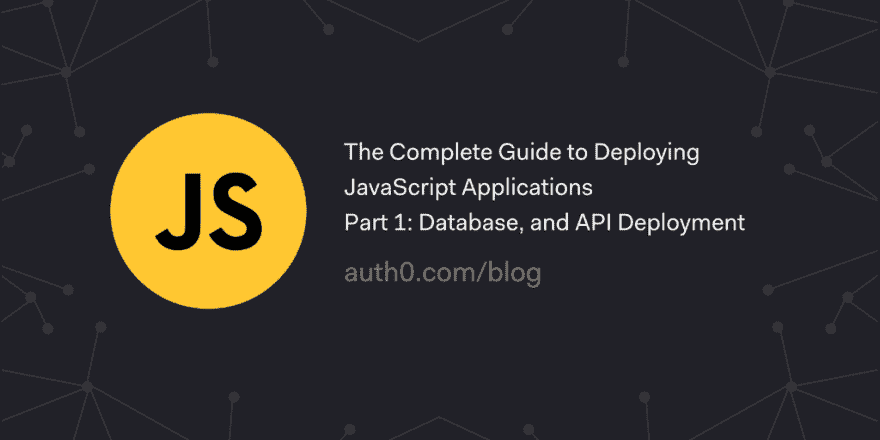

# 部署 JavaScript 应用程序的完整指南——第 1 部分:数据库和 API 部署

> 原文:[https://dev . to/auth 0/the-complete-guide-to-deploying-JavaScript-applications-part-1-database-and-API-deployment-5d GB](https://dev.to/auth0/the-complete-guide-to-deploying-javascript-applications---part-1-database-and-api-deployment-5dgb)

阿特伍德定律指出，任何可以用 JavaScript 编写的应用程序，最终都会用 JavaScript 编写。2018 年，这个定律提出十一年后，JavaScript 现在是世界上最流行的语言。在本教程中，我们将向您展示如何将您的 JavaScript 应用程序部署到不同的云平台，如 Google Cloud、Microsoft Azure、Netlify 等。

[读读☁️🚀](https://auth0.com/blog/the-complete-guide-to-deploying-javascript-applications-part-1/?utm_source=dev&utm_medium=sc&utm_campaign=deploying_javascript)

[T2】](https://res.cloudinary.com/practicaldev/image/fetch/s--ZkgJmpV6--/c_limit%2Cf_auto%2Cfl_progressive%2Cq_auto%2Cw_880/https://thepracticaldev.s3.amazonaws.com/i/v5k8nhd5l7t2jlf5gruv.png)