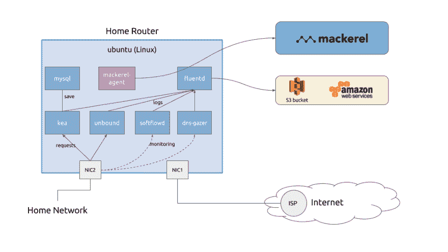
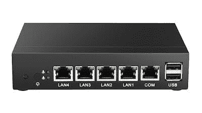
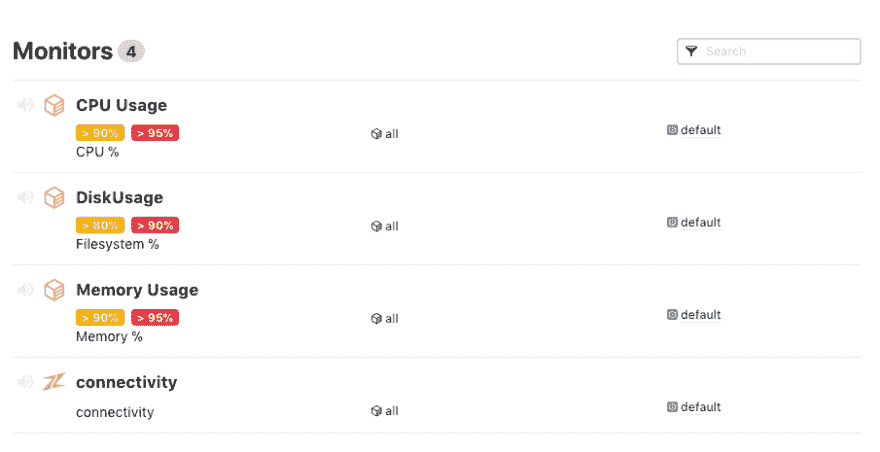

# 面向家庭和小型办公室的 Docker + Linux 现代路由器的设计与实现

> 原文：<https://dev.to/mizutani/design--implementation-of-modern-router-with-docker--linux-for-home-and-small-office-4301>

[T2】](https://res.cloudinary.com/practicaldev/image/fetch/s--vZSxfieT--/c_limit%2Cf_auto%2Cfl_progressive%2Cq_auto%2Cw_880/https://thepracticaldev.s3.amazonaws.com/i/pt6hc4n6nzh49hi1utvx.jpg)

本文描述了一个由 Docker + Linux 为家庭和小型办公室构建的路由器。

# 设计

## 原理

### 可调制性

除了与 Linux 内核相关的工作之外，我会让每个服务尽可能独立地工作。

*   与商业可用的宽带路由器相比，使用 Linux 的机器可以做任何事情，因为它具有极高的自由度，但是存在一个问题，即环境变得“肮脏”——在保持微小变化的同时，服务和保存的文件的依赖性等将逐渐变得未知——特别是如果你试图插入或删除新的服务，垃圾将仍然存在
*   虽然构建路由器的机会不多，但最好有一个将服务与操作系统分离的配置，以便在更换机器时尽可能容易地进行迁移

### 运行成本低

外部服务(SaaS 等。)相比过去有所增加。虽然我想积极使用这些东西，我承担家庭和小办公室到底，所以我不指望增加日常运行成本。

具体来说，我们的目标是保持每月金额在几百日元左右。这是严重意识到，我们可以使用各种更好的服务，如果我们把钱，但我们设计它是最低限度的必要功能的基础上，这一政策。

### 只针对工程师

首先，我认为是 it 工程师自己制造路由器，但如果敢说，目的是满足工程师们想自己动手修补的愿望。因此，它不是为了取代现有的宽带路由器等而设计的。对于普通用途来说，购买和安装宽带路由器要便宜得多，也容易得多。

## 假设

*   硬件- x86 机器(虽然可能配置了 Raspberry Pi，但没有心思在性能稍有不确定性的情况下努力工作& ARM) -我有两个以上的 NIC-RAM 可以有一定余量使用(假设约 4 GB) -假设 HDD 没有那么大，留下的永久数据较少
*   所需服务-数据包转发(家庭网络->互联网)-防火墙- DNS 缓存服务器- DHCP 服务器-通信监控

## 建筑

基于上述要求等。，其设计如下图所示。

[T2】](https://res.cloudinary.com/practicaldev/image/fetch/s--b4u5N4AR--/c_limit%2Cf_auto%2Cfl_progressive%2Cq_auto%2Cw_880/https://thepracticaldev.s3.amazonaws.com/i/yqi5p06l5rq22qv1chh5.png)

*   包转发、防火墙等直接关系到网络的部分让 Linux OS 乖乖听话
*   其他服务基本都是用 Docker 配置模块化的，更容易添加/更改/删除服务- DNS 缓存服务器(未绑定)- DHCP 服务器(kea) - Monitor 通信(softflowd，dns - gazer)
*   视情况使用外部服务-指标监控(鲭鱼)-保存日志(AWS S3)

# 实现

## 准备机器

这次准备的机器会在下面。

> XCY 英特尔赛扬 J1900 准系统(2 Ghz 四核 4 线程)千兆局域网* 4 无风扇小型节省空间(4g RAM 32g SSD)
> 
> [](https://res.cloudinary.com/practicaldev/image/fetch/s--LKvoeXQF--/c_limit%2Cf_auto%2Cfl_progressive%2Cq_auto%2Cw_880/https://thepracticaldev.s3.amazonaws.com/i/371jkmoztmbsn38gg8qc.jpg)

以太网 4 个网卡被刺穿，CPU 有足够的性能当路由器用，2 GHz 四核，4 G 内存，32 G SSD。由于有四个网卡，可以单独分段玩，而且飞机也比较小，适合作为路由器安装。

当然，即使不是这台机器，也有给旧的台式 PC 再贴个网卡就能用的配置。这次将在使用这个 XCY 安装的前提下进行说明。

## 安装 Linux 作为主机

[T2】](https://res.cloudinary.com/practicaldev/image/fetch/s--9NK0Vwpp--/c_limit%2Cf_auto%2Cfl_progressive%2Cq_auto%2Cw_880/https://thepracticaldev.s3.amazonaws.com/i/04mmer8vs3es7ckcrcm5.jpg)

### OS 安装

由于这次使用的 XCY 的机器是普通的 x86 机器，所以在 PC 或服务器上安装同样的程序没有问题。如图所示，两个 USB 口正在啄，所以我们将安装 CD / DVD 或 USB 存储器等。没试过，但是由于 COM 串口开着，就算用了也能安装。

这次我使用了 CD / DVD 驱动器，将键盘连接到另一个 USB，并在将背面的 VGA 输出复制到屏幕上的同时进行安装。使用 USB CD / DVD 驱动器时，有必要修改 BIOS 引导优先级...(记忆是模糊的，因为它做了一段时间)但启动后，立即用 ESC 键将其放入 BIOS。

另外，这次我选择了 ubuntu Linux 16.04 作为主机 OS。之后我们会在前提下解释。

### 包安装

```
$ sudo apt update
$ sudo apt upgrade -y
$ sudo apt install -y iptables docker.io docker-compose pppoeconf git 
```

Enter fullscreen mode Exit fullscreen mode

由于主机 OS 端尽量不想放多余的东西，所以安装包尽量最小化。

### 界面配置

如设计图所示，一个网卡用于互联网端，另一个网卡用于内部网络端。在 ubuntu Linux 16.04(或 Linux 内核 4.4.0-104-generic)中，实机中写的接口名和 OS 的设备名对应如下。

*   LAN1 : enp1s0
*   LAN2 : enp2s0
*   LAN3 : enp3s0
*   LAN4 : enp4s0

此时，将 LAN1 (enp1s0)设置为互联网端，将 LAN2 (enp2s0)设置为内部网络端。网络配置如下。

*   网络:10.0.0.0/24
*   用于 DHCP 的 IP 地址范围:从 10.0.0.129 到 10.0.0.254
*   内部网络端的 IP 地址:10.0.0.1

此阶段`/etc/network/interfaces`的设置如下。

```
auto lo
iface lo inet loopback

auto enp2s0
iface enp2s0 inet static
    address 10.0.0.1
    netmask 255.255.255.0 
```

Enter fullscreen mode Exit fullscreen mode

### 设置 PPPoE

掌握 PPPoE 的用户名和密码，执行以下命令。

```
$ sudo pppoeconf 
```

Enter fullscreen mode Exit fullscreen mode

如果你运行 pppoeconf，你会推荐设置为 nice，所以如果你相应地回答问题，它会在`/etc/ppp/`下准备它。请注意，在执行`pppoeconf`命令时，有必要用 LAN 电缆连接 PPPoE 兼容设备。

### NAT & F/W 配置

在`/etc/sysctl.conf`中添加以下一行。

```
net.ipv4.ip_forward=1 
```

Enter fullscreen mode Exit fullscreen mode

编辑`/etc/rc.local`。

```
/sbin/iptables-restore < /etc/network/iptables
exit 0 
```

Enter fullscreen mode Exit fullscreen mode

最初，将读取 iptables 的脚本放在`/etc/network/if-pre-up.d/`下似乎是一个好主意，但这样做后，在界面启动后执行的 docker 服务将由 iptables 执行，因为它似乎覆盖了设置，用`/etc/rc.local`执行 iptables-restore。

我在`/etc/network/iptables`中保存并编辑了`iptables-save`的结果。混合原来的 docker 设置，设置设置释放端口进行服务等等最后如下(`/etc/network/iptables`)。

```
*nat
:PREROUTING ACCEPT [0:0]
:INPUT ACCEPT [0:0]
:OUTPUT ACCEPT [0:0]
:POSTROUTING ACCEPT [0:0]
:DOCKER - [0:0]

# eth0 is WAN interface, eth1 is LAN interface, ppp0 is the PPPoE connection
-A POSTROUTING -o ppp0 -j MASQUERADE
-A PREROUTING -m addrtype --dst-type LOCAL -j DOCKER
-A OUTPUT ! -d 127.0.0.0/8 -m addrtype --dst-type LOCAL -j DOCKER
-A POSTROUTING -s 172.17.0.0/16 ! -o docker0 -j MASQUERADE
-A DOCKER -i docker0 -j RETURN

COMMIT

*filter
:INPUT DROP [0:0]
:FORWARD ACCEPT [0:0]
:OUTPUT ACCEPT [0:0]
:DOCKER - [0:0]
:DOCKER-ISOLATION - [0:0]
-A FORWARD -j DOCKER-ISOLATION
-A FORWARD -o docker0 -j DOCKER
-A FORWARD -o docker0 -m conntrack --ctstate RELATED,ESTABLISHED -j ACCEPT
-A FORWARD -i docker0 ! -o docker0 -j ACCEPT
-A FORWARD -i docker0 -o docker0 -j ACCEPT
-A DOCKER-ISOLATION -j RETURN

-A DOCKER -i ppp0 -p udp -m state --state ESTABLISHED -j ACCEPT
-A DOCKER -i ppp0 -p tcp -m state --state RELATED,ESTABLISHED -j ACCEPT
-A DOCKER -i ppp0 -j DROP

-A INPUT -i lo -j ACCEPT
-A INPUT -p tcp -m state --state ESTABLISHED,RELATED -j ACCEPT
-A INPUT -p udp -m state --state ESTABLISHED -j ACCEPT

-A INPUT -p tcp --dport 22 -s 10.0.0.0/24 -j ACCEPT
-A INPUT -p icmp -s 10.0.0.0/24 -j ACCEPT

COMMIT 
```

Enter fullscreen mode Exit fullscreen mode

### rsyslog 配置

如下文所述，由于所有日志都通过 fluentd 保存在 AWS 的 S3 中，因此主机 OS 的 rsyslog 也被设置为 skip log to fluentd。创建一个新的`/etc/rsyslog.d/10-remote.conf`并编辑如下。

```
*.* @127.0.0.1:5514 
```

Enter fullscreen mode Exit fullscreen mode

### 监控服务安装

对于监控服务，使用[鲭鱼](https://mackerel.io)。类似的服务还有 [Datadog](https://www.datadoghq.com/) 和 [New Relic](https://newrelic.com/) 。虽然我没有正确地比较它们，但我认为 Mackrel 似乎相对简单且易于使用，我在自由框架上选择了自定义指标，这样它看起来易于使用。

虽然可以从 Docker 容器中进行监控，但是从容器中强制引用主机上的数据似乎有些混乱，所以我顺从地在主机操作系统上安装了代理。可以通过将以下脚本作为一行执行来安装基本的监控代理。

```
$ wget -q -O - https://mackerel.io/file/script/setup-all-apt-v2.sh | MACKEREL_APIKEY='2R8VBzXXXXXXXXXXXXXXXXXXXXXXXXXXXXXXXXXXXXXX' sh 
```

Enter fullscreen mode Exit fullscreen mode

有关详细信息，请参阅下页。
[https://mackerel.io/orgs/mizutani-home/instruction-agent](https://mackerel.io/orgs/mizutani-home/instruction-agent)

虽然它似乎也能够设置 10 个监控规则，但我们只移动检测默认连接检查和 CPU、磁盘、内存过度使用的规则。

[T2】](https://res.cloudinary.com/practicaldev/image/fetch/s--c3M09NaE--/c_limit%2Cf_auto%2Cfl_progressive%2Cq_auto%2Cw_880/https://thepracticaldev.s3.amazonaws.com/i/f1i42a1zlrqn7iakpucs.png)

## 服务配置

### 服务

#### fluentd(日志收集)

你知道，日志收集工具 [fluentd](https://www.fluentd.org/) 。在这种路由器中，日志被集中在数据流上并被集中管理。主要来源和目的地如下。

*   Sources -从每个 docker 容器的日志记录驱动程序发送的标准输出和标准错误的日志-主机操作系统 syslog -从 softflowd 发送的 Netflow 日志-从 dns-gazer 发送的 DNS 查询/回复日志
*   目的地——日志基本上存储在 AWS S3 上——发送一些指标给鲭鱼进行监控(在这篇评论中没有实现，但将来会实现)

至于日志，netflow 日志和 DNS 日志可以存储，即使它不去 3MB 一天。在东京地区，费用为 0.025 美元/ GB(前 50 TB)。即使 1 年得到 1 GB 左右，10 年每月也是 10 GB /月* \ $ 0.025 /月=每月 30 日元以下，计算符合最初的目标。

#### 未绑定(DNS 缓存服务器)

长期以来，说起 DNS 服务器， *bind* 很有名，但如果你只想把它作为缓存服务器来运行，就没有太多理由使用实现完整 DNS 特性的 *bind* 。[unbounded](https://www.unbound.net/)似乎是主要着眼于作为缓存服务器的功能而打造的 DNS 服务器，具有缓存污染容忍度、性能、易设置等优势。确实是。该设置也非常简单，它作为一个 DNS 缓存服务器，只有这个设置内容。

```
server:
  port: 53
  interface: 0.0.0.0
  access-control: 10.0.0.0/24 allow

  logfile: ""
  verbosity: 2 
```

Enter fullscreen mode Exit fullscreen mode

#### kea (DHCP 服务器)

动态设置 IP 地址的 dhcp 也曾经是所谓的 isc-dhcp-server，传统上由[互联网系统联盟](https://www.isc.org/)实现，但最近 isc 自己实现了一个名为“现代开源 DHCPv4 & DHCPv6 服务器” [kea](https://www.isc.org/kea/) 的 DHCP 服务器。脸书发表了一篇[博客](https://code.facebook.com/posts/845909058837784/using-isc-kea-dhcp-in-our-data-centers/)说他们在数据中心也使用 kea。好像有各种介绍结果。

*   [https://www.isc.org/kea/](https://www.isc.org/kea/)
*   [http://kea.isc.org/wiki](http://kea.isc.org/wiki)

与传统的 ISC DHCP 服务器相比，Kea 似乎具有以下特征。

*   提供了 API，如 RESTful 配置更改
*   RDBS (PostgreSQL，MySQL)可用于租赁数据库
*   DHCPv4 和 DHCPv6 是分开的

虽然我不使用设置更改等。函数这次我尝试用 MySQL 做租赁 DB。

此外，作为一个旁白，它是非常大的源代码，它需要大量的时间来构建源代码。(长时间编译，在 2013 版 MacBook Pro 上需要几个小时)我们建议在使用时使用二进制版本。

#### softflowd(流量监控)

[softflowd](https://www.mindrot.org/projects/softflowd/) 监控网络接口并显示通信流信息(源和目的 IP 地址、IP 协议、源和目的端口号、发送/接收数据量、数据包数量、开始/结束时间等)。

其实 ntopng 提供的 [nprobe](https://www.ntop.org/nprobe/advanced-flow-collection-with-ntopng-and-nprobe/) 得到了更详细的信息。然而，要正确使用它，必须购买许可证。我放弃了认为我廉价实现这个不适合这个设计的想法。

我目前使用的是 softflowd，但我计划用另一个工具或我将来开发的工具来代替它。

#### dns-gazer (DNS 监控)

我使用名为 [dns-gazer](https://github.com/m-mizutani/dns-gazer) 的工具在 dns 中记录查询(这是我自己开发的)。除了 softflowd，它还监控网络接口并创建 DNS 查询和回复日志。它直接将日志以`forward`格式输出到 fluentd，这次我们将日志保存到 AWS S3。有 [dnscap](https://github.com/DNS-OARC/dnscap) 作为类似的工具来捕获 DNS 通信，但是由于日志输出方法和格式有困难，我决定开发一个独立的工具。

出于安全目的，也会获取 DNS 日志。即使它到目前为止还不能进行高级分析，它也可以通过确认它正在与后来公布在黑名单中的域名和 IP 地址进行通信来简单地检测恶意软件的感染。此外，在某些情况下，它还用于在事件发生时进行取证(尽管在正常的家庭环境中几乎不可能做到这一点)。

事实上，我想一起介绍这个日志的使用，但这部分还不成熟。暂时来说，这次只是适当的离开日志。

### 准备对外服务

#### AWS S3

如前所述，这次我们将使用 AWS S3 存储桶来保存日志文件。我将跳过创建帐户的步骤。

当控制台可用于某个帐户时，首先创建一个存储桶。这一次我们将着手进行的前提是，我们准备了名为`home-network`的 S3 桶。

一旦我们创建了 bucket，我们将获得 API 密钥。尽管即使您使用您帐户的 API 密钥也不是不可能，但我们建议您创建另一个专门用于将日志保存到 S3 的用户作为授权用户。

创建用户后(或在创建时)，创建一个策略写入 S3，并将其附加到该用户。要设置的策略示例如下。还授予了`s3:GetObject`和`s3:ListBucket`特权，以便`s3:PutObject`和 fluentd 的 out_s3 插件创建日志文件，可以检查 bucket 上的文件是否存在。

```
{  "Version":  "2012-10-17",  "Statement":  [  {  "Sid":  "VisualEditor0",  "Effect":  "Allow",  "Action":  [  "s3:PutObject",  "s3:GetObject",  "s3:ListBucket"  ],  "Resource":  [  "arn:aws:s3:::home-network",  "arn:aws:s3:::home-network/*"  ]  }  ]  } 
```

Enter fullscreen mode Exit fullscreen mode

一旦您设置了策略，您就可以检索并保存`AWSAccessKeyId`和`AWSSecretKey`的信息。

### 设置 docker-compose

从这里开始，我将在我们将使用我准备的 [docke-compose 配置](https://github.com/m-mizutani/docker-based-home-router)构建环境的前提下进行解释。

```
$ sudo mkdir -p /opt
$ sudo chown $USER /opt
$ cd /opt
$ git clone https://github.com/m-mizutani/docker-based-home-router
$ cd docker-based-home-router 
```

Enter fullscreen mode Exit fullscreen mode

然后，创建一个名为`config.json`的文件。

```
$ cp config.template.json config.json
$ vim config.json 
```

Enter fullscreen mode Exit fullscreen mode

并重写必要的部分。

```
{  "s3":  {  "key":  "AKXXXXXXXXXXXXXXXXXXXXXX",  "secret":  "Ib346xxxxxxxxxxxxxxxxxxxxxxxxxxxxxxxxxxxxxx",  "region":  "ap-northeast-1",  "bucket_name":  "home-network"  },  "dhcp":  {  "interfaces":  [  "enp0s2"  ],  "pools":  [  "10.0.0.129 - 10.0.0.254"  ]  },  "network":  {  "internal_gateway":  "10.0.0.1",  "subnet":  "10.0.0.0/24"  },  "monitor":  {  "interface":  "enp0s2"  },  "mackerel":  {  "api_key":  "2R8xxxxxxxxxxxxxxxxxxxxxxxxxxxxxxxxxxxxxxxxxxxx"  }  } 
```

Enter fullscreen mode Exit fullscreen mode

我先放一段评论。

*   `dhcp/interfaces/`和`monitor/interface`下的接口名称基本相同。前者是 kea 的设置，后者是 softflowd 和 dns-gazer 的监控接口。
*   `dhcp`请注意，以下两项是列表类型(一旦在列表中插入多个值，它应该可以工作，但目前无法验证)

如果可以创建`config.json`，运行`setup.py`。* *我用 Python 3.6 确认过了。** 执行时，自动生成各种设置文件。

```
$ ./setup.py
2018-01-06 03:57:57,279 [DEBUG] config path: /opt/docker-based-home-router/config.json
2018-01-06 03:57:57,282 [INFO] creating fluentd config: /opt/docker-based-home-router/fluentd/fluent.conf
2018-01-06 03:57:57,286 [DEBUG] Found Mackerel API KEY in config
2018-01-06 03:57:57,286 [DEBUG] Found Mackerel ID file: /var/lib/mackerel-agent/id
2018-01-06 03:57:57,286 [INFO] creating kea config file: /opt/docker-based-home-router/kea/kea-config.json
2018-01-06 03:57:57,289 [INFO] creating env file for mysql: /opt/docker-based-home-router/mysql.env
2018-01-06 03:57:57,289 [INFO] creating env file for dns-gazer: /opt/docker-based-home-router/dns-gazer.env 
```

Enter fullscreen mode Exit fullscreen mode

当文件自动生成时，构建映像。

```
$ sudo docker-compose build 
```

Enter fullscreen mode Exit fullscreen mode

现在您已经准备好设置它了。

### 码头工-化合物. yml

至于 docker-compose 的构图和每张图片的内容细节，基本上就是一种你要看代码的感觉，不过我会精准的涵盖要点。

```
 unbound:
    build: ./unbound
    restart: always    
    ports:
    - "53:53/udp"
    depends_on:
    - fluentd
    logging:
      driver: fluentd
      options:
        fluentd-address: localhost:24224
        tag: "docker.{{.ImageName}}.{{.ID}}" 
```

Enter fullscreen mode Exit fullscreen mode

不限于未绑定，所有日志记录驱动程序都集中在 fluentd 容器中，并被跳过到 S3。所以我们为每个`depends_on`指定 fluentd 容器。我试着做标签`docker.<Image name>.<Container ID>`。

```
 kea:
    build: ./kea
    restart: always    
    network_mode: host 
```

Enter fullscreen mode Exit fullscreen mode

kea 需要接收在客户端的 DHCP discover 上出现的广播数据包。由于 docker 容器基本上位于主机操作系统的内部网络中，因此在正常配置下，DHCP discover 数据包不会到达容器。虽然如果我能做很多，我似乎是可能的，但这次我只是通过设置一个相当于`--net=host`的设置来对应。

```
 kea-db:
    build: ./kea-db
    restart: always    
    ports:
    - 127.0.0.1:3306:3306
    env_file:
    - ./mysql.env
    volumes:
    - kea-db-vol:/var/lib/mysql 
```

Enter fullscreen mode Exit fullscreen mode

另一方面，如果 kea 的容器处于 net = host 状态，mysql 会将 3306/tcp 暴露给 local，kea 会`127.0.0.1:3306`，因为它无法连接到配置为连接的带有`links`的 mysql 容器。

数据库初始化脚本放在 mysql 的镜像 kea-db 中。此外，由于数据库文件是通过设置 volume 来持久化的，因此即使重新启动，也将继承相同的租用 DB。

```
 fluentd:
    build: ./fluentd
    restart: always
    ports:
    - 127.0.0.1:24224:24224
    - 127.0.0.1:5514:5514/udp
    - 127.0.0.1:2055:2055/udp
    volumes:
    - fluentd-buffer:/var/log/fluentd 
```

Enter fullscreen mode Exit fullscreen mode

Fluentd 还会接管缓冲区的目录，即使是在卷挂载和重新启动容器之后。每个端口都公开用于以下目的。

*   24224:收到日志驱动程序+ dns-gazer 的日志
*   5514:接收 rsyslog
*   2055:接收网络流

### 使 docker-compose 在机器启动时启动

当你准备好的时候，在最后添加一个启动脚本到`/etc/rc.local`。最后将如下。

```
/sbin/iptables-restore < /etc/network/iptables
docker-compose -p router -f /opt/docker-based-home-router/docker-compose.yml --verbose up -d
exit 0 
```

Enter fullscreen mode Exit fullscreen mode

之后，如果你说`sudo /etc/rc.local`等，所有的组件都应该启动。由于日志通过这个启动命令流向后台，所以当需要调试时，最好在关闭`-d`选项的情况下运行 docker-compose 命令。

```
$ sudo docker-compose -p router -f /opt/docker-based-home-router/docker-compose.yml --verbose up 
```

Enter fullscreen mode Exit fullscreen mode

# 经历

既然是路由器，结果是不可见的，也不容易理解结果，但从某种意义上说，它暂时是带着这种感觉在工作。

[T2】](https://res.cloudinary.com/practicaldev/image/fetch/s--gisKfDe1--/c_limit%2Cf_auto%2Cfl_progressive%2Cq_auto%2Cw_880/https://thepracticaldev.s3.amazonaws.com/i/1gkay5a9qr09o3k796lw.png)

这是麦克雷尔上的一个监控屏幕。虽然我运行了两个流量监控进程，但是流量也是全低的(由于昨晚最大瞬时风速为 1 M Byte / ss = 8 Mbps)，完全没有消耗 CPU。昨晚内存重启时，缓存下降了不少，但使用了近 1 GB。

# 鸣谢

我要感谢谷歌翻译。