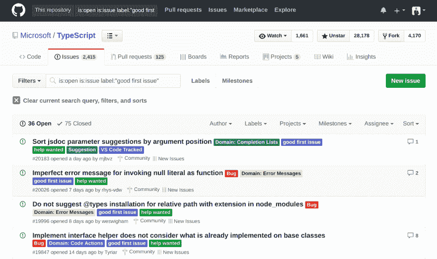
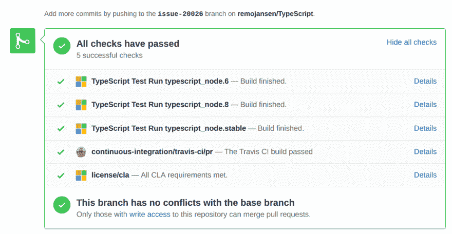

# 通过一个真实的例子了解如何为 GitHub 上的 TypeScript 编译器做出贡献

> 原文:[https://dev . to/remo Jansen/learn-how-to-contribute-to-the-typescript-compiler-on-github-through-a-real-world-example-4df 0](https://dev.to/remojansen/learn-how-to-contribute-to-the-typescript-compiler-on-github-through-a-real-world-example-4df0)

几天前，我成功地向 GitHub 上的 TypeScript 项目发送了我的第一份 PR。这是我很久以来一直想做的事情，但不幸的是，对我来说感觉太复杂了。

我决定写这篇文章，因为我 100%确定有很多人和我有同样的感受。我将尝试描述我个人是如何找到一种贡献的方式的。我的目标是希望帮助其他人也做出贡献。

请注意，我不是 TypeScript 编译器内部的专家。如果我说错了，请用下面的评论来纠正我。

## 先决条件

我将在本文中假设几件事:

*   你理解 [Git](https://git-scm.com/) 并且已经安装在你的机器上。
*   你理解 [TypeScript](https://www.typescriptlang.org/index.html) 并且已经使用了一段时间。
*   你理解了 [GitHub 流程](https://guides.github.com/introduction/flow/)并且你已经有了一个 [GitHub](https://github.com/) 账户。

## 真实世界的例子

在这篇文章中，我将使用一个真实世界的问题及其贡献作为参考。如果您想查看原始问题和贡献，请参考以下链接:

*   GitHub 上的[原刊](https://github.com/Microsoft/TypeScript/issues/20026)。
*   GitHub 上的[原创贡献](https://github.com/Microsoft/TypeScript/commit/73e3e8d790410c982ea80fd786cb046b0b861989)

## 关于学习曲线

正如我已经说过的，为 TypeScript 做贡献是我长期以来一直想做的事情，但不幸的是，它对我来说太复杂了。在这一部分，我将试着描述一下我个人的学习历程。

我个人认为，为 TypeScript 这样的开源项目做贡献不是我们在短短几天内就能实现的。我们前面还有很长的学习曲线，但是每个人都可以通过适当的努力和毅力做出贡献。

我个人的学习曲线始于几年前，当时我创建了我的第一个 GitHub 账户，并开始从事自己的兼职项目。这些项目只是学习练习和演示应用，但它帮助我熟悉了 GitHub 和 Git。

那时我对打字稿有着浓厚的兴趣，并且正在写一本关于打字稿的书。这让我访问了很多 TypeScript 路线图、TypeScript 问题和其他 TypeScript 项目，如 GitHub 上的 DefinitelyTyped。我在很长一段时间内阅读了数百期杂志、公关和评论。

过了一段时间后，我开始为做贡献。我从报告问题开始，但最终我发送了一些 pr。
我的第一批 PRs 是文档变更、依赖升级和一些非常简单的错误修复。最终，我创建了新的类型定义，并在另一篇文章中记录了我的经历。

同时使用 TypeScript 和 GitHub 让我很好地理解了 TypeScript、Git 和 GitHub，但我仍然无法贡献 TypeScript 编译器。主要的问题是，我使用 React 和 Node.js 开发了一些库，如 [InversifyJS](https://github.com/inversify/InversifyJS) 和一些 web 应用程序，但是这些项目与 TypeScript 编译器非常不同。

### 如何了解 TypeScript 编译器？

为编译器做贡献一开始可能有点可怕，因为对于像我这样的人(我没有 CS 学位)来说，编译器听起来像是一个非常高级的计算机科学主题。

然而，我们很幸运，因为 TypeScript 编译器实际上是一个“非常简单”的编译器，因为它不需要处理硬件架构或内存管理之类的事情(JavaScript 运行时会处理这些事情)。如果你一直想了解编译器是如何工作的，那么加入 TypeScript 实际上是一种非常友好的方式。

我个人是通过在线观看许多[安德斯·海尔斯伯格](https://en.wikipedia.org/wiki/Anders_Hejlsberg)的采访开始了解编译器的。他总是谈论“将 TypeScript 发射器重写为基于树的转换发射器”之类的事情。起初我并没有理解他所说的一切，但是这些年来听他的采访让我获得了一些关于 TypeScript 编译器架构的基本知识。

看了很多视频，看了很多文档。我不记得他们所有人，但这些是我记忆中最深刻的:

*   道格拉斯·克洛克福特的 Syntaxation 描述了如何从头开始实现一个解析器，并提供了对什么是抽象语法树(AST)以及它是如何生成的非常好的理解。
*   Vincent Ogloblinsky 的《TypeScript 编译器的隐藏瑰宝》以一种非常清晰和实用的方式描述了 TypeScript 编译器是如何工作的。
*   [安德斯·海尔斯伯格@ Build 2017](https://www.youtube.com/watch?v=jBddlEWNsps) 是众多关于 TypeScript 的安德斯·海尔斯伯格访谈之一。
*   安德斯·海尔斯伯格的《现代编译器构造》提供了一些关于 TypeScript 编译器的有趣见解，但它没有太多实现细节。
*   [用解析树从语法上给自己找根](https://dev.to/vaidehijoshi/grammatically-rooting-oneself-with-parse-trees-16a)
*   [架构概述](https://github.com/Microsoft/TypeScript/wiki/Architectural-Overview)
*   [编译器内部构件](https://github.com/Microsoft/TypeScript/wiki/Compiler-Internals)
*   [打字稿编译器内部](https://basarat.gitbooks.io/typescript/docs/compiler/overview.html)作者[巴萨拉特阿里赛义德](https://twitter.com/basarat)。
*   [TypeScript wiki](https://github.com/Microsoft/TypeScript/wiki) 中的“TypeScript 贡献者”和“TypeScript 构建工具”部分。

[T2】](https://res.cloudinary.com/practicaldev/image/fetch/s--Ce9KEfKS--/c_limit%2Cf_auto%2Cfl_progressive%2Cq_auto%2Cw_880/https://thepracticaldev.s3.amazonaws.com/i/z0j7yplnkwpyciqqhmff.png)

大约一年前，我在微软全球 MVP 峰会的一次黑客马拉松中做了一个小实验。我试图创建一个扩展来将 TypeScript 代码转换成 UML 图。

我从未完全完成这个实验，但这是我第一次直接接触 TypeScript AST 和语言服务工具。我发现这个小实验非常有用，我建议把使用语言服务作为一个学习练习。

一旦你理解了编译过程的不同阶段以及每个阶段的作用，你就应该准备好开始尝试挑选一个问题。

## 怎么才能找到事情做？

TypeScript 项目经理为推荐给社区的[问题创建了一个里程碑。这一期有些被贴上了](https://github.com/Microsoft/TypeScript/milestone/2)[【好的第一期】](https://github.com/Microsoft/TypeScript/issues?q=is%3Aopen+is%3Aissue+label%3A%22good+first+issue%22)的标签。你应该试着仔细考虑这些问题，找到一个你能理解的问题。

[T2】](https://res.cloudinary.com/practicaldev/image/fetch/s--lvOpuGmx--/c_limit%2Cf_auto%2Cfl_progressive%2Cq_auto%2Cw_880/https://thepracticaldev.s3.amazonaws.com/i/6bcjsdg00nlrva2bulij.png)

### 一切都显得太复杂怎么办？

几个月来，我访问了这个社区里程碑很多次，但很多次我都失望地离开了，因为我觉得自己帮不上忙。我继续学习和访问这个页面，直到有一天我看到了一个问题，我觉得我可以做一些事情。

在你的第一次公关后，你的自信程度将会大大提高，不久你就会找到下一次新的公关机会。

## 关于问题#20026

我第一次投稿选的那期是第 [#20026](https://github.com/Microsoft/TypeScript/issues/20026) 期。

在这个特别的问题中，有人建议当我们试图调用一个`null`或`undefined`变量:

```
null() 
```

<svg width="20px" height="20px" viewBox="0 0 24 24" class="highlight-action crayons-icon highlight-action--fullscreen-on"><title>Enter fullscreen mode</title></svg> <svg width="20px" height="20px" viewBox="0 0 24 24" class="highlight-action crayons-icon highlight-action--fullscreen-off"><title>Exit fullscreen mode</title></svg>

我们得到一个`Object is possibly 'null'`错误。这个错误对用户不太友好，如果使用以下错误之一会好得多:

```
Cannot invoke an object which is possibly 'null'.
Cannot invoke an object which is possibly 'undefined'.
Cannot invoke an object which is possibly 'null' or 'undefined'. 
```

<svg width="20px" height="20px" viewBox="0 0 24 24" class="highlight-action crayons-icon highlight-action--fullscreen-on"><title>Enter fullscreen mode</title></svg> <svg width="20px" height="20px" viewBox="0 0 24 24" class="highlight-action crayons-icon highlight-action--fullscreen-off"><title>Exit fullscreen mode</title></svg>

我能够理解这个问题的要求，并且我认为我能够找到错误`Object is possibly 'null'`被抛出的地方，并且当表达式是一个`function`调用时，为其他错误之一改变它。

我第一次发现了一个听起来不太复杂的问题，所以我决定尝试一下。

## 我该如何贡献？

找到我们感兴趣的问题后，我们可以开始着手解决它。我们需要经历以下步骤:

1.  设置项目
2.  实施和测试您的变更
3.  发送 PR

### 1。设置项目

*   创建 TypeScript 项目的分支。

    > 如果你需要更多关于如何派生一个库的帮助，请参考 GitHub 文档。

*   克隆你的叉子

```
git clone https://github.com/YOUR_GITHUB_USER_NAME_GOES_HERE/TypeScript.git 
```

<svg width="20px" height="20px" viewBox="0 0 24 24" class="highlight-action crayons-icon highlight-action--fullscreen-on"><title>Enter fullscreen mode</title></svg> <svg width="20px" height="20px" viewBox="0 0 24 24" class="highlight-action crayons-icon highlight-action--fullscreen-off"><title>Exit fullscreen mode</title></svg>

> 如果你需要更多关于如何克隆库的帮助，请参考 [GitHub 文档](https://help.github.com/articles/cloning-a-repository/)。

*   安装 jake(需要 [node.js](https://nodejs.org/en/download/)

```
npm install -g jake 
```

<svg width="20px" height="20px" viewBox="0 0 24 24" class="highlight-action crayons-icon highlight-action--fullscreen-on"><title>Enter fullscreen mode</title></svg> <svg width="20px" height="20px" viewBox="0 0 24 24" class="highlight-action crayons-icon highlight-action--fullscreen-off"><title>Exit fullscreen mode</title></svg>

*   安装项目依赖项

```
npm install 
```

<svg width="20px" height="20px" viewBox="0 0 24 24" class="highlight-action crayons-icon highlight-action--fullscreen-on"><title>Enter fullscreen mode</title></svg> <svg width="20px" height="20px" viewBox="0 0 24 24" class="highlight-action crayons-icon highlight-action--fullscreen-off"><title>Exit fullscreen mode</title></svg>

*   运行测试

```
jake runtests-parallel 
```

<svg width="20px" height="20px" viewBox="0 0 24 24" class="highlight-action crayons-icon highlight-action--fullscreen-on"><title>Enter fullscreen mode</title></svg> <svg width="20px" height="20px" viewBox="0 0 24 24" class="highlight-action crayons-icon highlight-action--fullscreen-off"><title>Exit fullscreen mode</title></svg>

如果所有的测试都成功了，你应该准备好开始工作了。

我建议你在一个新的分支机构工作。在我的例子中，a 用我正在处理的问题的名称创建了一个分支:

```
git checkout -b issue-20026 
```

<svg width="20px" height="20px" viewBox="0 0 24 24" class="highlight-action crayons-icon highlight-action--fullscreen-on"><title>Enter fullscreen mode</title></svg> <svg width="20px" height="20px" viewBox="0 0 24 24" class="highlight-action crayons-icon highlight-action--fullscreen-off"><title>Exit fullscreen mode</title></svg>

### 2。实施和测试您的变更

我们的第一次公关将很可能是一个错误的修复，而不是一个新功能。修复 bug 的最好方法是从编写一个重现 bug 的测试开始。

所以我开始尝试寻找现有的测试。我打开了`tests`文件夹，但是我找不到看起来像单元测试的东西。

TypeScript 测试有点奇怪，因为它们以非常抽象的方式使用 Mocha。我们不需要编写测试装置或测试用例，相反，我们编写一个类型脚本代码片段，它预期以某种方式工作或抛出某种编译错误。测试工具将会生成一些输出，并且会为这些输出中的每一个自动创建一个测试用例。

为了编写一个测试，我们需要在 tests 文件夹(`/tests/cases/compiler/`)下创建一个具有唯一名称的新文件。`CONTRIBUTING.md`文件提供了一些关于名称唯一性的建议:

> 注意，这里的文件名必须不同于所有其他编译器测试用例名称，所以如果它是常见的，您可能需要花点时间来找到一个唯一的名称。

该文件应该包含您希望测试的 TypeScript 代码。在我的例子中，我创建了一个名为 [`nullableFunctionError.ts`](https://github.com/Microsoft/TypeScript/blob/73e3e8d790410c982ea80fd786cb046b0b861989/tests/cases/compiler/nullableFunctionError.ts) 的文件。

#### /测试/案例/编译器/nullableFunctionError.ts

我的`nullableFunctionError.ts`包含以下打字稿代码:

```
// @strictNullChecks: true

null();
undefined();
let f: null | undefined;
f(); 
```

<svg width="20px" height="20px" viewBox="0 0 24 24" class="highlight-action crayons-icon highlight-action--fullscreen-on"><title>Enter fullscreen mode</title></svg> <svg width="20px" height="20px" viewBox="0 0 24 24" class="highlight-action crayons-icon highlight-action--fullscreen-off"><title>Exit fullscreen mode</title></svg>

前面的代码片段使用了三个函数调用:`null();`、`undefined();`和`f();`。这些调用中的每一个都应该触发问题#20026 预期的每一个新错误。

您可能已经注意到，代码片段不包含任何类型的断言。TypeScript 项目使用以前的编译输出作为测试断言。

我们可以使用下面的命令来执行测试:

```
jake runtests tests=nullableFunctionError 
```

<svg width="20px" height="20px" viewBox="0 0 24 24" class="highlight-action crayons-icon highlight-action--fullscreen-on"><title>Enter fullscreen mode</title></svg> <svg width="20px" height="20px" viewBox="0 0 24 24" class="highlight-action crayons-icon highlight-action--fullscreen-off"><title>Exit fullscreen mode</title></svg>

然后，TypeScript 编译器将生成以下文件作为输出:

*   `nullableFunctionError.errors.txt`
*   `nullableFunctionError.js`
*   `nullableFunctionError.symbols`
*   `nullableFunctionError.types`

这些文件存储在源代码控制中的`/tests/baselines/reference/`目录下。当执行测试时，文件在`/tests/baselines/local/`目录下重新生成。然后比较两个目录下的文件，检查编译器的行为是否发生了变化。

你可以使用下面的命令来比较这两个版本:

```
jake diff 
```

<svg width="20px" height="20px" viewBox="0 0 24 24" class="highlight-action crayons-icon highlight-action--fullscreen-on"><title>Enter fullscreen mode</title></svg> <svg width="20px" height="20px" viewBox="0 0 24 24" class="highlight-action crayons-icon highlight-action--fullscreen-off"><title>Exit fullscreen mode</title></svg>

和下面的命令来接受修改:

```
jake baseline-accept 
```

<svg width="20px" height="20px" viewBox="0 0 24 24" class="highlight-action crayons-icon highlight-action--fullscreen-on"><title>Enter fullscreen mode</title></svg> <svg width="20px" height="20px" viewBox="0 0 24 24" class="highlight-action crayons-icon highlight-action--fullscreen-off"><title>Exit fullscreen mode</title></svg>

因为这是一个新的测试，没有以前版本的文件，我们需要使用`jake baseline-accept`来接受新的文件。

不要太担心误使用`jake baseline-accept`,因为如果需要的话，您可以使用 Git 回滚更改。

在我的例子中，`nullableFunctionError.errors.txt`包含以下内容:

```
tests/cases/compiler/nullableFunctionError.ts(1,1): error TS2531: Object is possibly 'null'.
tests/cases/compiler/nullableFunctionError.ts(2,1): error TS2531: Object is possibly 'null'.
tests/cases/compiler/nullableFunctionError.ts(4,1): error TS2531: Object is possibly 'null'.

==== tests/cases/compiler/nullableFunctionError.ts (3 errors) ====
    null();
    ~~~~
!!! error TS2721: Object is possibly 'null'.
    undefined();
    ~~~~~~~~~
!!! error TS2722: Object is possibly 'null'.
    let f: null | undefined;
    f();
    ~
!!! error TS2723: Object is possibly 'null'. 
```

<svg width="20px" height="20px" viewBox="0 0 24 24" class="highlight-action crayons-icon highlight-action--fullscreen-on"><title>Enter fullscreen mode</title></svg> <svg width="20px" height="20px" viewBox="0 0 24 24" class="highlight-action crayons-icon highlight-action--fullscreen-off"><title>Exit fullscreen mode</title></svg>

正如我们看到的，三个错误是`Object is possibly 'null'.`，但它们应该是:

```
Cannot invoke an object which is possibly 'null'.
Cannot invoke an object which is possibly 'undefined'.
Cannot invoke an object which is possibly 'null' or 'undefined'. 
```

<svg width="20px" height="20px" viewBox="0 0 24 24" class="highlight-action crayons-icon highlight-action--fullscreen-on"><title>Enter fullscreen mode</title></svg> <svg width="20px" height="20px" viewBox="0 0 24 24" class="highlight-action crayons-icon highlight-action--fullscreen-off"><title>Exit fullscreen mode</title></svg>

这是正确的，因为我没有在 TypeScript 编译器中做任何更改。此时，我需要找出需要更改的内容，以便显示正确的错误。

我已经有了一个测试，通过检查`nullableFunctionError.errors.txt`文件的内容，我将能够知道我的更改是否正确。此外，已经有 [58656 个现有的测试](https://travis-ci.org/Microsoft/TypeScript/jobs/326657578#L628)，它会让我知道我是否错误地更改了其他东西。这是一个非常明显的例子，说明了 [TDD](https://en.wikipedia.org/wiki/Test-driven_development) 的好处。

### /src/compiler/diagnostic messages . JSON

我尝试做的第一件事是找出当前错误消息的来源。我最终在一个名为[diagnostic messages . JSON](https://github.com/Microsoft/TypeScript/blob/73e3e8d790410c982ea80fd786cb046b0b861989/src/compiler/diagnosticMessages.json):
的文件中添加了三个新错误

```
"Cannot invoke an object which is possibly 'null'.": {
    "category": "Error",
    "code": 2721
},
"Cannot invoke an object which is possibly 'undefined'.": {
    "category": "Error",
    "code": 2722
},
"Cannot invoke an object which is possibly 'null' or 'undefined'.": {
    "category": "Error",
    "code": 2723
}, 
```

<svg width="20px" height="20px" viewBox="0 0 24 24" class="highlight-action crayons-icon highlight-action--fullscreen-on"><title>Enter fullscreen mode</title></svg> <svg width="20px" height="20px" viewBox="0 0 24 24" class="highlight-action crayons-icon highlight-action--fullscreen-off"><title>Exit fullscreen mode</title></svg>

### /src/编译器/检查器. ts

下一步是抛出我在`diagnosticMessages.json`文件中创建的三个新错误。

这一步是一个紧张的学习练习，因为我对 TypeScript 编译器的领域知识知之甚少。我唯一的选择是通过尝试、错误和实验来获得一些知识。

我设法弄明白了我可以使用下面的命令运行所有的测试:

```
jake runtests-parallel 
```

<svg width="20px" height="20px" viewBox="0 0 24 24" class="highlight-action crayons-icon highlight-action--fullscreen-on"><title>Enter fullscreen mode</title></svg> <svg width="20px" height="20px" viewBox="0 0 24 24" class="highlight-action crayons-icon highlight-action--fullscreen-off"><title>Exit fullscreen mode</title></svg>

我也可以使用下面的命令运行我的测试:

```
jake runtests tests=nullableFunctionError 
```

<svg width="20px" height="20px" viewBox="0 0 24 24" class="highlight-action crayons-icon highlight-action--fullscreen-on"><title>Enter fullscreen mode</title></svg> <svg width="20px" height="20px" viewBox="0 0 24 24" class="highlight-action crayons-icon highlight-action--fullscreen-off"><title>Exit fullscreen mode</title></svg>

我也可以使用下面的命令和 chrome 调试工具来调试我的测试:

```
jake runtests-browser tests=nullableFunctionError browser=chrome 
```

<svg width="20px" height="20px" viewBox="0 0 24 24" class="highlight-action crayons-icon highlight-action--fullscreen-on"><title>Enter fullscreen mode</title></svg> <svg width="20px" height="20px" viewBox="0 0 24 24" class="highlight-action crayons-icon highlight-action--fullscreen-off"><title>Exit fullscreen mode</title></svg>

我在`CONTRIBUTING.md`文件中找到了所有这些信息。

因为这些错误是类型错误，所以我可以猜测我应该在 checker 中实现一些更改。

我再次开始搜索类型检查器中使用了`TS2723: Object is possibly 'null'`错误的地方。我最后查看了`checkNonNullType`和`checkNonNullExpression`函数。

这三个新错误只与函数调用相关，但是函数`checkNonNullType`在很多情况下都被使用，不仅仅是函数调用。

经过一段时间的试验，我发现我需要将这三个新错误作为可选参数传递给`checkNonNullExpression`并传递给`checkNonNullType` :

```
function checkNonNullExpression(
    node: Expression | QualifiedName,
    nullDiagnostic?: DiagnosticMessage,
    undefinedDiagnostic?: DiagnosticMessage,
    nullOrUndefinedDiagnostic?: DiagnosticMessage,
) {
    return checkNonNullType(
        checkExpression(node),
        node,
        nullDiagnostic,
        undefinedDiagnostic,
        nullOrUndefinedDiagnostic
    );
} 
```

<svg width="20px" height="20px" viewBox="0 0 24 24" class="highlight-action crayons-icon highlight-action--fullscreen-on"><title>Enter fullscreen mode</title></svg> <svg width="20px" height="20px" viewBox="0 0 24 24" class="highlight-action crayons-icon highlight-action--fullscreen-off"><title>Exit fullscreen mode</title></svg>

然后，`checkNonNullType`也将这三个新错误作为可选参数，并在适当的时候使用它们:

```
function checkNonNullType(
    type: Type,
    node: Node,
    nullDiagnostic?: DiagnosticMessage,
    undefinedDiagnostic?: DiagnosticMessage,
    nullOrUndefinedDiagnostic?: DiagnosticMessage
): Type {
    const kind = (strictNullChecks ? getFalsyFlags(type) : type.flags) & TypeFlags.Nullable;
    if (kind) {
        error(node, kind & TypeFlags.Undefined ? kind & TypeFlags.Null ?
            (nullOrUndefinedDiagnostic || Diagnostics.Object_is_possibly_null_or_undefined) :
            (undefinedDiagnostic || Diagnostics.Object_is_possibly_undefined) :
            (nullDiagnostic || Diagnostics.Object_is_possibly_null)
        );
        const t = getNonNullableType(type);
        return t.flags & (TypeFlags.Nullable | TypeFlags.Never) ? unknownType : t;
    }
    return type;
} 
```

<svg width="20px" height="20px" viewBox="0 0 24 24" class="highlight-action crayons-icon highlight-action--fullscreen-on"><title>Enter fullscreen mode</title></svg> <svg width="20px" height="20px" viewBox="0 0 24 24" class="highlight-action crayons-icon highlight-action--fullscreen-off"><title>Exit fullscreen mode</title></svg>

最后的改变是在使用函数调用时提供三个新的错误作为参数`checkNonNullExpression`。我试图在源代码中搜索类似于`invoke`或`call`的东西，我设法找到了我正在寻找的`resolveCallExpression`函数。

```
function resolveCallExpression(node: CallExpression, candidatesOutArray: Signature[]): Signature {
    // ...

    const funcType = checkNonNullExpression(
        node.expression,
        Diagnostics.Cannot_invoke_an_object_which_is_possibly_null,
        Diagnostics.Cannot_invoke_an_object_which_is_possibly_undefined,
        Diagnostics.Cannot_invoke_an_object_which_is_possibly_null_or_undefined
    );
    // ... 
```

<svg width="20px" height="20px" viewBox="0 0 24 24" class="highlight-action crayons-icon highlight-action--fullscreen-on"><title>Enter fullscreen mode</title></svg> <svg width="20px" height="20px" viewBox="0 0 24 24" class="highlight-action crayons-icon highlight-action--fullscreen-off"><title>Exit fullscreen mode</title></svg>

我执行了测试，发现了意外的结果，因为我的测试没有使用不可空的类型来执行。多亏了 chrome 调试器，我才明白了这一点。引导我识别问题的代码可以在`checkNonNullType`函数中找到:

```
const kind = (strictNullChecks ? getFalsyFlags(type) : type.flags) & TypeFlags.Nullable; 
```

<svg width="20px" height="20px" viewBox="0 0 24 24" class="highlight-action crayons-icon highlight-action--fullscreen-on"><title>Enter fullscreen mode</title></svg> <svg width="20px" height="20px" viewBox="0 0 24 24" class="highlight-action crayons-icon highlight-action--fullscreen-off"><title>Exit fullscreen mode</title></svg>

我在`CONTRIBUTING.md`文件中找到了如何启用不可空的文件:

> 这些文件支持// @metaDataName: value 格式的元数据标记。支持的名称和值与编译器本身支持的名称和值相同。

解决方案是将标志`// @strictNullChecks: true`添加到测试文件`nullableFunctionError.ts`中。我再次执行了测试，并按预期生成了以下文件。

#### /测试/案例/编译器/nullablefunctionerror . errors . txt

包含编译器检测到的错误列表。这一次错误是正确的:

```
tests/cases/compiler/nullableFunctionError.ts(1,1): error TS2721: Cannot invoke an object which is possibly 'null'.
tests/cases/compiler/nullableFunctionError.ts(2,1): error TS2722: Cannot invoke an object which is possibly 'undefined'.
tests/cases/compiler/nullableFunctionError.ts(4,1): error TS2723: Cannot invoke an object which is possibly 'null' or 'undefined'.

==== tests/cases/compiler/nullableFunctionError.ts (3 errors) ====
    null();
    ~~~~
!!! error TS2721: Cannot invoke an object which is possibly 'null'.
    undefined();
    ~~~~~~~~~
!!! error TS2722: Cannot invoke an object which is possibly 'undefined'.
    let f: null | undefined;
    f();
    ~
!!! error TS2723: Cannot invoke an object which is possibly 'null' or 'undefined'. 
```

<svg width="20px" height="20px" viewBox="0 0 24 24" class="highlight-action crayons-icon highlight-action--fullscreen-on"><title>Enter fullscreen mode</title></svg> <svg width="20px" height="20px" viewBox="0 0 24 24" class="highlight-action crayons-icon highlight-action--fullscreen-off"><title>Exit fullscreen mode</title></svg>

#### /测试/案例/编译器/nullableFunctionError.js

包含输入(TypeScript)和输出(JavaScript)代码:

```
//// [nullableFunctionError.ts]
null();
undefined();
let f: null | undefined;
f();

//// [nullableFunctionError.js]
null();
undefined();
var f;
f(); 
```

<svg width="20px" height="20px" viewBox="0 0 24 24" class="highlight-action crayons-icon highlight-action--fullscreen-on"><title>Enter fullscreen mode</title></svg> <svg width="20px" height="20px" viewBox="0 0 24 24" class="highlight-action crayons-icon highlight-action--fullscreen-off"><title>Exit fullscreen mode</title></svg>

#### /测试/案例/编译器/nullableFunctionError.symbols

包含由编译器创建的符号列表:

```
=== tests/cases/compiler/nullableFunctionError.ts ===
null();
undefined();
>undefined : Symbol(undefined)

let f: null | undefined;
>f : Symbol(f, Decl(nullableFunctionError.ts, 2, 3))

f();
>f : Symbol(f, Decl(nullableFunctionError.ts, 2, 3)) 
```

<svg width="20px" height="20px" viewBox="0 0 24 24" class="highlight-action crayons-icon highlight-action--fullscreen-on"><title>Enter fullscreen mode</title></svg> <svg width="20px" height="20px" viewBox="0 0 24 24" class="highlight-action crayons-icon highlight-action--fullscreen-off"><title>Exit fullscreen mode</title></svg>

#### /测试/案例/编译器/nullableFunctionError.types

包含编译器检测到的类型列表:

```
=== tests/cases/compiler/nullableFunctionError.ts ===
null();
>null() : any
>null : null

undefined();
>undefined() : any
>undefined : undefined

let f: null | undefined;
>f : null | undefined
>null : null

f();
>f() : any
>f : null | undefined 
```

<svg width="20px" height="20px" viewBox="0 0 24 24" class="highlight-action crayons-icon highlight-action--fullscreen-on"><title>Enter fullscreen mode</title></svg> <svg width="20px" height="20px" viewBox="0 0 24 24" class="highlight-action crayons-icon highlight-action--fullscreen-off"><title>Exit fullscreen mode</title></svg>

### 3。发送 PR

此时，我几乎准备好完成我的公关。我接受了新的基线文件:

```
jake baseline-accept 
```

<svg width="20px" height="20px" viewBox="0 0 24 24" class="highlight-action crayons-icon highlight-action--fullscreen-on"><title>Enter fullscreen mode</title></svg> <svg width="20px" height="20px" viewBox="0 0 24 24" class="highlight-action crayons-icon highlight-action--fullscreen-off"><title>Exit fullscreen mode</title></svg>

并且我执行了所有现有的测试:

```
jake runtests-parallel 
```

<svg width="20px" height="20px" viewBox="0 0 24 24" class="highlight-action crayons-icon highlight-action--fullscreen-on"><title>Enter fullscreen mode</title></svg> <svg width="20px" height="20px" viewBox="0 0 24 24" class="highlight-action crayons-icon highlight-action--fullscreen-off"><title>Exit fullscreen mode</title></svg>

如果您的测试在本地通过，那么您很可能不会在 CI 构建中遇到任何问题。

[T2】](https://res.cloudinary.com/practicaldev/image/fetch/s--En7cXT-L--/c_limit%2Cf_auto%2Cfl_progressive%2Cq_auto%2Cw_880/https://thepracticaldev.s3.amazonaws.com/i/f2owuvtd3paw8juj64fe.png)

如果您遇到任何问题，TypeScript 团队应该能够帮助您，不要害怕寻求帮助！

如果您需要更多关于如何创建 PR 的帮助，请参考 [GitHub 文档](https://help.github.com/articles/creating-a-pull-request/)。

#### 签约 CLA

TypeScript 项目要求贡献者签署贡献许可协议(CLA)。

`CONTRIBUTING.md`文件包含了一些相关的指导方针:

> 您需要完成贡献者许可协议(CLA)。简而言之，本协议证明您同意我们根据项目许可的条款使用提交的变更，并且提交的作品受到适当的版权保护。请在提交提取请求之前提交贡献者许可协议(CLA)。您可以访问[https://cla.microsoft.com](https://cla.microsoft.com)进行数字签名。

## 总结

在本文中，我们通过一个真实的例子了解了如何为 GitHub 上的 TypeScript 做出贡献。

我希望你喜欢这篇文章，它会帮助你发送你的第一份 PR 到 TypeScript 项目。

编码快乐！