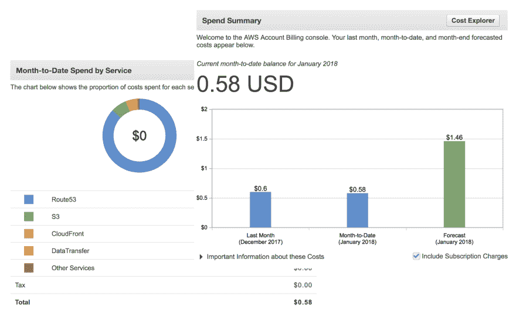

# AWS 存储成本

> 原文:[https://dev.to/ashanfernando/aws-storage-costs-1a5a](https://dev.to/ashanfernando/aws-storage-costs-1a5a)

Amazon Web Services (AWS)为备份、归档和灾难恢复以及数据块、文件和对象存储提供了各种存储选项。这些低成本的存储选项为不同的用例提供了高可用性和耐用性(更多细节来自官方[文档](https://aws.amazon.com/whitepapers/storage-options-aws-cloud/))。这些存储选项互不相同，提供了独特的产品。重要的是不仅要了解适当的存储使用情形，还要了解底层的成本结构。

存储的总拥有成本也会因地区和存储管理方法的不同而不同。提供所需的数量并在需要时扩大规模非常重要。有些第三方存储管理工具提供了具有不同 [AWS 成本结构](https://www.netapp.com/us/cloud/ontap-cloud-native-pricing)的自动化选项。例如，像 NetApp on tap 云这样的第三方解决方案为 [AWS 存储](https://cloud.netapp.com/cloud-ontap)提供了增强功能，例如自动化工作负载、灾难恢复、开发运维、文件共享、数据库管理等。

为了监控存储的使用情况，有各种工具可供使用，包括 AWS 内部工具以及第三方工具，如 AWS Billing Console、Bills、Cost Explorer 或具有自定义监控支持的第三方存储管理工具。

# 存储成本计算

在估算存储成本时，需要根据具体的存储选项从不同的角度来看待使用案例。在计算存储成本时，需要考虑这些维度中的一个或多个。总的来说，我们可以研究的维度可以分为以下几类。

*   调配/使用的存储容量
*   数据传输能力
*   数据传输速率
*   复制因子
*   访问模式

**注意:AWS 还提供基于 AWS 自由层限制的成本节约。您可以跟踪您的 AWS 自由层使用情况，以保持在自由层限制之下。**

## 亚马逊简单存储服务(S3)

AWS S3 是云中的一个可扩展且高度耐用的对象存储服务，具有以下定价组件。

*   存储(每月每 GB)
*   数据传入或传出(每月每 GB)
*   请求(每月每千个请求)
*   数据传入和传出(用于 S3 传输加速)

## 亚马逊冰川

低成本、高度耐用的云中归档存储，具有以下定价组件。

*   存储(每月每 GB)
*   传出数据(每月每 GB)
*   请求(每月每千次上传和检索请求)

## 亚马逊弹性文件系统(EFS)

EFS 是 Amazon EC2 实例的可扩展网络文件存储，您只需为文件系统中使用的存储量付费。

## 亚马逊弹性街区商店(EBS)

EBS 为 Amazon EC2 实例提供数据块存储卷，价格组成如下。

*   调配的存储
*   输入输出请求
*   快照存储

## 亚马逊 EC2 实例存储

Amazon EC2 实例的临时块存储卷，本地实例存储卷上的数据存储不收取额外费用。但是，跨区域和可用性区域的数据传输会产生数据传输费用。

## AWS 存储网关

AWS Storage Gateway 是一种内部存储设备，与云存储集成，具有以下定价组件。

*   网关使用率(每月每个网关)
*   快照存储使用情况(每月每 GB)
*   卷存储使用量(每月每 GB)
*   虚拟磁带库/托架存储(每月每 GB)
*   从虚拟磁带架中检索(每 GB)
*   传出数据(每月每 GB)

## AWS 雪球

雪球式数据传输机制，通过以下定价组件将大量数据传输到云或从云中传输出来。

*   服务费(每份工作)
*   额外的一天费用
*   数据传送

## AWS CloudFront

全球内容交付网络(CDN)具有以下定价组件。

*   区域数据传出(每 GB)
*   请求数量(每 10，000 人)

# 估计和监控使用情况和成本

您可以使用 [AWS 成本计算器](https://calculator.s3.amazonaws.com/index.html)来估算存储成本。你只需要输入近似值，其余的由计算器来完成。了解存储成本因 AWS 地区而异也很重要。

AWS 计费和成本管理仪表板提供了丰富的功能来监控使用成本。使用控制面板，您可以查看各种图表，这些图表显示了您的 AWS 使用情况的不同明细，以及上个月、本月至今和月末的预测成本，如下所示。

[T2】](https://res.cloudinary.com/practicaldev/image/fetch/s--PPtLNFvw--/c_limit%2Cf_auto%2Cfl_progressive%2Cq_auto%2Cw_880/https://thepracticaldev.s3.amazonaws.com/i/8h1pee739tpnhetmb91z.png)

您可以使用成本分配标签来进一步追溯和过滤成本。AWS 还生成包含资源创建者信息的成本分配标记，该标记会自动应用于所提供的资源。

AWS Cost Explorer 是计费仪表板中的另一个工具。您可以使用它来查看过去 13 个月的成本数据，还可以使用各种过滤器预测未来三个月的支出。

此外，您可以设置预算，并在超过阈值时通过电子邮件发送通知或向您的 SNS 主题发布通知来通知适当的人。