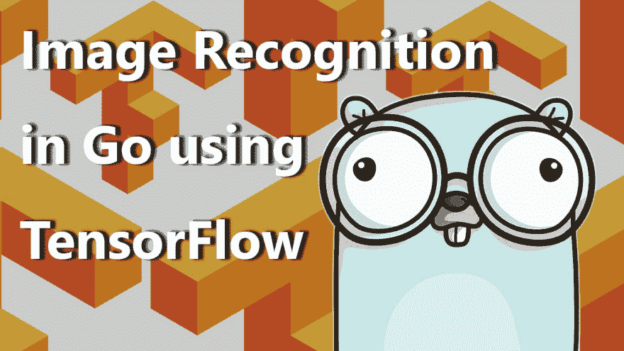

# 基于张量流的围棋图像识别

> 原文:[https://dev . to/plutov/image-recognition-in-go-using-tensor flow-2hga](https://dev.to/plutov/image-recognition-in-go-using-tensorflow-2hga)

[T2】](https://res.cloudinary.com/practicaldev/image/fetch/s--01dRUl3k--/c_limit%2Cf_auto%2Cfl_progressive%2Cq_auto%2Cw_880/http://pliutau.com/IRiGuTF.jpg)

Tensorflow 是用图形表示计算的计算库。它的核心是用 C++实现的，也有不同语言的绑定，包括 Go。

在过去的几年中，机器学习领域在解决图像识别的难题方面取得了巨大的进展。

机器学习的挑战之一是弄清楚如何将训练好的模型部署到生产环境中。训练完模型后，您可以“冻结”它并将其导出以在生产环境中使用。

对于一些常见的用例，我们开始看到组织共享他们训练过的模型，你可以在 [TensorFlow 模型报告](https://github.com/tensorflow/models)中找到一些。

在这个视频中，我们将使用其中的一个，称为 [Inception](https://github.com/tensorflow/models/tree/master/research/inception/inception) 来识别图像。

我们将构建一个小的命令行应用程序，它将图像的 URL 作为输入，并按顺序输出标签。

[视频:使用 TensorFlow 进行围棋图像识别](https://youtu.be/P8MZ1Z2LHrw)