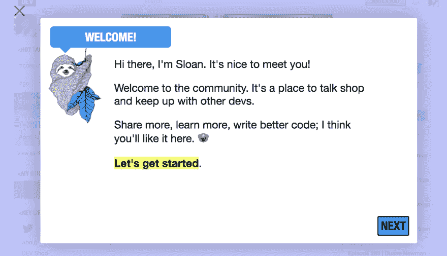
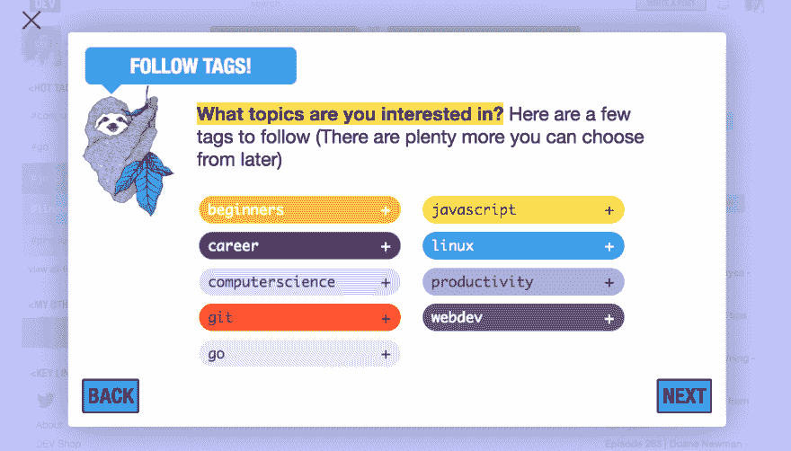
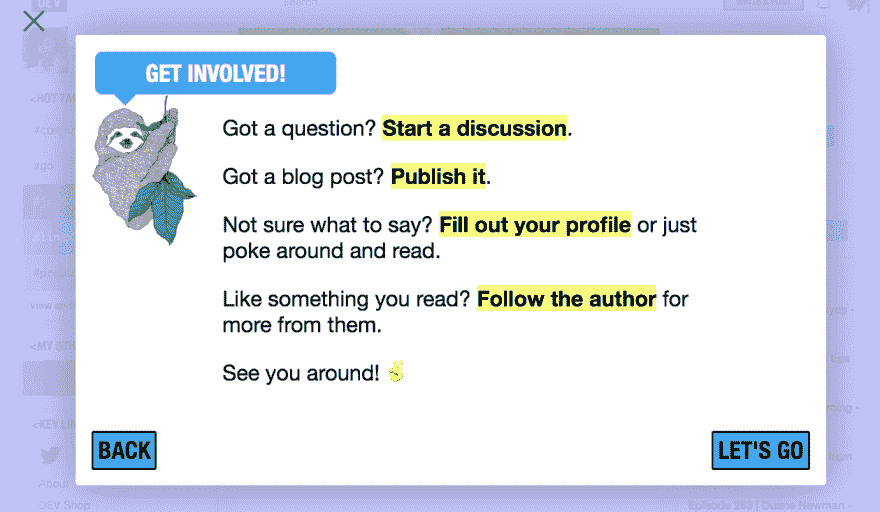

# Changelog:新社区成员入职

> 原文：<https://dev.to/jess/changelog-onboarding-new-community-members-1d53>

我们一直希望为新的社区成员创造一个更受欢迎的体验，并确保每个人都知道一些关键的开发功能。例如，并不是每个人都知道跟随一个标签实际上是用更相关的内容定制他们的 dev.to home feed。这对于直接在你的 feed 上显示更多合适的编程主题特别有用。

随着网站的发展，我们将不断改进新成员的加入，但下面是第一次迭代的情况:

**1。快速概览**

**2。显示热门标签**

**3。鼓励新成员参与**

下一步:包括一张幻灯片，让人们从他们关心的话题跟随他们的 twitter 朋友和/或受欢迎的开发者。