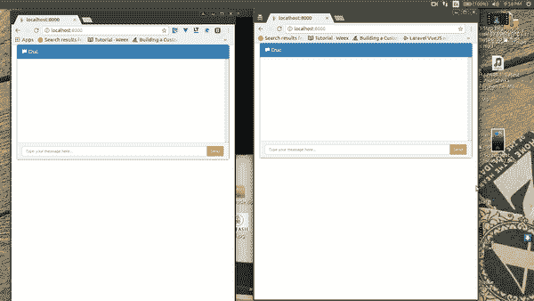
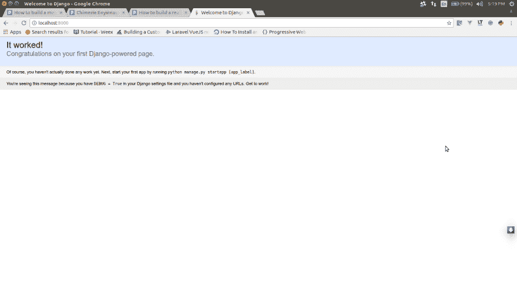
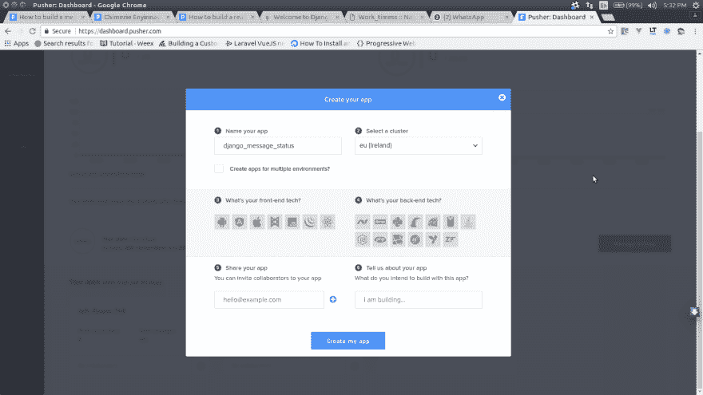

# 如何在 Django 中建立消息传递状态

> 原文:[https://dev . to/samuelayo/how-to-build-a-message-delivery-status-in-django-1c6e](https://dev.to/samuelayo/how-to-build-a-message-delivery-status-in-django-1c6e)

[T2】](https://res.cloudinary.com/practicaldev/image/fetch/s--OU2ujYXj--/c_limit%2Cf_auto%2Cfl_progressive%2Cq_66%2Cw_880/https://blog.pusher.com/wp-content/uploads/2017/05/How-to-build-a-message-delivery-status-in-Django-demo.gif)

今天，我们将使用 Django 和 Pusher 制作一个实时消息传递状态框架。为了遵循本教程，需要对 Django 和 Vue 有一个基本的了解。

## 设置姜戈

首先，如果我们还没有 Python Django 库，我们需要安装它。为了安装 Django，我们运行:

```
pip install django 
```

<svg width="20px" height="20px" viewBox="0 0 24 24" class="highlight-action crayons-icon highlight-action--fullscreen-on"><title>Enter fullscreen mode</title></svg> <svg width="20px" height="20px" viewBox="0 0 24 24" class="highlight-action crayons-icon highlight-action--fullscreen-off"><title>Exit fullscreen mode</title></svg>

安装完 Django 之后，就该创建我们的项目了。打开一个终端，使用以下命令创建一个新项目:

```
django-admin startproject pusher_message 
```

<svg width="20px" height="20px" viewBox="0 0 24 24" class="highlight-action crayons-icon highlight-action--fullscreen-on"><title>Enter fullscreen mode</title></svg> <svg width="20px" height="20px" viewBox="0 0 24 24" class="highlight-action crayons-icon highlight-action--fullscreen-off"><title>Exit fullscreen mode</title></svg>

在上面的命令中，我们创建了一个名为`pusher_message`的新项目。下一步将是在我们的新项目中创建一个应用程序。为此，让我们运行以下命令:

```
//change directory into the pusher_message directory 
cd pusher_message 
//create a new app where all our logic would live 
django-admin startapp message 
```

<svg width="20px" height="20px" viewBox="0 0 24 24" class="highlight-action crayons-icon highlight-action--fullscreen-on"><title>Enter fullscreen mode</title></svg> <svg width="20px" height="20px" viewBox="0 0 24 24" class="highlight-action crayons-icon highlight-action--fullscreen-off"><title>Exit fullscreen mode</title></svg>

一旦我们完成了新应用程序的设置，我们需要告诉 Django 我们的新应用程序，因此我们将进入`pusher_message\settings.py`并将消息应用程序添加到我们已安装的应用程序中，如下所示:

```
INSTALLED_APPS = ['django.contrib.admin', 
                  'django.contrib.auth', 
                  'django.contrib.contenttypes', 
                  'django.contrib.sessions', 
                  'django.contrib.messages', 
                  'django.contrib.staticfiles', 
                  'message'] 
```

<svg width="20px" height="20px" viewBox="0 0 24 24" class="highlight-action crayons-icon highlight-action--fullscreen-on"><title>Enter fullscreen mode</title></svg> <svg width="20px" height="20px" viewBox="0 0 24 24" class="highlight-action crayons-icon highlight-action--fullscreen-off"><title>Exit fullscreen mode</title></svg>

完成以上工作后，是时候运行应用程序了，看看是否一切顺利。

在我们的终端 shell 中，我们运行:

```
python manage.py runserver 
```

<svg width="20px" height="20px" viewBox="0 0 24 24" class="highlight-action crayons-icon highlight-action--fullscreen-on"><title>Enter fullscreen mode</title></svg> <svg width="20px" height="20px" viewBox="0 0 24 24" class="highlight-action crayons-icon highlight-action--fullscreen-off"><title>Exit fullscreen mode</title></svg>

如果我们将浏览器导航到`http://localhost:8000`，我们应该会看到以下内容:

[T2】](https://res.cloudinary.com/practicaldev/image/fetch/s--dv5U8Fnw--/c_limit%2Cf_auto%2Cfl_progressive%2Cq_auto%2Cw_880/https://blog.pusher.com/wp-content/uploads/2017/05/How-to-build-a-message-delivery-status-in-Django.png)

## 在 Pusher 上设置一个 App

至此，Django 已经准备就绪。我们现在需要设置 Pusher，并获取我们的应用程序凭证。

我们需要在[推送器](https://pusher.com/signup)上注册，创建一个新的应用，还需要复制我们的秘密应用密钥和应用 id。

[T2】](https://res.cloudinary.com/practicaldev/image/fetch/s--VbUthoSM--/c_limit%2Cf_auto%2Cfl_progressive%2Cq_auto%2Cw_880/https://blog.pusher.com/wp-content/uploads/2017/05/How-to-build-a-message-delivery-status-in-Django-2.png)

下一步是安装所需的库:

```
pip install pusher 
```

<svg width="20px" height="20px" viewBox="0 0 24 24" class="highlight-action crayons-icon highlight-action--fullscreen-on"><title>Enter fullscreen mode</title></svg> <svg width="20px" height="20px" viewBox="0 0 24 24" class="highlight-action crayons-icon highlight-action--fullscreen-off"><title>Exit fullscreen mode</title></svg>

在上面的 bash 命令中，我们安装了一个包，`pusher`。这是 Python 的官方 Pusher 库，我们将用它来触发和发送我们的消息给 Pusher。

## 创建我们的应用

首先，让我们创建一个模型类，它将生成我们的数据库结构。

让我们打开`message\models.py`，将内容替换为:

```
from django.db import models 
from django.contrib.auth.models import User 
# Create your models here. class Conversation(models.Model): 
    user = models.ForeignKey(User, on_delete=models.CASCADE) 
    message = models.CharField(blank=True, null=True, max_length=225) 
    status = models.CharField(blank=True, null=True, max_length=225) 
    created_at = models.DateTimeField(auto_now=True) 
```

<svg width="20px" height="20px" viewBox="0 0 24 24" class="highlight-action crayons-icon highlight-action--fullscreen-on"><title>Enter fullscreen mode</title></svg> <svg width="20px" height="20px" viewBox="0 0 24 24" class="highlight-action crayons-icon highlight-action--fullscreen-off"><title>Exit fullscreen mode</title></svg>

在上面的代码块中，我们定义了一个名为`Conversation`的模型。对话表由以下字段组成:

*   将消息链接到创建它的用户的字段
*   存储消息的字段
*   存储消息状态的字段
*   存储消息创建日期和时间的字段

**运行迁移**

我们需要进行迁移并运行它们，以便创建我们的数据库表。为此，让我们在终端中运行下面的代码:

```
python manage.py makemigrations python manage.py migrate 
```

<svg width="20px" height="20px" viewBox="0 0 24 24" class="highlight-action crayons-icon highlight-action--fullscreen-on"><title>Enter fullscreen mode</title></svg> <svg width="20px" height="20px" viewBox="0 0 24 24" class="highlight-action crayons-icon highlight-action--fullscreen-off"><title>Exit fullscreen mode</title></svg>

**创造我们的观点。**

在 Django 中，视图不一定指我们应用程序的 HTML 结构。事实上，我们可以将它视为我们的`Controller`，正如其他一些框架中所提到的那样。

让我们打开`message`文件夹中的`views.py`，用下面的内容替换它:

```
from django.shortcuts import render 
from django.contrib.auth.decorators import login_required 
from django.views.decorators.csrf import csrf_exempt 
from pusher import Pusher 
from .models import * 
from django.http import JsonResponse, HttpResponse 
# instantiate pusher pusher = Pusher(app_id=u'XXX_APP_ID', key=u'XXX_APP_KEY', secret=u'XXX_APP_SECRET', cluster=u'XXX_APP_CLUSTER') 
# Create your views here. 
#add the login required decorator, so the method cannot be accessed withour login @login_required(login_url='login/') 
def index(request): 
    return render(request,"chat.html"); 
#use the csrf_exempt decorator to exempt this function from csrf checks @csrf_exempt 
def broadcast(request): 
    # collect the message from the post parameters, and save to the database 
    message = Conversation(message=request.POST.get('message', ''), status='', user=request.user); 
    message.save(); 
    # create an dictionary from the message instance so we can send only required details to pusher 
    message = {'name': message.user.username, 'status': message.status, 'message': message.message, 'id': message.id} 
    #trigger the message, channel and event to pusher 
    pusher.trigger(u'a_channel', u'an_event', message) 
    # return a json response of the broadcasted message 
    return JsonResponse(message, safe=False) 

#return all conversations in the database def conversations(request): 
    data = Conversation.objects.all() 
    # loop through the data and create a new list from them. Alternatively, we can serialize the whole object and send the serialized response 
    data = [{'name': person.user.username, 'status': person.status, 'message': person.message, 'id': person.id} for person in data] 
    # return a json response of the broadcasted messgae 
    return JsonResponse(data, safe=False) 

#use the csrf_exempt decorator to exempt this function from csrf checks @csrf_exempt 
def delivered(request, id): 
    message = Conversation.objects.get(pk=id); 
    # verify it is not the same user who sent the message that wants to trigger a delivered event 
    if request.user.id != message.user.id: 
        socket_id = request.POST.get('socket_id', '') message.status = 'Delivered'; message.save(); 
        message = {'name': message.user.username, 'status': message.status, 'message': message.message, 'id': message.id} 
        pusher.trigger(u'a_channel', u'delivered_message', message, socket_id) 
        return HttpResponse('ok'); 
    else: 
        return HttpResponse('Awaiting Delivery'); 
```

<svg width="20px" height="20px" viewBox="0 0 24 24" class="highlight-action crayons-icon highlight-action--fullscreen-on"><title>Enter fullscreen mode</title></svg> <svg width="20px" height="20px" viewBox="0 0 24 24" class="highlight-action crayons-icon highlight-action--fullscreen-off"><title>Exit fullscreen mode</title></svg>

在上面的代码中，我们定义了四个主要函数，它们是:

*   `index`
*   `broadcast`
*   `conversation`
*   `delivered`

在`index`函数中，我们添加了 login required decorator，我们还传递了尚不存在的 login URL 参数，因为我们需要在`urls.py`文件中创建它。此外，我们渲染了一个名为`chat.html`的默认模板，我们也将很快创建它。

在`broadcast`函数中，我们检索正在发送的消息的内容，将其保存到我们的数据库中，并最终触发一个 Pusher 请求传入我们的消息字典，以及一个通道和事件名称。

在`conversations`函数中，我们简单地抓取所有对话，并将其作为 JSON 响应返回。

最后，我们有`delivered`函数，这个函数负责我们的消息传递状态。

在这个函数中，我们通过提供给我们的 ID 获取对话。然后，我们验证想要触发交付事件的用户不是最初发送消息的用户。此外，我们传入`socket_id`，这样 Pusher 就不会将事件广播回触发它的人。

`socket_id`代表触发事件的套接字连接的标识符。

**填充 URL 的. py**

让我们打开我们的`pusher_message\urls.py`文件，并用以下内容替换:

```
"""pusher_message URL Configuration The `urlpatterns` list routes URLs to views. 
For more information please see: https://docs.djangoproject.com/en/1.11/topics/http/urls/ 
Examples: Function views 
1\. Add an import: from my_app import views 
2\. Add a URL to urlpatterns: url(r'^$', views.home, name='home') 
Class-based views 
1\. Add an import: from other_app.views import Home 
2\. Add a URL to urlpatterns: url(r'^$', Home.as_view(), name='home') 
Including another URLconf 
1\. Import the include() function: from django.conf.urls import url, include 
2\. Add a URL to urlpatterns: url(r'^blog/', include('blog.urls')) 
""" 
from django.conf.urls import url 
from django.contrib import admin 
from django.contrib.auth import views 
from message.views import * 
urlpatterns = [url(r'^$', index), 
               url(r'^admin/', admin.site.urls), 
               url(r'^login/$', views.login, {'template_name': 'login.html'}), 
               url(r'^logout/$', views.logout, {'next_page': '/login'}), 
               url(r'^conversation$', broadcast), url(r'^conversations/$', conversations), 
               url(r'^conversations/(?P<id>[-\w]+)/delivered$',delivered) 
               ] 
```

<svg width="20px" height="20px" viewBox="0 0 24 24" class="highlight-action crayons-icon highlight-action--fullscreen-on"><title>Enter fullscreen mode</title></svg> <svg width="20px" height="20px" viewBox="0 0 24 24" class="highlight-action crayons-icon highlight-action--fullscreen-off"><title>Exit fullscreen mode</title></svg>

这个文件中有什么变化？我们在文件中添加了六条新路线。

我们已经定义了入口点，并将其分配给我们的`index`函数。接下来，我们定义了登录 URL，`login_required` decorator 将尝试访问它来验证用户。

我们使用了默认的`auth`函数来处理它，但是传入了我们自己的自定义登录模板，我们很快就会创建这个模板。

接下来，我们为`conversation`消息触发器、所有`conversations`以及最后的`delivered`对话定义了路由。

**创建 HTML** **文件**

现在我们需要创建两个 HTML 页面，这样我们的应用程序才能顺利运行。在构建应用程序的过程中，我们引用了两个 HTML 页面。

让我们在我们的`messages`文件夹中创建一个名为`templates`的新文件夹。

接下来，我们在`templates`文件夹中创建一个名为`login.html`的文件，并用下面的内容替换它:

```
<link href="https://maxcdn.bootstrapcdn.com/bootstrap/3.3.7/css/bootstrap.min.css" rel="stylesheet" integrity="sha384-BVYiiSIFeK1dGmJRAkycuHAHRg32OmUcww7on3RYdg4Va+PmSTsz/K68vbdEjh4u" crossorigin="anonymous">
 
<center>
   <p>Your username and password didn't match. Please try again.</p>
</center>
   
<center>
   <p>Your account doesn't have access to this page. To proceed, please login with an account that has access.</p>
</center>
 
<center>
   <p>Please login to see this page.</p>
</center>
  
<div class="container">
   <div class="row">
      <div class="col-md-4 col-md-offset-4">
         <div class="login-panel panel panel-default">
            <div class="panel-heading">
               <h3 class="panel-title">Please Sign In</h3>
            </div>
            <div class="panel-body">
               <form method="post" action="">
                   
                  <p class="bs-component"> 
                  <table>
                     <tr>
                        <td>{{ form.username.label_tag }}</td>
                        <td>{{ form.username }}</td>
                     </tr>
                     <tr>
                        <td>{{ form.password.label_tag }}</td>
                        <td>{{ form.password }}</td>
                     </tr>
                  </table>
                  </p> 
                  <p class="bs-component"> 
                  <center> <input class="btn btn-success btn-sm" type="submit" value="login" /> </center>
                  </p> <input type="hidden" name="next" value="{{ next }}" /> 
               </form>
            </div>
         </div>
      </div>
   </div>
</div>
Next, let us create the `chat.html` file and replace it with the following: 
<html>
   <head>
      <title> </title>
   </head>
   <link rel="stylesheet" href="https://maxcdn.bootstrapcdn.com/bootstrap/3.3.7/css/bootstrap.min.css"/>
   <script src="https://cdnjs.cloudflare.com/ajax/libs/vue/2.3.2/vue.js"></script> <script src="https://cdnjs.cloudflare.com/ajax/libs/axios/0.16.1/axios.min.js"></script> <script src="//js.pusher.com/4.0/pusher.min.js"></script> 
   <style> .chat { list-style: none; margin: 0; padding: 0; } .chat li { margin-bottom: 10px; padding-bottom: 5px; border-bottom: 1px dotted #B3A9A9; } .chat li.left .chat-body { margin-left: 60px; } .chat li.right .chat-body { margin-right: 60px; } .chat li .chat-body p { margin: 0; color: #777777; } .panel .slidedown .glyphicon, .chat .glyphicon { margin-right: 5px; } .panel-body { overflow-y: scroll; height: 250px; } ::-webkit-scrollbar-track { -webkit-box-shadow: inset 0 0 6px rgba(0,0,0,0.3); background-color: #F5F5F5; } ::-webkit-scrollbar { width: 12px; background-color: #F5F5F5; } ::-webkit-scrollbar-thumb { -webkit-box-shadow: inset 0 0 6px rgba(0,0,0,.3); background-color: #555; } </style>
   <body>
      <div class="container" id="app">
         <div class="row">
            <div class="col-md-12">
               <div class="panel panel-primary">
                  <div class="panel-heading"> <span class="glyphicon glyphicon-comment"></span> Chat </div>
                  <div class="panel-body">
                     <ul class="chat" id="chat" >
                        <li class="left clearfix" v-for="data in conversations">
                           <span class="chat-img pull-left" >  </span> 
                           <div class="chat-body clearfix">
                              <div class="header"> <strong class="primary-font" v-html="data.name"> </strong> <small class="pull-right text-muted" v-html="data.status"></small> </div>
                              <p v-html="data.message"> </p>
                           </div>
                        </li>
                     </ul>
                  </div>
                  <div class="panel-footer">
                     <div class="input-group"> <input id="btn-input" v-model="message" class="form-control input-sm" placeholder="Type your message here..." type="text"> <span class="input-group-btn"> <button class="btn btn-warning btn-sm" id="btn-chat" @click="sendMessage()"> Send</button> </span> </div>
                  </div>
               </div>
            </div>
         </div>
      </div>
   </body>
</html> 
```

<svg width="20px" height="20px" viewBox="0 0 24 24" class="highlight-action crayons-icon highlight-action--fullscreen-on"><title>Enter fullscreen mode</title></svg> <svg width="20px" height="20px" viewBox="0 0 24 24" class="highlight-action crayons-icon highlight-action--fullscreen-off"><title>Exit fullscreen mode</title></svg>

**Vue 组件和推动器绑定**

就是这样！现在，每当一个新的消息被发送，它将被广播，我们可以收听，使用我们的频道，实时更新状态。下面是我们使用 Vue.js 编写的示例组件。

**请注意:在下面的 Vue 组件中，定义了一个名为** `**queryParams**` **的新函数来序列化我们的 POST 主体，因此它可以作为** `**x-www-form-urlencoded**` **发送到服务器，而不是作为** `**payload**` **。** **我们这样做是因为** **Django 不能处理作为** `**payload**`进入的请求。

```
<script> 
var pusher = new Pusher('XXX_APP_KEY', { cluster: 'XXX_APP_CLUSTER' });
var socketId = null;
pusher.connection.bind('connected', function () { socketId = pusher.connection.socket_id; });
var my_channel = pusher.subscribe('a_channel');
var config = { headers: { 'Content-Type': 'application/x-www-form-urlencoded' } };
new Vue({
    el: "#app", data: { 'message': '', 'conversations': [] }, mounted() {
        this.getConversations();
        this.listen();
    }, methods: {
        sendMessage() { axios.post('/conversation', this.queryParams({ message: this.message }), config).then(response => { this.message = ''; }); }, getConversations() {
            axios.get('/conversations').then((response) => {
                this.conversations = response.data;
                this.readall();
            });
        },
        listen() {
            my_channel.bind("an_event", (data) => {
                this.conversations.push(data);
                axios.post('/conversations/' + data.id + '/delivered', this.queryParams({ socket_id: socketId }));
            }) my_channel.bind("delivered_message", (data) => { for (var i = 0; i < this.conversations.length; i++) { if (this.conversations[i].id == data.id) { this.conversations[i].status = data.status; } } })
        },
        readall() {
            for (var i = 0; i < this.conversations.length; i++) {
                if (this.conversations[i].status == 'Sent') {
                    axios.post('/conversations/' + this.conversations[i].id + '/delivered');
                }
            }
        },
        queryParams(source) {
            var array = [];
            for (var key in source) {
                array.push(encodeURIComponent(key) + "=" + encodeURIComponent(source[key]));
            }
            return array.join("&");
        }
    }
});
</script> 
```

<svg width="20px" height="20px" viewBox="0 0 24 24" class="highlight-action crayons-icon highlight-action--fullscreen-on"><title>Enter fullscreen mode</title></svg> <svg width="20px" height="20px" viewBox="0 0 24 24" class="highlight-action crayons-icon highlight-action--fullscreen-off"><title>Exit fullscreen mode</title></svg>

下图展示了我们所构建的内容:

[T2】](https://res.cloudinary.com/practicaldev/image/fetch/s--OU2ujYXj--/c_limit%2Cf_auto%2Cfl_progressive%2Cq_66%2Cw_880/https://blog.pusher.com/wp-content/uploads/2017/05/How-to-build-a-message-delivery-status-in-Django-demo.gif)

## 结论

在本文中，我们介绍了如何使用 Django 和 Pusher 创建实时消息交付状态。我们已经完成了从 CSRF 检查中免除某些功能，以及免除广播公司接收它们触发的事件。

代码托管在一个公共的 GitHub 库上。可以下载用于教育目的。

有没有更好的方法来构建我们的应用程序、预订或评论？请在评论中告诉我们。记住，分享就是学习。

* * *

本帖由作者[在此](https://blog.pusher.com/how-to-build-a-message-delivery-status-in-django/)原创发布。