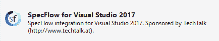
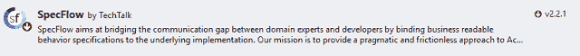
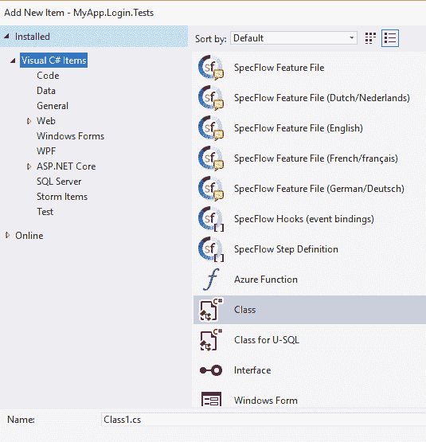

# 持续测试和 ATDD

> 原文:[https://dev.to/vanlightly/continuous-testing-and-atdd-4op8](https://dev.to/vanlightly/continuous-testing-and-atdd-4op8)

[GitHub 上的代码。](https://github.com/Vanlightly/for-sharing-code/tree/master/testing/specflow/MyApp)

软件和代码质量不仅需要工程学科，还需要测试和度量。在本文中，我们将看看验收测试驱动开发(ATDD)和持续测试是如何携手提高代码质量、缩短上市时间和降低整体风险的。

ATDD 已经存在了一段时间，但是你会惊讶于仍然不知道它的人的数量。本质上，这意味着需求是可执行的测试。业务可以定义需求，这些需求可以由测试自动化测试框架执行，以证明交付的软件满足功能需求。这听起来很抽象，但不要担心，我们会以工作代码结束这篇文章，你会亲眼看到这是如何作为代码结束的。

ATDD 的神奇之处在于，每个人都说同一种语言，小黄瓜，而且我们可以根据这些需求对交付的软件进行自动化测试。我们还将介绍什么是小黄瓜，以及如何将它翻译成代码。

但是确保软件做客户要求的事情并不是故事的结尾。代码质量是客户经常看不到并且难以衡量的东西(参见 SeaLights 关于[衡量代码质量](https://www.sealights.io/test-metrics/measuring-software-quality-a-practical-guide/)的参考资料)。有时它表现为一个错误或不稳定性，但通常它只是通过更长的交付时间来表现自己。很难衡量，因此也很难区分轻重缓急。如果你不能衡量它，甚至不能定义它，那么它最终会被忽略，导致越来越大的问题。这就是持续测试的用武之地。

持续测试是自动化测试的下一个发展。这意味着我们知道正在交付的代码质量的当前状态。它将测试执行、测试覆盖率和一系列其他指标结合成一个软件的整体视图。这也意味着您的那些自动化测试被集成到您的 CI/CD 管道中，并且持续运行。

一起使用，你就知道你的软件交付了客户要求的功能，并且它满足了使软件可维护的代码质量标准。

## ATDD 的情况

你在公司日常业务部门工作的同事和你这个开发人员说的不是同一种语言。当你的公司要求一个新的应用程序或新的特性时，他们会用他们自己的语言，并混合商业术语。他们不知道他们的要求是模棱两可或不可行的。因此，需求最终变得模糊不清，并且缺少将它们转化为软件所需的细节。更不用说被遗忘的需求了。

ATDD 通过用一种叫做“小黄瓜”的语法写下所有的需求来解决这个问题。Gherkin 是一种业务和开发人员都能理解的语言。它是一种普通的语言，但是它的结构允许它被映射成代码。

因为我们可以将其映射到代码，所以我们可以将其自动化，并创建可重复的、自动化的测试来证明软件符合功能需求。非功能性需求是另一回事，不在讨论范围之内。因此，ATDD 将项目的所有各方聚集在一个共同的愿景中，并且使用工具来自动化这个愿景的一致性。

我和 ATDD 在两个不同的团队中合作过，以我的经验来看:

*   您的开发人员很高兴，因为他们有严格的要求，没有误解或含糊的余地。
*   你的 QA 很高兴，因为枯燥重复的手工测试工作已经自动化，让他们可以从事探索性和负载测试。
*   您的客户很高兴，因为开发的软件将更接近他们的期望，并且整体质量更高。

上市时间也更快，因为:

*   开发人员和质量保证人员之间很少互相推诿
*   测试自动化消除了大量缓慢的手工测试

在本文中，我们将使用 Visual Studio 2017、MS Test 和 SpecFlow 构建一些自动化验收测试。最终结果将是集成测试，可以像测试管道中的任何其他自动化测试一样执行。不同的是，测试将是要求，并用简单的英语书写。

## SpecFlow 和小黄瓜

小黄瓜是我们用来描述需求的语法。它允许我们使用正常的语言，业务可以理解，但是可以连接到测试自动化框架来执行。虽然我们在本文中讨论了 [SpecFlow](http://specflow.org/) ，但重要的是我们如何使用小黄瓜。小黄瓜是所有 ATDD 框架都使用的语法。

如果你曾经在干净的单元测试中使用过 Arrange，Act，Assert (AAA)模式，那么小黄瓜对你来说会很容易。Gherkin 使用 Given、When、Then 直接映射到 AAA。给出的描述了系统的当前状态，当描述了要采取的行动，然后描述了预期的结果。

挑战:我们的任务是为我们的网站登录创建逻辑。用户使用用户名和密码登录。除了测试这一基本登录功能的工作情况，我们还想对登录尝试进行分级限制。

### 步骤 1 -添加 SpecFlow 扩展

由于我们正在使用 Visual Studio 2017，我们需要打开扩展和更新窗口，搜索“Visual Studio 2017 的 SpecFlow”并添加它。

[T2】](https://res.cloudinary.com/practicaldev/image/fetch/s--VUYjY25R--/c_limit%2Cf_auto%2Cfl_progressive%2Cq_auto%2Cw_880/https://thepracticaldev.s3.amazonaws.com/i/6oxd43uf4brudpqf2dt6.PNG)

### 第二步-添加测试项目

添加一个新的单元测试项目，然后将 NuGet 包 SpecFlow 添加到项目中。

[T2】](https://res.cloudinary.com/practicaldev/image/fetch/s--nBFOkWFQ--/c_limit%2Cf_auto%2Cfl_progressive%2Cq_auto%2Cw_880/https://thepracticaldev.s3.amazonaws.com/i/ixabe15nfv5i0vsnxi3p.png)

最后，确保在 app.config 中我们使用了 Mstest 测试框架。

```
<unitTestProvider name="Mstest" /> 
```

<svg width="20px" height="20px" viewBox="0 0 24 24" class="highlight-action crayons-icon highlight-action--fullscreen-on"><title>Enter fullscreen mode</title></svg> <svg width="20px" height="20px" viewBox="0 0 24 24" class="highlight-action crayons-icon highlight-action--fullscreen-off"><title>Exit fullscreen mode</title></svg>

您也可以使用 xUnit 或 nUnit。

### 步骤 3 -创建我们的第一个特征

SpecFlow 将所有的小黄瓜测试存储在特征文件中。继续单击 Add New Item，向项目添加一个名为 BasicLogin.feature 的特性文件。

[T2】](https://res.cloudinary.com/practicaldev/image/fetch/s--mO-q10xk--/c_limit%2Cf_auto%2Cfl_progressive%2Cq_auto%2Cw_880/https://thepracticaldev.s3.amazonaws.com/i/jlogbmaa6hi5l2ri3niz.PNG)

用新的特性描述和一个小黄瓜场景替换现有文本:

```
Feature: LoginSuccess
Login usernames and passwords are evaluated against stored usernames and passwords and a login result is returned.

@loginSuccess
Scenario: Correct username and password produces a success response
    Given that the user 'john' exists and his password is 'monkey'
    When the username 'john' with password 'monkey' is supplied
    Then the result should be 'Success' 
```

<svg width="20px" height="20px" viewBox="0 0 24 24" class="highlight-action crayons-icon highlight-action--fullscreen-on"><title>Enter fullscreen mode</title></svg> <svg width="20px" height="20px" viewBox="0 0 24 24" class="highlight-action crayons-icon highlight-action--fullscreen-off"><title>Exit fullscreen mode</title></svg>

如您所见，该场景清楚地描述了预期的功能行为。这对于业务分析师和程序员来说很容易理解。

### 步骤 4 -生成 C#步骤类

现在我们需要将小黄瓜转化为可执行代码。右键单击特征文件中的一些文本，然后单击生成步骤定义。在新窗口中，单击生成。

现在，您将拥有一个没有任何逻辑的 C# steps 类，但是方法及其参数绑定到了给定的小黄瓜、When、Then 行。

```
[Binding]
public class BasicLoginSteps
{
    [Given(@"that the user '(.*)' exists and his password is '(.*)'")]
    public void GivenThatTheUserExistsAndHisPasswordIs(string p0, string p1)
    {
        ScenarioContext.Current.Pending();
    }

    [When(@"the username '(.*)' with password '(.*)' is supplied")]
    public void WhenTheUsernameWithPasswordIsSupplied(string p0, string p1)
    {
        ScenarioContext.Current.Pending();
    }

    [Then(@"the result should be '(.*)'")]
    public void ThenTheResultShouldBe(string p0)
    {
        ScenarioContext.Current.Pending();
    }
} 
```

<svg width="20px" height="20px" viewBox="0 0 24 24" class="highlight-action crayons-icon highlight-action--fullscreen-on"><title>Enter fullscreen mode</title></svg> <svg width="20px" height="20px" viewBox="0 0 24 24" class="highlight-action crayons-icon highlight-action--fullscreen-off"><title>Exit fullscreen mode</title></svg>

我们可以运行我们的小黄瓜场景，SpecFlow 已经把它连接起来，我们可以用小黄瓜线的值得到字符串参数！

现在我们需要做些什么。在这个玩具示例中，凭证存储在内存字典中。

```
[Binding]
public class BasicLoginSteps
{
    [Given(@"that the user '(.*)' exists and his password is '(.*)'")]
    public void GivenThatTheUserExistsAndHisPasswordIs(string p0, string p1)
    {
        CredentialRepository.Credentials.Clear();
        CredentialRepository.Credentials.Add(p0, p1);
    }

    [When(@"the username '(.*)' with password '(.*)' is supplied")]
    public void WhenTheUsernameWithPasswordIsSupplied(string p0, string p1)
    {
        var sut = SutFactory.CreateLoginService();
        var result = sut.Login(p0, p1);
        ScenarioContext.Current.Add("result", result);
    }

    [Then(@"the result should be '(.*)'")]
    public void ThenTheResultShouldBe(string p0)
    {
        Assert.AreEqual(p0, ScenarioContext.Current["result"].ToString());
    }
} 
```

<svg width="20px" height="20px" viewBox="0 0 24 24" class="highlight-action crayons-icon highlight-action--fullscreen-on"><title>Enter fullscreen mode</title></svg> <svg width="20px" height="20px" viewBox="0 0 24 24" class="highlight-action crayons-icon highlight-action--fullscreen-off"><title>Exit fullscreen mode</title></svg>

在*给定的*方法中，我们将这些凭证存储在我们的凭证存储中。如果这是真实的，我们将把这些凭证添加到我们真实的凭证存储中，或者模仿它们。

在 *When* 方法中，我们使用从 Gherkin 场景传递来的用户名和密码执行登录代码。然后，我们将结果存储在 ScenarioContext 中。因为我们的测试跨越多个方法，甚至多个类，所以我们可以在 ScenarioContext 中存储状态。

在 *Then* 方法中，我们将存储在 ScenarioContext 中的内容与小黄瓜场景期望的内容进行比较。

这样做的真正好处是，我现在可以添加更多的小黄瓜场景，而根本不用更改 C#代码。这对生产力和干净的代码来说是非常好的。

### 第 5 步——添加更多场景而无需更多 C

我们现在添加另外三个登录场景，而不改变我们的步骤类。

```
@loginSuccess
Scenario: Correct username with different case and password produces a success response
    Given that the user 'john' exists and his password is 'monkey'
    When the username 'John' with password 'monkey' is supplied
    Then the result should be 'Success'

@loginFailure
Scenario: User does not exist
    Given that the user 'john' exists and his password is 'monkey'
    When the username 'jane' with password '12345' is supplied
    Then the result should be 'UserDoesNotExist'

@loginFailure
Scenario: Password is wrong
    Given that the user 'john' exists and his password is 'monkey'
    When the username 'john' with password '12345' is supplied
    Then the result should be 'PasswordWrong' 
```

<svg width="20px" height="20px" viewBox="0 0 24 24" class="highlight-action crayons-icon highlight-action--fullscreen-on"><title>Enter fullscreen mode</title></svg> <svg width="20px" height="20px" viewBox="0 0 24 24" class="highlight-action crayons-icon highlight-action--fullscreen-off"><title>Exit fullscreen mode</title></svg>

### 第 6 步-更多小黄瓜语法-背景

到目前为止，我们已经看到了特性描述和场景。每个场景都有一个用于组织测试的@标签，以及一个给定的 When Then 结构。

现在我们来看看背景。有时你会一遍又一遍地重复同样的事情。在这些情况下，您可以通过向要素添加背景来减少重复。

```
Feature: RateLimiting
    Login attempts of a given user must be limited to a certain amount X within a time period Y. 
    This is important to avoid brute force attacks on our users.

Background:
    Given that the user 'john' exists and his password is 'monkey'
    And that the user 'mick' exists and his password is '123456'

@rateLimiting
Scenario: Number of attempts less than limit
    Given the limit period is 10 seconds
    And the limit in that period is 3
    When 2 logins with 0 seconds delay are attempted with user 'john' and password '123'
    Then the results should be 'WrongPassword,WrongPassword'

@rateLimiting
Scenario: Attempts inside rate limit
    Given the limit period is 10 seconds
    And the limit in that period is 3
    When 4 logins with 4 seconds delay are attempted with user 'john' and password '123'
    Then the results should be 'WrongPassword,WrongPassword,WrongPassword,WrongPassword'

@rateLimiting
Scenario: Attempts exceeds limit
    Given the limit period is 10 seconds
    And the limit in that period is 3
    When 4 logins with 0 seconds delay are attempted with user 'john' and password '123'
    Then the results should be 'WrongPassword,WrongPassword,ReachedRateLimit,ReachedRateLimit' 
```

<svg width="20px" height="20px" viewBox="0 0 24 24" class="highlight-action crayons-icon highlight-action--fullscreen-on"><title>Enter fullscreen mode</title></svg> <svg width="20px" height="20px" viewBox="0 0 24 24" class="highlight-action crayons-icon highlight-action--fullscreen-off"><title>Exit fullscreen mode</title></svg>

因为每个场景都需要用户 John，所以我们将其放在特征背景中，以避免重复。当我们生成 steps 类时，您会注意到背景给定项没有包含在内，因为它们已经存在于 BasicLoginSteps.cs 中。

这个特性的另一个新特性是使用逗号分隔的列表值。但是默认情况下它不会被解析成一个列表。带有 CSV 值的 When 的 C#被绑定到字符串参数。

```
[Then(@"the results should be '(.*)']")]
public void ThenTheResultsShouldBe(string p0)
{
    ScenarioContext.Current.Pending();
} 
```

<svg width="20px" height="20px" viewBox="0 0 24 24" class="highlight-action crayons-icon highlight-action--fullscreen-on"><title>Enter fullscreen mode</title></svg> <svg width="20px" height="20px" viewBox="0 0 24 24" class="highlight-action crayons-icon highlight-action--fullscreen-off"><title>Exit fullscreen mode</title></svg>

这可以修改为:

```
[Then(@"the results should be '(.*)']")]
public void ThenTheResultsShouldBe(List<string> p0)
{
    ScenarioContext.Current.Pending();
}

[StepArgumentTransformation]
public List<String> TransformToListOfString(string commaSeparatedList)
{
    return commaSeparatedList.Split(',').ToList();
} 
```

<svg width="20px" height="20px" viewBox="0 0 24 24" class="highlight-action crayons-icon highlight-action--fullscreen-on"><title>Enter fullscreen mode</title></svg> <svg width="20px" height="20px" viewBox="0 0 24 24" class="highlight-action crayons-icon highlight-action--fullscreen-off"><title>Exit fullscreen mode</title></svg>

您希望将 TransformToListOfString 方法放在一个单独助手类中，因为多个 steps 类都需要它。只需记住将[Binding]属性添加到类中，以便 SpecFlow 可以找到它。

### 第 7 步-更多小黄瓜语法-表格

当我们有非常数据驱动的验收测试时，一个表格更具可读性，通常也更容易使用。

我们可以以两种方式使用表格:

*   为我们的绑定方法制作表参数
*   使用表格以不同的变量多次执行一个场景

让我们制作一个基于表格的 BasicLogin 特性版本。

```
Feature: BasicLoginWithTables
    When correct usernames and passwords are supplied a login success
    response is returned

Background:
    Given the following users exist:
    | User | Password |
    | john | monkey   |
    | mick | 123456   |
    | joe  | 654321   |

@TableBased
Scenario: Usernames and passwords produce different responses
    When the username <username> with password <password> is supplied
    Then the result should be <result>

Examples:
    | username | password | result           |
    | john     | monkey   | Success          |
    | john     | 12345    | WrongPassword    |
    | jane     | 123      | UserDoesNotExist | 
```

<svg width="20px" height="20px" viewBox="0 0 24 24" class="highlight-action crayons-icon highlight-action--fullscreen-on"><title>Enter fullscreen mode</title></svg> <svg width="20px" height="20px" viewBox="0 0 24 24" class="highlight-action crayons-icon highlight-action--fullscreen-off"><title>Exit fullscreen mode</title></svg>

后台创建三个用户及其密码。该场景执行三次，使用示例表中指定的值。这使得一些测试更容易阅读，编写更快。

场景背后的 C#与我们最初的 steps 类相同，因为它仍然处理单个变量。而背景中的给定接受表作为方法参数。

```
[Given(@"the following users exist:")]
public void GivenTheFollowingUsersExist(Table table)
{
    ScenarioContext.Current.Pending();
} 
```

<svg width="20px" height="20px" viewBox="0 0 24 24" class="highlight-action crayons-icon highlight-action--fullscreen-on"><title>Enter fullscreen mode</title></svg> <svg width="20px" height="20px" viewBox="0 0 24 24" class="highlight-action crayons-icon highlight-action--fullscreen-off"><title>Exit fullscreen mode</title></svg>

如果我们创建一个 UserRecord 类，我们可以将这个表转换为一个列表。您需要使用 TechTalk 添加该行。SpecFlow . Assist 去你的班级。

```
[Given(@"the following users exist:")]
public void GivenTheFollowingUsersExist(Table table)
{
    CredentialRepository.Credentials.Clear();
    var users = table.CreateSet<UserRecord>();
    foreach(var user in users)
        CredentialRepository.Credentials.Add(user.Username, user.Password);
} 
```

<svg width="20px" height="20px" viewBox="0 0 24 24" class="highlight-action crayons-icon highlight-action--fullscreen-on"><title>Enter fullscreen mode</title></svg> <svg width="20px" height="20px" viewBox="0 0 24 24" class="highlight-action crayons-icon highlight-action--fullscreen-off"><title>Exit fullscreen mode</title></svg>

### 步骤 8 -将你的测试添加到你的测试管道中。

因为 SpecFlow 测试与任何其他单元或集成测试一样被对待，所以它们像任何其他测试一样集成到您现有的测试管道中。现在，每当有代码签入时，您都可以立即获得反馈。

## 结论

在现代软件开发中，持续测试是必须的。通过使用验收测试驱动的开发，您可以看到代码质量的重大改进和上市时间的缩短。像 SpecFlow 这样的框架让它变得如此简单！将它与其他代码质量指标、代码覆盖率和其他测试指标结合起来，就可以降低每个软件项目的风险。开发者更开心，QA 更开心，你的客户也更开心。

[GitHub 上的代码。](https://github.com/Vanlightly/for-sharing-code/tree/master/testing/specflow/MyApp)