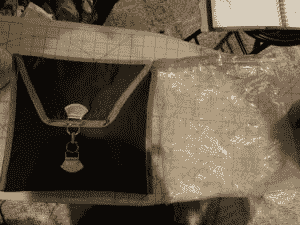
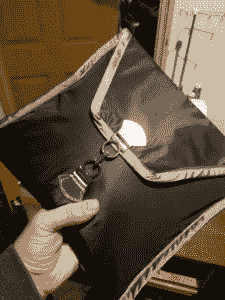
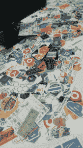
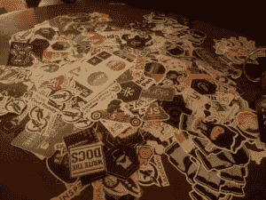
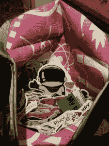
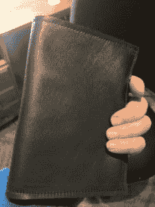
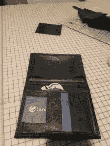

# 贴纸包

> 原文:[https://dev.to/wiredferret/the-sticker-bag-2mb3](https://dev.to/wiredferret/the-sticker-bag-2mb3)

我在[女士扬声器闲聊](http://www.heidiwaterhouse.com/2017/06/09/lady-speaker-small-talk/)中稍微谈到了这一点，但让我扩展一下。

我有一包贴纸，每次去参加会议都会带着。本周，我把我的游戏从“意义重大的古代加仑 ziploc 袋”升级为“定制袋”。我只花了一点时间就缝好了，但是我对它非常满意，它使用了我上次去纽约市服装区时得到的一个扣件。

 

我之所以努力，是因为贴纸包对我来说很重要——一部分是个人品牌，一部分是对话的开始。

 

我一年要参加 20 多个会议，在每个会议上，我收集供应商和会议贴纸，我和给我这些贴纸的人交谈，然后我在午餐或晚会上把它们摊在桌子上，邀请人们来戳它们，拿走他们想要的任何东西。

这是我有过的最天才的自发想法，因为它带给我的是:

*   低调，低压力的机会，甚至与害羞的人交谈
*   谈论不同技术以及人们感兴趣和寻找的东西的方式
*   一种衡量与会者群体兴奋程度的方法
*   值得记忆
*   对贴纸的市场需求和限制有着极其敏锐的理解

# 贴纸是什么意思

我已经到了成为丽莎·弗兰克的年龄了。我清楚地记得把科学展的奖金花在了奇怪的全息独角兽上。事实证明，我们很多人从未完全失去整洁贴纸的乐趣。我们把它们放在电脑上、水瓶上、笔记本上、手提箱上、啤酒冰箱上，任何我们能保持静止的东西上。

我们将它们用作联系标识符。对于其他人来说，这可能是一个不起眼的标签，但如果你关心 Debian，当你看到别人设备上的 Debian 标签时，你就会知道。你知道他们可能会和你谈论 Debian。现在想象一下，把这种对话方式重复 20 次。

我们用它们作为政治声明。一张 EFF 贴纸意味着什么，就像一张写着“支持你的姐妹，而不仅仅是你的姐妹”的贴纸一样。彩虹/骄傲贴纸飞出我的收藏，因为说“这里不是每个人都是直的”太重要了。

有些人对他们将使用哪种贴纸有规定。"我只为我投资的项目贴贴纸."或者“我只使用我所用项目的贴纸。”或者“只有有趣的贴纸”或者“我的笔记本电脑有一个颜色主题。”

这一切对我来说都有意义。在很多方面，我们的笔记本电脑代表了我们的脸，尤其是在会议上。我们隐藏在他们的身体或隐喻背后。当我们做报告时，他们会从讲台上偷看。当我们在走廊里工作时，它们表明了我们的身份。

# 秘密贴纸规则

我认为关于科技贴有一些通用的规则。我对此感受如此强烈，以至于在我走进世界之前的一天，当我出现在 LaunchDarkly 办公室时，我花了两个小时谈论贴纸，以及我想分发的东西。

## 我的理想贴纸

*   小-2 英寸是理想的。除非你为一家公司工作，否则你不会想给他们 1/6 的可用笔记本电脑空间。
*   可贴瓷砖——圆形贴纸是自私的，因为你不能将它们堆叠或移动到任何其他贴纸上。我更喜欢六角形，这是相对标准的，尤其是在开源项目中，这要感谢 RedHat。PS–Heroku，形状合适，略大，而且它打破了瓷砖。我在评判。
*   有趣——厨师的“撒在一些 DevOps 上”贴纸很搞笑，很可爱，不会侮辱任何人。它们可能是最优的。我也很喜欢 Logstash 贴纸，那是一根木头。留着小胡子。而且我求了一整包的“我呼机”。因为人们觉得*很搞笑*。你不需要搞笑。其他的选择是可爱的，完全直的，或者你的标志但是有颜色的。
*   上面有你的名字。我无法告诉你当他们有可爱的镶嵌宝石的动物时，对流入数据来说有多悲伤，但是他们的名字没有出现在贴纸上，所以我就像，嗯，这是一只几维鸟？从某人那里？是不是很可爱？把你的名字写在贴纸上，除非你是，比如，塔吉特或者苹果。
*   不是性别歧视，种族歧视，或者其他的混蛋。我拿出一堆写着“UX 男人”的贴纸，因为虽然这个双关语很可爱，但排除在外并不可爱。我不会放相扑逻辑贴，因为我觉得这是一个丑陋的漫画。Basho 也在那条线上。

我真的很喜欢 LaunchDarkly 设计师 Melissa 设计的贴纸。其中大多数是六边形，有几个非常小的长方形，几乎适合任何地方，令人惊讶的是，最佳移动贴纸异常大，是我们的宇航员 Toggle 的代表。

[T2】](https://res.cloudinary.com/practicaldev/image/fetch/s--REq4iYGH--/c_limit%2Cf_auto%2Cfl_progressive%2Cq_auto%2Cw_880/http://www.heidiwaterhouse.com/wp-content/uploads/2018/01/sticker-bag-interior-225x300.jpg)

父母的爱是不分性别的，他们会给每个孩子带回家一张贴纸。

# 其他讲义

当我代表一家公司而不仅仅是我自己去参加会议时，我发现了一些其他适合我的事情。特性管理是一个足够新的市场空间，人们并不总是知道我的意思，或者想要一些东西带回他们的团队来解释它。Melissa 和我一起制作了一张小明信片，在正面有一些品牌标识，背面有几段文字解释我们的商业案例。它小到可以塞进口袋或会议包，当你回到办公桌后，你可能会再读一遍，以记住你为什么拿起它。

我还带着名片，这样人们就有办法特别联系到我。我是思考如何解决他们问题的人和我团队中能够明确回答他们问题的人之间的信息渠道。所以如果你对我说“Heidi，我很想做特性管理，但是它尊重 semver 吗？”我给你我的名片，你给我写信，然后我发现是的，我们这个季度会有。耶！

当然，我保留了几套 LaunchDarkly 贴纸，它们不会与贴纸包的混乱混在一起，这样我就可以把它们分发给人们，特别是在我们谈论 LaunchDarkly 的时候。出于令我困惑的原因，虽然 Moo 为他们的小卡片和名片提供了出色的卡座，但他们没有为这两种尺寸的明信片提供卡座，在亚马逊和 Etsy 上寻找只是一次绝望和歧义之旅。

所以我花钱买了一些材料，自己做了一个，一旦我用 Instructables 整理出我的认证，我会把过程贴出来，但是看，我为我所有的卡做了一个卡座！

 

明信片的一面有角撑，所以我可以在里面叠几张明信片，名片夹的一面也可以放贴纸。整件衣服的尺寸正好可以放进我的帽衫口袋，因为我在会场上 95%的时间都穿着它。

## 我不出什么手

t 恤。这真是一场噩梦，因为它们体积庞大，大小不一，而我是轻装上阵。如果你想要一件 t 恤衫，写信给我们，我们会把它寄给你。[T2】](https://res.cloudinary.com/practicaldev/image/fetch/s--TiSCvLN7--/c_limit%2Cf_auto%2Cfl_progressive%2Cq_auto%2Cw_880/https://s.w.oimg/core/emoji/2.3/72x72/1f609.png)

袜子。因为我们还没有，但我继续希望我们会在科技袜子热(由 StitchFix，那些狡猾的天才发起)消失之前得到袜子。我喜欢科技袜。最近一次统计，我有 22 双科技袜，我目前最喜欢的一双是 Sentry.io 的，因为它们有一个版本，袖口颜色是尖叫珊瑚色。

# 总而言之

在与人交往时，给他们一些有形的东西是很好的，但不是累赘，这样他们就会深情地记住你。此外，我很高兴我买了一台缝纫机，尽管它是一年三个星期中的一个胖自行车将是有用的。