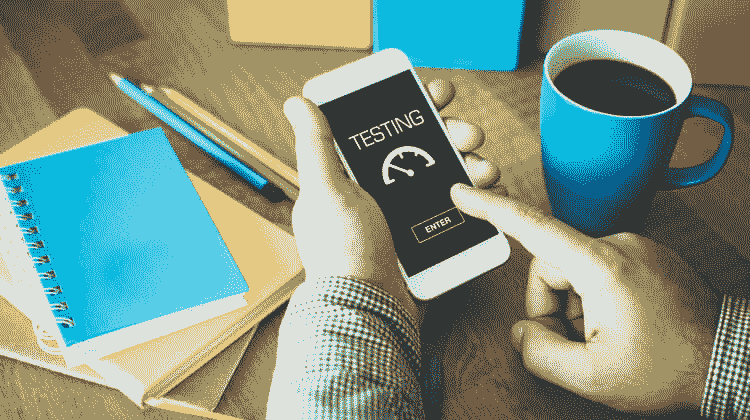

# 移动应用可用性测试–清单！

> 原文:[https://dev.to/ryanmiller/mobile-app-usability-testing-核对表-3hij](https://dev.to/ryanmiller/mobile-app-usability-testing--checklist-3hij)

[T2】](https://res.cloudinary.com/practicaldev/image/fetch/s--gMMUTZRp--/c_limit%2Cf_auto%2Cfl_progressive%2Cq_auto%2Cw_880/https://thepracticaldev.s3.amazonaws.com/i/s8x45ibh4w6za3ntrv67.jpg)

在我们开始之前，首先要知道什么是移动应用可用性测试？嗯，在现代开发环境中，移动应用程序开发者已经成长为向用户提供更高的价值和质量，仅仅测试应用程序的功能准确性和可行性是不够的。必须提前采取措施，以确保移动应用程序易于接受、具有交互性和外观，足以吸引用户并很好地满足他们的需求。

移动应用可用性测试帮助开发者了解并应用从可用性角度来看很重要的变化。这包括在确定和优化移动应用程序的质量时参考产品用户和他们的需求，以便为他们提供完整的解决方案，该解决方案能够很好地满足用户需求，以他们理解的方式与他们沟通，并让他们达到满意的程度。

## 以下是可用性测试的重要特征

*   包括将在测试程序中使用的方法。
*   准备一份任务清单，列出并描述需要遵循的各种活动和实践。
*   它配备了测试所需的设施、环境和工具。
*   它应该明确测试的领域和范围。
*   包含关于交付测试结果的报告和分析的部分。

## 手机 app 可用性测试方法

评估移动应用可用性的实验室方法是所有方法中最好也是最受欢迎的。在这里，当测试应用程序的可用性时，你需要一些工具和资源来帮助你确定和获得正确的数字和细节。以下是使用的主要组件:

*   **摄像机**

摄像机记录用户在应用程序上的活动和移动，以捕捉用户如何与应用程序交互，并知道如何在可用性方面改进它。为了使它更加有效，可以使用更多的相机从不同的角度捕捉它，并获得它的整体视图。你可以让用户浏览移动应用程序的不同模块，使用不同的功能，并揭示他们觉得哪些地方令人印象深刻，以及作为用户它如何让他们恼火。你可以从不同的角度衡量他们的反应，如功能合规性、导航易用性、操作一致性、沟通价值和应用程序的辅助反应。

*   **录音软件**

记录软件应该允许你有效地记录程序和行动的应用程序，并处理它们，让你高质量的结果。在这里，您应该拥有一个包容的环境，能够记录、查看、分析、解释和构建您的可用性报告(由详细的图表和插图支持)，以获得关于移动应用使用的正确信息，帮助您获得最佳的可用性测试结果。

*   **可选的网络摄像头**

使用网络摄像头可以让你在与应用程序交互时监控用户的各种面部表情和手势。这为你提供了用户反应的详细信息，因为你能够注意到他们的面部反应和肢体语言，作为对你的应用程序的不同产品、功能和特点的反应。使用网络摄像头结合屏幕录制可以为您提供关于应用可用性的必要信息和见解。

*   **一个测试位置**

你需要一个合适的生态系统来成功地进行测试。一个理想的测试地点配备了一个具有补充工具和资源的包容性基础设施，可以让您准确、有效和可靠地进行测试。您在测试场所使用的技术应该是最新的，并且应该与流程保持一致并很好地嵌入其中，以使您在可用性测试中获得最大价值。

*   **测试架构师/主持人**

你应该只和有经验的测试主持人一起去。这是因为你需要安排一个人专门管理测试过程，并把事情组织在一起，以帮助你获得想要的结果。在这里，在测试架构师的帮助下，您将能够最有效地进行可用性测试，而不会面临太多与过程和执行相关的问题。此外，在极端情况和不利结果的情况下，他们可以很好地管理和平息情况。

## 手机可用性测试的顶级工具

**1 .监视发送〔t1〕**

使用 Watchsend，您可以运行应用程序的测试版。因此，您可以在发布应用程序之前安排好您需要的所有信息。当你计划快速发布时，这给了你一个很好的理由去使用 Watchsend。该工具允许您记录用户与应用程序的交互，提供有关发出的请求、遵循的导航和使用的功能的信息，以收集足够的数据来评估和规划应用程序的内容和演示，并准备好测试版并测试其质量。

**#2。UXCam**

另一个测试应用可用性的有用工具！使用 UXCam，您可以记录用户如何使用您的应用程序，并控制他们看到的内容和他们看到的方式，从而让您获得更好的效果。该工具不仅允许您跟踪应用程序上的重要事件，还可以详细分析用户行为，并通过基于获取的结果可视化数据来优化用户体验。

**#3。土坯边缘检测**

这个工具在设计师和开发人员中非常受欢迎，用于检查不同设备和显示类别上的应用程序设计。Adobe Edge Inspect 可以同样有效地与可以访问 Google Chrome 的 Windows 或 Mac 计算机配合使用。该工具允许您连接不同的设备，并在一个通用的显示环境中同步它们，以验证和优化可用性，因为它们可以对其进行完美的编辑。该工具为创建的页面提供的自动更新进一步使其更加有用。

**#4。斯卡拉预览**

这个工具可以在 Android 和 iOS 商店上访问。仅当两台设备连接在一起共同使用时，您才可以使用 Skala Preview。因此，你可以让一台 Mac 与一台 iOS 设备或一台 Android 设备一起工作，因为你可以预览高质量的设计以进行可用性测试。这个工具允许开发人员测试文本和抽头大小。在 Skala 的帮助下，你可以在设计阶段测试应用程序本身，而无需进行任何实时编辑。这为您作为测试工程师节省了很多痛苦和时间。

**五号。用户缩放**

被认为是可用性测试工具中最好的选择之一，Userzoom 允许开发者拥有重要的信息，比如卡片存储，树测试等等。它主要用于三个主要领域:

*   作为企业的解决方案中心。
*   确保对调查进行修改，以提高问卷的性能。
*   通过竞争分析设定基准。

这个工具最好的一点是，它能以令人难以置信的速度获取您需要参考和使用的所有数据。在这里，你可以在几个小时内获得定量(访问量)和定性(用户体验)的数据，即使是大量的数据。

**#6。谷歌的友好测试**

另一个带有谷歌标签的免费工具。毫无疑问，由于它提供的可靠性和可访问性，世界各地的测试专业人员都在使用它。它适用于任何以 Chrome 为浏览器的设备。该工具配备了广泛的移动友好的测试选项，并允许用户在富有表现力和可展示的界面的帮助下，有效而轻松地与可用性测试环境进行交互。

## 结论

这些是一些主要的支持者和实践，帮助[移动应用开发者](https://www.itfirms.co/top-mobile-app-development-companies/)在可用性测试的尝试中带来合规性和充分性。如果您计划并放置它们，使它们为您提供实用程序和资源的正确组合，确保在一个包容的测试设施内实现标准化流程，您应该会获得最佳结果。如果你不这样做，你可能会错过达到你需要忍受的移动应用可用性的质量。