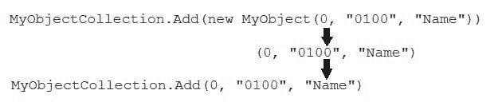

# Visual Studio 中的通配符正则表达式查找和替换

> 原文：<https://dev.to/collinbarrett/wildcard-regex-find-and-replace-in-visual-studio-1470>

[T2】](https://collinmbarrett.com/wildcard-regex-find-replace-visual-studio/)

## 穿出删除键

最近修复一个 bug 时，在我工作的范围内有一个模式看起来像这样:

```
MyObjectCollection.Add(new MyObject(0, "0100", "Name"))MyObjectCollection.Add(new MyObject(0, "0200", "Address")) 
```

该方法的开发人员在相同的方法中使用了大约一百次这种模式！为了进行迭代重构，我为 Add()创建了一个扩展重载方法，它隐藏并消除了重复的 MyObject 实例化。

然而，重构原始方法需要大量的手动选择和删除。我必须删除`new MyObject(`和`)`的每个实例。我可以对所有的`new MyObject(`实例使用标准的查找和替换，但是我如何删除它们相应的右括号呢？

## 正则表达式查找和替换

与其花时间手动删除重构的代码，我决定花(尽管同样多)时间用正则表达式查找和替换来自动化它。

Regex 很强大，但是我很少使用它，所以我没有掌握任何有意义的技能。当我最终为上述问题确定了一个可用的模式时，我不得不记下它以供以后参考。

## TL；灾难恢复解决方案

在 Visual Studio 的“查找”字段中:

```
(MyObjectCollection.Add&#40;new MyObject)(&#40;[^)]*&#41;)(&#41;) 
```

在“替换”字段:

```
MyObjectCollection.Add$2 
```

## 解解释

我用括号将查找模式分成三组。因为括号包含正则表达式的意义，所以我对现有的括号字符`&#40;`和`&#41;`进行了编码。Visual Studio 用查找字段中第二个括号分组的内容替换替换字段中的`$2`变量。因此，这个解决方案用 replace regex 模式替换 find regex 模式捕获的每一整行(用`$2`变量保留唯一的 MyObject 构造函数参数)。

<figure>[](https://collinmbarrett.com/media/regexSolutionExplanation_collinmbarrett.jpg) 

<figcaption id="caption-attachment-5773">图中的正则表达式查找和替换解决方案</figcaption>

</figure>

有没有更高效的方法来做到这一点？很有可能。但是，这个方法奏效了。

*经由[栈溢出](https://stackoverflow.com/questions/24135006/regex-that-match-any-character-inside-a-parenthesis/24135281)T3】*