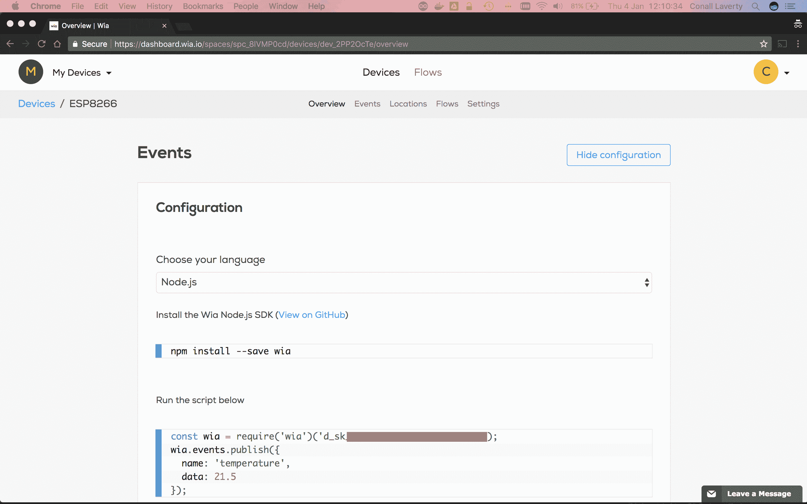
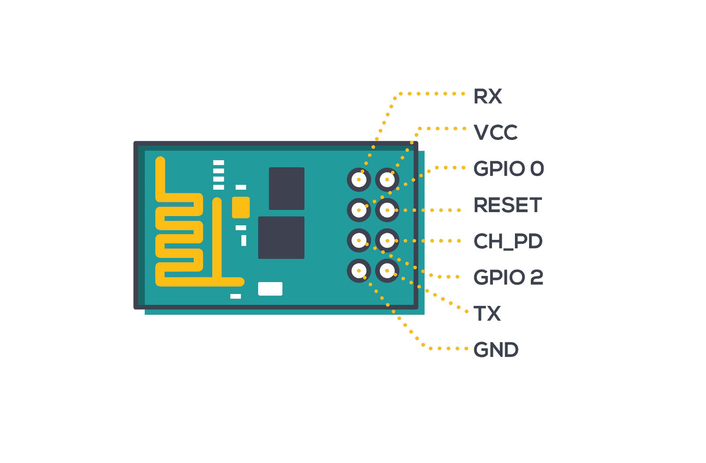
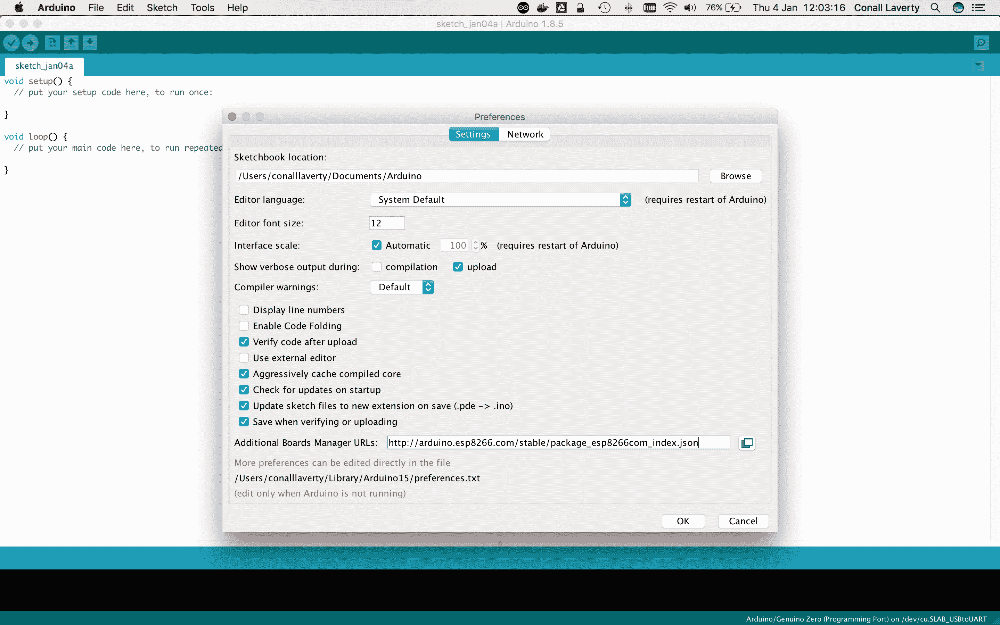
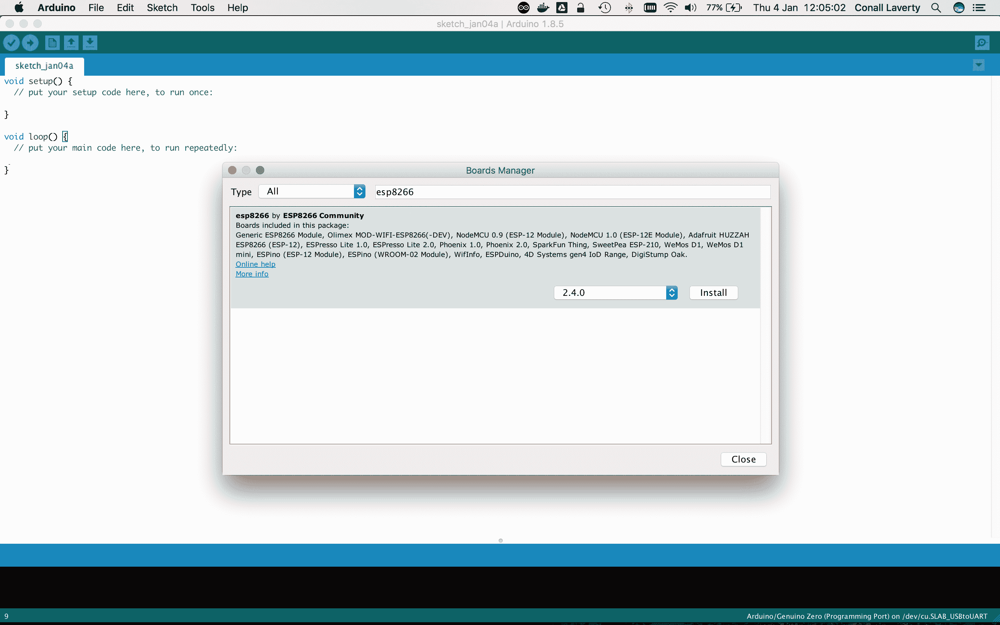
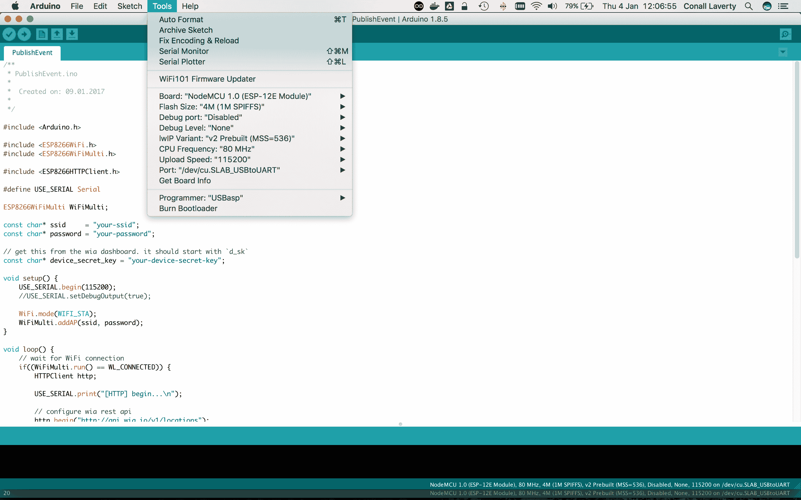
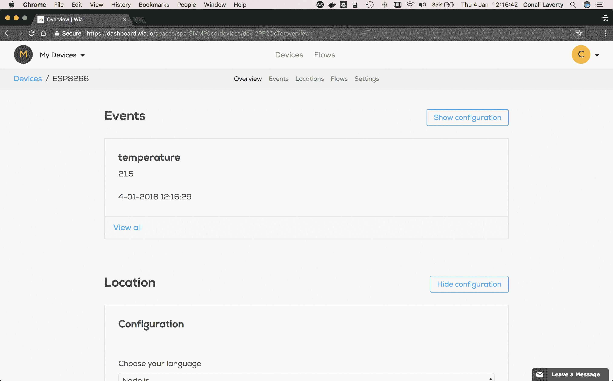

# 将事件从 ESP8266 发送到 Wia

> 原文:[https://dev . to/conalllaverty/send-events-from-an-esp8266-to-wia-50f 0](https://dev.to/conalllaverty/send-events-from-an-esp8266-to-wia-50f0)

大家好，

今天我们将学习如何从 ESP8266 向 Wia 发送数据。该 ESP8266 物联网演示将介绍从零开始到发布您自己的活动和位置所需的所有步骤。我们开始吧！

### 创建您的 Wia 帐户

如果您还没有，请[点击此处](https://dashboard.wia.io/signup)注册。

### 设置一个空格

登录后，为您的设备设置一个新的空间。我要叫我的`My Devices`。当您的共享空间准备就绪时，您应该会看到如下所示的屏幕。

[T2】](//images.contentful.com/i5evrz7h2uo7/1bfPDxMf4s0SyaOSkCEsum/f0dc8f7ebe0076a222b495d36376f4f7/Screen_Shot_2018-01-01_at_12.38.44.png)

### 创建一个设备

通过在面板中输入设备名称来创建新设备。然后，您将被重定向到设备概述页面。这里你会看到设备的密钥(应该以`d_sk`开头)。记下这个，我们以后会用到它。

[T2】](//images.contentful.com/i5evrz7h2uo7/5UKUiYakvu2yCWAGkwOCa6/cbda91da4eedf6c0fe1b324a34e38987/Screen_Shot_2018-01-04_at_12.10.31.png)

### 连接到板卡

注:如果您的主板有一个微型 USB 端口，您可以跳过这一步。

通过 USB 转 TTL 电缆/适配器将您的主板连接到笔记本电脑/台式机。这是显示不同连接的引脚排列。

[T2】](//images.contentful.com/i5evrz7h2uo7/1zvTmj97OQAc46cuC4coGu/34ab2fc5e04dde88b3455b84e7fd8ae1/Wia_Blog_Illustration_1600x1052_03B.png)

连接应该是这样的:

*   ESP8266 ESP-01 USB TTL
*   GND -全球导航卫星系统
*   TX - RX
*   RX - TX
*   VCC - 3.3V (+)
*   CH_PD - 3.3V (+)
*   GPIO0 - GND(闪烁板时)

注意:您可能需要安装 FTDI 驱动程序才能显示您的设备。请向您的适配器制造商咨询最新版本。如果你被困在这里，[发微博给我们](https://www.twitter.com/wiaio)寻求支持。

### 设置您的环境

*   安装 Arduino IDE。你可以在这里下载适用于 Mac OS X、Windows 和 Linux 的软件。
*   启动 Arduino 应用程序并打开偏好设置。
*   在附加的董事会经理 URL 中输入`http://arduino.esp8266.com/stable/package_esp8266com_index.json`。如果需要多个，可以用逗号分隔。

[T2】](//images.contentful.com/i5evrz7h2uo7/1nAulaFjAsImkUIOmMuYk6/1aad804141f349bb44dbe6a477d01f48/Screen_Shot_2018-01-04_at_12.03.11.png)

*   转到工具>电路板>电路板管理器。
*   搜索`esp8266`。找到后，单击安装。

[T2】](//images.contentful.com/i5evrz7h2uo7/6hPtzz0sQ8Ue4yEkCQCawm/77fae51d3f6e065145e147418dc94c22/Screen_Shot_2018-01-04_at_12.04.59.png)

*   进入工具>电路板，选择您的 ESPP8266 电路板类型，然后选择您的类型。对于这个例子，我使用的是`NodeMCU 1.0 (ESP-12E Module)`。
*   注意:检查上传速度是否设置为 115200，是否选择了正确的端口。

[T2】](//images.contentful.com/i5evrz7h2uo7/1tKBKsaU7ew8qmMwqiC2oI/0a3d20c07f7b6a70371c1baa9349fbf3/Screen_Shot_2018-01-04_at_12.06.55.png)

### 创建草图

*   点击文件>新建创建一个新草图。
*   复制并粘贴下面的发布事件示例代码。你也可以在 GitHub [这里](https://github.com/wiaio/wia-board-examples/tree/master/Arduino/ESP8266)查看。在那里你可以直接看到如何发布事件和地点。

```
/**
 * PublishEvent.ino
 *
 *  Created on: 09.01.2017
 *
 */

#include <Arduino.h>

#include <ESP8266WiFi.h>
#include <ESP8266WiFiMulti.h>

#include <ESP8266HTTPClient.h>

#define USE_SERIAL Serial

ESP8266WiFiMulti WiFiMulti;

const char* ssid     = "your-ssid";
const char* password = "your-password";

// get this from the wia dashboard. it should start with `d_sk`
const char* device_secret_key = "your-device-secret-key";

void setup() {
    USE_SERIAL.begin(115200);
    //USE_SERIAL.setDebugOutput(true);

    WiFi.mode(WIFI_STA);
    WiFiMulti.addAP(ssid, password);
}

void loop() {
    // wait for WiFi connection
    if((WiFiMulti.run() == WL_CONNECTED)) {
        HTTPClient http;

        USE_SERIAL.print("[HTTP] begin...\n");

        // configure wia rest api
        http.begin("http://api.wia.io/v1/events");

        USE_SERIAL.print("[HTTP] POST...\n");

        // set authorization token
        http.addHeader("Authorization", "Bearer " + String(device_secret_key));

        // set content-type to json
        http.addHeader("Content-Type", "application/json");

        // start connection and send HTTP headers. replace name and data values with your own.
        int httpCode = http.POST("{\"name\":\"temperature\",\"data\":21.5}");

        // httpCode will be negative on error
        if(httpCode > 0) {
            // HTTP header has been send and Server response header has been handled
            USE_SERIAL.printf("[HTTP] POST... code: %d\n", httpCode);

            // file found at server
            if(httpCode == HTTP_CODE_OK) {
                String payload = http.getString();
                USE_SERIAL.println(payload);
            }
        } else {
            USE_SERIAL.printf("[HTTP] POST... failed, error: %s\n", http.errorToString(httpCode).c_str());
        }

        http.end();
    }

    delay(10000);
} 
```

<svg width="20px" height="20px" viewBox="0 0 24 24" class="highlight-action crayons-icon highlight-action--fullscreen-on"><title>Enter fullscreen mode</title></svg> <svg width="20px" height="20px" viewBox="0 0 24 24" class="highlight-action crayons-icon highlight-action--fullscreen-off"><title>Exit fullscreen mode</title></svg>

替换下列变量的下列值:

*   `ssid`使用您的 WiFi 网络名称。
*   `password`用你的 WiFi 网络密码。
*   `device_secret_key`使用之前的设备密钥(以`d_sk`开头的密钥)。

验证/编译代码。如果运行正确，则转到草图>上传，将其发送到您的 ESP8266。

[T2】](//images.contentful.com/i5evrz7h2uo7/3zDozXJcEEC8mGkAIUgqWE/fe893983954906786622377197bf18f6/Screen_Shot_2018-01-04_at_12.16.34.png)

就是这样，伙计们！

如果您在设置方面需要任何帮助，[发推特给我们](https://twitter.com/wiaio)或发电子邮件给 [support@wia.io](//mailto:support@wia.io)

*参考资料*

[Espressif Systems](https://www.espressif.com)是一家全球领先的物联网公司。他们制造了广受欢迎的 ESP8266 和 ESP32 芯片。他们是一个由芯片设计专家、软件/固件开发人员和营销人员组成的创新团队。他们致力于提供业界最好的物联网设备和软件平台。