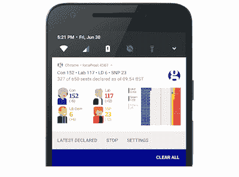
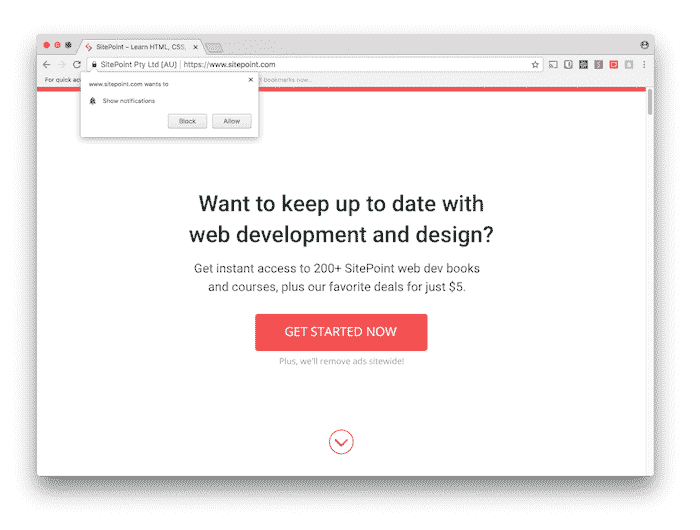
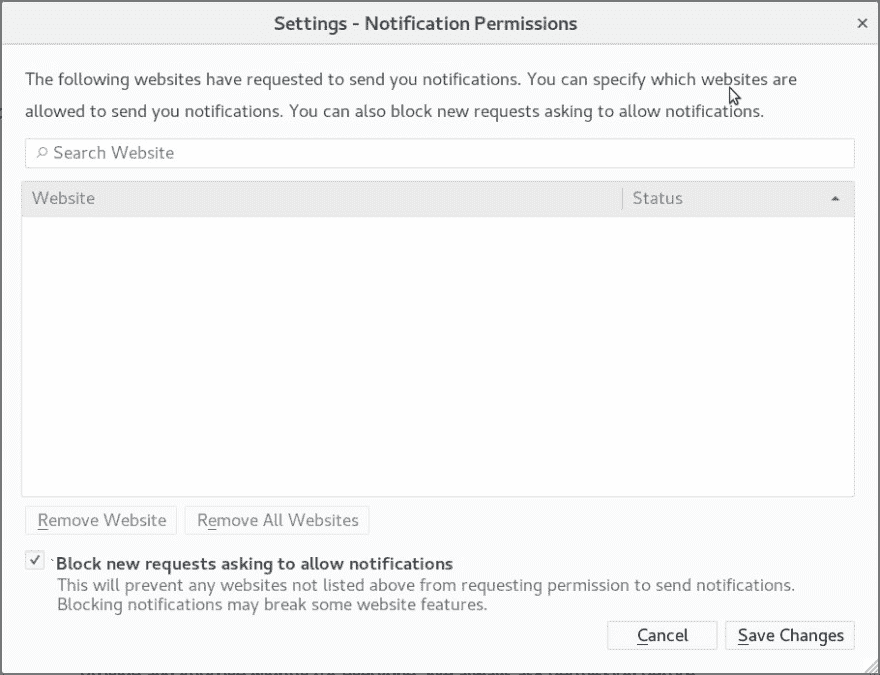

# 网络上的权限糟透了

> 原文:[https://dev.to/philnash/permissions-on-the-web-suck-2iae](https://dev.to/philnash/permissions-on-the-web-suck-2iae)

我是进步网络应用的粉丝，也是他们赋予网络开发者构建下一代应用的力量的粉丝。我们可以编写离线工作的 web 应用程序，[在后台下载大文件](https://philna.sh/blog/2017/07/04/experimenting-with-the-background-fetch-api/)，[发送推送通知](https://www.twilio.com/blog/2016/02/web-powered-sms-inbox-with-service-worker-push-notifications.html)，等等。我对网络上的推送通知非常兴奋，以至于我在 2015 年写了一整篇关于它的演讲，并有幸在世界各地的许多地方进行了演讲。

但是，也许我对这个演讲的标题“网络正在变得咄咄逼人”有点太有先见之明了网络应用本身越来越强势，现在我看到了这样的推文:

> 丹·辛博尔斯基@ dszymborski亲爱的现有的每一个网站，
> 
> 不，我不想打开通知。
> 
> 谢、
> 
> 丹2017 年 10 月 20 日上午 06:22230969

还有这个:

> 安德里亚·惠特莫@螺母螺栓亲爱的网站:没人想要推送通知。爱，每一个使用互联网的人2017 年 10 月 31 日下午 17:5611383112

以及像 How-To Geek 的[如何阻止网站要求显示通知](https://www.howtogeek.com/288946/how-to-stop-websites-from-asking-to-show-notifications/)这样的博客帖子。

推送通知的名声越来越差，我认为他们不值得。以下是我认为我们在这方面面临的问题和一些可能的解决方案。

## 这不是通知的错

我有一个理论。并不是用户不想要推送通知。好的推送通知是有时间和地点的。至少以我的经验来看，本地移动应用程序开发者似乎正在理解这一点，像《卫报》这样的创新网络团队已经做了一些非常有趣和令人印象深刻的推送通知实验。

[T2】](https://res.cloudinary.com/practicaldev/image/fetch/s--JD6DA6Eh--/c_limit%2Cf_auto%2Cfl_progressive%2Cq_auto%2Cw_880/https://philna.img/permissions/guardian.png)

我的理论是用户可能想要推送通知。他们可能会在有新闻价值的时刻使用它们，比如《卫报》的选举之夜实验。他们可能希望得到通知，有人给他们发了信息，或者他们的出租车到了，或者他们的航班延误了。用户想要接收推送通知的原因数不胜数。

但是最让用户恼火的是弹出一个权限对话框，要求在页面加载时发送推送通知，而没有任何上下文，任何信息，允许他们做出决定。

[T2】](https://res.cloudinary.com/practicaldev/image/fetch/s--fSrRq-4b--/c_limit%2Cf_auto%2Cfl_progressive%2Cq_auto%2Cw_880/https://philna.img/permissions/sitepoint.png)

我注意到 [Sitepoint](http://sitepoint.com/) ，一个真正应该知道得更好的网络教程网站，正在这样做。和其他众所周知的网站； [Product Hunt](https://www.producthunt.com/) 、 [cnet](https://www.cnet.com/) 甚至[脸书](https://www.facebook.com/)在他们对该功能的早期试验中，也被发现在这么做。大概还有很多例子。

这些许可对话框糟透了。

## 什么权限？

再次阅读截图中对话。上面只写着“www.sitepoint.com 想要显示通知”，还有两个按钮，“阻止”或“允许”。它没有说通知将包含什么，多久发送一次，为什么用户应该关心。权限对话框不能这么说。在 [`PushManager` API](https://developer.mozilla.org/en-US/docs/Web/API/PushManager) 中没有任何东西可以用来给这样的弹出窗口添加任何上下文。

我相信 API 的目的是鼓励开发人员构建一个中间步骤，在这个步骤中应用程序解释为什么它需要发送推送通知的许可。然后当用户同意时，触发真正的许可通知。

马特·冈特在他关于 UX 许可的文章中用航空公司的例子很好地解释了这种模式。Matt 文章中每个模式的真正关键在于，权限对话框从来不会让用户感到惊讶，他们总是知道为什么浏览器会请求他们发送通知的权限。

## 权限解决了

如果每个人都阅读 Matt 的文章，并实现友好的请求许可模式，那么一切都解决了，对吗？但愿如此。

一篇关于 UX 的文章有多好，或者有多少人阅读，都没有关系，它不可能影响到所有人。所以我们最终还是会在页面加载时弹出权限。你可能会认为这对提供糟糕体验的网站来说是件坏事，但是看看这篇文章开头的那些推文。他们不再关心了，他们再也不想要通知了。他们希望能够永远关掉它们。他们可以，这就是如何极客文章的解释。火狐很快也会发布一个全局禁用选项，如果你看了回复，你会发现这是受欢迎的。

> Firefox Nightly@ Firefox Nightly现在有一个全局的“禁用”选项用于所有推送通知提示
> [bugzilla.mozilla.org/1368744](https://t.co/b01ZCoWOfK)上午 11:03-08 2018 年 1 月367

这里的问题是，所有这些糟糕的权限体验导致用户不仅从违规的网站，而且从整个平台撤销权限。一旦通知在全球范围内被关闭，让用户再次打开通知几乎是不可能的。现在，即使您已经构建了最好的推送通知权限流，直接阻止通知的用户也不会看到它，也不会像您构建应用程序那样体验它。

我认为我们需要的不仅仅是 UX 最佳实践的文章来解决这个问题。

## 给浏览器供电

我认为权力在浏览器手中。我们以前见过他们处理不必要的弹出窗口。请记住，早在一天，安装弹出窗口拦截器，因为网络是一个充满混乱的窗口弹出无处不在。现在每个浏览器都有内置的弹出窗口拦截器。这些内置的弹出窗口拦截器所做的大部分事情是限制 [`window.open`功能](https://developer.mozilla.org/en-US/docs/Web/API/Window/open)只对用户交互起作用。这意味着用户浏览网页时不会出现一大堆意想不到的弹出窗口，或者更糟的弹出窗口。

我希望权限对话框也是如此。如果浏览器在你显示许可对话框之前强制用户交互，那么页面加载许可对话框会立即消失。然后，该平台将鼓励所有开发者在请求许可之前解释许可，并带来全面的更好体验。

## 我们可以一起保存权限

这将是一个团队的努力，但我认为我们可以节省权限对话框，推送通知和网络平台。

开发者们:永远不要在页面加载时显示权限对话框，而是阅读[马特·冈特关于权限 UX 的文章](https://developers.google.com/web/fundamentals/push-notifications/permission-ux)，创造更好的体验。

浏览器:请考虑一个权限弹出窗口拦截器，通过让糟糕的体验变得更难构建来鼓励开发者构建更好的应用。

请不要屏蔽所有的权限，你可能会在网上的其他地方错过一些真正有用的东西。

我希望我们都同意推送通知是有用处的，我们真正需要解决的是权限问题。

* * *

*[网络吸权限](https://philna.sh/blog/2018/01/08/permissions-on-the-web-suck/)原载于[philna . sh](https://philna.sh)2018 年 1 月 8 日。*