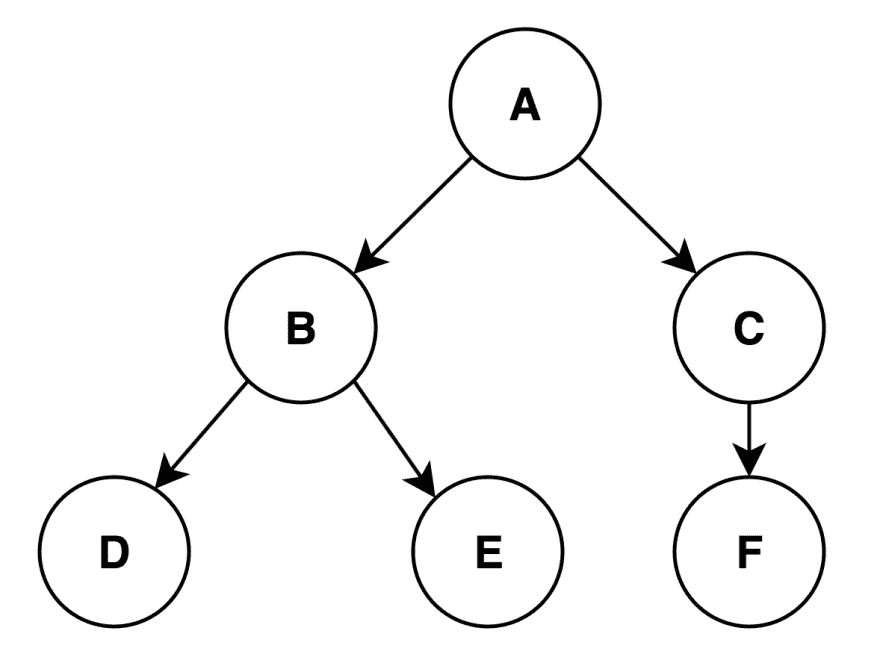
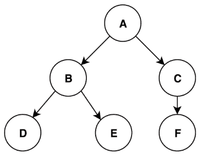
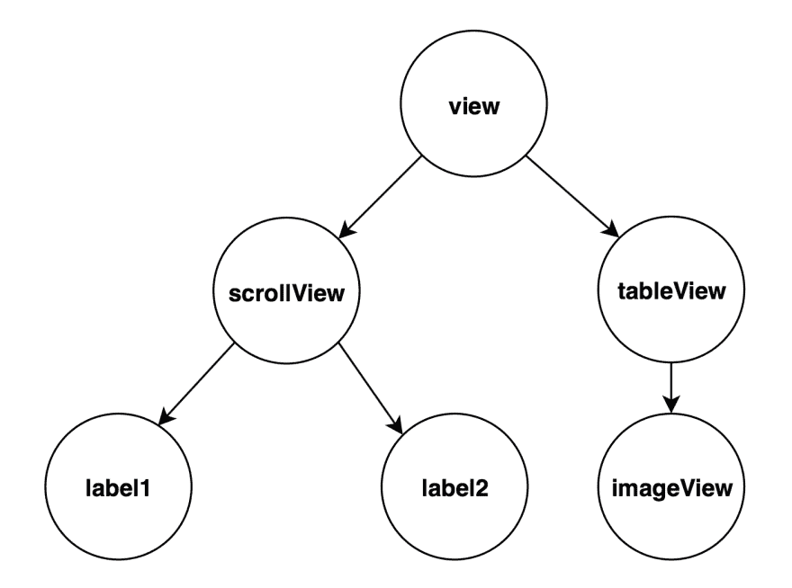

# DFS 子视图:DFS 和 UIKit

> 原文:[https://dev.to/externconst/dfsubviews-5182](https://dev.to/externconst/dfsubviews-5182)

如果你学过计算机科学或为技术面试做准备，那么你可能见过[图遍历](https://en.wikipedia.org/wiki/Graph_traversal)。

两种流行的遍历算法是:[深度优先搜索(DFS)](https://en.wikipedia.org/wiki/Depth-first_search) 和[广度优先搜索(BFS)](https://en.wikipedia.org/wiki/Breadth-first_search) 。两者都有大量的[应用](https://en.wikipedia.org/wiki/Graph_traversal#Applications)。

我相信 UIView 的私有函数:`recursiveDescription`是 DFS 的一个应用程序，我将尝试用这个假设重新创建它。

## 假设

我假设你熟悉:

*   [视图层次](https://developer.apple.com/library/content/documentation/General/Conceptual/Devpedia-CocoaApp/View%20Hierarchy.html)在 iOS 中如何工作；和
*   Swift 但是假设你熟悉另一种语言，这是不必要的
    *   我将尽力解释一些 Swift 独有的功能。

我将简要回顾一下图、邻接表和 DFS。之后，我会以此为基础进行逆向工程`recursiveDescription`。

## 图表 101

我们先来看下图:

*图一。有向图*

[T2】](https://res.cloudinary.com/practicaldev/image/fetch/s--BOANVe3t--/c_limit%2Cf_auto%2Cfl_progressive%2Cq_auto%2Cw_880/https://thepracticaldev.s3.amazonaws.com/i/f043vm2qhzufdgkezj3e.png)

这是一个由六(6)个**顶点**和五(5)条**边**组成的**有向**图。

*   **顶点**(又名节点或点)是被圈起来的数据
    *   《出埃及记》上图有顶点:`A`、`B`、`C`、`D`、`E`和`F`
*   **边**(又名弧或线)是连接每个顶点的线
    *   它们还可以有与之相关联的[权重](https://en.wikipedia.org/wiki/Glossary_of_graph_theory_terms#weight)
    *   《出埃及记》`A`有两条相关的边:一条到`B`，另一条到`C`
*   **指向**是指图形的[方位](https://en.wikipedia.org/wiki/Orientation_(graph_theory))
    *   这具体指的是**边如何连接每个顶点**
    *   一个图可以是[有向的](https://en.wikipedia.org/wiki/Directed_graph)或[无向的](https://en.wikipedia.org/wiki/Graph_(discrete_mathematics)#Undirected_graph)(有时称为双向的)
    *   《出埃及记》如果我们从`A`出发，我们可以去`B`或者`C`，但是我们不能反过来

## 邻接表

一个[邻接表](https://en.wikipedia.org/wiki/Adjacency_list)是相对于给定顶点的相邻顶点的集合。

对于图 1 中的图，我们可以说顶点`B`和顶点`C`与顶点`A`相邻。

其余顶点及其相邻顶点概述如下:

| 顶点 | 邻接表 |
| --- | --- |
| A | [乙，丙] |
| B | [ D，E ] |
| C | [ F ] |
| D | [ ] |
| E | [ ] |
| F | [ ] |

## 深度优先搜索

DFS 是一种遍历算法:**从根(最上面的顶点)开始，在对下一个邻居**重复之前，穷尽一个邻居的所有分支。

给定图 1 中的图表，我们将按照算法执行这些步骤:

```
1\. Visit A
2\. A has two neighbours: B and C
3\. Visit B
4\. B has two neighbours: D and E
5\. Visit D
6\. D has no neighbours so we've exhausted this branch
7\. B has one more neighbour: E
8\. Visit E
9\. E has no neighbours so we've exhausted this branch
10\. A has one more neighbour: C 
11\. Visit C next
12\. C has one neighbour: F
13\. Visit F
14\. F has no neighbours so we've exhausted this branch 
```

<svg width="20px" height="20px" viewBox="0 0 24 24" class="highlight-action crayons-icon highlight-action--fullscreen-on"><title>Enter fullscreen mode</title></svg> <svg width="20px" height="20px" viewBox="0 0 24 24" class="highlight-action crayons-icon highlight-action--fullscreen-off"><title>Exit fullscreen mode</title></svg>

这可以更好地形象化为:

[T2】](https://res.cloudinary.com/practicaldev/image/fetch/s--Mi5NJzps--/c_limit%2Cf_auto%2Cfl_progressive%2Cq_66%2Cw_880/https://thepracticaldev.s3.amazonaws.com/i/q7gskxisynbs3w7m5v5e.gif)

让我们看看如何在 Swift 中实施 DFS。首先，我们需要对单个顶点建模。一种方式可能是:

```
// 1
class Vertex<T> {
    // 2
    let value: T
    var visited: Bool = false
    var adjacencyList: [Vertex] = []

    // 3
    init(value: T) {
        self.value = value
    }
} 
```

<svg width="20px" height="20px" viewBox="0 0 24 24" class="highlight-action crayons-icon highlight-action--fullscreen-on"><title>Enter fullscreen mode</title></svg> <svg width="20px" height="20px" viewBox="0 0 24 24" class="highlight-action crayons-icon highlight-action--fullscreen-off"><title>Exit fullscreen mode</title></svg>

1.  顶点的通用类定义
    *   `T`表示这是通用的，可以是任何类型(即`Int`、`String`等)
2.  类的属性(或成员)
    *   `value`:属于该顶点的通用数据
    *   `visited`:初始值为`false`的标志，表示我们以前是否见过这个节点
    *   `adjacencyList`:表示相邻顶点的数组
        *   这是表示邻接表的许多方法之一
3.  初始化(或构造函数)函数
    *   一个用法示例可能是:`Vertex<Int>(value: 2)`或`Vertex<String>(value: "Alex")`

使用此模型，下面的 DFS 实现有三点需要强调:

1.  是[递归](https://en.wikipedia.org/wiki/Recursion_(computer_science))
2.  我们在这里不搜索任何东西，而是在每次访问一个顶点时打印出一个值
3.  一个顶点有可能直接或间接地指向它的父顶点
    *   这在无向图中很常见，但在有向图中也可能出现
    *   它要求我们跟踪我们访问过的顶点，否则我们可能会无限地遍历

```
// 1
func depthFirstSearch(from vertex: Vertex) {
    // 2
    vertex.visited = true
    // 3
    print(vertex.value + "\n")

    // 4
    for adjacentVertex in vertex.adjacencyList {
        // 5
        if !adjacentVertex.visited {
            // 6
            depthFirstSearch(from: adjacentVertex)
        }
    }
} 
```

<svg width="20px" height="20px" viewBox="0 0 24 24" class="highlight-action crayons-icon highlight-action--fullscreen-on"><title>Enter fullscreen mode</title></svg> <svg width="20px" height="20px" viewBox="0 0 24 24" class="highlight-action crayons-icon highlight-action--fullscreen-off"><title>Exit fullscreen mode</title></svg>

1.  定义一个函数，该函数接受一个可选类型`Vertex`的参数`vertex`
    *   `?`表示这是一个[可选类型](https://developer.apple.com/library/content/documentation/Swift/Conceptual/Swift_Programming_Language/Types.html#//apple_ref/doc/uid/TP40014097-CH31-ID452),意味着该值可能为零
    *   `from`是一个命名参数，帮助函数名读起来像一个句子:`depthFirstSearch(from: someRootVertex)`
2.  将`vertex`标记为已访问，这样我们就不会意外地再次访问它
3.  打印`vertex`的`value`属性，后跟一个新行
4.  我们遍历根的所有相邻顶点，将迭代变量表示为`adjacentVertex`
5.  在做任何事情之前，我们会检查是否没有访问过`adjacentVertex`
6.  通过再次调用`depthFirstSearch(from:)`并传递`adjacentVertex`作为新的顶点来继续遍历

步骤`1.`到`6.`将会重复，直到我们穷尽了图中的所有顶点。
输出如下所示:

```
A
B
D
E
C
F 
```

<svg width="20px" height="20px" viewBox="0 0 24 24" class="highlight-action crayons-icon highlight-action--fullscreen-on"><title>Enter fullscreen mode</title></svg> <svg width="20px" height="20px" viewBox="0 0 24 24" class="highlight-action crayons-icon highlight-action--fullscreen-off"><title>Exit fullscreen mode</title></svg>

我们实现 DFS 的另一种方法是使用堆栈，但这超出了本文的范围。

## UIView `description`

在我们看`recursiveDescription`之前，我们需要先看看它的对应词`description` :

```
// Swift generated version of NSObject.h
var description: String { get } 
```

<svg width="20px" height="20px" viewBox="0 0 24 24" class="highlight-action crayons-icon highlight-action--fullscreen-on"><title>Enter fullscreen mode</title></svg> <svg width="20px" height="20px" viewBox="0 0 24 24" class="highlight-action crayons-icon highlight-action--fullscreen-off"><title>Exit fullscreen mode</title></svg>

[描述](https://developer.apple.com/documentation/objectivec/nsobject/1418799-description)是一个存在于所有继承自`NSObject`的 Objective-C 类上的属性。此属性返回对象内容的字符串表示形式。这类似于 Python 中的`__str__` / `__repr__`。

如果你曾经不得不在 iOS 中调试一些东西，那么你可能会直接或间接地调用`description`。
描述通常被调用的方式如下:

```
let view = UIView(frame: CGRect(x: 0, y: 10, width: 100, height: 500))
print(view.description) 
```

<svg width="20px" height="20px" viewBox="0 0 24 24" class="highlight-action crayons-icon highlight-action--fullscreen-on"><title>Enter fullscreen mode</title></svg> <svg width="20px" height="20px" viewBox="0 0 24 24" class="highlight-action crayons-icon highlight-action--fullscreen-off"><title>Exit fullscreen mode</title></svg>

输出如下:

```
<UIView: 0x7fecf2106100; frame = (0 10; 100 500); layer = <CALayer: 0x600000028500>> 
```

<svg width="20px" height="20px" viewBox="0 0 24 24" class="highlight-action crayons-icon highlight-action--fullscreen-on"><title>Enter fullscreen mode</title></svg> <svg width="20px" height="20px" viewBox="0 0 24 24" class="highlight-action crayons-icon highlight-action--fullscreen-off"><title>Exit fullscreen mode</title></svg>

您可以覆盖`description`函数来提供自定义描述消息:

```
class Tutorial: NSObject {
    let title: String

    init(title: String) {
        self.title = title
    }

    /// This overrides the superclass description
    override var description: String {
        return "<Tutorial: \(title)>"
    }
} 
```

<svg width="20px" height="20px" viewBox="0 0 24 24" class="highlight-action crayons-icon highlight-action--fullscreen-on"><title>Enter fullscreen mode</title></svg> <svg width="20px" height="20px" viewBox="0 0 24 24" class="highlight-action crayons-icon highlight-action--fullscreen-off"><title>Exit fullscreen mode</title></svg>

自定义`description`将被称为:

```
let tutorial = Tutorial(title: "This is a tutorial about Cats")
print(tutorial.description) 
```

<svg width="20px" height="20px" viewBox="0 0 24 24" class="highlight-action crayons-icon highlight-action--fullscreen-on"><title>Enter fullscreen mode</title></svg> <svg width="20px" height="20px" viewBox="0 0 24 24" class="highlight-action crayons-icon highlight-action--fullscreen-off"><title>Exit fullscreen mode</title></svg>

输出如下:

```
<Tutorial: "This is a tutorial about Cats"> 
```

<svg width="20px" height="20px" viewBox="0 0 24 24" class="highlight-action crayons-icon highlight-action--fullscreen-on"><title>Enter fullscreen mode</title></svg> <svg width="20px" height="20px" viewBox="0 0 24 24" class="highlight-action crayons-icon highlight-action--fullscreen-off"><title>Exit fullscreen mode</title></svg>

对于一个纯 Swift 类(不从 NSObject 继承的类)或 struct，可以通过 [CustomStringConvertible](https://developer.apple.com/documentation/swift/customstringconvertible) 和[CustomDebugStringConvertible](https://developer.apple.com/documentation/swift/customdebugstringconvertible)这样的协议来实现。

这些协议可以如下使用:

```
struct Tutorial: CustomStringConvertible {
    var title: String

    // MARK: CustomStringConvertible
    var description: String {
        return "<Tutorial: \(title)>"
    }
} 
```

<svg width="20px" height="20px" viewBox="0 0 24 24" class="highlight-action crayons-icon highlight-action--fullscreen-on"><title>Enter fullscreen mode</title></svg> <svg width="20px" height="20px" viewBox="0 0 24 24" class="highlight-action crayons-icon highlight-action--fullscreen-off"><title>Exit fullscreen mode</title></svg>

## UIView `recursiveDescription`

对于单个视图来说，`description`通常就足够了，但是如果您想获得关于它的视图层次结构的信息呢？这就是`recursiveDescription`的用武之地。

`recursiveDescription`是 UIView 上的私有函数，它打印视图及其所有子视图(或子视图)的`description`。
然而，在 Objective-C 中使用它是比较容易的事情之一，但在 Swift 中仍然是可能的。我们只需要做一些[额外的步骤](https://stackoverflow.com/a/27694502/1631577)来让它工作。

*请注意，由于这是一个私有 API，因此不应在生产代码中发布。你的应用很可能会被应用商店拒绝。出于调试的目的，这应该没问题。*

我们将在下面的代码片段中建立一个简单的视图层次结构。
这种设置被大大简化了，可能不是您实际设置用户界面的方式，因为:

*   我们没有考虑视图布局；和
*   有些视图，比如`tableView`，不应该添加子视图。

```
// 1
let scrollView = UIScrollView()
let label1 = UILabel()
let label2 = UILabel()
scrollView.addSubview(label1)
scrollView.addSubview(label2)

// 2
let tableView = UITableView()
let imageView = UIImageView()
tableView.addSubview(imageView)

// 3
let view = UIView()
view.addSubview(scrollView)
view.addSubview(tableView)

// 4
print(view.perform("recursiveDescription")) 
```

<svg width="20px" height="20px" viewBox="0 0 24 24" class="highlight-action crayons-icon highlight-action--fullscreen-on"><title>Enter fullscreen mode</title></svg> <svg width="20px" height="20px" viewBox="0 0 24 24" class="highlight-action crayons-icon highlight-action--fullscreen-off"><title>Exit fullscreen mode</title></svg>

1.  创建一个`UIScrollView`并添加两个标签:`label1`和`label2`作为子视图
2.  创建一个`UITableView`并添加一个`UImageView`作为子视图
3.  创建一个`UIView`，并添加上面的`scrollView`和`tableView`作为子视图
4.  通过`perform()`函数调用`view`上的`recursiveDescription`
    *   因为这是一个私有函数，我们不能只调用`view.recursiveDescription()`，因为它不会被编译
    *   相反，我们通过`perform()`调用这个函数。这让我们可以通过名字调用对象上的任意函数
    *   这种函数调用的方法是不推荐的，因为如果对象不实现它，它会崩溃

输出应该是这样的，减去注释`//`和用于截断输出的`[...]`:

```
<UIView: 0x7fcf29812970; [...]> // view
   | <UIScrollView: 0x7fcf2901b800; [...]> // scrollView
   |    | <UILabel: 0x7fcf29808710; [...]> // label1
   |    | <UILabel: 0x7fcf26e021d0; [...]> // label2
   | <UITableView: 0x7fcf2903f200; [...]> // tableView
   |    | <UIImageView: 0x7fcf29810f80; [...]> // imageView 
```

<svg width="20px" height="20px" viewBox="0 0 24 24" class="highlight-action crayons-icon highlight-action--fullscreen-on"><title>Enter fullscreen mode</title></svg> <svg width="20px" height="20px" viewBox="0 0 24 24" class="highlight-action crayons-icon highlight-action--fullscreen-off"><title>Exit fullscreen mode</title></svg>

上面的输出显示了每个视图的描述，以及缩进表示深度的子视图的描述。

缩进用竖线(`|`)和空格表示。您可以看到这与我们的初始代码相匹配:`view`是`scrollView`和`tableView`的父级，而`tableView`是它们自己的子视图的父级。

从上面的输出中，我们可以得出以下结论:

```
1\. Visit view
2\. view has two subviews: scrollView and tableView
3\. Visit scrollView
4\. scrollView has two subviews: label1 and label2
5\. Visit label1
6\. label1 has no subviews so we've exhausted this view
7\. scrollView has one more subview: label2
8\. Visit label2
9\. label2 has no subviews so we've exhausted this view
10\. view has one more subview: tableView
11\. Visit tableView
12\. tableView has one subview: imageView
13\. Visit imageView
14\. imageView has no subviews so we've exhausted this view 
```

<svg width="20px" height="20px" viewBox="0 0 24 24" class="highlight-action crayons-icon highlight-action--fullscreen-on"><title>Enter fullscreen mode</title></svg> <svg width="20px" height="20px" viewBox="0 0 24 24" class="highlight-action crayons-icon highlight-action--fullscreen-off"><title>Exit fullscreen mode</title></svg>

如果你对以上内容很熟悉，那么你会注意到一些非常重要的事情。这些步骤遵循与“深度优先搜索”遍历中的步骤相同的算法。

## 逆向工程`recursiveDescription`

看起来`recursiveDescription`正在使用 DFS 打印出它的层次结构，但是如果不看源代码，我们如何确认这一点呢？

我们唯一的选择是尝试逆向工程的功能。由于我们不知道它是如何工作的，我们不得不把它当作一个黑盒。我们可以观察不同输入下的输出。

此外，这将有助于简化我们想要在我们的`recursiveDescription`版本中打印出来的内容。
我们将改变之前的输出，忽略管道周围的空格(`|` ):

```
<UIView: 0x7fcf29812970; [...]>
|<UIScrollView: 0x7fcf2901b800; [...]>
||<UILabel: 0x7fcf29808710; [...]>
||<UILabel: 0x7fcf26e021d0; [...]>
|<UITableView: 0x7fcf2903f200; [...]>
||<UIImageView: 0x7fcf29810f80; [...]> 
```

<svg width="20px" height="20px" viewBox="0 0 24 24" class="highlight-action crayons-icon highlight-action--fullscreen-on"><title>Enter fullscreen mode</title></svg> <svg width="20px" height="20px" viewBox="0 0 24 24" class="highlight-action crayons-icon highlight-action--fullscreen-off"><title>Exit fullscreen mode</title></svg>

由于输出表示一个层次结构，您可能会注意到它可以表示为类似于图 1 中的图形:

*图二。UIView 层次图*

[T2】](https://res.cloudinary.com/practicaldev/image/fetch/s--wMrGEj0k--/c_limit%2Cf_auto%2Cfl_progressive%2Cq_auto%2Cw_880/https://thepracticaldev.s3.amazonaws.com/i/x7tgu3uhxvgd3mk27hg9.png)

## 琐碎的视图层次

让我们试着解决一个简单的情况:一个由单一 UIView 组成的层次结构。如果我们只有一个视图，那么我们只需要打印出它的描述。

```
// 1
extension UIView {
    // 2
    func recursiveDescription() -> String {
        // 3
        return description
    }
} 
```

<svg width="20px" height="20px" viewBox="0 0 24 24" class="highlight-action crayons-icon highlight-action--fullscreen-on"><title>Enter fullscreen mode</title></svg> <svg width="20px" height="20px" viewBox="0 0 24 24" class="highlight-action crayons-icon highlight-action--fullscreen-off"><title>Exit fullscreen mode</title></svg>

1.  创建一个扩展，这样我们可以将我们的`recursiveDescription`函数添加到 UIView 中
    *   一个`extension`允许你添加函数到一个现有的类中
    *   当您无法访问类内部时，这尤其有用
2.  定义一个名为`recursiveDescription`的函数，它不接受任何参数并返回一个`String`
3.  返回视图的`description`

让我们测试一下，当我们使用我们的实现:
为单个视图打印`recursiveDescription`时会发生什么

```
let view = UIView()
print(view.recursiveDescription()) 
```

<svg width="20px" height="20px" viewBox="0 0 24 24" class="highlight-action crayons-icon highlight-action--fullscreen-on"><title>Enter fullscreen mode</title></svg> <svg width="20px" height="20px" viewBox="0 0 24 24" class="highlight-action crayons-icon highlight-action--fullscreen-off"><title>Exit fullscreen mode</title></svg>

输出应该类似于:

```
<UIView: 0x7fcf29812970; [...]> 
```

<svg width="20px" height="20px" viewBox="0 0 24 24" class="highlight-action crayons-icon highlight-action--fullscreen-on"><title>Enter fullscreen mode</title></svg> <svg width="20px" height="20px" viewBox="0 0 24 24" class="highlight-action crayons-icon highlight-action--fullscreen-off"><title>Exit fullscreen mode</title></svg>

然而，这并不令人兴奋，不是吗？如果我们有一个更复杂的层次结构，那么它只会打印父视图。

我们已经能够打印父视图的`description`以及所有子视图的`description`。

## 非平凡视图层次结构

我们现在需要一种遍历视图子视图的方法，我们可以通过 UIView 属性`subviews`来实现。该属性返回给定视图的直接子视图的数组。

```
// Swift generated version of UIView.h
var subviews: [UIView] { get } 
```

<svg width="20px" height="20px" viewBox="0 0 24 24" class="highlight-action crayons-icon highlight-action--fullscreen-on"><title>Enter fullscreen mode</title></svg> <svg width="20px" height="20px" viewBox="0 0 24 24" class="highlight-action crayons-icon highlight-action--fullscreen-off"><title>Exit fullscreen mode</title></svg>

这将提醒您邻接表，我们也可以类似地对视图层次结构建模:

*表 2。片段 1 的视图和子视图*

| UIView | Subviews |
| --- | --- |
| 视角 | [ scrollView, tableView ] |
| 卷动检视 | [ label1, label2 ] |
| tableView | [ imageview ] |
| 标签 1 | [ ] |
| 标签 2 | [ ] |
| 影像检视 | [ ] |

有了获取子视图的能力，我们可以更新我们原来的`recursiveDescription`实现来匹配传统的 DFS 实现，如下所示:

```
// The extension UIView code is present but omitted for simplicity
func recursiveDescription() -> String {
    // 1
    guard !subviews.isEmpty else {
        return description
    }

    // 2
    var text: String = description
    // 3
    for view in subviews {
        // 4
        text.append(view.recursiveDescription())
    }

    // 5
    return text
} 
```

<svg width="20px" height="20px" viewBox="0 0 24 24" class="highlight-action crayons-icon highlight-action--fullscreen-on"><title>Enter fullscreen mode</title></svg> <svg width="20px" height="20px" viewBox="0 0 24 24" class="highlight-action crayons-icon highlight-action--fullscreen-off"><title>Exit fullscreen mode</title></svg>

1.  通过检查子视图数组是否为空来断言该视图有子视图
    *   `guard`是一个类似断言的 Swift 特性。如果断言失败，则进入`else`块
2.  用当前视图的描述初始化一个局部变量`text`
3.  遍历`subviews`中的每个视图，将每个视图表示为`view`(单数)
4.  将每个`view`上调用`recursiveDescription()`的结果追加到`text`
    *   因为一个视图不能有它的父视图作为子视图，我们不需要检查我们是否已经访问过它
5.  返回调用者使用的最终版本`text`

这将产生一个类似于
的结果

```
<UIView: 0x7fa2db70ebe0; [...]><UIScrollView: 0x7fa2de80d000; [...]><UILabel: 0x7fa2db400b60; [...]><UILabel: 0x7fa2db706520; [...]><UITableView: 0x7fa2dd047c00; [...]><UIImageView: 0x7fa2db70d1e0; frame = (0 0; 0 0); [...]> 
```

<svg width="20px" height="20px" viewBox="0 0 24 24" class="highlight-action crayons-icon highlight-action--fullscreen-on"><title>Enter fullscreen mode</title></svg> <svg width="20px" height="20px" viewBox="0 0 24 24" class="highlight-action crayons-icon highlight-action--fullscreen-off"><title>Exit fullscreen mode</title></svg>

发生了什么事？看起来我们忘了在每次打印后添加新的行。

让我们替换附加每个`subview.recursiveDescription()`的行，使其具有一个前缀新行字符(`\n`)。

```
// The extension UIView code is present but omitted for simplicity
func recursiveDescription() -> String {
    ...
    for view in subviews {
        // 1
        text.append("\n")
        text.append(view.recursiveDescription())
    }
    ...
} 
```

<svg width="20px" height="20px" viewBox="0 0 24 24" class="highlight-action crayons-icon highlight-action--fullscreen-on"><title>Enter fullscreen mode</title></svg> <svg width="20px" height="20px" viewBox="0 0 24 24" class="highlight-action crayons-icon highlight-action--fullscreen-off"><title>Exit fullscreen mode</title></svg>

1.  这将在追加`view`的 recursiveDescription 之前向文本追加一个换行符(`\n`)

输出现在看起来像:

```
<UIView: 0x7fa2db70ebe0; [...]>
<UIScrollView: 0x7fa2de80d000; [...]>
<UILabel: 0x7fa2db400b60; [...]>
<UILabel: 0x7fa2db706520; [...]>
<UITableView: 0x7fa2dd047c00; [...]>
<UIImageView: 0x7fa2db70d1e0; [...]> 
```

<svg width="20px" height="20px" viewBox="0 0 24 24" class="highlight-action crayons-icon highlight-action--fullscreen-on"><title>Enter fullscreen mode</title></svg> <svg width="20px" height="20px" viewBox="0 0 24 24" class="highlight-action crayons-icon highlight-action--fullscreen-off"><title>Exit fullscreen mode</title></svg>

这样更好，但是没有表示层次深度的缩进。

### 扩张`recursiveDescription`

我们如何表明我们处于哪一层，如何让这些管道(`|`)显示出来？因为我们递归地调用我们的函数，我们可以通过函数参数传递数据。

我们可以扩展我们的函数来包含一个`"prefix"`参数，并且在每一层我们将传递在每个输出之前要预先考虑的内容。

例如:

*   在 1 级中，`prefix`是`""`
*   在级别 2 中，`prefix`是`"|"`
*   在 3 级中，`prefix`是`"||"`
*   在 4 级中，`prefix`是`"|||"`
*   在 n 级中，`prefix`是`"||...||"` ( `"|"`重复 n-1 次)

然而，由于最初的`recursiveDescription`实现没有参数，我们需要创建一个助手函数来处理这个函数的`prefix`传递和递归性质。

我们称它为`recursiveDescriptionHelper`，它将接受`String` :
类型的单个`prefix`参数

```
// The extension UIView code is present but omitted for simplicity
func recursiveDescription() -> String {
    return recursiveDescriptionHelper(with: "")
}

func recursiveDescriptionHelper(with prefix: String) -> String {
    guard !subviews.isEmpty else {
        return description
    }

    var text: String = description
    // 1
    let nextPrefix: String = prefix + "|"
    for view in subviews {
        text.append("\n")
        // 2
        text.append(nextPrefix)
        // 3
        text.append(view.recursiveDescriptionHelper(with: nextPrefix))
    }

    return text
} 
```

<svg width="20px" height="20px" viewBox="0 0 24 24" class="highlight-action crayons-icon highlight-action--fullscreen-on"><title>Enter fullscreen mode</title></svg> <svg width="20px" height="20px" viewBox="0 0 24 24" class="highlight-action crayons-icon highlight-action--fullscreen-off"><title>Exit fullscreen mode</title></svg>

1.  将管道(`|`)附加到`prefix`参数，并将其存储在本地变量`nextPrefix`中
2.  在添加视图的`recursiveDescription`之前，我们将把`nextPrefix`添加到文本中
3.  调用`recursiveDescriptionHelper`并传入`nextPrefix`用于下一次递归调用
    *   回想一下，一旦视图不再有子视图，递归调用就会停止

之后，我们应该会看到如下输出:

```
<UIView: 0x7fa2db70ebe0; [...]>
|<UIScrollView: 0x7fa2de80d000; [...]>
||<UILabel: 0x7fa2db400b60; [...]>
||<UILabel: 0x7fa2db706520; [...]>
|<UITableView: 0x7fa2dd047c00; [...]>
||<UIImageView: 0x7fa2db70d1e0; [...]> 
```

<svg width="20px" height="20px" viewBox="0 0 24 24" class="highlight-action crayons-icon highlight-action--fullscreen-on"><title>Enter fullscreen mode</title></svg> <svg width="20px" height="20px" viewBox="0 0 24 24" class="highlight-action crayons-icon highlight-action--fullscreen-off"><title>Exit fullscreen mode</title></svg>

这与我们版本的`recursiveDescription`的预期输出相匹配，但在技术上与真正的`recursiveDescription`不匹配。

希望您能看到 DFS 是如何用于实际实现的，以及我们如何从这里扩展它。希望您能看到 DFS 是如何用于实际实现的，以及我们如何从这里扩展它。我已经在这个[操场](https://github.com/ajfigueroa/blog-code/tree/master/posts/1-DFSubviews.playground)为你们整理好了最终版本。

## 结论

在这篇文章中，我们研究了 DFS 以及函数`recursiveDescription`中的潜在应用。
我们还简要地谈到了如何通过把一个函数当作一个黑盒来进行逆向工程。

我希望这有助于启发你在日常生活中寻找这些著名的算法。如果你能看到它的实际应用，这真的有助于使这个概念坚持下去。

如果您有任何建议或问题，请告诉我，我会非常感谢您的反馈。

## 附加资源

*   [邻接表](https://www.raywenderlich.com/152046/swift-algorithm-club-graphs-adjacency-list)和
*   [深度优先搜索](https://www.raywenderlich.com/157949/swift-algorithm-club-depth-first-search)非常详细。
*   苹果文档中关于`recursiveDescription`用法的[简介](https://developer.apple.com/library/content/technotes/tn2239/_index.html#//apple_ref/doc/uid/DTS40010638-CH1-SUBSECTION34)。

最初发布在我的[网站](https://alexanderfigueroa.com)。