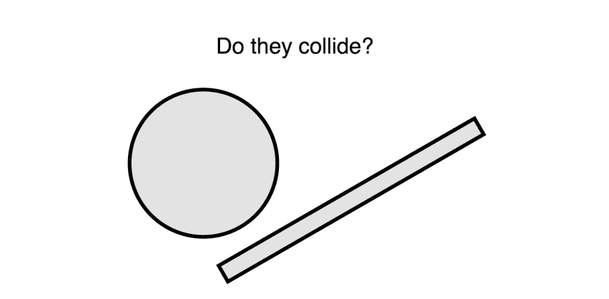
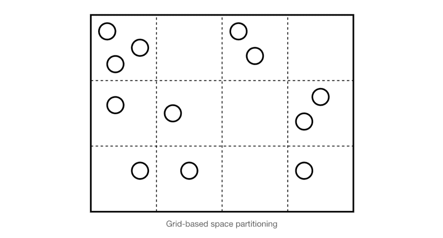
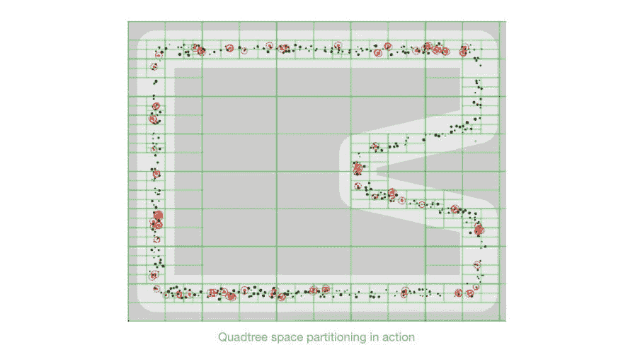
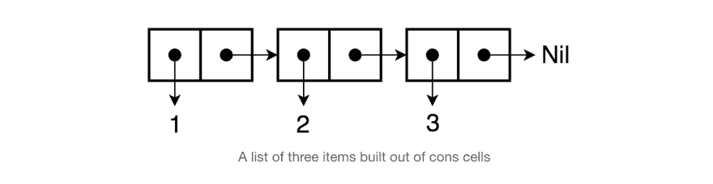

# 递归数据结构和惰性求值

> 原文:[https://dev . to/romanliutikov/recursive-data-structures-and-lazy-evaluation-16 E0](https://dev.to/romanliutikov/recursive-data-structures-and-lazy-evaluation-16e0)

在这篇文章中，我试图向自己解释递归数据结构，以及它们如何与惰性求值一起工作。我碰巧每天都在使用它们，但是从来没有真正考虑过底层的实现和一般的想法。

首先我们定义一个问题并描述它的递归解决方案。之后，我们将递归地实现一个简单的数据结构。一旦我们有了这个想法，我将讨论惰性求值，并给出该数据结构的惰性变体。

## 问题

游戏开发中的一个典型问题是碰撞检测。该技术用于检测坐标空间中实体之间的相交，例如射击游戏中的敌人和子弹。

[T2】](https://res.cloudinary.com/practicaldev/image/fetch/s--MoxqfzZU--/c_limit%2Cf_auto%2Cfl_progressive%2Cq_auto%2Cw_880/https://thepracticaldev.s3.amazonaws.com/i/lihb8wtd6akhpwmlssqv.png)

让我们想象我们正在建设 2D 太空射击游戏。游戏包括敌人实体和玩家导弹之间的互动。为了说明敌人实体是否被摧毁，游戏应该能够检测到导弹何时在二维坐标空间中与实体相交。在我们的游戏中，碰撞检测算法可以描述如下:

1.  创建一个所有导弹实体的列表和一个当前在屏幕上的所有敌人实体的列表
2.  从列表中选择第一个/下一个导弹实体
3.  对照所有敌人实体检查它的位置
    *   如果位置匹配-检测到碰撞，从列表中删除两个实体，并从步骤 2 开始重复
    *   否则—从步骤 2 开始重复，直到列表结束

如你所见，该算法简单明了，可以通过迭代轻松实现。

```
for (let i = 0; i < missiles.length; i++) {
  const missile = missiles[i];
  for (let j = 0; j < enemies.length; j++) {
    const enemy = enemies[j];
    if (missile.intersects(enemy)) {
      // collision is detected
    }
  }
} 
```

<svg width="20px" height="20px" viewBox="0 0 24 24" class="highlight-action crayons-icon highlight-action--fullscreen-on"><title>Enter fullscreen mode</title></svg> <svg width="20px" height="20px" viewBox="0 0 24 24" class="highlight-action crayons-icon highlight-action--fullscreen-off"><title>Exit fullscreen mode</title></svg>

然而，问题是这种幼稚的方法需要`O(n*(n-1))`或简单的`O(n^2)`时间来执行，这意味着每次实体的数量增加一倍，检测所有实体之间的冲突所需的迭代次数将增加四倍。也就是说，对于 3 个实体，大约需要 9 次迭代，对于 30 个实体需要 900 次迭代，对于 300 个实体需要 90000 次迭代，依此类推。如果单个检查的操作成本相对较低，并且屏幕上没有太多实体，那么使用这种方法完全没问题，但有时情况并非如此。

## 解

一个显而易见的改进是，对一个给定的实体只对靠近它的实体执行冲突检查，而丢弃所有远处的实体。屏幕区域可以划分成单独的区域以形成网格，现在对于每个实体，我们可以只对当前在同一区域的其他实体执行碰撞检查。这种技术被称为*空间分区*。

[T2】](https://res.cloudinary.com/practicaldev/image/fetch/s--g1IlFBr3--/c_limit%2Cf_auto%2Cfl_progressive%2Cq_auto%2Cw_880/https://thepracticaldev.s3.amazonaws.com/i/edurpjsysojvfissbktu.png)

更复杂的算法是使用自适应网格，其中单元可以根据给定单元中当前有多少实体来细分自身。

### 递归算法

实现自适应网格方法的算法之一叫做*四叉树空间划分*。四叉树是一种数据结构，其中每个节点正好有四个子节点，因此得名。四叉树是递归的，因为它是根据自身定义的(除了叶节点，每个节点都有另一个四叉树作为其子树)。

游戏画布可以在这些节点之间划分，其中每个节点代表屏幕上由其边界定义的区域。节点可以保存当前在对应于该节点的区域中的实体。应该为四叉树节点设置它们可以容纳的最大实体数量(给定区域中的最大实体数量)。一旦节点的容量满了，节点就将自己细分成四个子节点，并根据子节点在屏幕上的位置将其实体分布到子节点上。细分可以无限深，但通常会设置最大层数。

这种方法的好处是，在最好的情况下，当所有实体在屏幕上均匀分布时，执行所有碰撞检查所需的时间会随着每一级细分而减少 4 倍。也就是说，对于 100 个实体，我们得到 2500 张支票，而不是一个细分级别的 10000 张支票，两个细分级别是 625 张支票，依此类推。如果应用正确，这可以减少 CPU 负载，但是不要忘记维护四叉树也会消耗 CPU 周期和内存。

 [
T4】](https://jsbin.com/qeqize/edit?js,output)

我们刚刚学到的是，游戏开发很有趣，算法也没那么难，但最重要的是，在这一节中，我们看到了递归数据结构如何成为解决某一类问题的天然选择。现在让我们看看代码。

## 递归数据结构

在这一节中，我们将构建`List`数据结构，确切地说是单链表。从 Lisp 编程语言的早期开始，列表就是函数式编程中的基本数据结构。看看 Haskell
中列表数据类型的类型声明

```
data List a = Nil | Cons a (List a) 
```

<svg width="20px" height="20px" viewBox="0 0 24 24" class="highlight-action crayons-icon highlight-action--fullscreen-on"><title>Enter fullscreen mode</title></svg> <svg width="20px" height="20px" viewBox="0 0 24 24" class="highlight-action crayons-icon highlight-action--fullscreen-off"><title>Exit fullscreen mode</title></svg>

你可以看到一个列表或者是一个值和另一个列表的`Nil`(空列表)或者是`Cons`(构造)。将另一个列表作为列表中的下一个值是使该数据结构递归或根据自身定义的原因。列表中的最后一个值始终是`Nil`，它用来表示到达了列表的末尾。`Nil`也被视为空列表，这意味着该类型继承了列表的属性。为了更好地理解，下面是如何用伪代码编写三个条目的列表:

```
[1 [2 [3 nil]]] 
```

<svg width="20px" height="20px" viewBox="0 0 24 24" class="highlight-action crayons-icon highlight-action--fullscreen-on"><title>Enter fullscreen mode</title></svg> <svg width="20px" height="20px" viewBox="0 0 24 24" class="highlight-action crayons-icon highlight-action--fullscreen-off"><title>Exit fullscreen mode</title></svg>

这里的两个项目的元组被称为 cons(构造)单元。cons 单元格由第一个位置的值(头)和指向另一个值的指针(尾)组成。因此，一个包含三个条目的列表实际上是由三个 cons 单元格组成的链，最后一个单元格中的`Nil`表示列表的结束。这也可以想象为:

[T2】](https://res.cloudinary.com/practicaldev/image/fetch/s--pSHnX95T--/c_limit%2Cf_auto%2Cfl_progressive%2Cq_auto%2Cw_880/https://thepracticaldev.s3.amazonaws.com/i/ic6kcstv3nir9i64om46.png)

建立在 cons 单元格上的列表有一些有趣的属性，比如在固定时间内访问列表的头部和尾部。另一方面，列表不提供有效的随机访问，比如在索引集合(数组)中。

现在我们知道了列表的底层表示，让我们创建自己的实现。首先，我们定义数据类型——列表的构建块。分别是:`List`、`Cons`和`Nil`。`List`类型并不真的需要建立一个列表，因为列表只是一串以`Nil`结尾的 cons 单元格。它是一个非常有用的抽象，可以为我们提供一个创建和操作列表的 API。

首先，我们将类型`Nil`实现为 JavaScript 类，并创建该类的一个实例，一个名为`nil`的变量，用作列表结尾的标记。

```
class Nil {
  toString() {
    return 'Nil';
  }
}

const nil = new Nil(); 
```

<svg width="20px" height="20px" viewBox="0 0 24 24" class="highlight-action crayons-icon highlight-action--fullscreen-on"><title>Enter fullscreen mode</title></svg> <svg width="20px" height="20px" viewBox="0 0 24 24" class="highlight-action crayons-icon highlight-action--fullscreen-off"><title>Exit fullscreen mode</title></svg>

下一种是`Cons`。它是一个接受`head`值和`tail`——对下一个值的引用的类。我们还创建了一个助手静态方法`.of`来避免使用`new`关键字。

```
class Cons {
  constructor(head, tail = nil) {
    this.head = head;
    this.tail = tail;
  }
  toString() {
    return `Cons(${this.head}, ${this.tail})`;
  }
}

Cons.of = (head, tail) => new Cons(head, tail); 
```

<svg width="20px" height="20px" viewBox="0 0 24 24" class="highlight-action crayons-icon highlight-action--fullscreen-on"><title>Enter fullscreen mode</title></svg> <svg width="20px" height="20px" viewBox="0 0 24 24" class="highlight-action crayons-icon highlight-action--fullscreen-off"><title>Exit fullscreen mode</title></svg>

仅使用 cons 单元格，我们已经可以创建值列表并访问这些值:

```
const list = Cons.of(1, Cons.of(2, Cons.of(3, nil)));

console.log(list.head);
console.log(list.tail.toString());
console.log(list.tail.head);
console.log(list.tail.tail.tail.toString()); 
```

<svg width="20px" height="20px" viewBox="0 0 24 24" class="highlight-action crayons-icon highlight-action--fullscreen-on"><title>Enter fullscreen mode</title></svg> <svg width="20px" height="20px" viewBox="0 0 24 24" class="highlight-action crayons-icon highlight-action--fullscreen-off"><title>Exit fullscreen mode</title></svg>

正如我之前提到的，cons 单元格足以创建列表，但是构建在`Cons`之上的列表抽象通过提供一个 API 来创建和操作列表，可以节省我们一点时间和代码。所以让我们在`Cons` :
的基础上建造`List`型

```
class List extends Cons {
  constructor(head, tail) {
    super(head, tail);
  }
  toString() {
    return `List(${this.first()}, ${this.rest()})`;
  }
  first() {
    return this.head;
  }
  rest() {
    return this.tail;
  }
}

List.of = (head, tail) => new List(head, tail);

List.fromValues = (head, ...tail) => {
  if (tail.length > 0) {
    return List.of(head, List.fromValues(...tail));
  } else {
    return List.of(head, nil);
  }
}; 
```

<svg width="20px" height="20px" viewBox="0 0 24 24" class="highlight-action crayons-icon highlight-action--fullscreen-on"><title>Enter fullscreen mode</title></svg> <svg width="20px" height="20px" viewBox="0 0 24 24" class="highlight-action crayons-icon highlight-action--fullscreen-off"><title>Exit fullscreen mode</title></svg>

我们还实现了从任意数量的参数创建列表的`.fromValues`助手。注意它是如何递归构建一个列表的。

```
const list = List.fromValues(1, 2, 3);

console.log(list.toString()); 
```

<svg width="20px" height="20px" viewBox="0 0 24 24" class="highlight-action crayons-icon highlight-action--fullscreen-on"><title>Enter fullscreen mode</title></svg> <svg width="20px" height="20px" viewBox="0 0 24 24" class="highlight-action crayons-icon highlight-action--fullscreen-off"><title>Exit fullscreen mode</title></svg>

另一个有用的操作是生成一系列值。将一个新的静态方法添加到`List`类定义:

```
List.range = (start, end) => {
  if (start < end) {
    return List.of(start, List.range(start + 1, end));
  } else {
    return nil;
  }
}; 
```

<svg width="20px" height="20px" viewBox="0 0 24 24" class="highlight-action crayons-icon highlight-action--fullscreen-on"><title>Enter fullscreen mode</title></svg> <svg width="20px" height="20px" viewBox="0 0 24 24" class="highlight-action crayons-icon highlight-action--fullscreen-off"><title>Exit fullscreen mode</title></svg>

`take`方法用于*从列表中获取*任意数量的值。

```
take(n) {
  if (n > 0) {
    return List.of(this.first(), this.rest().take(n - 1));
  } else {
    return List.of(this.first(), nil);
  }
} 
```

<svg width="20px" height="20px" viewBox="0 0 24 24" class="highlight-action crayons-icon highlight-action--fullscreen-on"><title>Enter fullscreen mode</title></svg> <svg width="20px" height="20px" viewBox="0 0 24 24" class="highlight-action crayons-icon highlight-action--fullscreen-off"><title>Exit fullscreen mode</title></svg>

用`range`和`take`
进行快速测试

```
const list = List.range(0, 10);

console.log(list.take(3).toString()); 
```

<svg width="20px" height="20px" viewBox="0 0 24 24" class="highlight-action crayons-icon highlight-action--fullscreen-on"><title>Enter fullscreen mode</title></svg> <svg width="20px" height="20px" viewBox="0 0 24 24" class="highlight-action crayons-icon highlight-action--fullscreen-off"><title>Exit fullscreen mode</title></svg>

到目前为止，我们只实现了检索和列表创建操作。让我们也创建向列表添加值并映射其值的操作:`add`和`map`方法。

`add`操作超级便宜，因为 list 支持高效添加到头部，只需要创建一个新的列表，头部位置有值，尾部位置有目标列表，就这么简单:

```
add(value) {
  return List.of(value, this);
} 
```

<svg width="20px" height="20px" viewBox="0 0 24 24" class="highlight-action crayons-icon highlight-action--fullscreen-on"><title>Enter fullscreen mode</title></svg> <svg width="20px" height="20px" viewBox="0 0 24 24" class="highlight-action crayons-icon highlight-action--fullscreen-off"><title>Exit fullscreen mode</title></svg>

`map`操作还返回一个新列表，其中头位置的值递归应用于映射函数:

```
map(fn) {    
  const first = this.first();
  const rest = this.rest();

  if (rest === nil) {
    return List.of(fn(first), nil);
  } else {
    return List.of(fn(first), rest.map(fn));
  }
} 
```

<svg width="20px" height="20px" viewBox="0 0 24 24" class="highlight-action crayons-icon highlight-action--fullscreen-on"><title>Enter fullscreen mode</title></svg> <svg width="20px" height="20px" viewBox="0 0 24 24" class="highlight-action crayons-icon highlight-action--fullscreen-off"><title>Exit fullscreen mode</title></svg>

```
const list = List.range(1, 4).add(0).map(n => n * n);

console.log(list.toString()); 
```

<svg width="20px" height="20px" viewBox="0 0 24 24" class="highlight-action crayons-icon highlight-action--fullscreen-on"><title>Enter fullscreen mode</title></svg> <svg width="20px" height="20px" viewBox="0 0 24 24" class="highlight-action crayons-icon highlight-action--fullscreen-off"><title>Exit fullscreen mode</title></svg>

像`filter`和`reduce`这样的操作可以类似于`map`来实现。

在这一节中，我们学习了`List`数据结构及其递归实现。类似的推理可以应用于构建前面提到的四叉树以及任何其他数据结构。稍后我们将创建`List`的懒惰版本。

## 懒惰而急切的评价

在我们开始实现`List`的懒惰变体之前，让我们快速提醒自己什么是懒惰评估。

有两种评价策略:渴望和懒惰。简而言之，急切意味着现在或立即执行，懒惰意味着稍后或延迟执行直到需要结果。惰性求值本质上是一种优化技术。一个真实世界的类比就是在网页上加载图片。当你打开一个有很多图片的网站时，浏览器会立即开始下载它们。另一方面，我们可以通过只加载那些当前在浏览器窗口中可见的图像来节省带宽。在页面滚动到可以看到的位置之前，文件夹下的图像都不能加载。这同样适用于代码:当实际需要结果时，一组操作按需执行。

从更容易推理的意义上来说，热切的评价更直接。这是 JavaScript 和 Ruby 等语言的标准评估策略。考虑下面的例子(评估过程在注释中描述):

```
range(0, 10) // [0..9]
  .map(n => n + 1) // [1..10]
  .filter(n => n % 2 === 0) // [2 4 6 8 10]
  .take(3) // [2 4 6] 
```

<svg width="20px" height="20px" viewBox="0 0 24 24" class="highlight-action crayons-icon highlight-action--fullscreen-on"><title>Enter fullscreen mode</title></svg> <svg width="20px" height="20px" viewBox="0 0 24 24" class="highlight-action crayons-icon highlight-action--fullscreen-off"><title>Exit fullscreen mode</title></svg>

您可以看到代码就地执行，结果立即返回。

懒评策略不一样。

```
range(0, 10) // nothing happened
  .map(n => n + 1) // nothing happened
  .filter(n => n % 2 === 0) // nothing happened
  .take(3) // nothing happened
  .run() // [2 4 6] 
```

<svg width="20px" height="20px" viewBox="0 0 24 24" class="highlight-action crayons-icon highlight-action--fullscreen-on"><title>Enter fullscreen mode</title></svg> <svg width="20px" height="20px" viewBox="0 0 24 24" class="highlight-action crayons-icon highlight-action--fullscreen-off"><title>Exit fullscreen mode</title></svg>

这里，链中的任何操作都不会被执行，直到调用`.run`方法。`nothing happened`当然不尽然。当被调用时，每个操作都被保存以供以后执行，当结果被请求时，整个链被执行并返回最终值。像 Haskell 和 Clojure 这样的语言严重依赖延迟执行。例如在 Haskell 中，一切都存储在 thunks 中。您可以将 thunk 视为阻止其求值的任意代码的容器。它可以是包含表达式的闭包。热切版的`1 + 1`在 JavaScript 中可以表示为懒惰的`() => 1 + 1`。举个例子，让我们创建一个懒惰的函数来加减数字:

```
const add = (a, b) => {
  return () => {
    a = typeof a === "function" ? a() : a;
    b = typeof b === "function" ? b() : b;
    return a + b;
  };
};

const sub = (a, b) => {
  return () => {
    a = typeof a === "function" ? a() : a;
    b = typeof b === "function" ? b() : b;
    return a - b;
  };
}; 
```

<svg width="20px" height="20px" viewBox="0 0 24 24" class="highlight-action crayons-icon highlight-action--fullscreen-on"><title>Enter fullscreen mode</title></svg> <svg width="20px" height="20px" viewBox="0 0 24 24" class="highlight-action crayons-icon highlight-action--fullscreen-off"><title>Exit fullscreen mode</title></svg>

`add`和`sub`都返回一个对参数封闭的函数，因此实际的操作还没有执行，直到我们通过调用返回的 thunk 来强制执行它。

```
const thunk = fn => {
  fn.toString = () => '[Thunk]';
  return fn;
};

const add = (a, b) => {
  return thunk(() => {
    a = typeof a === "function" ? a() : a;
    b = typeof b === "function" ? b() : b;
    return a + b;
  });
};

const sub = (a, b) => {
  return thunk(() => {
    a = typeof a === "function" ? a() : a;
    b = typeof b === "function" ? b() : b;
    return a - b;
  });
};

const result1 = sub(20, add(10, 5));
const result2 = add(3, sub(5, 7));
const result3 = add(result1, result2);

console.log(result1);
console.log(result2);
console.log(result3);

console.log(result3()); 
```

<svg width="20px" height="20px" viewBox="0 0 24 24" class="highlight-action crayons-icon highlight-action--fullscreen-on"><title>Enter fullscreen mode</title></svg> <svg width="20px" height="20px" viewBox="0 0 24 24" class="highlight-action crayons-icon highlight-action--fullscreen-off"><title>Exit fullscreen mode</title></svg>

惰性求值总是伴随着记忆化，这是另一种优化。一旦对 thunk 求值，它可以在闭包中缓存结果，并在后续调用中返回缓存的值，而不是一次又一次地对整个过程求值。下面是上一个例子的修改版本:

```
const memoize = (fn) => {
  let cache;
  return () => {
    if (cache) {
      console.log('Return cached');
      return cache;
    } else {
      console.log('Evaluate');
      cache = fn();
      return cache;
    }
  };
};

const add = (a, b) => {
  return memoize(() => {
    a = typeof a === "function" ? a() : a;
    b = typeof b === "function" ? b() : b;
    return a + b;
  });
};

const sub = (a, b) => {
  return memoize(() => {
    a = typeof a === "function" ? a() : a;
    b = typeof b === "function" ? b() : b;
    return a - b;
  });
};

const result1 = sub(20, add(10, 5));
const result2 = add(3, sub(5, 7));
const result3 = add(result1, result2);

console.log(result3());
console.log(result3()); 
```

<svg width="20px" height="20px" viewBox="0 0 24 24" class="highlight-action crayons-icon highlight-action--fullscreen-on"><title>Enter fullscreen mode</title></svg> <svg width="20px" height="20px" viewBox="0 0 24 24" class="highlight-action crayons-icon highlight-action--fullscreen-off"><title>Exit fullscreen mode</title></svg>

## 懒惰和递归数据结构

下面是我们将在`Cons`类型之上构建的`LazyList`抽象的初始实现。

```
class LazyList {
  constructor(fn) {
    this._fn = fn;
  }
  toString() {
    return `LazyList(${this.next()})`;
  }
  next() {
    return this._fn();
  }
  first() {
    return this.next().head;
  }
  rest() {
    return this.next().tail;
  }
}

LazyList.of = fn => new LazyList(fn); 
```

<svg width="20px" height="20px" viewBox="0 0 24 24" class="highlight-action crayons-icon highlight-action--fullscreen-on"><title>Enter fullscreen mode</title></svg> <svg width="20px" height="20px" viewBox="0 0 24 24" class="highlight-action crayons-icon highlight-action--fullscreen-off"><title>Exit fullscreen mode</title></svg>

`fn`这是一个 thunk，它应该返回一个 cons 单元格，`next`方法对 thunk 进行求值。

看看`.fromValues` helper 如何懒散地递归构建一个列表。它返回一个`LazyList`的实例，该实例包含一个`Cons`的 thunk，其中`head`作为参数的值，`tail`作为另一个懒惰列表。

```
LazyList.fromValues = (head, ...tail) => {
  return LazyList.of(() => {
    if (tail.length > 0) {
      return Cons.of(head, LazyList.fromValues(...tail));
    } else {
      return Cons.of(head, nil);
    }
  });
}; 
```

<svg width="20px" height="20px" viewBox="0 0 24 24" class="highlight-action crayons-icon highlight-action--fullscreen-on"><title>Enter fullscreen mode</title></svg> <svg width="20px" height="20px" viewBox="0 0 24 24" class="highlight-action crayons-icon highlight-action--fullscreen-off"><title>Exit fullscreen mode</title></svg>

```
const list = LazyList.fromValues(1, 2, 3);

console.log(list.toString()); 
```

<svg width="20px" height="20px" viewBox="0 0 24 24" class="highlight-action crayons-icon highlight-action--fullscreen-on"><title>Enter fullscreen mode</title></svg> <svg width="20px" height="20px" viewBox="0 0 24 24" class="highlight-action crayons-icon highlight-action--fullscreen-off"><title>Exit fullscreen mode</title></svg>

`take`也返回一个懒惰列表。但是为了获取实际值，它从目标列表的尾部开始逐个计算 thunks，并构造一个新的值。

```
take(n) {
  if (n > 0) {
    return LazyList.of(() => {
      const head = this.first();
      const tail = this.rest();

      if (tail === nil) {
        return Cons.of(head, nil);
      } else {
        return Cons.of(head, tail.take(n - 1));
      }
    });
  }
} 
```

<svg width="20px" height="20px" viewBox="0 0 24 24" class="highlight-action crayons-icon highlight-action--fullscreen-on"><title>Enter fullscreen mode</title></svg> <svg width="20px" height="20px" viewBox="0 0 24 24" class="highlight-action crayons-icon highlight-action--fullscreen-off"><title>Exit fullscreen mode</title></svg>

返回一个数值范围，除了现在可以创建无限列表。

```
LazyList.range = (start = 0, end = Infinity) => {
  if (start < end) {
    return LazyList.of(() => Cons.of(start, LazyList.range(start + 1, end)));
  }
}; 
```

<svg width="20px" height="20px" viewBox="0 0 24 24" class="highlight-action crayons-icon highlight-action--fullscreen-on"><title>Enter fullscreen mode</title></svg> <svg width="20px" height="20px" viewBox="0 0 24 24" class="highlight-action crayons-icon highlight-action--fullscreen-off"><title>Exit fullscreen mode</title></svg>

```
const list = LazyList.range();

console.log(list.take(2).toString());
console.log(list.take(5).toString()); 
```

<svg width="20px" height="20px" viewBox="0 0 24 24" class="highlight-action crayons-icon highlight-action--fullscreen-on"><title>Enter fullscreen mode</title></svg> <svg width="20px" height="20px" viewBox="0 0 24 24" class="highlight-action crayons-icon highlight-action--fullscreen-off"><title>Exit fullscreen mode</title></svg>

向惰性列表添加一个值与`List`实现
非常相似

```
add(value) {
  return LazyList.of(() => Cons.of(value, this));
} 
```

<svg width="20px" height="20px" viewBox="0 0 24 24" class="highlight-action crayons-icon highlight-action--fullscreen-on"><title>Enter fullscreen mode</title></svg> <svg width="20px" height="20px" viewBox="0 0 24 24" class="highlight-action crayons-icon highlight-action--fullscreen-off"><title>Exit fullscreen mode</title></svg>

`map`操作也类似于它的热切变体

```
map(fn) {    
  return LazyList.of(() => {
    const first = this.first();
    const rest = this.rest();

    return Cons.of(fn(first), rest.map(fn));
  });
} 
```

<svg width="20px" height="20px" viewBox="0 0 24 24" class="highlight-action crayons-icon highlight-action--fullscreen-on"><title>Enter fullscreen mode</title></svg> <svg width="20px" height="20px" viewBox="0 0 24 24" class="highlight-action crayons-icon highlight-action--fullscreen-off"><title>Exit fullscreen mode</title></svg>

现在，我们可以创建一个无限值列表，其中定义了一组操作。

```
const list = LazyList.range().map(n => n * n);

console.log(list.take(2).toString());
console.log(list.take(5).toString()); 
```

<svg width="20px" height="20px" viewBox="0 0 24 24" class="highlight-action crayons-icon highlight-action--fullscreen-on"><title>Enter fullscreen mode</title></svg> <svg width="20px" height="20px" viewBox="0 0 24 24" class="highlight-action crayons-icon highlight-action--fullscreen-off"><title>Exit fullscreen mode</title></svg>

到目前为止，我们只有一种评估整个列表的方法:`.toString`。为了能够使用普通的 JavaScript 工具来使用列表，它应该被转换成有意义的东西，例如 array。方法正是这样做的。

```
toArray() {
  const first = this.first();
  const rest = this.rest();

  if (rest === nil) {
    return [first];
  } else {
    return [first, ...rest.toArray()];
  }
} 
```

<svg width="20px" height="20px" viewBox="0 0 24 24" class="highlight-action crayons-icon highlight-action--fullscreen-on"><title>Enter fullscreen mode</title></svg> <svg width="20px" height="20px" viewBox="0 0 24 24" class="highlight-action crayons-icon highlight-action--fullscreen-off"><title>Exit fullscreen mode</title></svg>

```
list.take(5).toArray() 
```

<svg width="20px" height="20px" viewBox="0 0 24 24" class="highlight-action crayons-icon highlight-action--fullscreen-on"><title>Enter fullscreen mode</title></svg> <svg width="20px" height="20px" viewBox="0 0 24 24" class="highlight-action crayons-icon highlight-action--fullscreen-off"><title>Exit fullscreen mode</title></svg>

现在让我们添加记忆。每当有人调用`.next`方法从列表中检索一个值时，我们或者评估一个 thunk 并存储结果，或者如果结果已经被缓存，就返回结果。下面是对`LazyList`类:
需要做的修改

```
constructor(fn) {
  this._fn = fn;
  this._next = null; // cache
}

next() {
  // if there's a thunk
  if (typeof this._fn === 'function') {
    this._next = this._fn(); // evaluate it and cache the result
    this._fn = null; // we don't need thunk anymore
    return this._next; // return cached  value
  } else {
    // other just return cached value
    return this._next;
  }
} 
```

<svg width="20px" height="20px" viewBox="0 0 24 24" class="highlight-action crayons-icon highlight-action--fullscreen-on"><title>Enter fullscreen mode</title></svg> <svg width="20px" height="20px" viewBox="0 0 24 24" class="highlight-action crayons-icon highlight-action--fullscreen-off"><title>Exit fullscreen mode</title></svg>

请看这个从数据库中缓慢提取用户记录的例子。在对 thunk 进行评估时，函数通过按需从数据库中提取用户记录来生成用户记录列表。

```
const getUsers = (db, [id, ...ids]) => {
  return LazyList.of(() => {
    if (ids.length > 0) {
      return Cons.of(db.getUserByID(id), getUsers(db, ids));
    } else {
      return Cons.of(db.getUserByID(id), nil);
    }
  });
};

// usage
const ids = db.getUsersIDs();
const users = getUsers(db, ids); // nothing happened
const firstThreeUsers = users.take(3).map(({ id }) => id); // nothing happened

firstThreeUsers.toArray(); // [1, 2, 3] 
```

<svg width="20px" height="20px" viewBox="0 0 24 24" class="highlight-action crayons-icon highlight-action--fullscreen-on"><title>Enter fullscreen mode</title></svg> <svg width="20px" height="20px" viewBox="0 0 24 24" class="highlight-action crayons-icon highlight-action--fullscreen-off"><title>Exit fullscreen mode</title></svg>

我们来测试一下。如果您运行下面的代码，您将会看到第一次运行花费了大约 1 秒，但是下一次运行花费了不到 1 毫秒，即使我们执行不同的操作。发生这种情况是因为第一次运行时评估了`users`列表，并为后续调用存储了结果。

```
// benchmark helper
const time = (fn) => {
  const start = performance.now();
  const result = fn();
  const delta = performance.now() - start;
  console.log(Math.round(delta * 100) / 100);
  return result;
};

// db mock
const db = {
  getUsersIDs() {
    return [1, 2, 3, 4, 5, 6];
  },
  getUserByID(id) {
    for (let i = 0; i < 1e8; i++) {}
    return { id };
  }
};

const getUsers = (db, [id, ...ids]) => {
  return LazyList.of(() => {
    if (ids.length > 0) {
      return Cons.of(db.getUserByID(id), getUsers(db, ids));
    } else {
      return Cons.of(db.getUserByID(id), nil);
    }
  });
};

const users = getUsers(db, [1, 2, 3, 4, 5, 6]);

time(() =>
   users
     .take(6)
     .toArray());

time(() =>
  users
    .map(id => 'user id ' + id)
    .take(3)
    .toArray()); 
```

<svg width="20px" height="20px" viewBox="0 0 24 24" class="highlight-action crayons-icon highlight-action--fullscreen-on"><title>Enter fullscreen mode</title></svg> <svg width="20px" height="20px" viewBox="0 0 24 24" class="highlight-action crayons-icon highlight-action--fullscreen-off"><title>Exit fullscreen mode</title></svg>

差不多就是这样🎬

如果你对学习函数式数据结构感兴趣，我强烈推荐阅读 Okasaki 的书[《纯函数式数据结构》](https://www.cs.cmu.edu/~rwh/theses/okasaki.pdf)。