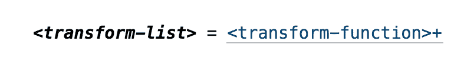
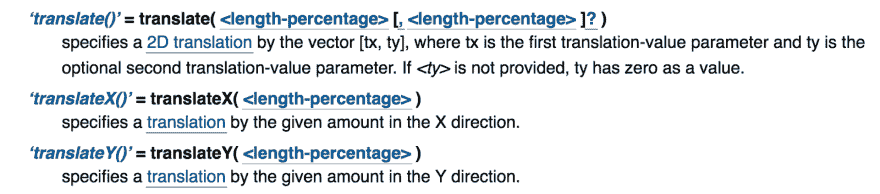

# 解析带谓词的 DSL

> 原文：<https://dev.to/romanliutikov/parsing-dsls-with-predicates-14hi>

这篇文章阐述了如何使用数据规范来验证和解析 DSL。我们将使用 Clojure 为 CSS 的子集创建数据驱动的 DSL，并使用 clojure.spec 库来定义和解析语法。

clojure.spec 是一个规范库，它提供工具(谓词和组合规则)来描述数据应该是什么样子，检查它是否符合规范，并在失败时提供原因解释。

```
(s/def  ::name  string?)  (s/def  ::age  pos-int?)  (s/def  ::profile  (s/keys  :req  [::name  ::age]))  (s/valid?  ::profile  {::name  "Roman"  ::age  25.9})  ;; false  (s/explain  ::profile  {::name  "Roman"  ::age  25.9})  In:  [:specs.profile/age]  val:  25.9  fails  spec:  :specs.profile/age  at:  [:specs.profile/age]  predicate:  pos-int? 
```

Enter fullscreen mode Exit fullscreen mode

当符合数据时，返回值根据规范被析构。这对于解析 DSL 非常有用，因为输出可以清楚地描述语法的结构。可以把它看作是产生 AST 的一种方法，这对于分析和编译更有用。我们稍后会看到这个。

作为一个例子，我们将为 *CSS 转换*值创建一个语法。

```
[[:translate-x  120  :px]  [:translate-y  150  :px]]  ;; -> translateX(120px), translateY(150px)  [[:translate  120  :px]]  ;; -> translate(120px)  [[:translate  120  :px  150  :px]]  ;; -> translate(120px, 150px) 
```

Enter fullscreen mode Exit fullscreen mode

让我们先来看看 W3C CSS 转换规范。规范明确定义了`transform`属性的值不是`none`就是`<transform-list>`。

[T2】](https://res.cloudinary.com/practicaldev/image/fetch/s--MZ2kZWOe--/c_limit%2Cf_auto%2Cfl_progressive%2Cq_auto%2Cw_880/https://thepracticaldev.s3.amazonaws.com/i/qdlz5xpv2wezbw3xsikv.png)

这直接转化为代码:

```
(s/def  ::transform  ;; transform  (s/alt  ;; is either  :something  ::transform-list  ;; <transform-list>  :nothing  #{:none}))  ;; or `none` 
```

Enter fullscreen mode Exit fullscreen mode

规范将`<transform-list>`定义为一个或多个`<transform-function>`令牌。

[T2】](https://res.cloudinary.com/practicaldev/image/fetch/s--AWYJO0cl--/c_limit%2Cf_auto%2Cfl_progressive%2Cq_auto%2Cw_880/https://thepracticaldev.s3.amazonaws.com/i/h4k1d8rz0xknqulh05qq.png)

在代码中，这可以使用对序列进行操作的 *clojure.spec* 的 regex 操作符来表示。

```
(s/def  ::transform-list  ;; <transform-list>  (s/cat  ;; is a sequence  :fns  (s/+  ::transform-function)))  ;; of one or more <transform-function> 
```

Enter fullscreen mode Exit fullscreen mode

`<transform-function>`是你可能比较熟悉的 CSS 变换函数之一，比如`translateX(x)`、`translate(x, y)`。

```
(s/def  ::transform-function  ;; <transform-function>  (s/or  ;; is either  :translate-x  ::translate-x  ;; translateX  :translate-y  ::translate-y  ;; translateY  :translate  ::translate))  ;; or translate 
```

Enter fullscreen mode Exit fullscreen mode

从这些函数的签名中我们可以看到，它们接受一个类型为`<length-percentage>`的值，这个值可以是`<length>` ( `px`、`em`等等。)或`<percentage>` ( `%`)型单位。

[](https://res.cloudinary.com/practicaldev/image/fetch/s--38FQIjG6--/c_limit%2Cf_auto%2Cfl_progressive%2Cq_auto%2Cw_880/https://thepracticaldev.s3.amazonaws.com/i/i2odyh8hxua7bud56mpx.png)T3】

```
(s/def  ::length-percentage  (s/alt  :length  ::length  :percentage  ::percentage)) 
```

Enter fullscreen mode Exit fullscreen mode

根据我们在开始时指定的语法，带有单元的值是两个元素的序列:`number`和代表单元类型的`keyword`。

```
(s/def  ::length  (s/cat  :value  number?  :unit  #{:px})) 
```

Enter fullscreen mode Exit fullscreen mode

`<percentage>`具有相同的语法，只是类型`:%`与
不同

```
(s/def  ::percentage  (s/cat  :value  number?  :unit  #{:%})) 
```

Enter fullscreen mode Exit fullscreen mode

让我们看看 spec 的析构对于`::length-percentage`规范是如何工作的。

```
(s/conform  ::length-percentage  [100  :px])  ;; [:length {:value 100, :unit :px}] 
```

Enter fullscreen mode Exit fullscreen mode

这里返回的值基于我们提供的规范，缺失的地方用从提供的数据中解析出来的值填充。这个表示基本上是一个 AST。

现在我们已经有了函数参数的规范，让我们来描述一下这些函数的语法。

```
(s/def  ::translate-x  ;; translate-x function  (s/cat  ;; is a sequence  :function  #{:translate-x}  ;; of :translate-x keyword  :value  ::length-percentage))  ;; and a nested sequence of ::length-percentage  ;; translate-y is similar  (s/def  ::translate-y  (s/cat  :function  #{:translate-y}  :value  ::length-percentage)) 
```

Enter fullscreen mode Exit fullscreen mode

`transform`函数更有趣，因为它有两个参数，第二个是可选的。

```
(s/def  ::translate  ;; translate fn  (s/cat  ;; is a sequence  :function  #{:translate}  ;; of :translate keyword  :value  (s/cat  ;; sequence  :x  ::length-percentage  ;; of ::length-percentage  :y  (s/?  ::length-percentage)))))  ;; and optional second value ::length-percentage 
```

Enter fullscreen mode Exit fullscreen mode

最后，让我们测试整个事情。

```
(s/conform  ::transform  [[:translate  -190  :px  80  :px]])  [:something  {:fns  [[:translate  {:function  :translate,  :value  {:x  [:length  {:value  -190,  :unit  :px}],  :y  [:length  {:value  80,  :unit  :px}]}}]]}] 
```

Enter fullscreen mode Exit fullscreen mode

现在，编译过程进入遍历树并将令牌转换成适当的 CSS 格式。

此外，当一致性失败时，意味着语法中的某个地方有错误，我们可以以数据的形式询问失败的原因。

```
(s/conform  ::transform  [[:translate  -190  :px  80  :p]])  ;; :clojure.spec.alpha/invalid  (s/explain-data  ::transform  [[:translate  -190  :px  80  :p]])  {:problems  '({:path  [:something  :fns  :translate  :value  :y  :length  :unit],  :pred  #{:px},  :val  :p,  :via  [:specs.css/transform  :specs.css/transform  :specs.css/transform-list  :specs.css/transform-function  :specs.css/transform-function  :specs.css/translate],  :in  [0  4]}),  :spec  :specs.css/transform,  :value  [[:translate  -190  :px  80  :p]]} 
```

Enter fullscreen mode Exit fullscreen mode

我们可以看到`[[:translate -190 :px 80 :p]]`中的值`:p`失败了规范`:specs.css/translate`的谓词`#{:px}`。正如您可能猜到的那样，这些数据可以用来以人类可读的格式报告错误。

更多真实的例子请看[我为 CSS 媒体查询](https://github.com/roman01la/cljss/blob/master/src/cljss/media.clj)编写的解析和编译语法的代码。

要了解更多关于 clojure.spec 的信息，请查看[的基本原理和概述](https://clojure.org/about/spec)。