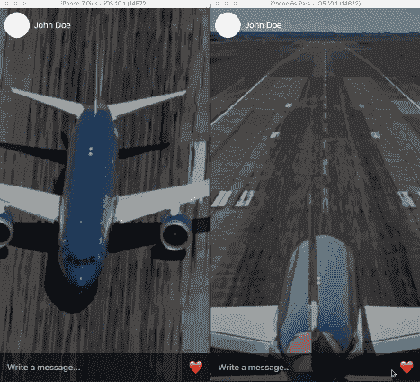
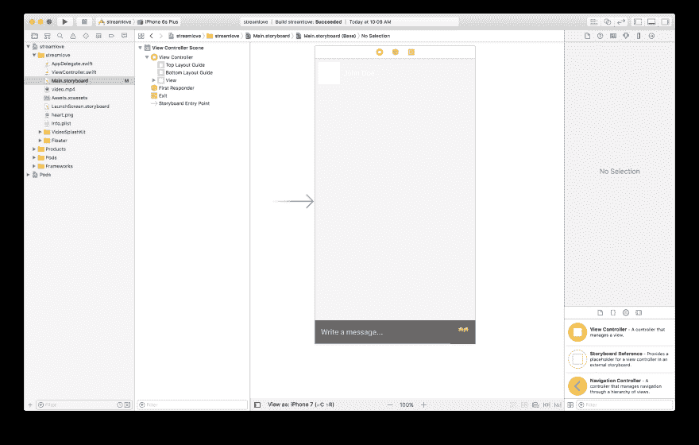
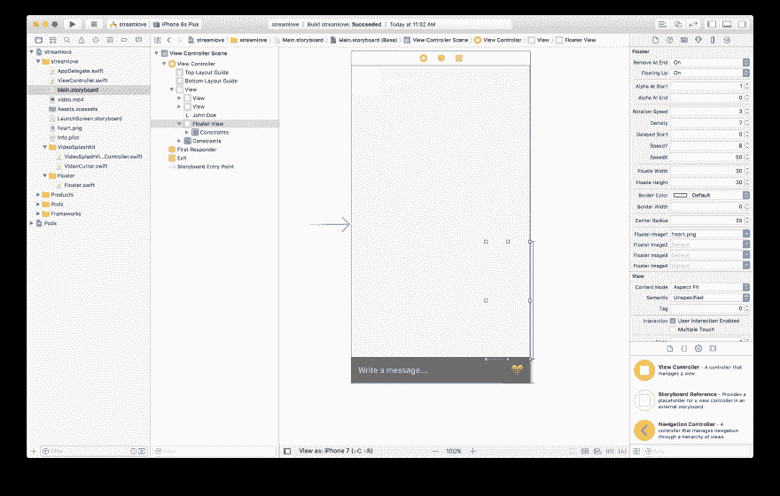
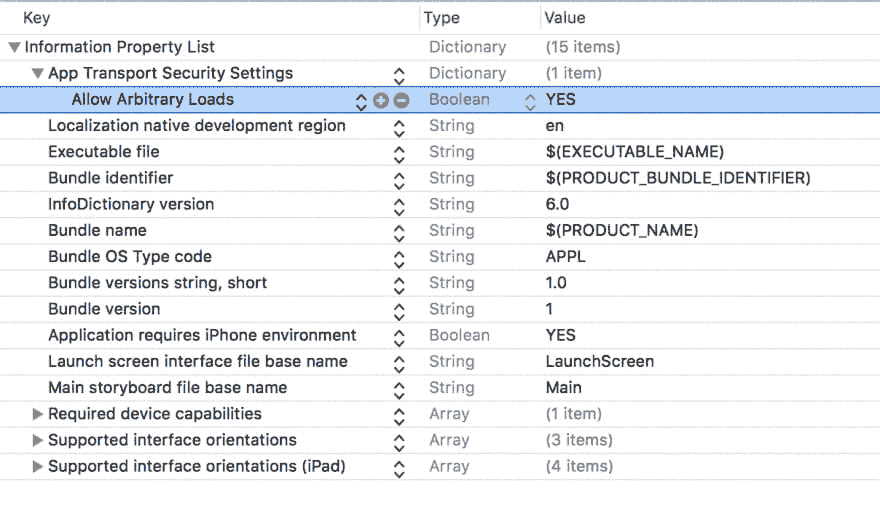

# 如何在 iOS 中创建实时浮动心形效果

> 原文:[https://dev . to/neo/how-to-create-real time-floating-hearts-effect-in-IOs-nlc](https://dev.to/neo/how-to-create-realtime-floating-hearts-effect-in-ios-nlc)

如果你是 Periscope、Instagram 和脸书等应用程序的用户，那么你可能已经注意到他们的直播流中有一个功能，每当有人喜欢直播内容时，“喜欢”就会浮在你的屏幕上。本文将向您展示如何使用 Swift 和 Pusher 在您的 iOS 应用程序上实现实时浮动红心功能。

下面是我们在本教程中使用 Swift 和 Pusher 将实现的内容的屏幕记录。

[T2】](https://res.cloudinary.com/practicaldev/image/fetch/s--pCmxSuhy--/c_limit%2Cf_auto%2Cfl_progressive%2Cq_66%2Cw_880/https://thepracticaldev.s3.amazonaws.com/i/7lvk43qkfq7btqvxvnjq.gif)

从录音中，你可以看到当点击喜欢按钮时，喜欢会浮到顶部，并且它们也会复制到另一个观看正在播放的视频的设备上。

现在，让我们开始旅程。

**要求**
按照本教程，你将需要以下东西:

*   了解 Swift 和 Xcode 故事板。
*   Xcode 安装在您的机器上。
*   推送应用程序–您可以在此创建一个免费的推送账户[。](https://pusher.com)
*   node.js 和 npm 安装在您的计算机上
*   安装在你机器上的 Cocoapods 使用 Ruby 通过运行:`gem install cocoapods`来安装它。

希望你已经检查了所有的需求。让我们开始吧。

## 在 Xcode 中创建浮动心形应用程序

启动 Xcode，在那里创建一个新项目。我们将把这个应用程序叫做 **streamlove** (是的，我们知道它很蹩脚)。完成初始设置后，关闭 Xcode 并启动终端。`cd`到您的应用程序的根目录并运行`pod init`。这将在根目录下创建一个`Podfile`。在文本编辑器中打开它，用下面的代码替换它:

```
 platform :ios, '9.0'
    target 'streamlove' do
      use_frameworks!
      pod 'PusherSwift', '~> 4.0'
      pod 'Alamofire', '~> 4.4'
    end 
```

<svg width="20px" height="20px" viewBox="0 0 24 24" class="highlight-action crayons-icon highlight-action--fullscreen-on"><title>Enter fullscreen mode</title></svg> <svg width="20px" height="20px" viewBox="0 0 24 24" class="highlight-action crayons-icon highlight-action--fullscreen-off"><title>Exit fullscreen mode</title></svg>

之后，保存并关闭文件，运行命令`pod install`。这将开始安装我们正在创建的应用程序所需的所有依赖项。现在在 Xcode 中打开`streamlove.xcworkspace`文件。

我们需要做的下一件事是设计我们的应用程序故事板。打开`Main.storyboard`文件。我们将添加一些模拟视图，因为我们真的不想在它们上面实现任何东西，它们只是为了美观。我们主要关注的是按钮和背景视频。在设计好我们的故事板之后，这是我们希望得到的:

[T2】](https://res.cloudinary.com/practicaldev/image/fetch/s--xoMZf9-N--/c_limit%2Cf_auto%2Cfl_progressive%2Cq_auto%2Cw_880/https://thepracticaldev.s3.amazonaws.com/i/zd5ldqox4vemaivwress.png)

在这个故事板中，我们在屏幕的右下角有一个按钮，这个按钮在`ViewController`中有一个`@IBAction`，所以你需要`ctrl+drag`来连接这个按钮和`ViewController`。

这将把`@IBAction`添加到`ViewController`中，如下所示:

```
 @IBAction func hearted(_ sender: Any) {
        // This function will be fired every time the button is tapped!
    } 
```

<svg width="20px" height="20px" viewBox="0 0 24 24" class="highlight-action crayons-icon highlight-action--fullscreen-on"><title>Enter fullscreen mode</title></svg> <svg width="20px" height="20px" viewBox="0 0 24 24" class="highlight-action crayons-icon highlight-action--fullscreen-off"><title>Exit fullscreen mode</title></svg>

## 使用 Swift 在 iOS 中创建背景循环视频

接下来，我们将创建模拟实时流的视频背景(因为创建实际的实时流超出了本文的范围)。打开`ViewController`文件并粘贴以下内容:

```
 import UIKit
    import PusherSwift
    import Alamofire

    class ViewController: VideoSplashViewController {

        override func viewDidLoad() {
            super.viewDidLoad()
            loadVideoStreamSample()
        }

        private func loadVideoStreamSample() {
            let url = NSURL.fileURL(withPath: Bundle.main.path(forResource: "video", ofType: "mp4")!)
            self.videoFrame = view.frame
            self.fillMode = .resizeAspectFill
            self.alwaysRepeat = true
            self.sound = true
            self.startTime = 0.0
            self.duration = 10.0
            self.alpha = 0.7
            self.backgroundColor = UIColor.black
            self.contentURL = url
            self.restartForeground = true
        }

        override var prefersStatusBarHidden: Bool {
            return true
        }  

        @IBAction func hearted(_ sender: Any) {
            // This function will be called everytime the button is tapped!
        }
    } 
```

<svg width="20px" height="20px" viewBox="0 0 24 24" class="highlight-action crayons-icon highlight-action--fullscreen-on"><title>Enter fullscreen mode</title></svg> <svg width="20px" height="20px" viewBox="0 0 24 24" class="highlight-action crayons-icon highlight-action--fullscreen-off"><title>Exit fullscreen mode</title></svg>

在第一行，我们已经导入了我们需要的库，但是大部分是在教程的后面。现在，让我们把注意力集中在其他人身上。`ViewController`扩展了我们还没有创建的`VideoSplashViewController`。在`viewDidLoad`方法中，我们调用了一个方法`loadVideoStreamSample`，在这个方法中，我们基本上是加载一个视频并为视频设置一些参数。这些参数将在`VideoSplashViewController`中实现。

现在对于`VideoSplashViewController`，我们将使用 Github 上的[Swift 库。然而，由于该库不支持 Swift 3，我们将挑选出我们需要的文件，并将其转换为支持 Swift 3。第一个是](https://github.com/svtek/VideoSplashKit/)[videossplashviewcontroller](https://github.com/svtek/VideoSplashKit/blob/master/VideoSplashKit/Source/VideoSplashViewController.swift)。创建一个扩展了`UIViewController`的新文件`VideoSplashViewController`，并在其中粘贴以下内容:

```
 import UIKit
    import MediaPlayer
    import AVKit

    public enum ScalingMode {
        case resize
        case resizeAspect
        case resizeAspectFill
    }

    public class VideoSplashViewController: UIViewController {

        private let moviePlayer = AVPlayerViewController()
        private var moviePlayerSoundLevel: Float = 1.0

        public var videoFrame: CGRect = CGRect()
        public var startTime: CGFloat = 0.0
        public var duration: CGFloat = 0.0
        public var backgroundColor = UIColor.black { didSet { view.backgroundColor = backgroundColor } }
        public var contentURL: URL = URL(fileURLWithPath: "") { didSet { setMoviePlayer(url: contentURL) } }
        public var sound: Bool = true { didSet { moviePlayerSoundLevel = sound ? 1 : 0 } }
        public var alpha: CGFloat = 1 { didSet { moviePlayer.view.alpha = alpha } }

        public var alwaysRepeat: Bool = true {

            didSet {

                if alwaysRepeat {
                    NotificationCenter.default.addObserver(forName:.AVPlayerItemDidPlayToEndTime, object:nil, queue:nil) { [weak self] (notification) in
                        self?.playerItemDidReachEnd()
                    }
                    return
                }

                if !alwaysRepeat {
                    NotificationCenter.default.removeObserver(self, name:.AVPlayerItemDidPlayToEndTime, object: nil)
                }
            }
        }

        public var fillMode: ScalingMode = .resizeAspectFill {
            didSet {
                switch fillMode {
                case .resize:
                    moviePlayer.videoGravity = AVLayerVideoGravityResize
                case .resizeAspect:
                    moviePlayer.videoGravity = AVLayerVideoGravityResizeAspect
                case .resizeAspectFill:
                    moviePlayer.videoGravity = AVLayerVideoGravityResizeAspectFill
                }
            }
        }

        public var restartForeground: Bool = false {
            didSet {
                if restartForeground {
                    NotificationCenter.default.addObserver(forName:.UIApplicationWillEnterForeground, object:nil, queue:nil) { [weak self] (notification) in
                        self?.playerItemDidReachEnd()
                    }
                }
            }
        }

        override public func viewDidAppear(_ animated: Bool) {
            super.viewDidAppear(animated)
            moviePlayer.view.frame = videoFrame
            moviePlayer.view.backgroundColor = self.backgroundColor;
            moviePlayer.showsPlaybackControls = false
            moviePlayer.view.isUserInteractionEnabled = false
            view.addSubview(moviePlayer.view)
            view.sendSubview(toBack: moviePlayer.view)
        }

        private func setMoviePlayer(url: URL){
            let videoCutter = VideoCutter()
            videoCutter.cropVideoWithUrl(videoUrl: url, startTime: startTime, duration: duration) { [weak self] (videoPath, error) -> Void in
                guard let path = videoPath, let strongSelf = self else { return }
                strongSelf.moviePlayer.player = AVPlayer(url: path)
                strongSelf.moviePlayer.player?.addObserver(strongSelf, forKeyPath: "status", options: .new, context: nil)
                strongSelf.moviePlayer.player?.play()
                strongSelf.moviePlayer.player?.volume = strongSelf.moviePlayerSoundLevel
            }
        }

        public override func observeValue(forKeyPath keyPath: String?, of object: Any?, change: [NSKeyValueChangeKey : Any]?, context: UnsafeMutableRawPointer?) {

            guard let player = object as? AVPlayer else {
                super.observeValue(forKeyPath: keyPath, of: object, change: change, context: context)
                return
            }

            if player.status == .readyToPlay {
                movieReadyToPlay()
            }
        }

        deinit{
            moviePlayer.player?.removeObserver(self, forKeyPath: "status")
            NotificationCenter.default.removeObserver(self)
        }

        // Override in subclass
        public func movieReadyToPlay() { }

        func playerItemDidReachEnd() {
            moviePlayer.player?.seek(to: kCMTimeZero)
            moviePlayer.player?.play()
        }

        func playVideo() {
            moviePlayer.player?.play()
        }

        func pauseVideo() {
            moviePlayer.player?.pause()
        }
    } 
```

<svg width="20px" height="20px" viewBox="0 0 24 24" class="highlight-action crayons-icon highlight-action--fullscreen-on"><title>Enter fullscreen mode</title></svg> <svg width="20px" height="20px" viewBox="0 0 24 24" class="highlight-action crayons-icon highlight-action--fullscreen-off"><title>Exit fullscreen mode</title></svg>

现在创建另一个名为`VideoCutter`的文件，它扩展了 NSObject 并粘贴到下面:

```
 import UIKit
    import AVFoundation

    extension String {
        var convert: NSString { return (self as NSString) }
    }

    public class VideoCutter: NSObject {

        /**
         Block based method for crop video url

         @param videoUrl Video url
         @param startTime The starting point of the video segments
         @param duration Total time, video length

         */
        public func cropVideoWithUrl(videoUrl url: URL, startTime: CGFloat, duration: CGFloat, completion: ((_ videoPath:URL?, _ error: NSError?) -> Void)?) {

            DispatchQueue.global().async {

                let asset = AVURLAsset(url: url, options: nil)
                var outputPath = NSHomeDirectory()
                let documentPaths = NSSearchPathForDirectoriesInDomains(.documentDirectory, .userDomainMask, true)
                if (documentPaths.count > 0) {
                    outputPath = documentPaths.first!
                }
                let fileManager = FileManager.default

                guard let exportSession = AVAssetExportSession(asset: asset, presetName: "AVAssetExportPresetHighestQuality") else { return }
                let outputFilePath = outputPath.convert.appendingPathComponent("output.mp4")

                if fileManager.fileExists(atPath: outputFilePath) {
                    do {
                        try fileManager.removeItem(atPath: outputFilePath)
                    } catch let error {
                        print(error)
                    }
                }

                do {
                    try fileManager.createDirectory(atPath:outputPath, withIntermediateDirectories: true, attributes: nil) }
                catch let error {
                    print(error)
                }

                let start = CMTimeMakeWithSeconds(Float64(startTime), 600)
                let duration = CMTimeMakeWithSeconds(Float64(duration), 600)
                let range = CMTimeRangeMake(start, duration)
                let outputURL = URL(fileURLWithPath: outputFilePath)
                exportSession.outputURL = outputURL
                exportSession.timeRange = range
                exportSession.shouldOptimizeForNetworkUse = true
                exportSession.outputFileType = AVFileTypeMPEG4
                exportSession.exportAsynchronously(completionHandler: {
                    switch exportSession.status {
                    case .completed:
                        DispatchQueue.main.async { completion?(exportSession.outputURL, nil) }
                    default:
                        DispatchQueue.main.async { completion?(nil, nil) }
                    }
                })
            }
        }
    } 
```

<svg width="20px" height="20px" viewBox="0 0 24 24" class="highlight-action crayons-icon highlight-action--fullscreen-on"><title>Enter fullscreen mode</title></svg> <svg width="20px" height="20px" viewBox="0 0 24 24" class="highlight-action crayons-icon highlight-action--fullscreen-off"><title>Exit fullscreen mode</title></svg>

在上面我们刚刚创建的文件中，它基本上可以帮助你管理视频背景，并将你选择的视频设置为背景视频，并永远循环播放。这对于应用程序登录页面也很有用。然而，我们只是把它用于一个虚构的视频流。

> 💡**如果您使用的是低于 3 的 Swift 版本，那么您可以使用存储库中的源代码，但是，如果您使用的是 Swift 3 或更高版本，您可能需要这些修改才能使其工作。**

现在，我们需要做的最后一件事是向我们的工作区添加一个 mp4 文件。你可以使用任何你想使用的 mp4 文件。将视频文件`video.mp4`放入工作区，**确保它被复制**并添加到应用程序目标。

如果您现在构建并预览您的应用程序，您应该会看到视频在后台循环播放。太好了。

## 将浮动心形添加到您的 iOS 应用程序

现在我们已经有了背景中的视频循环，接下来我们要做的是为应用程序添加浮动心脏功能。基本上，每次有人点击心形按钮时，都会有一个心形图标浮到顶部，然后慢慢消失。

打开`Main.storyboard`文件，在心脏按钮的右下方，添加一个没有背景的视图。这将是浮动的心将旅行的视窗。可以做成 250×350 左右的长方形。

接下来，我们将使用 Github 的另一个[库来为应用程序添加浮动心形功能。我们实际需要的文件是](https://github.com/ravenshore/iOS-Floaters) [Floater.swift](https://github.com/ravenshore/iOS-Floaters/blob/master/floaters/Floater.swift) 文件。该库还没有任何软件包管理器来安装它，所以我们将复制该文件的内容，并将其添加到我们工作区的一个文件中。

我们正在使用 Swift 3 构建，所以我们需要对该类进行一些修改，所以如果您使用 Swift 3，请复制并粘贴下面的代码，如果您不使用，请按原样使用。创建一个新文件`Floater.swift`并扩展`UIView`对象。将此粘贴到班级:

```
 import UIKit

    @IBDesignable public class Floater: UIView {

        var image1: UIImage?
        var image2: UIImage?
        var image3: UIImage?
        var image4: UIImage?

        var isAnimating: Bool = false
        var views: [UIView]!
        var duration: TimeInterval = 1.0
        var duration1: TimeInterval = 2.0
        var duration2: TimeInterval = 2.0
        var floatieSize = CGSize(width: 50, height: 50)
        var floatieDelay: Double = 10
        var delay: Double = 10.0
        var startingAlpha: CGFloat = 1.0
        var endingAlpha: CGFloat = 0.0
        var upwards: Bool = true
        var remove: Bool = true

        @IBInspectable var removeAtEnd: Bool = true {
            didSet {
                remove = removeAtEnd
            }
        }
        @IBInspectable var FloatingUp: Bool = true {
            didSet {
                upwards = FloatingUp
            }
        }
        @IBInspectable var alphaAtStart: CGFloat = 1.0 {
            didSet {
                startingAlpha = alphaAtStart
            }
        }
        @IBInspectable var alphaAtEnd: CGFloat = 0.0 {
            didSet {
                endingAlpha = alphaAtEnd
            }
        }
        @IBInspectable var rotationSpeed: Double = 10 {
            didSet {
                duration2 = 20 / rotationSpeed
            }
        }
        @IBInspectable var density: Double = 10 {
            didSet {
                floatieDelay = 1 / density
            }
        }
        @IBInspectable var delayedStart: Double = 10 {
            didSet {
                delay = delayedStart
            }
        }
        @IBInspectable var speedY: CGFloat = 10 {
            didSet {
                duration = Double(10/speedY)
            }
        }
        @IBInspectable var speedX: CGFloat = 5 {
            didSet {
                duration1 = Double(10/speedX)
            }
        }
        @IBInspectable var floatieWidth: CGFloat = 50 {
            didSet {
                floatieSize.width = floatieWidth
            }
        }
        @IBInspectable var floatieHeight: CGFloat = 50 {
            didSet {
                floatieSize.height = floatieHeight
            }
        }
        @IBInspectable var borderColor: UIColor = UIColor.clear {
            didSet {
                layer.borderColor = borderColor.cgColor
            }
        }

        @IBInspectable var borderWidth: CGFloat = 0 {
            didSet {
                layer.borderWidth = borderWidth
            }
        }

        @IBInspectable var cornerRadius: CGFloat = 0 {
            didSet {
                layer.cornerRadius = cornerRadius
            }
        }

        @IBInspectable var floaterImage1: UIImage? {
            didSet {
                image1 = floaterImage1
            }
        }
        @IBInspectable var floaterImage2: UIImage? {
            didSet {
                image2 = floaterImage2
            }
        }
        @IBInspectable var floaterImage3: UIImage? {
            didSet {
                image3 = floaterImage3
            }
        }
        @IBInspectable var floaterImage4: UIImage? {
            didSet {
                image4 = floaterImage4
            }
        }

        override public func awakeFromNib() {
            super.awakeFromNib()
        }

        func startAnimation() {
            print("Start Animating")
            isAnimating = true
            views = []
            var imagesArray = [UIImage?]()
            var actualImages = [UIImage]()
            let frameW = self.frame.width
            let frameH = self.frame.height
            var startingPoint: CGFloat!
            var endingPoint: CGFloat!
            if upwards {
                startingPoint = frameH
                endingPoint = floatieHeight*2
            } else {
                startingPoint = 0
                endingPoint = frameH - floatieHeight*2
            }
            imagesArray += [image1, image2, image3, image4]
            if !imagesArray.isEmpty {
                for i in imagesArray {
                    if i != nil {
                        actualImages.append(i!)
                    }
                }
            }

            let deadlineTime = DispatchTime.now() + .seconds(Int(self.delay * Double(NSEC_PER_SEC)))

            DispatchQueue.global().asyncAfter(deadline: deadlineTime, execute: {
                var goToNext = true
                while self.isAnimating {
                    if goToNext {
                        goToNext = false

                        DispatchQueue.main.asyncAfter(deadline: .now()+0.3, execute: {
                            let randomNumber = self.randomIntBetweenNumbers(firstNum:1, secondNum: 2)
                            var randomRotation: CGFloat!
                            if randomNumber == 1 {
                                randomRotation = -1
                            } else {
                                randomRotation = 1
                            }
                            let randomX = self.randomFloatBetweenNumbers(firstNum: 0 + self.floatieSize.width/2, secondNum: self.frame.width - self.floatieSize.width/2)
                            let floatieView = UIView(frame: CGRect(x: randomX, y: startingPoint, width: 50, height: 50))
                            self.addSubview(floatieView)

                            let floatie = UIImageView(frame: CGRect(x: 0, y: 0, width: self.floatieSize.width, height: self.floatieSize.height))

                            if !actualImages.isEmpty {

                                let randomImageIndex = (self.randomIntBetweenNumbers(firstNum: 1, secondNum: actualImages.count) - 1 )
                                floatie.image = actualImages[randomImageIndex]
                                floatie.center = CGPoint(x: 0, y: 0)
                                floatie.backgroundColor = UIColor.clear
                                floatie.layer.zPosition = 10
                                floatie.alpha = self.startingAlpha

                                floatieView.addSubview(floatie)
                                var xChange: CGFloat!
                                if randomX < self.frame.width/2 {
                                    xChange = randomX + self.randomFloatBetweenNumbers(firstNum: randomX, secondNum: frameW-randomX)
                                } else {
                                    xChange = self.randomFloatBetweenNumbers(firstNum: self.floatieSize.width*2, secondNum: randomX)
                                }

                                self.views.append(floatieView)
                                UIView.animate(withDuration: self.duration, delay: 0,
                                               options: [], animations: {
                                                floatieView.center.y = endingPoint
                                                floatie.alpha = self.endingAlpha
                                                goToNext = false
                                }, completion: {(value: Bool) in
                                    if self.remove {
                                        floatieView.removeFromSuperview()
                                    }
                                })
                                UIView.animate(withDuration: self.duration1, delay: 0,
                                               options: [.repeat, .autoreverse], animations: {
                                                floatieView.center.x = xChange
                                }, completion: nil)
                                UIView.animate(withDuration: self.duration2, delay: 0, options: [.repeat, .autoreverse], animations: {                 floatieView.transform = CGAffineTransform(rotationAngle: CGFloat(M_PI_2)*randomRotation)
                                }, completion: nil)
                            }
                        })
                    }
                }
            })
        }

        func stopAnimation() {
            print("Stop Animating")
            views = []
            isAnimating = false
            if !views.isEmpty {
                for i in views {
                    i.removeFromSuperview()
                }
            }
        }

        func randomFloatBetweenNumbers(firstNum: CGFloat, secondNum: CGFloat) -> CGFloat{
            return CGFloat(arc4random()) / CGFloat(UINT32_MAX) * abs(firstNum - secondNum) + min(firstNum, secondNum)
        }

        func randomIntBetweenNumbers(firstNum: Int, secondNum: Int) -> Int{
            return firstNum + Int(arc4random_uniform(UInt32(secondNum - firstNum + 1)))
        }
    } 
```

<svg width="20px" height="20px" viewBox="0 0 24 24" class="highlight-action crayons-icon highlight-action--fullscreen-on"><title>Enter fullscreen mode</title></svg> <svg width="20px" height="20px" viewBox="0 0 24 24" class="highlight-action crayons-icon highlight-action--fullscreen-off"><title>Exit fullscreen mode</title></svg>

当调用`startAnimation`方法时，这个库简单地创建一个浮动的心，当调用`stopAnimation`方法时，它停止。现在文件已经创建好了，打开您的`Main.storyboard`文件并将`Floater.swift`视图添加到我们之前创建的浮动视图中。这应该会在边栏中添加一些新的选项。这些选项是由于添加到`Floater.swift`类的`@IBDesignable`和`@IBInspectable`而产生的。

> **提示:** `**IBDesignable**` **和** `**IBInspectable**` **，一种创建自定义元素和属性的方式。这可以直接添加到 iOS 界面生成器中。** [**阅读更多关于 IBDesignable 和 IBInspectable**](https://medium.com/@Anantha1992/ibdesignable-and-ibinspectable-in-swift-3-702d7dd00ca) **。**

现在，在新的选项字段中，添加以下值:

[T2】](https://res.cloudinary.com/practicaldev/image/fetch/s--iQNhT_hj--/c_limit%2Cf_auto%2Cfl_progressive%2Cq_auto%2Cw_880/https://thepracticaldev.s3.amazonaws.com/i/olch8o3bx0uaek316b26.png)

对于浮动图像，将一个 30×30 的心形图像添加到您的工作区，然后在浮动图像部分选择它。

现在打开`ViewController`并添加以下方法:

```
 @IBOutlet weak var floaterView: Floater!

    private func startEndAnimation() {
        floaterView.startAnimation()
        DispatchQueue.main.asyncAfter(deadline: .now() + 1, execute: {
            self.floaterView.stopAnimation()
        })
    } 
```

<svg width="20px" height="20px" viewBox="0 0 24 24" class="highlight-action crayons-icon highlight-action--fullscreen-on"><title>Enter fullscreen mode</title></svg> <svg width="20px" height="20px" viewBox="0 0 24 24" class="highlight-action crayons-icon highlight-action--fullscreen-off"><title>Exit fullscreen mode</title></svg>

现在从`hearted`方法中调用`startEndAnimation`，这样当按钮被按下时就会调用它。确保`@IBOutlet floaterView`链接到我们在文章前面创建的视图端口。现在，当您构建和预览时，每次单击按钮时，您都应该看到心形浮动。

## 使用 Pusher 为我们的浮动心脏添加实时功能

现在我们已经成功地添加了浮动心脏，接下来要做的是使用 Pusher 添加实时功能。如果您还没有，[创建一个 Pusher 帐户](https://pusher.com)，创建一个新的应用程序，并在需要时复制凭证。

打开`ViewController`并在其中添加以下内容:

```
 static let API_ENDPOINT = "http://localhost:4000";

    var pusher : Pusher!

    let deviceUuid : String = UIDevice.current.identifierForVendor!.uuidString

    private func listenForNewLikes() {
        pusher = Pusher(key: "PUSHER_KEY", options: PusherClientOptions(host: .cluster("PUSHER_CLUSTER")))

        let channel = pusher.subscribe("likes")
        let _ = channel.bind(eventName: "like", callback: { (data: Any?) -> Void in
            if let data = data as? [String: AnyObject] {
                let uuid = data["uuid"] as! String

                if uuid != self.deviceUuid {
                    self.startEndAnimation()
                }
            }
        })
        pusher.connect()
    }

    private func postLike() {
        let params: Parameters = ["uuid": deviceUuid]

        Alamofire.request(ViewController.API_ENDPOINT + "/like", method: .post, parameters: params).validate().responseJSON { response in
            switch response.result {

            case .success:
                print("Liked")
            case .failure(let error):
                print(error)
            }
        }
    } 
```

<svg width="20px" height="20px" viewBox="0 0 24 24" class="highlight-action crayons-icon highlight-action--fullscreen-on"><title>Enter fullscreen mode</title></svg> <svg width="20px" height="20px" viewBox="0 0 24 24" class="highlight-action crayons-icon highlight-action--fullscreen-off"><title>Exit fullscreen mode</title></svg>

首先，我们定义一些类属性，用于存储 API 端点基本 URL、推送器实例和设备 UUID。在`listenForNewLikes`中，我们定义了一个侦听器，它等待 Pusher 发送的事件，然后在接收到事件时触发回调。我们将用它来触发浮动红心`startAndEndAnimation`方法。在`postLike`方法中，我们使用`AlamoFire`来达到一个端点(接下来我们将创建它)。端点将是我们向 Pusher 发送“like”事件的地方，这样它们就可以被广播给通道上的其他侦听器。

如果一切正常，您的`ViewController`现在应该是这样的:

```
 import UIKit
    import PusherSwift
    import Alamofire

    class ViewController: VideoSplashViewController {

        @IBOutlet weak var floaterView: Floater!

        static let API_ENDPOINT = "http://localhost:4000";

        var pusher : Pusher!

        let deviceUuid : String = UIDevice.current.identifierForVendor!.uuidString

        override func viewDidLoad() {
            super.viewDidLoad()
            loadVideoStreamSample()
            listenForNewLikes()
        }

        @IBAction func hearted(_ sender: Any) {
            postLike()
            startEndAnimation()
        }

        private func startEndAnimation() {
            floaterView.startAnimation()
            DispatchQueue.main.asyncAfter(deadline: .now() + 1, execute: {
                self.floaterView.stopAnimation()
            })
        }

        private func listenForNewLikes() {
            pusher = Pusher(key: "PUSHER_KEY", options: PusherClientOptions(host: .cluster("PUSHER_CLUSTER")))

            let channel = pusher.subscribe("likes")
            let _ = channel.bind(eventName: "like", callback: { (data: Any?) -> Void in
                if let data = data as? [String: AnyObject] {
                    let uuid = data["uuid"] as! String

                    if uuid != self.deviceUuid {
                        self.startEndAnimation()
                    }
                }
            })
            pusher.connect()
        }

        private func postLike() {
            let params: Parameters = ["uuid": deviceUuid]

            Alamofire.request(ViewController.API_ENDPOINT + "/like", method: .post, parameters: params).validate().responseJSON { response in
                switch response.result {

                case .success:
                    print("Liked")
                case .failure(let error):
                    print(error)
                }
            }
        }

        private func loadVideoStreamSample() {
            let url = NSURL.fileURL(withPath: Bundle.main.path(forResource: "video", ofType: "mp4")!)
            self.videoFrame = view.frame
            self.fillMode = .resizeAspectFill
            self.alwaysRepeat = true
            self.sound = true
            self.startTime = 0.0
            self.duration = 10.0
            self.alpha = 0.7
            self.backgroundColor = UIColor.black
            self.contentURL = url
            self.restartForeground = true
        }

        override var prefersStatusBarHidden: Bool {
            return true
        }  
    } 
```

<svg width="20px" height="20px" viewBox="0 0 24 24" class="highlight-action crayons-icon highlight-action--fullscreen-on"><title>Enter fullscreen mode</title></svg> <svg width="20px" height="20px" viewBox="0 0 24 24" class="highlight-action crayons-icon highlight-action--fullscreen-off"><title>Exit fullscreen mode</title></svg>

> **注意**您应该用从您的 PUSHER 应用仪表板中获得的实际值替换“PUSHER_CLUSTER”和“PUSHER_KEY”。**

这应该可以解决 Xcode 方面的问题。现在我们需要为我们的应用程序创建一个后端应用程序。这个后端应用程序将从应用程序接收有效载荷，并将其发送到 Pusher。

## 为我们的实时浮动心应用程序创建 NodeJS 后端

为 web 应用程序创建一个目录，然后创建两个新文件:

**index.js** 文件……

```
 let Pusher     = require('pusher');
    let express    = require('express');
    let app        = express();
    let bodyParser = require('body-parser')
    let pusher     = new Pusher(require('./config.js')['config']);

    app.use(bodyParser.json());
    app.use(bodyParser.urlencoded({ extended: false }));

    app.post('/like', (req, res, next) => {
      let payload = {uuid: req.body.uuid}
      pusher.trigger('likes', 'like', payload)
      res.json({success: 200})
    })

    app.get('/', (req, res) => {
      res.json("It works!");
    });

    app.use((req, res, next) => {
        let err = new Error('Not Found');
        err.status = 404;
        next(err);
    });

    app.listen(4000, function() {
        console.log('App listening on port 4000!')
    }); 
```

<svg width="20px" height="20px" viewBox="0 0 24 24" class="highlight-action crayons-icon highlight-action--fullscreen-on"><title>Enter fullscreen mode</title></svg> <svg width="20px" height="20px" viewBox="0 0 24 24" class="highlight-action crayons-icon highlight-action--fullscreen-off"><title>Exit fullscreen mode</title></svg>

`index.js`文件也有一个路径，它接收来自 iOS 应用程序的消息，并触发应用程序获取的 Pusher 事件。

下一个文件是 **packages.json** ，在这里我们定义了 NPM 依赖项:

```
 {
      "main": "index.js",
      "dependencies": {
        "body-parser": "^1.16.0",
        "express": "^4.14.1",
        "pusher": "^1.5.1"
      }
    } 
```

<svg width="20px" height="20px" viewBox="0 0 24 24" class="highlight-action crayons-icon highlight-action--fullscreen-on"><title>Enter fullscreen mode</title></svg> <svg width="20px" height="20px" viewBox="0 0 24 24" class="highlight-action crayons-icon highlight-action--fullscreen-off"><title>Exit fullscreen mode</title></svg>

最后，我们有一个 **config.js** ，我们将在其中放置我们的推送器配置:

```
 module.exports = {
        appId: 'PUSHER_ID',
        key: 'PUSHER_KEY',
        secret: 'PUSHER_SECRET',
        cluster: 'PUSHER_CLUSTER',
    }; 
```

<svg width="20px" height="20px" viewBox="0 0 24 24" class="highlight-action crayons-icon highlight-action--fullscreen-on"><title>Enter fullscreen mode</title></svg> <svg width="20px" height="20px" viewBox="0 0 24 24" class="highlight-action crayons-icon highlight-action--fullscreen-off"><title>Exit fullscreen mode</title></svg>

现在在目录上运行`npm install`，然后在 npm 安装完成后运行`node index.js`。你应该看到*应用程序监听 4000 端口！*消息。

## 测试我们的浮动心脏应用程序

一旦您的本地节点 web 服务器开始运行，您将需要进行一些更改，以便您的应用程序可以与本地 web 服务器通信。在`info.plist`文件中，进行以下更改:

[T2】](https://res.cloudinary.com/practicaldev/image/fetch/s--NIYk_D56--/c_limit%2Cf_auto%2Cfl_progressive%2Cq_auto%2Cw_880/https://thepracticaldev.s3.amazonaws.com/i/n9bd56izghhsqjz9ah14.png)

通过这一更改，您可以构建并运行您的应用程序，它将直接与您的本地 web 应用程序对话。

## 结论

在这篇文章中，我们已经能够复制像脸书、Instagram、Periscope 等应用程序所具有的浮动心脏功能。您可以以此为基础，将实际功能扩展到您自己的工作应用程序中。

对文章有问题或反馈吗？请在评论区下面提问。应用程序和节点后端的存储库可以在 [Github](https://github.com/neoighodaro/Realtime-Floating-Hearts-iOS-Pusher) 上获得。

这篇博文最早出现在[推手博客](https://blog.pusher.com/create-realtime-floating-hearts-effect-ios/)上