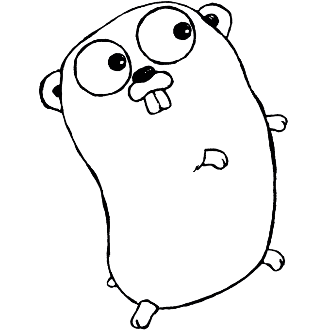

# 我为什么喜欢围棋

> 原文:[https://dev.to/vkuznecovas/why-i-like-go-14p8](https://dev.to/vkuznecovas/why-i-like-go-14p8)

在过去的 6 个月里，我一直把围棋作为我的主要语言。这就是它成为我最喜欢的语言的原因。

## 很简单

围棋非常简单。这是一种面向对象的编程语言，但它没有 C#或 Java 中常见的类，只有结构。结构不能继承，这意味着你不能在继承地狱中结束。我不会详细说明为什么遗传是不好的，但是如果你想要一个解释[遗传天生是邪恶的](https://simpleprogrammer.com/2010/01/15/inheritance-is-inherently-evil/)是这方面的一本好书。你想通过继承实现的一切都可以通过组合和使用接口来实现。它也摆脱了泛型。这意味着你阅读的代码将是清晰而简单的。它可能比许多其他语言更冗长，但你也有更多的控制权。

## 它有一个很棒的标准库

标准库相当不错。我很少需要走出去。这里通常怀疑的是 ORM 和测试/模仿框架。我要补充的是，与其他标准的 lib 包相比，测试和日志是相当不理想的，正如[或 Hiltch 在他的文章](https://medium.com/@_orcaman/most-imported-golang-packages-some-insights-fb12915a07)中所说的，但希望在未来的某个时候会有所改进。如果这些得到改进，我将只需要使用外来项目的外部库。

## 真快

Go 是一种编译语言。它没有 C 或 C++快，但在很多情况下比 Java 快。一旦它变得更加成熟，我会期待它变得更快。为了与其他语言进行比较，你可以看看这里的。我知道 benchmarksgame 在任何方面都不是权威，但它可能是目前我们能够接近的可靠基准。凭借 Go 的出色性能和易于理解的语法，开发速度相当快的应用程序是一件乐事。

## 它有一个伟大的并发模型

在许多语言中，使代码并发是相当令人生畏的。即使这不是很难实现，但每个线程使用大量内存也是一个缺点。Go 就是为此而设计的，这意味着 goroutines 既便宜又容易添加到代码中。如果你想知道它们是如何工作的，Golangbot 有一个关于 goroutines 的很好的简短教程。当编写并发代码时，go 的内置并发能力带来了极好的体验。这确实需要一些时间来适应，但是一旦你掌握了它——它会在你最终编写的代码中自然发生。

## 它有谷歌做后盾

许多开源项目在最初启动几年后就失败了。有 google 这样的支持者在背后支持围棋，让我确信这门语言会一直存在下去。此外，制作软件的过程既费时又费钱。对于像编程语言这样的大型项目来说更是如此。

## 它越来越受欢迎

[Opensource.com 有一篇优秀的文章解释了为什么围棋越来越受欢迎。这意味着，在久而久之，越来越多的公司将寻求雇佣围棋开发商。在这里领先将使我成为一个潜在的更好的候选人，而不是那些没有经验的人。](https://opensource.com/article/17/11/why-go-grows)

## 交叉编译很容易

交叉编译的能力允许在任何机器上为任何目标构建二进制文件，这使得部署变得容易，并且没有与操作系统或架构相关的问题。

## 它有一个很棒的吉祥物

(解释或更正刚说过的话)我是说...看看就知道了。
[T3】](https://res.cloudinary.com/practicaldev/image/fetch/s--zsmOaOf0--/c_limit%2Cf_auto%2Cfl_progressive%2Cq_auto%2Cw_880/https://dizzy.zone/2018/01/06/Why-I-like-go/Gopher2.png)

每次看到它都让我开心。

> 你为什么喜欢/不喜欢围棋？请在下面的评论中告诉我。